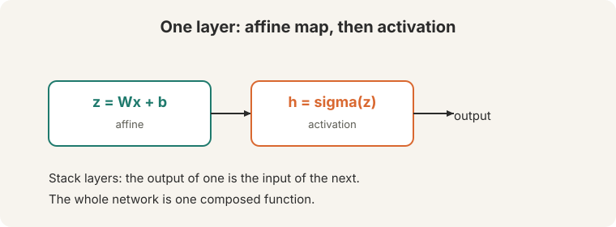

## How to read this lesson

This lesson has two levels. **Level 1 (Core)** builds a neural network layer
and derives the chain rule. **Level 2 (Deep)** explains backpropagation as
efficient bookkeeping and introduces autograd.

## Level 1: A layer is an affine map plus an activation

A **layer** does two things ([08:24](ts:08:24)).

; stacking layers composes one function.")

1. An **affine** map: z = Wx + b. The bias b is a threshold term.
2. An **activation**: h = sigma(z). A nonlinearity.

Stack layers. The output of one becomes the input of the next. The whole
network is a single composed function.

History matters. In the 1940s, the activation was a hard **threshold**: fire
or not. A step has zero gradient almost everywhere, so nothing learns. The
**sigmoid** smooths the step: gradients flow.

> [!QA]
> Q: Why must the activation be nonlinear?
> A: Affine maps compose into affine maps. A stack of linear layers is one linear layer, no matter how deep. The nonlinearity is what gives the network its expressive power.
> Follow-up: Why did the field move from step to sigmoid?
> A: Steps have zero gradient almost everywhere, so gradient descent cannot learn. The sigmoid is smooth and differentiable. Its gradient tells the optimizer which direction to move.

## Level 1: The chain rule

Neural networks are composed functions: s = f(h), h = g(z). To train, we need
ds/dz. The **chain rule** multiplies the local gradients ([33:15](ts:33:15)):

ds/dz = ds/dh x dh/dz

For vector functions, each local gradient is a **Jacobian** matrix: the matrix
of all partial derivatives ([24:07](ts:24:07)). The matrix version of the chain
rule multiplies Jacobians.

## Level 1: Forward versus backward

"Forward pass is just function application. Backward pass is the chain rule
applied efficiently" ([71:30](ts:71:30)).

Going down: apply each function, compute each value, **store every
intermediate**. Coming back up: multiply local Jacobians with the stored
values. The stored values make the backward pass cheap.

## Level 2: The two facts of backpropagation

Backpropagation rests on two facts.

1. The chain rule works on arbitrarily complex functions.
2. Store intermediates and reuse them. Never recompute.

The second fact is where the efficiency lives. The wrong way: compute
ds/db, ds/dw, ds/dx one at a time, redoing shared subexpressions each time
([58:29](ts:58:29)). The right way: one backward sweep, each intermediate
computed once. Cost scales linearly with graph size, not quadratically.

> [!QA]
> Q: What is backpropagation, in one sentence?
> A: The chain rule applied efficiently: one backward sweep that reuses every stored intermediate.
> Follow-up: Why does the wrong way cost so much?
> A: Gradients share subexpressions. Computing each gradient independently repeats the shared parts. The number of repeats grows with network depth. Reuse turns a quadratic blowup into a linear sweep.

## Level 2: Autograd as Lego

Modern frameworks implement backprop once. Each operation (matmul, sigmoid,
softmax, loss) knows its own backward rule. Compose them like pieces of Lego
and the gradients compose too ([72:06](ts:72:06)).

When you write a **new layer**, verify it with **gradient checking**
([68:40](ts:68:40)): compare the analytic gradient against a numeric finite
difference. If they disagree, the backward rule is wrong.

> [!QA]
> Q: When do you need gradient checking?
> A: Only when you implement a new operation by hand. Standard layers in PyTorch are already verified. Custom layers need one check against numeric gradients before training.
> Follow-up: Why numeric gradients as the ground truth?
> A: Finite differences need no calculus: (f(x+e) - f(x-e)) / 2e. They are slow but independent of your derivation. Agreement means your math is right.

## Recap: the whole lesson on one screen

Eight ideas carry this lecture. Read each card. Say the core sentence out
loud. If you can, you own the lesson.

<strong>1. A layer is affine plus activation</strong>

z = Wx + b, then h = sigma(z). Stack layers. The whole network is one
composed function.

Key: affine then nonlinear

<strong>2. Smooth activations let gradients flow</strong>

The 1940s step has zero gradient. The sigmoid smooths it. Learning needs
differentiable activations.

Key: no gradient, no learning

<strong>3. Chain rule multiplies local gradients</strong>

ds/dz = ds/dh x dh/dz. The vector version multiplies Jacobians, the
matrices of all partial derivatives.

Key: Jacobians multiply

<strong>4. Forward applies, backward reuses</strong>

Forward: function application. Backward: chain rule applied efficiently.
Store every intermediate on the way down.

Key: store, then reuse

<strong>5. Never recompute shared work</strong>

Computing gradients one at a time repeats subexpressions. One backward
sweep computes each intermediate once. Linear cost.

Key: two facts, one algorithm

<strong>6. Autograd is Lego</strong>

Each operation knows its backward rule. Compose operations freely;
gradients compose too. New layer: verify with gradient checking.

Key: compose forward, get backward free

<strong>7. The bias is a threshold</strong>

b shifts the activation point. In the 1940s neuron it decided fire or
not. Today it is a learned parameter like the weights.

Key: z = Wx + b

<strong>8. Backprop in one sentence</strong>

The chain rule applied efficiently. Forward is function application.
Backward is the chain rule, reusing stored intermediates.

Key: [71:25](ts:71:25)

## Official sources and further reading

**Official:**
- Lecture 3 video and transcript.

**Further reading:**
- Rumelhart, Hinton, Williams (1986), "Learning representations by back-propagating errors": the original backprop paper. Historical context. The lecture's two-fact framing is clearer.
- PyTorch autograd documentation: how modern frameworks implement the backward sweep.

**Caveats from these sources.** Gradient checking is for custom layers only. Checking built-in layers wastes time. Numeric gradients are approximate and slow: use them once, at small scale.

## Connections to the other courses

- **This course:** L02's NER classifier trains with backprop. L04's parser and L05's RNNs are deeper graphs through the same algorithm.
- **CS229:** the chain rule and Jacobians appear in the ML setting. Optimization theory is shared.
- **CS336:** L05 GPUs exist because backprop's backward sweep is matrix multiplication at scale. Triton kernels (L06) fuse these operations.

> [!CHEAT]
> **Neural nets cheatsheet.** Layer: z=Wx+b, h=sigma(z). Nonlinearity required. Threshold (1940s) -> sigmoid (smooth). Chain rule: ds/dz = ds/dh x dh/dz. Jacobian: matrix of partials. Forward: function application, store intermediates. Backward: chain rule efficiently, reuse stores. Backprop = two facts. Autograd: Lego blocks. Gradient check: numeric vs analytic for new layers.

> [!MEMORY]
> **Store, then reuse.** The chain rule is the math. Not recomputing is the algorithm. Autograd is both, boxed as Lego.
