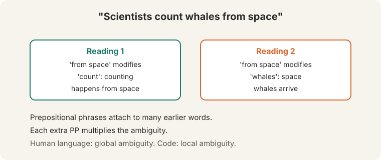
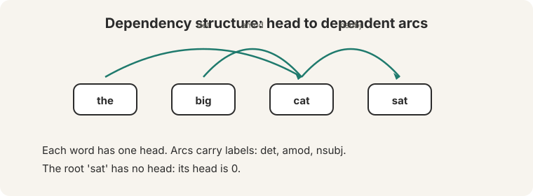
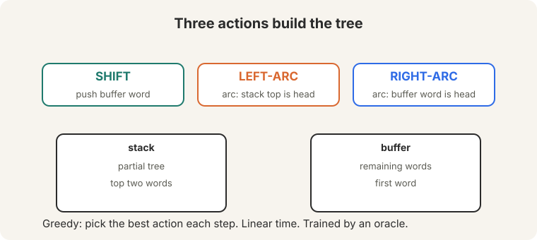
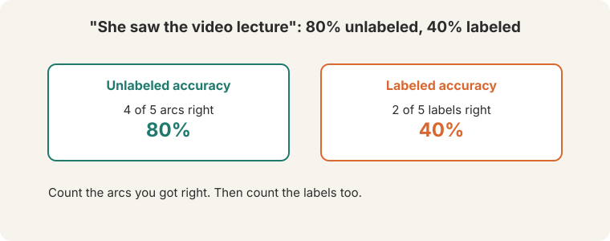
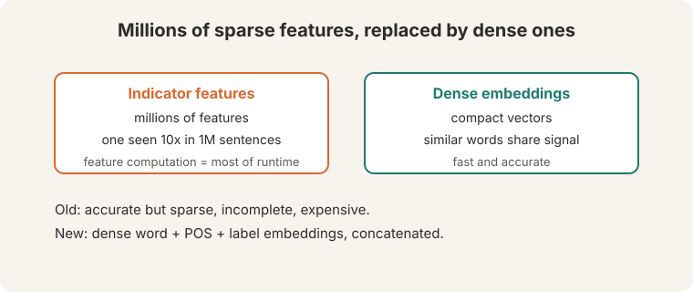
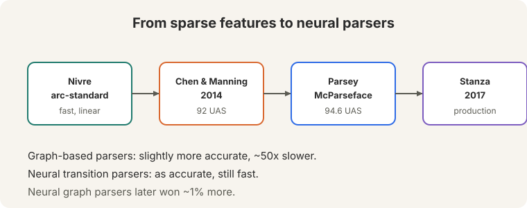

## How to read this lesson

This lesson has two levels. **Level 1 (Core)** explains why parsing is hard
and how transition-based parsing works. **Level 2 (Deep)** covers evaluation,
the feature problem, and the neural parser.

## Level 1: Sentences are ambiguous

Human language is **globally ambiguous**. Programming languages have only
local ambiguity. Consider the newspaper headline ([15:29](ts:15:29)):

"Scientists count whales from space" has two readings. Either the counting
happens from space, or the whales are from space (space whales). The
prepositional phrase "from space" can attach to "count" or to "whales".

Prepositional phrases are common in English. Each new one multiplies the
ambiguity: "look in the large crate in the kitchen by the door" ([10:20](ts:10:20))
stacks attachment choices. The reader resolves them by world knowledge. The
parser must resolve them by computation.

## Level 1: Dependency structure

A **dependency parse** represents grammar as directed arcs from a **head**
word to its **dependent** words. Each word has exactly one head (except the
root).

Arcs carry labels: det (determiner), amod (adjective modifier), nsubj
(nominal subject). The structure says what modifies what, which is what
interpretation needs.

## Level 1: Transition-based parsing

Transition-based parsing builds the tree bottom-up with a **stack** (partial
tree) and a **buffer** (remaining words). Three actions ([55:31](ts:55:31)):

- **SHIFT**: push the first buffer word onto the stack.
- **LEFT-ARC**: add an arc between the top two stack words, left-headed.
- **RIGHT-ARC**: add an arc, right-headed.

This is **shift-reduce parsing** ([54:45](ts:54:45)). The greedy version picks
the best action at each step. It runs in **linear time**. Training uses an
**oracle**: a teacher that always knows the correct next action.

The central result (Nivre's arc-standard system, [60:32](ts:60:32)): greedy
transition parsing is fast and surprisingly accurate.

> [!QA]
> Q: Why is transition-based parsing linear time?
> A: Each word is shifted exactly once and each arc action removes one word from the stack. The total number of actions is bounded by twice the sentence length. No search, no backtracking.
> Follow-up: What does the greedy choice cost?
> A: Early mistakes cannot be undone. Beam search keeps several hypotheses and recovers some accuracy. Google's Parsey McParseface added beam search on top of the greedy neural parser.

## Level 2: How you evaluate a parse

Evaluation counts arcs. The gold parse of "She saw the video lecture"
([64:53](ts:64:53)): word 1's head is 2, word 2's head is 0 (root), words 3
and 4 head to 5, word 5 heads to 2.

A proposed parse gets 4 of 5 arcs right: **80% unlabeled accuracy**. Only 2 of
5 labels right: **40% labeled accuracy**. Report both. Labels are harder.

## Level 2: The old approach: millions of sparse features

Before neural nets, parsers predicted transitions from **indicator features**:
conjunctions of words, tags, and arc labels ([63:42](ts:63:42)). Millions of
features. Each one **exceedingly sparse**: a feature might appear 10 times in
a million sentences. Three problems:

1. Sparse: almost never seen, so barely learned.
2. Incomplete: unseen combinations have no features.
3. Expensive: most parser runtime went to **computing** the features, not the
machine learning decisions ([67:00](ts:67:00)).

## Level 2: Chen and Manning's neural parser

Danqi Chen (then a PhD student) replaced indicators with **dense**
representations ([67:34](ts:67:34)). Words, parts of speech, and dependency
labels each get embeddings. Similar words sit near each other, so unseen
combinations still get signal.

For each parser state, take the key stack and buffer elements (the first
buffer word, the top two stack words). Concatenate their word, POS, and label
embeddings into one big vector, exactly like L02's five-word window.
Pass it through a hidden layer with ReLU. Softmax over SHIFT, LEFT-ARC,
RIGHT-ARC.

Two wins. **Speed**: dense vectors beat symbolic feature computation, so the
neural parser was faster than the symbolic ones despite the matrices.
**Accuracy**: a nonlinear network beat linear SVMs and logistic regressions.
Result: about 92 UAS, as good as the best graph-based parsers, at
transition-parser speed.

Google extended it: deeper network, bigger vectors, tuned hyperparameters,
beam search. **Parsey McParseface** hit 94.6 UAS ([74:05](ts:74:05)).

## Level 2: Graph-based parsing and Stanza

The other family: **graph-based** parsers score all n-squared possible
dependency arcs, then find the maximum spanning tree. Slightly more accurate.
About **50 times slower** than transition parsers.

Neural graph parsers later won about 1% more accuracy. The production
descendant is **Stanza** (2017), the Stanford NLP library.

> [!QA]
> Q: Why did dense features beat millions of indicator features?
> A: Sharing. An indicator for the exact word pair never fires on unseen pairs. An embedding fires for any word near the trained ones. Similar words share gradient updates, so rare configurations still get trained.
> Follow-up: When would you still use a graph-based parser?
> A: When accuracy matters more than speed and sentences are short. The spanning-tree search finds the global optimum. Greedy transitions can lock in early mistakes. In production, neural transition parsers won on speed.

## Recap: the whole lesson on one screen

Eight ideas carry this lecture. Read each card. Say the core sentence out
loud. If you can, you own the lesson.

<strong>1. Language is globally ambiguous</strong>

"Scientists count whales from space": counting from space, or space
whales. Each prepositional phrase multiplies attachment choices.

Key: PP attachment is the classic ambiguity

<strong>2. Dependencies are head-to-dependent arcs</strong>

Each word has one head. Arcs carry labels: det, amod, nsubj. The root's
head is 0. Structure says what modifies what.

Key: the big cat sat

<strong>3. Three actions build the tree</strong>

SHIFT, LEFT-ARC, RIGHT-ARC. Stack plus buffer. Greedy, linear time,
trained by an oracle. Nivre's arc-standard system.

Key: shift-reduce, linear time

<strong>4. Count arcs, then labels</strong>

"She saw the video lecture": 80% unlabeled, 40% labeled. Labels are
harder. Report both numbers.

Key: UAS and LAS

<strong>5. Indicator features were sparse and slow</strong>

Millions of features, each seen ~10 times in a million sentences.
Feature computation dominated runtime. Incomplete by construction.

Key: sparse, incomplete, expensive

<strong>6. Chen and Manning went dense</strong>

Embeddings for words, POS tags, labels. Concatenate, ReLU, softmax over
actions. 92 UAS at transition-parser speed.

Key: dense beats sparse

<strong>7. Google scaled it to Parsey McParseface</strong>

Deeper network, bigger vectors, beam search: 94.6 UAS. Fast enough to
parse the entire web. Graph-based was 50x slower.

Key: 92 to 94.6

<strong>8. Neural graph parsers won 1% more</strong>

Score all arcs, take the max spanning tree. The production descendant is
Stanza (2017). Transition parsers won on speed.

Key: accuracy versus speed

## Official sources and further reading

**Official:**
- Lecture 4 video and transcript.
- Chen and Manning (2014): the neural transition parser.

**Further reading:**
- Nivre (2003), "An efficient algorithm for projective dependency parsing": the arc-standard system.
- Andor et al. (2016), "Globally Normalized Transition-Based Neural Networks": Google's Parsey McParseface paper.
- Qi et al. (2020), Stanza: the production library.

**Caveats from these sources.** The lecture's 92 and 94.6 UAS numbers are on the lecture's reported benchmarks. Exact numbers depend on the treebank and evaluation setup. "50 times slower" is the lecture's figure for graph-based versus transition parsers of that era.

## Connections to the other courses

- **This course:** L02's window classifier becomes the parser's state encoder. L05's RNNs replace fixed windows with recurrence. Transformers (L08) learn dependency-like structure implicitly.
- **CS336:** L12 evaluation: UAS/LAS are task-specific metrics, like the lecture's intrinsic versus extrinsic distinction.
- **CS229S:** maximum spanning tree algorithms underlie graph-based parsing.

> [!CHEAT]
> **Dependency parsing cheatsheet.** Ambiguity: PP attachment, global. Structure: head-dependent arcs + labels. Transitions: SHIFT, LEFT-ARC, RIGHT-ARC. Stack + buffer. Greedy. Linear. Oracle. Eval: unlabeled (arcs), labeled (arcs + labels). Old: millions of sparse indicators, 10x in 1M sentences, feature cost dominated. New: dense word/POS/label embeddings, concatenate, ReLU, softmax. Chen&Manning 92 UAS; Parsey 94.6 with beam search. Graph-based: n-squared scores, MST, 50x slower, +1% later. Stanza 2017.

> [!MEMORY]
> **Dense beats sparse.** Sharing is the win. Similar words train each other. The parser that generalized parsed the web.
