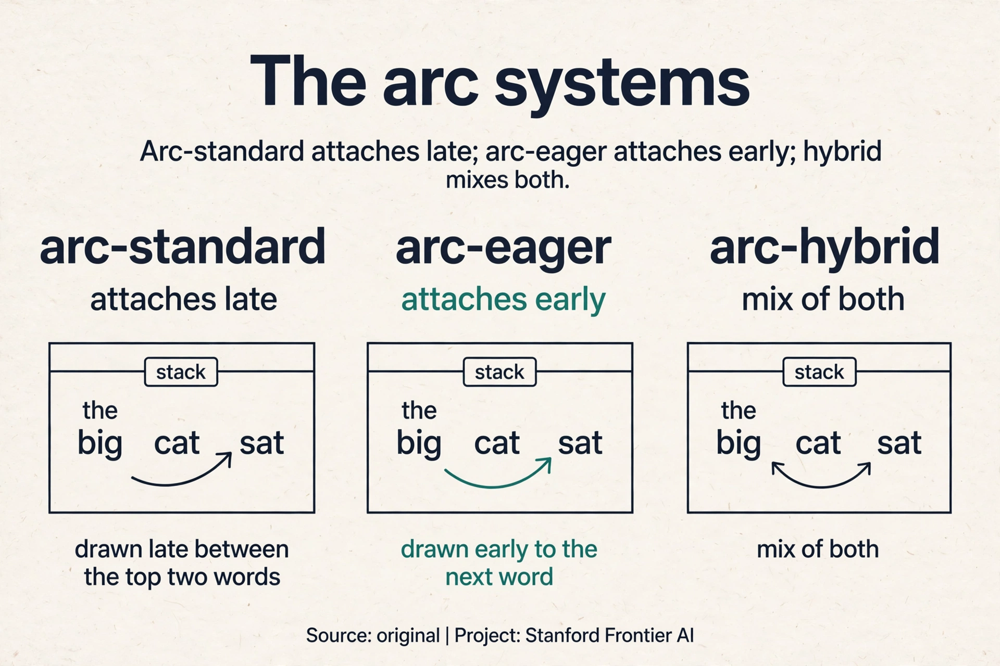
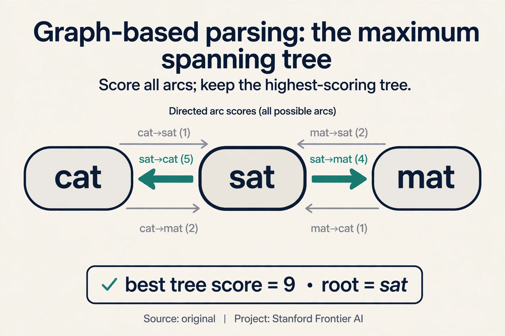

## The problem: who did what to whom

Read the newspaper headline: "Scientists count whales from space"
([15:29](ts:15:29)). Two readings. Either the counting happens from space,
or the whales are from space: space whales. The prepositional phrase "from
space" can attach to "count" or to "whales", and the meaning changes
completely.


Human language is **globally ambiguous**. Programming languages have only
local ambiguity. Each new prepositional phrase multiplies the choices:
"look in the large crate in the kitchen by the door" ([10:20](ts:10:20))
stacks attachment on attachment. A reader resolves them with world
knowledge. A parser must resolve them with computation. Before any system
can answer questions or translate, it must decide what modifies what.

**On this page:** [The arc systems](#subchapter-the-arc-systems-standard-eager-hybrid) · [Graph-based parsing](#subchapter-graph-based-parsing-the-maximum-spanning-tree) · [Beam search](#subchapter-beam-search-keep-k-hypotheses-alive) · [Parsers in production](#what-is-used-where-parsers-in-production) · [Watch and go deeper](#watch-and-go-deeper)

## The representation: dependency arcs

A **dependency parse** represents grammar as directed arcs from a **head**
word to its **dependent** words. Each word has exactly one head, except the
root of the sentence. The arcs say what modifies what, which is what
interpretation needs.


For "the big cat sat": the determiner arc det runs from "cat" to "the", the
adjective arc amod from "cat" to "big", and the subject arc nsubj from "sat"
to "cat". "Sat" is the root. Read the arcs and the sentence structure is
visible: the cat is big, the cat sat. The labels (det, amod, nsubj) name the
grammatical relation. Now the machine that builds it.

## The parsing machine: three actions

Transition-based parsing builds the tree with two structures: a **stack**
holding the partial tree, and a **buffer** holding the remaining words.
Three actions, and nothing else ([55:31](ts:55:31)):


- **SHIFT**: push the first buffer word onto the stack.
- **LEFT-ARC**: add an arc from the stack top to the word below it, and pop
  the lower word.
- **RIGHT-ARC**: add an arc from the word below the stack top to the stack
  top, and pop the stack top.

This is **shift-reduce parsing** ([54:45](ts:54:45)). Watch it parse "the
big cat sat", step by step, by hand. The gold arcs: det(cat, the),
amod(cat, big), nsubj(sat, cat), root(sat).

```ascii
stack          buffer              action          arc added
[ROOT]         [the,big,cat,sat]   SHIFT
[ROOT,the]     [big,cat,sat]       SHIFT
[ROOT,the,big] [cat,sat]           SHIFT
[ROOT,the,big,cat] [sat]           LEFT-ARC        cat -> the (det)
[ROOT,big,cat] [sat]               LEFT-ARC        cat -> big (amod)
[ROOT,cat]     [sat]               SHIFT
[ROOT,cat,sat] []                  LEFT-ARC        sat -> cat (nsubj)
[ROOT,sat]     []                  RIGHT-ARC       ROOT -> sat (root)
[ROOT]         []                  done
```

Eight actions for four words. Each word is shifted exactly once, and each
arc action removes one word from the stack. The total is bounded by twice
the sentence length: **linear time**. No search, no backtracking. The greedy
version picks the best action at each step. Training uses an **oracle**: a
teacher that always knows the correct next action, so the model learns to
imitate it.

The central result (Nivre's arc-standard system, [60:32](ts:60:32)): greedy
transition parsing is fast and surprisingly accurate.

### Subchapter: the arc systems, standard, eager, hybrid

Arc-standard is one of three transition systems. All use a stack and a
buffer. They differ in when arcs attach:

- **Arc-standard** (this lesson). LEFT-ARC and RIGHT-ARC attach the two
  top stack elements. A word gets its head only after all its dependents
  are processed. Attachments come late.
- **Arc-eager.** Attaches the head as soon as it is seen: RIGHT-ARC links
  the stack top to the buffer front without popping. A fifth action,
  REDUCE, pops finished words. Attachments come early, which gives the
  classifier more decided structure to read at each step.
- **Arc-hybrid.** Mixes the two: eager-style left arcs, standard-style
  right arcs.

Watch the difference on "the cat sat". Arc-standard attaches det(cat, the)
only after "cat" is fully built. Arc-eager attaches it the moment "cat"
appears in the buffer. In practice the accuracies are close.
practice the accuracies are close. The choice matters most for
**non-projective** languages (Czech, German): sentences where arcs cross.
Arc-standard cannot produce crossing arcs at all. Arc-eager with extra
actions (SWAP) can. If your language has free word order, the transition
system is not a detail: it decides which trees are even reachable.



### Subchapter: graph-based parsing, the maximum spanning tree

Transition parsers decide greedily. **Graph-based** parsers search. Score
every possible arc (n-squared scores for n words), then find the highest
scoring tree: the **maximum spanning tree**. Watch it on a toy, by hand.
Three words: "cat", "sat", "mat". Arc scores:

```ascii
sat -> cat: 5    sat -> mat: 4    cat -> sat: 1
cat -> mat: 2    mat -> cat: 1    mat -> sat: 0
best tree: sat -> cat (5) + sat -> mat (4) = 9, root "sat"
```

No search order, no early mistakes: the global optimum over all trees.
The price is the search itself. The classic algorithm (Chu-Liu/Edmonds)
costs O(n^3) naive, O(n^2) with care. Neural graph parsers (Dozat and
Manning, 2017) score arcs with a biaffine classifier and won about 1%
over transition parsers. The lecture's verdict stands: slightly more
accurate, about 50 times slower. In production, speed usually wins.



### Subchapter: beam search, keep k hypotheses alive

Greedy parsing locks in every choice. **Beam search** keeps the k best
partial parses at each step and expands all of them. Watch a beam of width
2 on the first two actions of "the big cat sat". Suppose the classifier
scores SHIFT 0.7 and LEFT-ARC 0.3 at step 1 (only SHIFT is legal, so the
beam holds one state). At step 4, two actions compete:

```ascii
beam: [state A (score 0.9), state B (score 0.8)]
step: expand both, keep the 2 best children
  A -> SHIFT (0.9 x 0.6 = 0.54), A -> LEFT-ARC (0.9 x 0.4 = 0.36)
  B -> SHIFT (0.8 x 0.7 = 0.56), B -> LEFT-ARC (0.8 x 0.3 = 0.24)
new beam: [B+SHIFT (0.56), A+SHIFT (0.54)]
```

Parsey McParseface
used it to reach 94.6 UAS. Width 8 to 32 is typical. Beyond that, the gains
flatten and the cost does not.

> [!QA]
> Q: Why is transition-based parsing linear time?
> A: Each word is shifted exactly once and each arc action removes one word from the stack. The total number of actions is bounded by twice the sentence length. No search, no backtracking.
> Follow-up: What does the greedy choice cost?
> A: Early mistakes cannot be undone. A wrong arc at step 3 stays wrong forever. Beam search keeps several hypotheses alive and recovers some accuracy. Google's Parsey McParseface added beam search on top of the greedy neural parser.

## How you score a parse

Evaluation counts arcs. Take "She saw the video lecture"
([64:53](ts:64:53)). The gold parse: word 1's head is 2, word 2's head is 0
(the root), words 3 and 4 head to 5, word 5 heads to 2.


A proposed parse gets 4 of 5 arcs right: **80% unlabeled accuracy** (UAS).
Only 2 of 5 labels right: **40% labeled accuracy** (LAS). Report both.
Labels are harder than arcs: getting the connection right is easier than
naming the relation.

## Where the old approach broke: millions of sparse features

Before neural nets, the parser chose each action from **indicator
features**: conjunctions of words, tags, and arc labels ([63:42](ts:63:42)).
A feature might be "top of stack is a noun AND next buffer word is a verb".
Millions of such features. Each one **exceedingly sparse**: a typical
feature appears about 10 times in a million sentences. Three failures:

1. **Sparse.** A feature seen 10 times is barely learned. Its weight is
   noise.
2. **Incomplete.** An unseen word combination has no features at all. The
   parser is blind exactly where it needs sight.
3. **Expensive.** Most of the parser's runtime went to **computing** the
   features, not to the machine learning decisions ([67:00](ts:67:00)).

Count the waste. A million features, each firing on 10 sentences out of a
million: the feature matrix is 99.999% zeros. The machine spends its time
checking millions of conditions that almost never fire, then learns almost
nothing from the ones that do.


## The key question

What if the features were dense and shared, so that similar words trained
each other?

## Chen and Manning's neural parser

Danqi Chen, then a PhD student, replaced the indicators with **dense**
representations ([67:34](ts:67:34)). Words, parts of speech, and dependency
labels each get embeddings. Similar words sit near each other, so unseen
combinations still get signal: the model has seen words *like* these before.


For each parser state, take the key stack and buffer elements: the first
buffer word, the top two stack words. Concatenate their word, POS, and label
embeddings into one big vector, exactly like Lecture 2's five-word window.
Pass it through a hidden layer with ReLU. Softmax over SHIFT, LEFT-ARC,
RIGHT-ARC. The parser is Lecture 2's classifier, pointed at parsing
actions.

Two wins, and both surprised people.

**Speed.** Dense vectors beat symbolic feature computation. The neural
parser was *faster* than the symbolic ones, despite the matrix multiplies.
Checking a few embeddings is cheaper than evaluating millions of sparse
conditions.

**Accuracy.** A nonlinear network beat linear SVMs and logistic
regressions. Result: about **92 UAS**, as good as the best graph-based
parsers, at transition-parser speed.

Google extended it: a deeper network, bigger vectors, tuned
hyperparameters, beam search. **Parsey McParseface** hit **94.6 UAS**
([74:05](ts:74:05)): fast enough to parse the entire web.


> [!QA]
> Q: Why did dense features beat millions of indicator features?
> A: Sharing. An indicator for one exact word pair never fires on unseen pairs, so rare configurations stay untrained. An embedding fires for any word near the trained ones, so similar words share gradient updates. The parser generalizes to combinations it never saw.
> Follow-up: When would you still use a graph-based parser?
> A: When accuracy matters more than speed and sentences are short. The spanning-tree search finds the global optimum, while greedy transitions can lock in early mistakes. In production, neural transition parsers won on speed.

## What is used where: parsers in production

- **Stanza (Stanford, 2017).** The research-to-production pipeline:
  neural transition parser, 60+ languages, the lecture's named
  descendant. Public.
- **spaCy.** Ships a transition-based neural parser (arc-eager style)
  with pretrained models. The default parser in thousands of production
  NLP pipelines. Public.
- **Parsey McParseface (Google, 2016).** SyntaxNet's flagship model:
  deep neural transition parser with beam search, 94.6 UAS. Parsed the
  web at Google scale. Public code, retired product.
- **UDPipe / Trankit.** Fast multilingual parsing for the Universal
  Dependencies treebanks. Public.
- **Modern LLMs.** GPT, Llama, and friends do not run explicit parsers.
  Dependency-like structure emerges inside attention (Lecture 8). The
  parser survives where structure must be explicit: grammar checking,
  information extraction, and linguistic research.

> [!QA]
> Q: Walk me through LEFT-ARC on "the big cat sat".
> A: State before: stack [ROOT, the, big, cat], buffer [sat]. LEFT-ARC adds an arc from the stack top ("cat") to the word below it ("big") and pops "big". Stack becomes [ROOT, the, cat]. The arc is amod(cat, big): "big" modifies "cat". LEFT-ARC always points from the top down to the second element and removes the dependent. RIGHT-ARC mirrors it: arc from second to top, pop the top.
> Follow-up: Why pop the dependent?
> A: A word gets exactly one head. Once "big" has its head ("cat"), it needs no more arcs, so it leaves the stack. Popping is what keeps the action count linear: every arc action removes one word.

> [!QA]
> Q: You need a parser for Turkish, which has free word order and crossing dependencies. Arc-standard or graph-based?
> A: Graph-based, or arc-eager with SWAP. Arc-standard cannot produce crossing arcs at all, and Turkish crosses freely. The transition system's reachable set excludes the correct trees. A graph-based parser searches all trees, so projectivity is never a constraint. The applied rule: check your language's projectivity first, then pick the parser family. The accuracy numbers from English do not transfer.
> Follow-up: What treebank do you train on?
> A: The Turkish subset of Universal Dependencies. Every parser in this lesson needs labeled trees, and UD is the multilingual standard. No treebank, no parser: budget the annotation.

> [!QA]
> Q: When does beam search actually help, and when is it wasted?
> A: It helps when the classifier is uncertain: close scores at a step mean the greedy choice is a coin flip, and the beam keeps both sides. It is wasted when the classifier is confident: the beam's k hypotheses collapse to near-copies of the greedy path, and you pay k times the compute for nothing. Measure the score gap: wide gaps mean skip the beam.
> Follow-up: Why not always use a huge beam?
> A: Diminishing returns. Accuracy flattens past width 8-32 while cost grows linearly. Parsey McParseface stopped where the curve bent. The beam is a budget, not a virtue.

> [!QA]
> Q: Graph-based parsers are more accurate. Why did transition parsers win production?
> A: Speed by a factor of 50. The graph parser scores n-squared arcs and searches trees. The transition parser does at most 2n actions with a small neural net each. The accuracy gap was about 1%: real, but users feel latency more than they feel 1% UAS. Stanza and spaCy both ship transition parsers for exactly this reason.
> Follow-up: Is the tradeoff permanent?
> A: No. Hardware and algorithms move it. Neural scoring made graph parsers fast enough for research use, and GPUs narrowed the gap. But the 2n action bound is structural: transition parsing will always be cheaper per sentence. The gap shrinks, it does not close.

> [!QA]
> Q: What breaks if the oracle makes a mistake during training?
> A: The parser learns to imitate the mistake. The oracle is the teacher: it always picks the correct action for the gold tree. If the gold tree is wrong (annotation error), the oracle teaches the wrong action confidently. This is why treebank quality matters more than parser architecture past a point: garbage gold, garbage parser.
> Follow-up: How do you train when no oracle exists for your transition system?
> A: You derive one. An oracle is an algorithm, not magic: given a gold tree and a parser state, it returns a correct next action. Nivre's systems each have a known oracle. New transition system, new oracle proof. No proof, no training.

## Mapping back: what the neural parser answers

| Indicator-feature failure | Neural answer | How |
|---|---|---|
| Sparse: each feature seen ~10 times per million sentences | Dense embeddings share updates | Similar words train each other. Rare configurations get signal |
| Incomplete: unseen combinations are blind | Similarity generalizes | Unseen pairs still produce vectors near seen ones |
| Expensive: feature computation dominated runtime | A few embedding lookups | Dense math beat millions of sparse checks. The parser got faster |

## The honest price

The greedy parser cannot undo a mistake, and the neural parser still needs
labeled treebanks: every training sentence needs a human-built gold parse,
which is expensive to produce. The deeper price is architectural. The parser
reads a fixed window of stack and buffer elements: a peephole, like Lecture
2's classifier. It never sees the whole sentence at once. Lecture 5 builds
models that read the full sequence, and Lecture 8 learns dependency-like
structure without any treebank at all.

## Recap: the whole lesson on one screen

1. **The problem.** "Scientists count whales from space": two readings.
   Each prepositional phrase multiplies attachment choices. The parser must
   decide what modifies what.
2. **The representation.** Dependency arcs from head to dependent, one head
   per word. Labels name relations: det, amod, nsubj.
3. **The machine.** SHIFT, LEFT-ARC, RIGHT-ARC on a stack and buffer. The
   worked trace parses "the big cat sat" in 8 actions. Linear time: at most
   2n actions. An oracle teaches the greedy choices.
4. **The score.** Count arcs (UAS), then labels (LAS). "She saw the video
   lecture": 80% unlabeled, 40% labeled. Labels are harder.
5. **The old failure.** Millions of indicator features, each seen ~10 times
   per million sentences. Sparse, incomplete, and feature computation
   dominated runtime.
6. **The fix.** Chen and Manning (2014): dense word, POS, and label
   embeddings, concatenated, ReLU, softmax over three actions. Similar
   words share training.
7. **The result.** 92 UAS at transition speed. Parsey McParseface: 94.6 with
   beam search. Graph-based: 50x slower, +1% later. Stanza (2017) in
   production.
8. **The price.** Greedy mistakes are permanent. Labeled treebanks are
   expensive. The peephole sees a window, never the whole sentence.

## Watch and go deeper

<div style="max-width:640px;margin:1.5rem 0">
<div style="position:relative;padding-bottom:56.25%;height:0;overflow:hidden;border-radius:8px;background:#000">
<iframe src="https://www.youtube-nocookie.com/embed/PVShkZgXznc" title="CS224n Winter 2019: Dependency Parsing" style="position:absolute;top:0;left:0;width:100%;height:100%;border:0" loading="lazy" allowfullscreen></iframe>
</div>
<p><strong>Dependency parsing</strong> (CS224N Winter 2019). The earlier Stanford take on transition-based parsing.</p>
</div>

### Go deeper

- [A Fast and Accurate Dependency Parser using Neural Networks](https://aclanthology.org/D14-1082/) (Chen and Manning, 2014). The neural transition parser.
- [Stanza: Python NLP library](https://stanfordnlp.github.io/stanza/) (Stanford). The production descendant, 60+ languages.
- [Stanford CS224N course site](https://web.stanford.edu/class/cs224n/). Slides, assignments, syllabus.

## Official sources and further reading

**Official:**
- Lecture 4 video and transcript.
- Chen and Manning (2014): the neural transition parser.

**Further reading:**
- Nivre (2003), "An efficient algorithm for projective dependency parsing":
  the arc-standard system.
- Andor et al. (2016), "Globally Normalized Transition-Based Neural
  Networks": Google's Parsey McParseface paper.
- Qi et al. (2020), Stanza: the production library.

**Caveats from these sources.** The 92 and 94.6 UAS numbers are the
lecture's reported figures. Exact numbers depend on the treebank and setup.
"50 times slower" is the lecture's figure for graph-based versus transition
parsers of that era. The worked parse trace above is an original teaching
toy following the arc-standard system.

## Connections to the other courses

- **This course:** L02's window classifier becomes the parser's state
  encoder. L05's RNNs replace fixed windows with recurrence. L08 learns
  dependency-like structure implicitly, without treebanks.
- **CS336:** task-specific metrics like UAS/LAS mirror the intrinsic
  versus extrinsic evaluation distinction.
- **CS229S:** maximum spanning tree algorithms underlie graph-based
  parsing.
