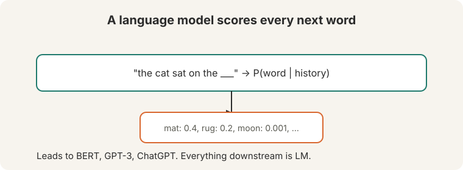
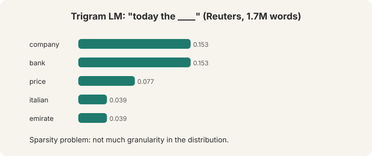
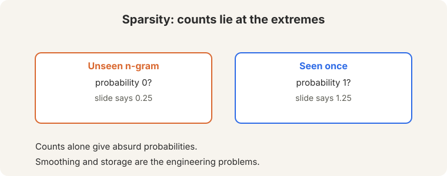
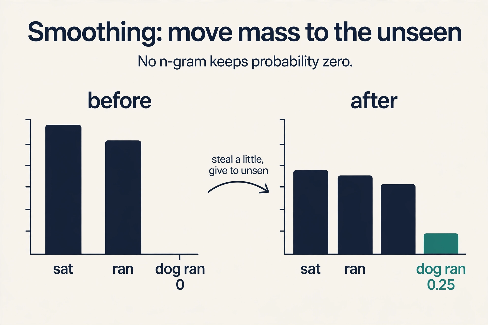
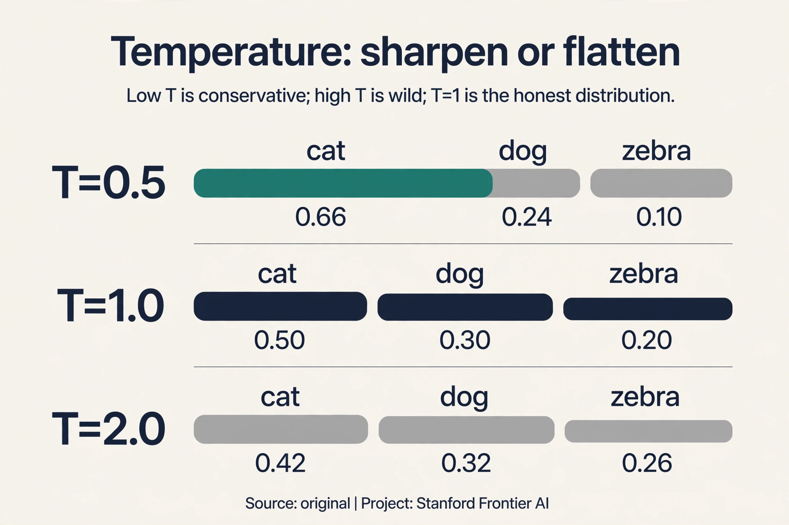
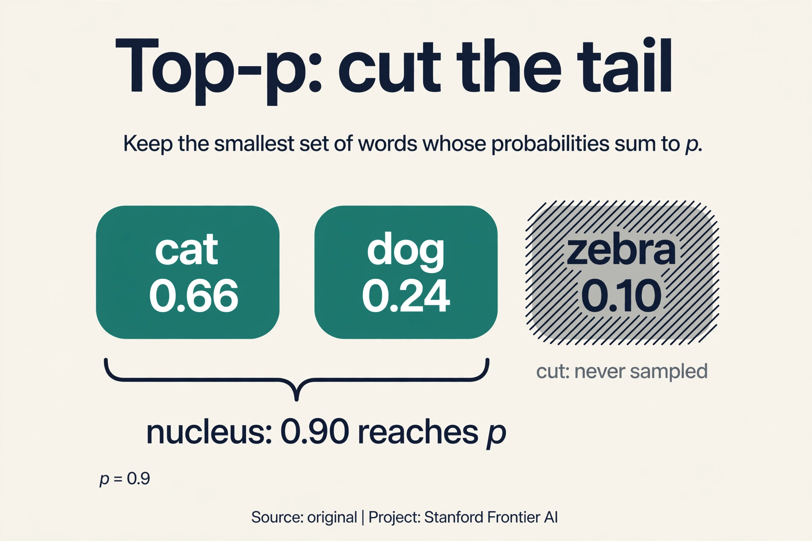
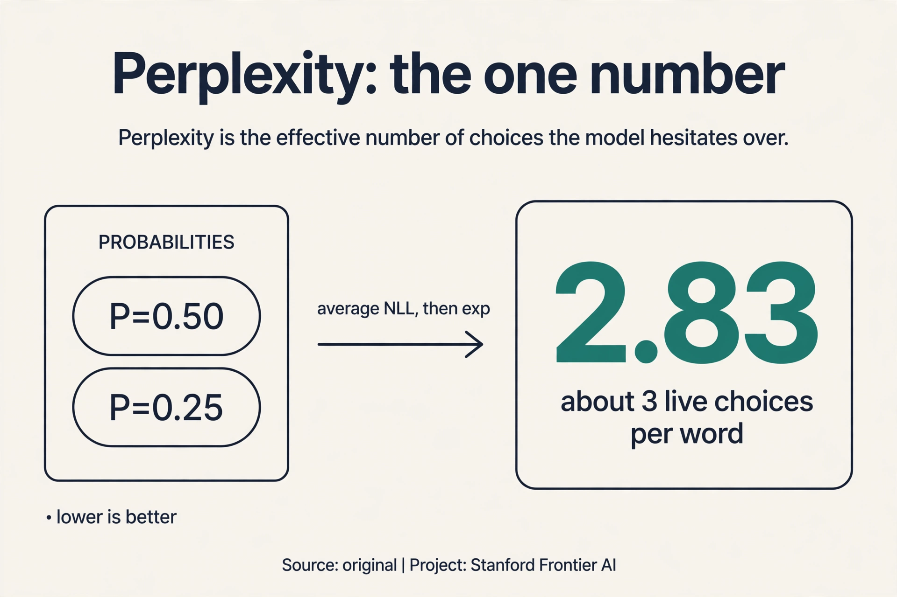
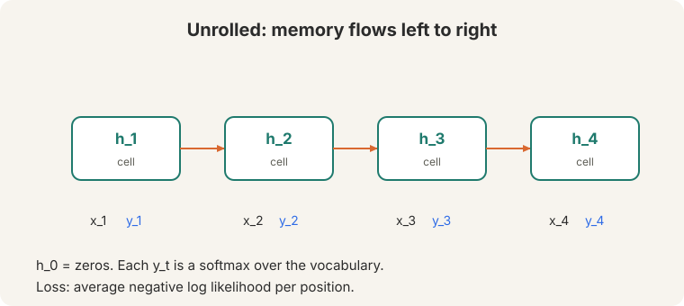
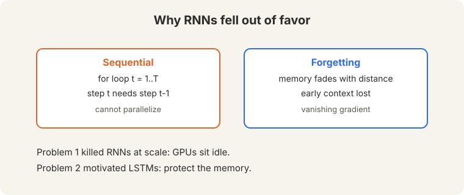

## The central concept

A **language model** assigns a probability to every possible next word. The
lecture calls it "the most important concept in the class". It leads to
BERT, GPT-3, and ChatGPT. Translation, question answering, summarization:
everything downstream is language modeling.

**On this page:** [Add-k](#subchapter-add-k-the-blunt-patch) · [Backoff](#subchapter-backoff-trust-what-you-have) · [Kneser-Ney](#subchapter-kneser-ney-count-contexts-not-words) · [Temperature](#subchapter-temperature-sharpen-or-flatten) · [Top-p](#subchapter-top-p-cut-the-tail) · [Perplexity](#subchapter-perplexity-the-one-number) · [Language models in production](#what-is-used-where-language-models-in-production) · [Watch and go deeper](#watch-and-go-deeper)



The job is concrete. Given "today the", the model must say how likely each
vocabulary word is to come next. A good model gives "company" high
probability and "zebra" low probability. Train that judgment on enough text
and the model can generate: sample a word, feed it back, repeat.

## First attempt: count

The classical approach counts. A **trigram** model over 1.7 million Reuters
words ([29:06](ts:29:06)) estimates P(word | previous two words) from
frequencies: count how often the triple occurred, divide by the count of
the pair.



Given "today the", the model outputs a distribution: company 0.153, bank
0.153, price 0.077, italian 0.039, emirate 0.039. To generate text, sample
from it. Watch the counting on a toy corpus: "the cat sat", "the cat ran",
"the dog sat". P(sat | the, cat) = count("the cat sat") / count("the cat")
= 1/2 = 0.5. That is the whole method: count, divide, sample.

## Where counting breaks

**Sparsity.** Most possible n-grams never occur. An unseen trigram gets
probability 0, which kills any sentence containing it: one zero factor
zeroes the whole product. A trigram seen once gets probability 1: total,
unearned certainty. The distribution has no granularity. The toy shows it:
"the dog ran" never occurred, so its probability is exactly 0, even though
it is a perfectly good sentence.



**Storage.** Every n-gram needs a count. With a 500,000-word vocabulary,
there are 500,000^3 = 1.25 x 10^17 possible trigrams. The table grows with
the corpus and can never cover the space. Real systems smooth the counts,
redistributing probability mass to unseen n-grams. Smoothing is a patch on
a fundamentally discrete representation: the model still only knows what it
counted.

### Subchapter: add-k, the blunt patch

Raw counts give unseen n-grams probability zero. The bluntest fix: add k
to every count. Watch add-1 on the toy corpus ("the cat sat", "the cat
ran", "the dog sat"), vocabulary {sat, ran, dog}:

```ascii
P(sat | the, cat) = (1 + 1) / (2 + 3) = 0.40   (was 0.50)
P(ran | the, dog) = (0 + 1) / (1 + 3) = 0.25   (was 0.00)
```

Nothing is zero anymore. Nothing is 1 either. Every estimate shrinks
toward uniform: that shrinkage is the price of the patch. Add-k is crude
but it kills the zeros, and the zeros were killing sentences.



### Subchapter: backoff, trust what you have

Add-k trusts all n-gram orders equally. **Backoff** is smarter: use the
longest context you have counts for. If the trigram "the cat sat" was
seen, use it. If "the dog ran" was never seen, fall back to the bigram
P(ran | dog), then to the unigram P(ran). Trust long context when the
counts support it, short context when they do not. The fallback weights
are learned so the probabilities still sum to 1.

### Subchapter: Kneser-Ney, count contexts not words

Backoff still counts occurrences. **Kneser-Ney** counts *contexts*. Its
insight: a word's backoff probability should measure how many different
histories precede it, not how often it occurs. "Francisco" occurs often
but only after "San": it is not a versatile word and deserves little
backoff mass. "Dog" occurs less often but after hundreds of different
words: it deserves more.

Watch the difference on a toy. "Francisco" occurs 1,000 times, all after
"San": 1 distinct context. "Dog" occurs 500 times after 300 distinct
words: 300 contexts. Kneser-Ney gives "dog" far more backoff probability
than "Francisco", even though "Francisco" is more frequent. Occurrence
counts memorize. Context counts generalize. Kneser-Ney was the production
standard for n-gram models for two decades.

### Subchapter: temperature, sharpen or flatten

A language model outputs a distribution. Generation turns the distribution
into words. The baseline is **greedy**: always pick the top word.
Deterministic, repetitive, good for the single most likely continuation,
bad for prose. **Temperature** generalizes it. Divide the logits by T
before the softmax. Watch one distribution, {cat: 0.5, dog: 0.3, zebra:
0.2}, under three temperatures:

```ascii
T = 0.5:  [0.66, 0.24, 0.10]   (sharpened: the leader pulls away)
T = 1.0:  [0.50, 0.30, 0.20]   (the model's honest distribution)
T = 2.0:  [0.42, 0.32, 0.26]   (flattened: the tail gets loud)
```

Low T is conservative: the top word dominates. High T is wild: rare words
get sampled far too often and the text derails. T = 1 trusts the model.
Greedy is the limit as T approaches 0.



### Subchapter: top-p, cut the tail

Temperature reshapes the whole distribution, tail included. **Top-k**
sampling keeps only the k most likely words and renormalizes. **Top-p**
(nucleus sampling) keeps the smallest set whose probabilities sum to p.
Watch top-p with p = 0.9 on {cat: 0.5, dog: 0.3, zebra: 0.2}:

```ascii
cat (0.5) + dog (0.3) = 0.8 < 0.9, add zebra (0.2) = 1.0
nucleus: {cat, dog, zebra}, renormalized to [0.5, 0.3, 0.2]
```

Now sharpen the distribution first (T = 0.4 gives [0.725, 0.202, 0.073]):
cat + dog = 0.927, which reaches p = 0.9. The nucleus is {cat, dog}:
renormalized [0.782, 0.218]. "Zebra" can never be sampled. That is the
point: cut the crazy tail. Top-p adapts where top-k cannot: a sharp
distribution gets a small nucleus, a flat one gets a large nucleus,
automatically. Temperature plus top-p is the standard recipe on every
chatbot: reshape, then cut.



### Subchapter: perplexity, the one number

How good is a language model? **Perplexity** is the standard answer: the
exponential of the average negative log likelihood. Watch it on a toy.
The model assigns probabilities [0.5, 0.25] to two true next words:

```ascii
NLL = (-log 0.5 + -log 0.25) / 2 = (0.693 + 1.386) / 2 = 1.04
perplexity = e^1.04 = 2.83
```

Read 2.83 as: the model is as confused as if it were choosing uniformly
among about 3 words. Lower is better. A model with perplexity 10 hesitates
among 10 candidates at each step. Perplexity is intrinsic (no task, just
the model's own uncertainty) and comparable across models on the same data.
Its limit: it measures the model's surprise, not its usefulness. A model
can have great perplexity and still write unhelpful text. Lecture 11 takes
that complaint apart.



> [!QA]
> Q: Why do n-grams fail on unseen word sequences?
> A: They only know what they counted. An unseen trigram gets probability zero, which kills any sentence containing it. Smoothing redistributes mass, but it is a patch on a fundamentally discrete representation.
> Follow-up: What replaced counting?
> A: Neural models. An RNN learns continuous representations, so unseen sequences still get sensible probabilities through similarity to seen ones. The representation generalizes where the table cannot.

## The key question

What if one set of weights handled every position, and the model carried
its own memory forward instead of a fixed window of counts?

## The recurrent neural network

A **recurrent neural network** applies **one set of weights** at every time
step ([51:43](ts:51:43)). The network keeps a **hidden state**: a vector
that carries memory forward. Read the sequence one token at a time, left to
right. Keep notes as you go. When a new token arrives, update the notes:
mix the old notes with the new token.

: the same weights combine the old memory with the new word.")

h(t) = tanh(W(h) h(t-1) + W(e) x(t) + b)

x(t) is the current word's vector. H(t-1) is the memory from the previous
step. The same matrices W(h), W(e) apply at every step: that sharing is
what makes the model handle any sequence length. H(0) starts as zeros. The
tanh squashes everything into a calm range.

Watch it work on a toy, by hand. Two-dimensional vectors. W(h) halves the
old notes, W(e) passes the token through unchanged.

```ascii
tokens:   x1 = "the" = [1, 0]      x2 = "cat" = [0, 1]
start:    h(0) = [0, 0]

step 1:   h(1) = tanh(0.5 * [0,0] + [1,0]) = tanh([1, 0]) = [0.76, 0]
step 2:   h(2) = tanh(0.5 * [0.76,0] + [0,1]) = tanh([0.38, 1]) = [0.36, 0.76]
```

Read h(2). The second number (0.76) is "cat", fresh and strong. The first
number (0.36) is "the", faded but present. The hidden state is doing its
job: it holds the history, with recent tokens louder than old ones.

## The RNN as a language model

Unroll the RNN across the sequence. At each position, the hidden state
feeds a **softmax over the vocabulary**: one probability distribution per
step. Sample a word from it to generate text.



```ascii
x1 --> [h1] --> [h2] --> [h3] --> ... --> [hT]
        |        |        |
       out1     out2     out3
```

The **loss** is the average negative log likelihood per position: at each
step, penalize the model for the probability it assigned to the actual next
word. One weight set, one loss, any length. This is why the RNN beat
n-grams: "the dog ran" gets a sensible probability through similarity to
seen sequences, not a zero from an empty count cell.

## Where the RNN breaks

**1. Sequential: the for loop.** Step t needs step t-1. This is a for loop
from t = 1 to T, and it cannot be parallelized ([56:56](ts:56:56)). A
1,000-token sequence means 1,000 strictly ordered steps. A modern GPU has
thousands of cores built for parallel work. The RNN gives them one step at
a time and tells the rest to wait. Training on billions of words becomes an
exercise in patience. This problem "led them to fall out of favor": at
scale, training cost decides which architectures survive.

**2. Forgetting: the leaky summary.** "They tend to forget stuff from
further back as well" ([58:08](ts:58:08)). The hidden state is a fixed-size
vector. Every step mixes the old notes with the new token, and the old
notes fade. Our toy fades by half each step. A word six steps back survives
at (0.5)^6 = 0.016: under 2 percent of its original strength. Distant
context fades too quickly, by construction.



The backward pass has the same disease. Backprop through T steps multiplies
the local gradient T times. Below 1, the product dies. Above 1, it explodes. The network cannot
even *learn* to preserve distant information, because the learning signal
itself fades on the way back. Lecture 6 names this disease and prescribes
the cure.

> [!QA]
> Q: Why did sequentiality kill RNNs at scale?
> A: Training speed. A GPU computes thousands of operations in parallel, but the RNN forces a strict order: step 1000 waits for step 999. Long sequences train slowly no matter how much hardware you add. Attention (L07-L08) fixed this by removing the order entirely.
> Follow-up: Is forgetting the same as the vanishing gradient?
> A: Related but not identical. Forgetting is about the forward pass: the hidden state is a fixed-size summary, so old information gets overwritten and fades. Vanishing gradients (L06) are about the backward pass: gradients shrink through long chains of multiplication. The LSTM fixes both with the same mechanism.

## What is used where: language models in production

- **N-grams (KenLM).** Smoothed n-gram models still run in speech
  recognition and input-method editors, where speed and tiny size beat
  neural quality. Public: the KenLM toolkit.
- **RNN language models.** Survive on-device and in streaming, where the
  O(1) per-step state is the point. Legacy speech systems shipped them.
  Public history.
- **Transformers.** GPT, Gemini, Llama, Mistral, DeepSeek: every frontier
  model is a transformer language model (Lectures 8-9). The RNN lost the
  training race. The n-gram lost the quality race.
- **Sampling knobs.** Temperature and top-p are the user-facing controls
  on every chat product. Defaults vary by product and are [uncertain]
  unless the vendor documents them.

> [!QA]
> Q: Walk me through an n-gram probability estimate on the toy corpus.
> A: Corpus: "the cat sat", "the cat ran", "the dog sat". Estimate P(sat | the, cat). Count "the cat sat": 1. Count "the cat": 2. Divide: 1/2 = 0.5. That is the whole method: count the triple, divide by the count of the pair. Now try P(ran | the, dog): count("the dog ran") = 0, so the estimate is 0. The model declares a fine sentence impossible. That zero is why smoothing exists.
> Follow-up: What does add-1 change in that estimate?
> A: P(sat | the, cat) becomes (1+1)/(2+3) = 0.4 with a 3-word vocabulary, and P(ran | the, dog) becomes (0+1)/(1+3) = 0.25. No zeros, no ones. The estimates shrink toward uniform: the price of the patch.

> [!QA]
> Q: You are building phone-keyboard autocomplete. N-gram or neural?
> A: N-gram, smoothed with Kneser-Ney, possibly interpolated with a tiny neural model. The constraints decide: the keyboard must respond in milliseconds, run on-device, and fit in megabytes. A KenLM trigram does that. A transformer does not. Autocomplete is local prediction ("the cat s" -> "sat"), exactly where n-grams are strong. Ship the n-gram. Measure keystroke savings, not perplexity.
> Follow-up: When would you upgrade to neural?
> A: When the errors are long-range: the n-gram cannot see past 2 words, so it mangles agreement across clauses. If users complain about grammar rather than word choice, the window is the bottleneck and a small RNN or transformer earns its cost.

> [!QA]
> Q: Your chatbot writes wild, incoherent text at temperature 1.5. What do you change?
> A: Lower the temperature toward 0.7-1.0 and add top-p around 0.9. Temperature 1.5 flattens the distribution: rare words get sampled far too often, and the text derails. The fix is two knobs: temperature sharpens the model's own distribution, top-p cuts the tail the temperature leaves behind. If it is still wild at T = 0.7, the model is the problem, not the sampler.
> Follow-up: Why not just use greedy decoding?
> A: Greedy is deterministic and repetitive: the same prompt always gives the same continuation, and locally-optimal choices compound into bland text. Sampling keeps variety. The applied standard is low-but-nonzero temperature with top-p: coherent, not robotic.

> [!QA]
> Q: Model A has perplexity 20, model B has 25 on the same test set. Is A better?
> A: At language modeling, yes: A is less surprised by real text. Read the numbers as effective choices: A hesitates among ~20 words per position, B among ~25. But perplexity is not usefulness. If B was instruction-tuned and A was not, B will be the better assistant despite worse perplexity. Compare perplexity only between models trained the same way, and evaluate the actual task before shipping.
> Follow-up: Can perplexity be gamed?
> A: Yes, by the tokenizer. Perplexity is per-token, and tokenizers differ: a model with a finer tokenizer sees more tokens per sentence and reports higher perplexity for the same text. Normalize per byte or per word before comparing across tokenizers. Same data, same tokenizer, or the number lies.

> [!QA]
> Q: Why did the field keep n-grams around after RNNs won?
> A: Because winning on quality is not winning on cost. An n-gram model is a table lookup: microseconds, megabytes, no GPU. It runs on a phone keyboard and in a speech recognizer's first pass. The RNN needs matrix multiplies per step. The field keeps both: n-grams where the budget is tight and the context is local, neural models everywhere else.
> Follow-up: Where is the boundary today?
> A: Roughly: on-device and real-time first-pass decoding stay n-gram or tiny-neural. Anything with a server and a quality bar is a transformer. The boundary moves as hardware improves, but the table lookup's cost advantage is structural.

## Mapping back: what the RNN answers

| N-gram failure | RNN answer | How |
|---|---|---|
| Sparsity: unseen n-grams get probability 0 | Continuous representations generalize | "The dog ran" gets a sensible probability through similarity to seen sequences |
| Storage: the count table grows with the corpus | One shared weight set for all positions | The same matrices handle any length. No table of triples |
| Fixed window: only n-1 words of context | The hidden state carries full history | In principle, h(t) remembers everything read so far |

## The honest price

The RNN paid for its generality with the two cracks above: the serial for
loop and the leaky memory, plus the silent gradient disease underneath.
The field spent years patching the recurrence. Lecture 6 builds the patch
that worked: the LSTM. Lecture 7 asks whether the chain is needed at all.

## Recap: the whole lesson on one screen

1. **The central concept.** A language model assigns a probability to every
   next word. Translation, QA, summarization: everything downstream is
   language modeling.
2. **First attempt: count.** Trigrams on 1.7M Reuters words. "Today the":
   company 0.153, bank 0.153, price 0.077. Count, divide, sample.
3. **Sparsity.** Unseen gets 0, seen-once gets 1. One zero kills the
   sentence. Smoothing is a patch on a discrete representation.
4. **Storage.** 500,000^3 = 1.25 x 10^17 possible trigrams. The table
   grows with the corpus and never covers the space.
5. **The RNN.** One weight set, reused every step:
   h(t) = tanh(W(h) h(t-1) + W(e) x(t) + b). The toy: h(1) = [0.76, 0],
   h(2) = [0.36, 0.76]. Recent tokens loud, old tokens faded.
6. **As a language model.** Unroll, softmax per step, sample to generate.
   Loss: average negative log likelihood per position.
7. **Sequential.** The for loop from 1 to T cannot parallelize. GPUs idle.
   This crack ended the RNN era at scale.
8. **Forgetting.** (0.5)^6 leaves under 2%. The fixed-size summary leaks.
   Underneath: the gradient multiplies T times and dies. Lecture 6 is the
   cure.

## Watch and go deeper

<div style="max-width:640px;margin:1.5rem 0">
<div style="position:relative;padding-bottom:56.25%;height:0;overflow:hidden;border-radius:8px;background:#000">
<iframe src="https://www.youtube-nocookie.com/embed/fyc0Jzr74y4" title="CS224N Spring 2024 Lecture 5: Language Modeling and RNNs" style="position:absolute;top:0;left:0;width:100%;height:100%;border:0" loading="lazy" allowfullscreen></iframe>
</div>
<p><strong>Lecture 5: Language Modeling and RNNs</strong> (Christopher Manning, Spring 2024). The original lecture: language modeling, n-grams, recurrent neural networks. If the embed does not load, watch the lecture directly on YouTube: https://www.youtube.com/watch?v=fyc0Jzr74y4</p>

<div style="max-width:640px;margin:1.5rem 0">
<div style="position:relative;padding-bottom:56.25%;height:0;overflow:hidden;border-radius:8px;background:#000">
<iframe src="https://www.youtube-nocookie.com/embed/PaCmpygFfXo" title="The spelled-out intro to language modeling: building makemore" style="position:absolute;top:0;left:0;width:100%;height:100%;border:0" loading="lazy" allowfullscreen></iframe>
</div>
<p><strong>Language modeling, spelled out</strong> (Karpathy). Build a bigram model by hand, then train it.</p>
</div>
</div>

### Go deeper

- [Hugging Face NLP Course](https://huggingface.co/learn/nlp-course/). Language modeling with transformers, from zero, with code.
- [Stanford CS224N course site](https://web.stanford.edu/class/cs224n/). Slides, assignments, syllabus.

## Official sources and further reading

**Official:**
- Lecture 5 video and transcript.

**Further reading:**
- Mikolov et al. (2010), "Recurrent neural network based language model":
  the RNNLM that scaled n-grams to continuous representations.
- Jozefowicz et al. (2016), "Exploring the Limits of Language Modeling":
  large-scale RNN LMs and their limits.

**Caveats from these sources.** The sparsity numbers (0, 1) describe raw
unsmoothed counts. Real n-gram systems always smooth. The RNN toy above is
an original teaching toy with the same arithmetic used across this course.
RNNs remain useful for short sequences and streaming. "fell out of favor"
refers to large-scale training.

## Connections to the other courses

- **This course:** L06 fixes forgetting and the gradient disease (LSTM).
  L07-L08 remove sequentiality with attention. L09's pretraining objectives
  are language modeling at scale.
- **CS336:** the transformer replaced the RNN. The KV cache is the
  transformer's answer to the hidden state.
- **CS229:** maximum likelihood estimation is the same objective in both
  courses.
- **CS229S:** the same RNN-to-attention story from the systems side, with
  the quadratic price of the fix.
