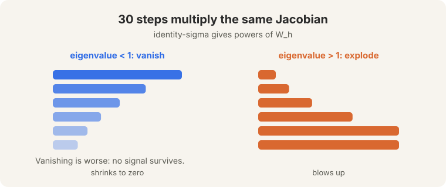
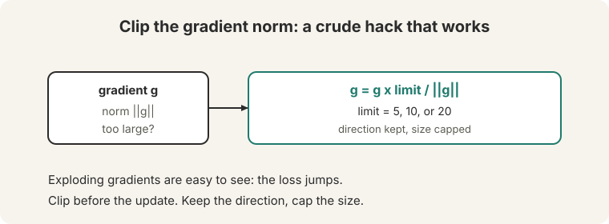
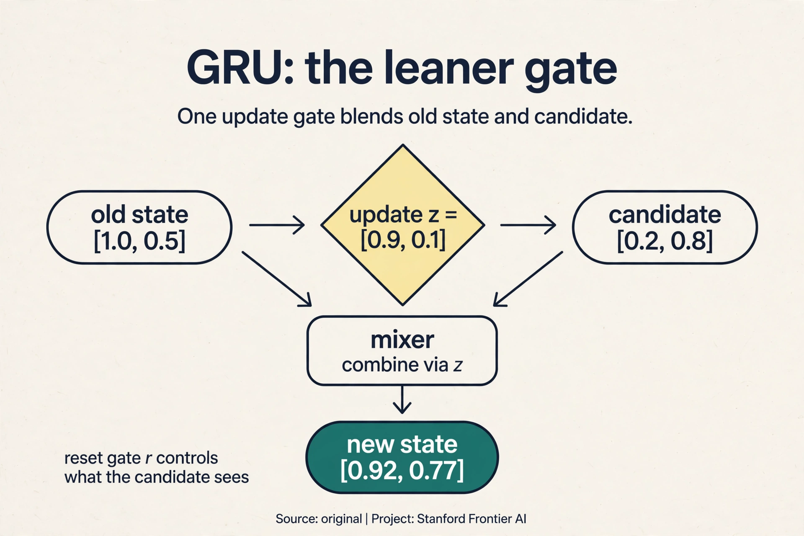
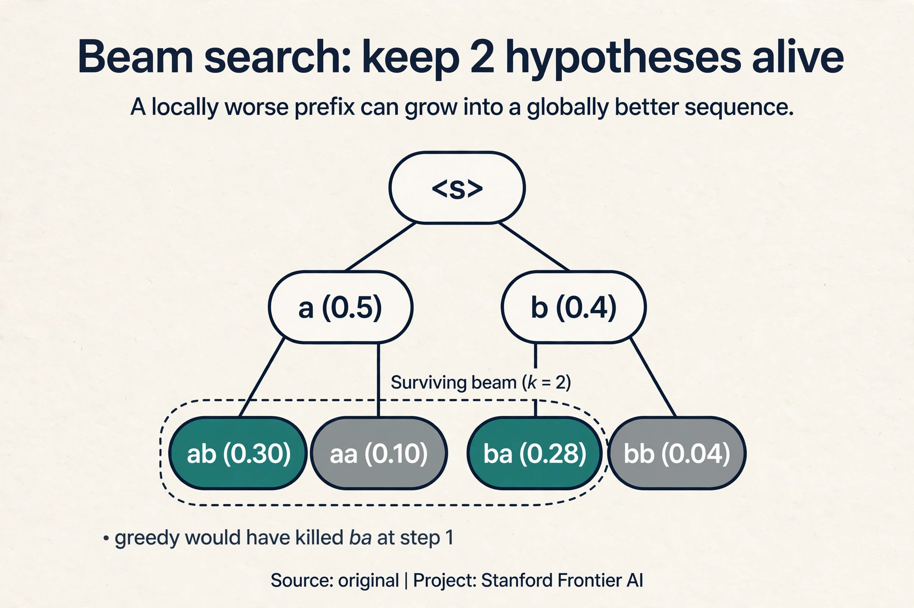
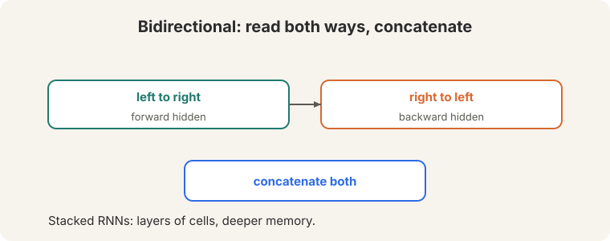
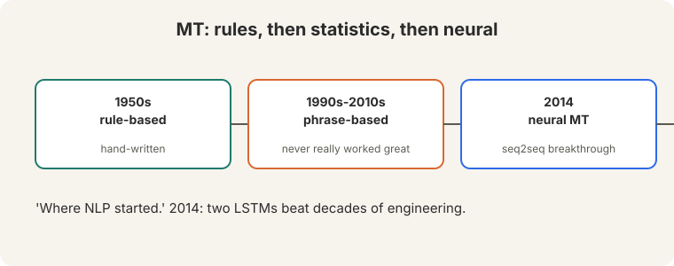
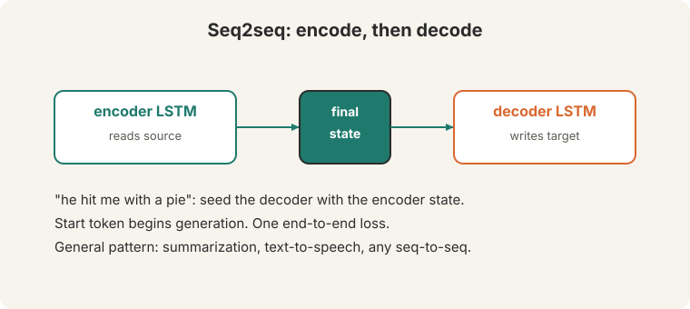

## The disease: gradients that die or explode

Lecture 5 ended with the backward-pass version of forgetting. Backprop
through 30 time steps multiplies 30 copies of the local Jacobian
([09:25](ts:09:25)).

**On this page:** [GRU](#subchapter-gru-the-leaner-gate) · [Beam search decoding](#subchapter-beam-search-decoding) · [Teacher forcing](#subchapter-teacher-forcing-and-exposure-bias) · [Recurrence in production](#what-is-used-where-recurrence-in-production) · [Watch and go deeper](#watch-and-go-deeper)
With a linear activation, that is the 30th power of the weight matrix. The
**eigenvalues** decide everything. Watch the numbers:

```ascii
per-step factor 0.9, 30 steps:  0.9^30 = 0.042   (gradient shrinks to ~4%)
per-step factor 1.1, 30 steps:  1.1^30 = 17.4    (gradient grows 17-fold)
```

- Eigenvalues below 1: the gradient **vanishes**. Thirty multiplications
  shrink the signal to 4 percent. Distant words cannot train: the network
  cannot assign them credit or blame.
- Eigenvalues above 1: the gradient **explodes**. Thirty multiplications
  blow the update 17-fold. Training diverges into nonsense.



**Vanishing is worse.** An exploded gradient is visible: the loss jumps,
NaNs appear. A vanished gradient is silent: the model trains, the loss
falls a little, but long-range dependencies never get learned. You cannot
fix what you cannot see.

> [!QA]
> Q: Why do eigenvalues control the gradient?
> A: Repeated multiplication by a matrix scales each eigendirection by its eigenvalue, raised to the number of steps. Below 1 shrinks to zero, above 1 blows up. Thirty steps make even small deviations extreme: 0.9^30 is 0.042, 1.1^30 is 17.4.
> Follow-up: Why is vanishing worse than exploding?
> A: Exploding is loud: NaN losses, obvious divergence, and clipping fixes it. Vanishing is quiet: the model trains, the loss falls a little, but long-range dependencies never get learned. You cannot fix what you cannot see.

## First patch: gradient clipping

The exploding fix is **gradient clipping** ([19:15](ts:19:15)). Before the
update, cap the gradient norm at 5, 10, or 20 ([19:37](ts:19:37)). Watch it
on a toy. The gradient is g = [6, 8]. Its norm is 10. The limit is 5:

```ascii
g = [6, 8],  ||g|| = 10 > 5
g_clipped = g x 5 / 10 = [3, 4],  ||g_clipped|| = 5
```

Keep the direction. Cap the size. The formula: g = g x limit / ||g||,
applied when ||g|| exceeds the limit. The lecture calls it "a crude hack
that works really well." It fixes exploding gradients completely. It does
nothing for vanishing: a gradient of 0.042 stays 0.042.



## The key question

Clipping treats the symptom. The disease is the multiplication itself:
every step multiplies the old memory, so the gradient must multiply back.
What if the memory update *added* instead of multiplied?

## The LSTM: a protected cell

The **LSTM** (Hochreiter and Schmidhuber, 1997, [24:55](ts:24:55)) fixes
vanishing with a **cell state**: a protected memory highway running through
time. Three **gates**, each outputting 0-to-1 probabilities, guard it
([30:05](ts:30:05)):


- **Forget gate.** "Wrongly named," says the lecture ([30:13](ts:30:13)).
  Think of it as a **remember gate**: how much of the old cell to keep.
  Near 1 means keep everything.
- **Input gate.** How much of the new candidate to write into the cell.
- **Output gate.** How much of the cell to reveal as the hidden state.

The update:

```ascii
cell   = old x forget  +  candidate x input
hidden = output x tanh(cell)
```

Watch it on a toy, by hand. The old cell holds [1.0, 0.5]. The gates say:
remember the first element fully, drop the second. Write half of the new
candidate into the first slot, all of it into the second. Reveal all of the
first, half of the second.

```ascii
old cell    = [1.0, 0.5]
forget      = [1.0, 0.0]     (remember first, drop second)
candidate   = [0.2, 0.8]
input       = [0.5, 1.0]
output      = [1.0, 0.5]

cell = [1.0*1.0 + 0.5*0.2,  0.0*0.5 + 1.0*0.8] = [1.1, 0.8]
hidden = [1.0*tanh(1.1), 0.5*tanh(0.8)] = [1.0*0.80, 0.5*0.66] = [0.80, 0.33]
```

The first cell element traveled from 1.0 to 1.1: nearly intact. Now the
gradient fact that matters. The derivative of the new cell with respect to
the old cell is the forget gate: dc(new)/dc(old) = [1.0, 0.0]. Where the
gate is near 1, the gradient passes through **unchanged**: no repeated
squashing, no 0.9^30 decay. The cell update is **additive**, not
multiplicative, and addition preserves gradients. That is the whole trick.

Google shipped LSTMs in its 2014 keyboard ([28:00](ts:28:00)): next-word
prediction that remembered context across whole sentences.

### Subchapter: GRU, the leaner gate

The LSTM has three gates and a separate cell. The **GRU** (gated recurrent
unit, Cho et al., 2014) asks whether two gates and one state are enough:

- **Update gate** z: how much of the old state to keep.
- **Reset gate** r: how much of the old state the candidate may see.

```ascii
z = sigmoid(W_z x + U_z h_prev)      (keep old vs take new)
r = sigmoid(W_r x + U_r h_prev)      (how much past the candidate sees)
candidate = tanh(W x + U (r * h_prev))
h = z * h_prev + (1 - z) * candidate
```

Watch it on a toy, by hand. h_prev = [1.0, 0.5], x arrives, gates compute
z = [0.9, 0.1], r = [1.0, 0.0], candidate = [0.2, 0.8]:

```ascii
h = [0.9*1.0 + 0.1*0.2,  0.1*0.5 + 0.9*0.8] = [0.92, 0.77]
```

The first element mostly keeps the past (z = 0.9). The second mostly takes
the candidate (z = 0.1). One gate blends old and new where the LSTM uses
two (forget + input). No separate cell: the hidden state is the memory.
Fewer parameters (about 3x vanilla versus the LSTM's 4x), nearly the same
power on most tasks. The LSTM's cell highway is slightly better at very
long dependencies. In practice: GRU for speed, LSTM for the hardest memory
tasks, and both lost to the transformer at scale.



### Subchapter: beam search decoding

Greedy decoding picks the top word at each step. **Beam search** keeps the
k best partial sequences and expands them all. Watch a beam of width 2 on a
toy. Vocabulary {a, b, </s>}. Start token <s>:

```ascii
step 1:  P(a|<s>) = 0.5,  P(b|<s>) = 0.4,  P(</s>|<s>) = 0.1
  beam: [<s> a (0.5), <s> b (0.4)]
step 2:  expand both:
  <s> a -> a: 0.5*0.2=0.10, -> b: 0.5*0.6=0.30, -> </s>: 0.5*0.2=0.10
  <s> b -> a: 0.4*0.7=0.28, -> b: 0.4*0.1=0.04, -> </s>: 0.4*0.2=0.08
  beam: [<s> a b (0.30), <s> b a (0.28)]
```

Greedy would have committed to "a" then "b" (0.30): same answer here, but
the beam also carried "<s> b a" (0.28), which greedy killed at step 1.
When early words are uncertain, the beam's second chances win. Width 5 to
10 is standard in translation. The cost is k times the compute, and the
gains flatten fast: beam search finds better-scoring sequences, not better
translations. Past width 10, the scores keep improving while BLEU does
not.



### Subchapter: teacher forcing and exposure bias

Seq2seq training cheats, in a precise sense. **Teacher forcing** feeds the
*gold* previous word at each decoder step, not the model's own prediction.
The model always reads perfect history during training. At inference it
reads its own words, mistakes included. One wrong word derails the
conditioning, and the model has never practiced recovery. That gap is
**exposure bias**: trained on clean histories, tested on dirty ones.

Watch it break. Trained with teacher forcing on "the cat sat", the decoder
sees "the", "cat", then predicts "sat". At inference it predicts "dog"
instead of "cat", then must continue from "the dog": a history it never
saw in training. Errors compound because the model never learned to steer
back.

Mitigations, all partial. **Scheduled sampling** mixes gold and predicted
words during training, annealing toward predictions. Beam search at
inference explores alternatives instead of committing. The deep fix came
later: architectures and objectives that train on their own outputs
(Lecture 10's RLHF, Lecture 15's online methods). Exposure bias is the
first sighting of a theme that runs through the whole course: train the
way you test.

## Reading both ways, stacking deep

One direction only sees the past. A **bidirectional LSTM** runs one LSTM
left-to-right and one right-to-left, then concatenates both
([51:55](ts:51:55)). **Stacked RNNs** pile cells in layers.



## Machine translation: where NLP started

"Machine translation is where NLP started" (1950s). Rule-based systems gave
way to statistical phrase-based systems, which "never really worked all
that great": chains of hand-built components whose errors compounded. The
**2014 neural breakthrough** ([65:15](ts:65:15)) replaced decades of
engineering with two LSTMs.



## Seq2seq: built from zero

**Seq2seq** is two LSTMs with one job between them. The **encoder** reads
the source sentence. Its final hidden state, one vector, seeds the
**decoder**, which writes the target one word at a time. A start token
begins generation. One end-to-end loss trains both.



Watch the decoder work on a schematic toy. The lecture's example sentence
is "he hit me with a pie" ([67:52](ts:67:52)). Suppose the encoder has
compressed the English source into the state c = [0.6, 0.4], and the French
vocabulary is {<s>, les, chats, dorment, </s>}. Decoding step 1 takes the
start token and the state, and produces scores:

```ascii
step 1: input <s>, state [0.6, 0.4]
  scores:  les 1.2,  chats 0.5,  dorment -0.3,  </s> -1.0
  exp:     3.32, 1.65, 0.74, 0.37.  total 6.08
  P:       les 0.55,  chats 0.27,  dorment 0.12,  </s> 0.06
  output: les
step 2: input "les", updated state -> predicts "chats"
step 3: input "chats" -> predicts "dorment"
step 4: input "dorment" -> predicts </s>, stop
```

**Autoregressive** generation: the model writes left to right, conditioning
on its own words so far. The encoder-decoder pattern generalizes beyond
translation:
summarization, text-to-speech, any sequence-to-sequence task.

> [!QA]
> Q: Why did seq2seq beat phrase-based translation?
> A: End-to-end learning. Phrase-based systems chained hand-built components: alignment, phrase tables, reordering rules. Each component's errors compounded. Seq2seq learned the whole mapping from data with one loss, so the components co-adapted.
> Follow-up: What is the bottleneck in seq2seq?
> A: The fixed-size final state. The entire source sentence must fit in one vector. Long sentences lose detail: the decoder's only view of the source is that single vector. Attention (L07) fixes exactly this bottleneck.

## What is used where: recurrence in production

- **Google Keyboard (2014).** The lecture's example: LSTM next-word
  prediction shipped to phones. Public.
- **Google Translate (2016).** GNMT: LSTM seq2seq with attention, the
  production system that replaced phrase-based translation. Public paper.
- **Speech recognition.** LSTM acoustic models ran production speech
  systems through the late 2010s. Public history.
- **On-device and streaming.** GRUs and LSTMs survive where the O(1)
  per-step state matters: streaming transcription, tiny models, always-on
  keyword spotting. The recurrence is the feature.
- **Modern LLMs.** None of GPT, Llama, Gemini, Mistral, or DeepSeek use
  LSTMs in the core model. The transformer won training at scale. Gated
  recurrence returned inside state-space models (Mamba), which the field
  watches as the possible next turn.

> [!QA]
> Q: Walk me through one GRU update, by hand.
> A: Previous state h = [1.0, 0.5]. New input x arrives. The gates compute z = [0.9, 0.1] (update) and r = [1.0, 0.0] (reset). The candidate sees r * h = [1.0, 0.0] mixed with x: candidate = [0.2, 0.8]. Final: h_new = z * h + (1-z) * candidate = [0.9*1.0 + 0.1*0.2, 0.1*0.5 + 0.9*0.8] = [0.92, 0.77]. The first slot kept the past, the second took the candidate. One gate blended; the LSTM would have used two.
> Follow-up: When does the GRU lose to the LSTM?
> A: On very long dependencies. The LSTM's separate cell with a forget gate near 1 is a cleaner highway than the GRU's blended state. In practice the gap is small, and both lose to attention past a few hundred tokens.

> [!QA]
> Q: Your translation system uses greedy decoding and mangles long sentences. What do you try first?
> A: Beam search with width 5. It costs 5 times the compute and often fixes exactly this: greedy commits to a locally good word that derails the rest, while the beam keeps alternatives alive. If width 5 does not help, the model is the problem: no search fixes a decoder that never learned the construction. Measure BLEU before and after, and stop widening past 10.
> Follow-up: Why does BLEU stop improving with wider beams?
> A: The beam optimizes model score, not translation quality. Wider beams find sequences the model likes more, which past a point are degenerate: too short, too repetitive. The model's preferences and human quality diverge. That divergence is a model problem wearing a search costume.

> [!QA]
> Q: What is exposure bias, and why does teacher forcing cause it?
> A: Teacher forcing trains the decoder on gold histories: every step reads the true previous word. At inference the decoder reads its own words, mistakes included. The model never practiced recovery, so one error compounds. Train on clean, test on dirty: that gap is exposure bias.
> Follow-up: Does scheduled sampling fix it?
> A: Partially. Mixing predicted words into training teaches some recovery, but it breaks the clean gradient signal and can destabilize training. The field's deeper answer was to train on the model's own outputs with feedback: RLHF and online methods (Lectures 10, 15). Exposure bias was the early warning.

> [!QA]
> Q: Why clip at 5, 10, or 20? Why not 1 or 1000?
> A: The threshold must sit above normal gradient norms and below explosive ones. Typical healthy norms are in the single digits, so 5-20 rarely triggers on good steps but catches explosions. At 1, clipping fires constantly and distorts every update: the optimizer crawls. At 1000, it never fires and the explosions survive. The numbers are heuristics tuned on real training runs, not derived constants.
> Follow-up: Does clipping change the update direction?
> A: No. It rescales the norm and keeps the direction: g * limit / ||g||. The step points the same way, just shorter. That is why it is safe: it limits damage without redirecting learning.

> [!QA]
> Q: Can the decoder in seq2seq be bidirectional?
> A: No. The decoder generates left to right: at step t the words after t do not exist yet. Bidirectionality needs the full sequence, which only the encoder has. This is structural, not a choice: generation is causal, so the decoder is causal. The encoder reads both ways; the decoder writes one way.
> Follow-up: What about non-autoregressive generation?
> A: It exists: predict all target words at once, then refine. Faster, weaker: without left-to-right conditioning the model cannot use its own partial output, and quality drops. The field tried it for speed; autoregressive stayed the standard because conditioning is where the quality lives.

## Mapping back: what the LSTM answers

| RNN pain | LSTM answer | How |
|---|---|---|
| Gradients vanish: 0.9^30 = 0.042 | Additive cell update | dc(new)/dc(old) = forget gate. Near 1, gradients pass unchanged |
| Gradients explode: 1.1^30 = 17.4 | Gradient clipping | Cap the norm at 5/10/20, keep the direction. Crude and effective |
| Forward memory fades: (0.5)^6 < 2% | The remember gate | Forget near 1 keeps the cell intact across steps. The toy: 1.0 -> 1.1 |
| One direction sees only the past | Bidirectional + stacked | Concatenate both directions. Stack for depth |

## The honest price

The LSTM is still sequential: step t waits for step t-1, so the GPU still
idles. And seq2seq has a structural bottleneck: the entire source sentence
must fit in one fixed-size vector. For a 5-word sentence that works. For a
50-word sentence, the decoder is trying to translate through a keyhole.
Watch what breaks next: Lecture 7 measures translation quality falling as
sentences lengthen, then deletes the keyhole entirely.

## Recap: the whole lesson on one screen

1. **The disease.** Backprop through 30 steps multiplies the Jacobian 30
   times. 0.9^30 = 0.042 (vanishes, silent, worse). 1.1^30 = 17.4
   (explodes, loud).
2. **Clipping.** Cap ||g|| at 5, 10, or 20, keep the direction. The toy:
   [6,8] becomes [3,4]. Crude hack, works really well. No help for
   vanishing.
3. **The key question.** What if the memory update added instead of
   multiplied?
4. **The LSTM.** A protected cell, three gates. Forget is really "remember".
   cell = old x forget + candidate x input. The toy: [1.0, 0.5] becomes
   [1.1, 0.8]. The remembered element survives.
5. **Why it trains.** The cell update is additive, so dc(new)/dc(old) =
   forget gate. Near 1, gradients flow unchanged. Addition preserves.
   multiplication destroys.
6. **Both ways, deep.** Bidirectional concatenates past and future.
   Stacked piles cells. Google keyboard shipped LSTMs in 2014.
7. **Seq2seq.** Two LSTMs: the encoder's final state seeds the decoder. A
   start token begins generation. One loss trains both. The toy decodes
   "les" at P = 0.55, then continues autoregressively.
8. **The price.** Still sequential. And the whole source must fit in one
   vector: a keyhole for long sentences. Lecture 7 deletes the keyhole.

## Watch and go deeper

<div style="max-width:640px;margin:1.5rem 0">
<div style="position:relative;padding-bottom:56.25%;height:0;overflow:hidden;border-radius:8px;background:#000">
<iframe src="https://www.youtube-nocookie.com/embed/YCzL96nL7j0" title="Long Short-Term Memory (LSTM), Clearly Explained" style="position:absolute;top:0;left:0;width:100%;height:100%;border:0" loading="lazy" allowfullscreen></iframe>
</div>
<p><strong>LSTM, clearly explained</strong> (StatQuest, Josh Starmer). Gates, memory paths, and why gradients survive.</p>
</div>

### Go deeper

- [Long Short-Term Memory](https://www.bioinf.jku.at/publications/older/2604.pdf) (Hochreiter and Schmidhuber, 1997). The LSTM paper.
- [Sequence to Sequence Learning with Neural Networks](https://arxiv.org/abs/1409.3215) (Sutskever, Vinyals, Le, 2014). Seq2seq for translation.
- [Understanding LSTM Networks](https://colah.github.io/posts/2015-08-Understanding-LSTMs/) (Chris Olah, 2015). The classic illustrated walkthrough.
- [Stanford CS224N course site](https://web.stanford.edu/class/cs224n/). Slides, assignments, syllabus.

## Official sources and further reading

**Official:**
- Lecture 6 video and transcript.
- Hochreiter and Schmidhuber (1997): the LSTM paper.
- Sutskever, Vinyals, Le (2014): seq2seq.

**Further reading:**
- Pascanu, Mikolov, Bengio (2013), "On the difficulty of training
  recurrent neural networks": the vanishing/exploding analysis the lecture
  cites.
- Bahdanau, Cho, Bengio (2015): attention, the fix for the seq2seq
  bottleneck. Covered in L07.

**Caveats from these sources.** Clipping thresholds (5, 10, 20) are
heuristics, not derived values. The LSTM gate toy and the decoder softmax
toy above are original teaching toys. "Never really worked all that great"
is the lecture's verdict on phrase-based MT, not a measured claim.

## Connections to the other courses

- **This course:** L05 introduced the RNN's two problems. L07 fixes the
  bottleneck with attention. L08 replaces recurrence entirely.
- **CS336:** LSTMs scaled with data and compute before transformers did.
  the scaling-laws story covers both.
- **CS229:** eigenvalues and matrix powers appear in the optimization
  theory.
- **CS229S:** the same RNN-to-attention story from the systems side.
