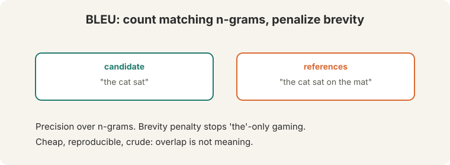
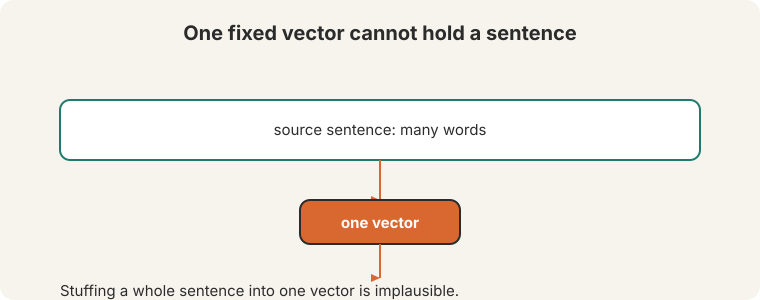
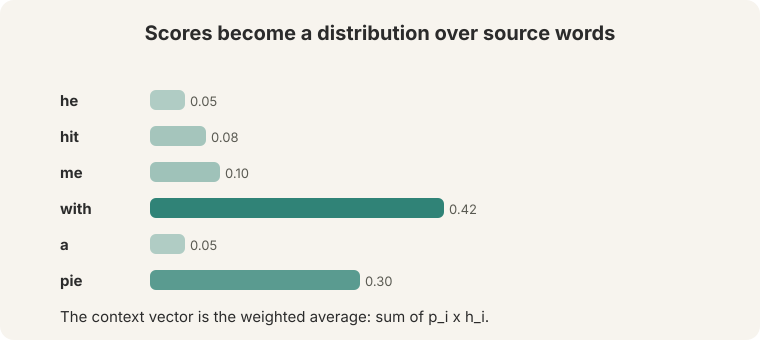
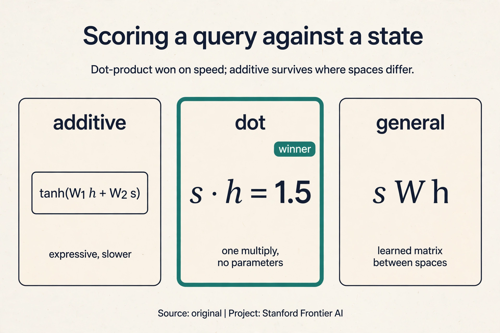
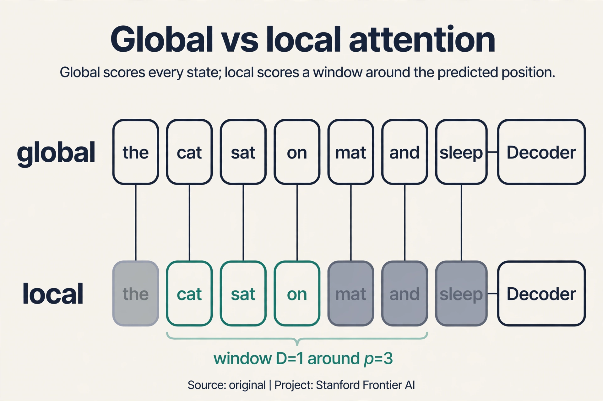
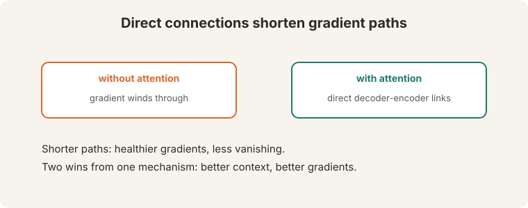

## The problem: how do you grade a translation

Before the new idea, the lecture fixes measurement. **BLEU**
([00:26](ts:00:26)) is the standard automatic metric for machine
translation. It compares n-gram overlap between the model's output and
human reference translations.

**On this page:** [Dot vs additive scoring](#subchapter-dot-versus-additive-scoring) · [Scaled dot-product](#subchapter-scaled-dot-product-the-one-line-fix) · [Luong: local vs global](#subchapter-luongs-global-versus-local-attention) · [Attention is not an explanation](#subchapter-attention-is-not-an-explanation) · [Attention in production](#what-is-used-where-attention-in-production) · [Watch and go deeper](#watch-and-go-deeper)



Watch it on toys, by hand. Reference: "the cat sat on the mat" (6 words).

```ascii
candidate A: "the cat sat on the mat"
  unigram matches: 6/6 = 1.00.  bigram matches: 5/5 = 1.00
candidate B: "the the the the the the"
  "the" appears 2x in the reference -> clipped count 2.  2/6 = 0.33
  (clipping stops pure repetition from scoring)
candidate C: "the cat sat"
  precision is high, but length 3 < reference 6
  brevity penalty = exp(1 - 6/3) = exp(-1) = 0.37
```

BLEU multiplies clipped n-gram precisions and applies the brevity penalty.

"The feline rested on the rug" means the
same as the reference and scores near zero. Lecture 11 returns to this
flaw.

## The bottleneck: one vector cannot hold a sentence

Seq2seq stuffs the whole source sentence into **one fixed vector**. "It
still seems a very questionable thing to do," says the lecture
([14:09](ts:14:09)). "It is certainly not like what a human being does."



A human translator reads the sentence, holds its meaning, then **looks
back** at earlier parts while translating ([14:14](ts:14:14)). When writing
the French word for "pie", the translator's eyes return to "pie". Seq2seq
never looks back. The decoder's only view of the source is the final
encoder state: a keyhole. Long sentences lose detail through it. The
network should do what the human does: attend to different source words as
needed.

## The key question

What if the decoder could look back at every encoder state, on every step,
and choose what to read?

## Attention: built from zero

On each decoder step, insert direct connections to the encoder
([14:51](ts:14:51)). Five steps (Bahdanau et al., 2015):


1. Use the decoder's hidden state as a **query** to look back
   ([15:20](ts:15:20)). The query says: this is what I need right now.
2. Compare it with every encoder hidden state. Compute **attention
   scores**: where to look ([15:50](ts:15:50)).
3. Softmax the scores into an **attention distribution**: weights that sum
   to 1.
4. Take the **weighted average** of the encoder states: the **context
   vector** ([16:25](ts:16:25)).
5. Concatenate the context vector with the decoder state, and predict.

Watch it on a toy, by hand. Three encoder states from "he hit pie":
h1(he) = [1, 0], h2(hit) = [0, 1], h3(pie) = [1, 1]. The decoder is about
to emit the French word for "pie". Its state, the query, is s = [1, 0.5].

```ascii
step 1, scores (dot products of the query with each encoder state):
  s . h1 = [1,0.5] . [1,0] = 1.0
  s . h2 = [1,0.5] . [0,1] = 0.5
  s . h3 = [1,0.5] . [1,1] = 1.5

step 2, softmax:
  e^1.0 = 2.72,  e^0.5 = 1.65,  e^1.5 = 4.48.  total = 8.85
  weights = [0.31, 0.19, 0.51]

step 3, context vector (weighted average):
  0.31 * [1,0] + 0.19 * [0,1] + 0.51 * [1,1] = [0.82, 0.70]
```

Read the weights. The decoder looks mostly at "pie" (0.51), some at "he"
(0.31), little at "hit" (0.19). The context vector [0.82, 0.70] is dominated
by the pie state. Concatenated with the decoder state, it drives the next
prediction: "tarte". On the next step the query changes, the weights shift,
and the model looks elsewhere.



The general form, beyond translation ([25:20](ts:25:20)): a set of
**values** H(1)..H(n), a **query** vector, scores between query and values,
softmaxed into weights, output = weighted average of values. Any problem
with "look at the relevant parts" fits this shape.

```ascii
values:   H_1   H_2   H_3  ...  H_n
query:    q
scores:   s_i = score(q, H_i)
weights:  a = softmax(s)
output:   sum over i of a_i * H_i
```

### Subchapter: dot versus additive scoring

"Score(q, H_i)" hides a design decision. Three published answers, on the
toy query s = [1, 0.5] and state h3 = [1, 1]:

- **Additive (Bahdanau).** score = v^T tanh(W_1 h + W_2 s). A small neural
  net scores the pair. Expressive, slower: the tanh runs per pair.
- **Dot (Luong).** score = s^T h. No parameters, one multiply. On the toy:
  1.5. Fast, and it won wherever dimensions were large.
- **General (Luong).** score = s^T W h. A learned matrix between the two
  spaces, for when query and key live in different geometries.

Additive is a network. Dot is arithmetic. The tradeoff is expressivity
against speed, and at scale speed won: dot-product scoring has no
parameters to learn and costs one multiply per pair.



### Subchapter: scaled dot-product, the one-line fix

Plain dot-product has a flaw that only shows at scale. Dot products grow
with dimension: at d = 64, typical scores look like [8, 8, 16] instead of
[1, 1, 2]. Softmax([8, 8, 16]) saturates to about [0.00, 0.00, 1.00]: one
weight near 1, gradients dead. The fix is one division:

score = s^T h / sqrt(d)

[8, 8, 16] / 8 = [1, 1, 2], and the softmax is healthy again. This is
**scaled dot-product attention** (Vaswani et al., 2017). Lecture 8 derives
it fully with the variance arithmetic. The point here: the field's final
answer to "how do we score" is dot-product plus one division. Additive
scoring survives only in small models and cross-modal settings where the
spaces genuinely differ.

### Subchapter: Luong's global versus local attention

Bahdanau attends to every encoder state on every step. **Luong** asked
whether the decoder needs all of them. Two answers:

- **Global.** Attend to all n states. Same as Bahdanau's coverage, with
  dot-product scoring and the context used slightly differently.
- **Local.** Predict an aligned position p_t, then attend only to states
  in [p_t - D, p_t + D]. Watch it on a toy: 7 encoder states, predicted
  position p = 3, window D = 1. The decoder scores only states 2, 3, 4.
  Cost per step drops from 7 to 3.

Local attention is monotonic alignment made differentiable: the model
looks where it expects the translation to be, plus a little around it.
For language pairs with similar word order it matches global quality at a
fraction of the cost. For pairs with heavy reordering, the window misses
and global wins. The choice encodes a bet about word order.



### Subchapter: attention is not an explanation

The weights look like explanations: 0.51 on "pie" when predicting
"tarte". Read them that way and you will be misled. Two results:

First, **adversarial attention** (Jain and Wallace, 2019). For many
predictions, very different weight distributions produce the same output.
If the weights were the explanation, changing them would change the
answer. It often does not. The weights are one factor in a large
computation: the values, the decoder state, and the output layer all vote.

Second, **correlation is not causation**. A high weight means the model
drew on that state, not that the word caused the output. The model might
attend to "pie" because the decoder state already decided "tarte" and the
attention follows. Treat weights as hints for debugging, never as proof.

## Why attention helps gradients

Attention solves the bottleneck: "you now no longer" compress everything
into one vector ([23:06](ts:23:06)). It also helps the **vanishing
gradient** problem ([23:22](ts:23:22)). Count the path lengths. Without
attention, the gradient from decoder step 20 back to the first encoder word
travels through 20 decoder steps plus the encoder chain: roughly 40 chained
multiplications. With attention, a direct connection runs from the decoder
step to each encoder state: the path is 1 or 2 multiplications.



> [!QA]
> Q: Why is attention "more human-like"?
> A: Humans translating look back at the source sentence as they write. Seq2seq forces the model to memorize the sentence in one vector and never look again. Attention restores the looking-back behavior: each decoder step aims a spotlight at the encoder states it needs.
> Follow-up: What did attention cost?
> A: Computation per step. Each decoder step now compares against every encoder state. And the decoder is still sequential: step t waits for step t-1. Attention fixed the bottleneck, not the for loop. Lecture 8 removes recurrence entirely.

> [!QA]
> Q: Is attention the same as alignment?
> A: Related, not identical. Classical alignment maps source words to target words as a hard preprocessing step. Attention learns soft weights jointly with translation. The weights often look like alignments, but they are learned for the task, not imposed.
> Follow-up: Can attention weights be read as explanations?
> A: Cautiously. High weight means the model drew on that state, not that the word caused the output. The weights are one factor in a large computation. Treat them as hints, not proofs.

## What is used where: attention in production

- **GNMT (Google, 2016).** Bahdanau-style attention in the production
  translation system. Public paper.
- **OpenNMT.** Luong's global/local attention, the open-source
  workhorse of NMT research and deployment. Public.
- **T5, BART.** Encoder-decoder transformers: cross-attention between
  decoder and encoder is Bahdanau's idea inside the transformer.
  Public.
- **Modern decoders.** GPT, Llama, and friends use self-attention, not
  encoder-decoder cross-attention. But cross-attention survives wherever
  two sequences meet: retrieval-augmented generation, image captioning,
  speech (Whisper's decoder attends to the audio encoder). Public
  architectures.

> [!QA]
> Q: Walk me through Bahdanau attention on the toy, naming every step.
> A: Encoder states from "he hit pie": h1 = [1,0], h2 = [0,1], h3 = [1,1]. The decoder state (query) is s = [1, 0.5]. Step 1, score: dot products give [1.0, 0.5, 1.5]. Step 2, weights: softmax gives [0.31, 0.19, 0.51]. Step 3, context: 0.31*[1,0] + 0.19*[0,1] + 0.51*[1,1] = [0.82, 0.70]. Step 4, predict: concatenate [0.82, 0.70] with the decoder state, run the output layer, sample "tarte". The spotlight landed on "pie" because the query matched it best.
> Follow-up: Where do the query and the states come from?
> A: The states are the encoder's hidden states: the source sentence read left to right (and right to left, if bidirectional). The query is the decoder's current hidden state: what it has generated so far. Attention is the meeting point of the two histories.

> [!QA]
> Q: Additive or dot-product scoring for a new translation model?
> A: Scaled dot-product, unless you have a reason. It has no parameters, costs one multiply per pair, and trains well: it is the default the field converged on. Pick additive only if the query and key spaces genuinely differ (cross-modal settings) and the extra expressivity pays for its cost. Measure on your dev set. The gap is usually small and the speed gap is not.
> Follow-up: What breaks with plain dot-product at large dimensions?
> A: Saturation. Dot products grow with dimension, the softmax collapses onto one state, and gradients die. That is why the scaled variant divides by sqrt(d): Lecture 8's one-line fix.

> [!QA]
> Q: English-to-German or English-to-Japanese: where does local attention work?
> A: English-to-German. Word orders are similar, so the aligned position predicts well and the window covers what matters. English-to-Japanese reorders heavily (verb-final), so the true alignment often falls outside any small window: local attention misses, global wins. The attention variant encodes a bet about the language pair. Know the linguistics before you pick.
> Follow-up: How wide a window?
> A: Wide enough to cover typical reorderings, narrow enough to matter. D = 5 to 10 is the historical range. Tune it on the dev set like any hyperparameter, and watch whether the predicted positions are actually monotonic.

> [!QA]
> Q: Your model translates "the animal did not cross the street because it was too tired" and attends strongly to "street" when generating "it". Do you conclude the model resolved "it" to "street"?
> A: No. The weight is a hint, not a proof. Adversarial results show different weights can produce the same output, so the weight does not determine the decision. The decoder state may already encode the resolution, with attention following. To test the claim, intervene: mask "street" and see if the pronoun resolution changes. Weights suggest hypotheses. Experiments confirm them.
> Follow-up: Are attention maps ever useful?
> A: Yes, for debugging. A translation model that never attends to the source is broken, and the map shows it instantly. Use attention as a diagnostic ("is it looking at all?"), not as an explanation ("this is why it decided").

> [!QA]
> Q: How do you stop an attention decoder from repeating itself?
> A: Track coverage: the sum of attention weights each source word has received so far. Penalize attending again to well-covered words. On the toy: if "pie" already accumulated 0.9 coverage, add a penalty proportional to new weight on "pie". This is the coverage mechanism (Tu et al., 2016): an explicit memory of what has been translated. It cuts repetition without changing the architecture.
> Follow-up: Why not just penalize repeated output words?
> A: Repetition is sometimes correct ("had had"). Coverage penalizes re-reading the source, not re-emitting words: it targets the cause (the spotlight stuck) rather than the symptom (the repeated word). Penalize the mechanism, not the surface.

## Mapping back: what attention answers

| Seq2seq pain | Attention answer | How |
|---|---|---|
| One fixed vector must hold the sentence | A fresh context vector per step | The decoder looks back at all encoder states. Nothing is compressed once |
| Detail lost on long sentences | The spotlight moves | Each step weights the relevant words: 0.51 on "pie" when "pie" is needed |
| Gradients vanish over ~40 chained steps | Direct connections | Path length drops to 1-2 multiplications. The signal survives |

## The honest price

Three bills. First, compute: each decoder step compares against every
encoder state. Second, the decoder is still a for loop: step t waits for
step t-1. Attention deleted the keyhole but kept the queue. Lecture 8
deletes the queue. Third, measurement: BLEU counts overlap, not meaning,
so a better model can score worse. Lecture 11 takes that problem apart.

## Recap: the whole lesson on one screen

1. **BLEU.** Clipped n-gram precision times a brevity penalty. The toys:
   repetition clipped to 0.33, short guesses penalized by exp(-1) = 0.37.
   Cheap, reproducible, crude: "the feline rested on the rug" scores ~0.
2. **The bottleneck.** One fixed vector for the whole sentence. "A very
   questionable thing to do." Humans look back. Seq2seq cannot.
3. **The key question.** What if the decoder looked back at every encoder
   state, on every step?
4. **The mechanism.** Query, scores, softmax, weighted average,
   concatenate, predict. Bahdanau et al., 2015.
5. **The toy.** Query [1, 0.5] against [1,0], [0,1], [1,1]: scores
   [1.0, 0.5, 1.5], weights [0.31, 0.19, 0.51], context [0.82, 0.70].
   The spotlight lands on "pie".
6. **The general form.** Values plus a query: scores, softmax, weighted
   average. Any "look at the relevant parts" problem fits.
7. **Gradients.** Direct connections cut the path from ~40 multiplications
   to 1-2. Shorter paths, healthier gradients.
8. **The price.** Per-step comparison cost. The decoder is still
   sequential. BLEU measures overlap, not meaning.

## Watch and go deeper

<div style="max-width:640px;margin:1.5rem 0">
<div style="position:relative;padding-bottom:56.25%;height:0;overflow:hidden;border-radius:8px;background:#000">
<iframe src="https://www.youtube-nocookie.com/embed/eMlx5fFNoYc" title="Attention in transformers, visually explained" style="position:absolute;top:0;left:0;width:100%;height:100%;border:0" loading="lazy" allowfullscreen></iframe>
</div>
<p><strong>Attention, visually explained</strong> (3Blue1Brown). Queries, keys, and values as geometry.</p>
</div>

### Go deeper

- [Neural Machine Translation by Jointly Learning to Align and Translate](https://arxiv.org/abs/1409.0473) (Bahdanau, Cho, Bengio, 2015). The attention paper.
- [Effective Approaches to Attention-based Neural Machine Translation](https://arxiv.org/abs/1508.04025) (Luong, Pham, Manning, 2015). Global vs local attention.
- [Attention and Augmented Recurrent Neural Networks](https://distill.pub/2016/augmented-rnns/) (Olah and Carter, Distill 2016). Attention drawn as it works.
- [Stanford CS224N course site](https://web.stanford.edu/class/cs224n/). Slides, assignments, syllabus.

## Official sources and further reading

**Official:**
- Lecture 7 video and transcript.
- Bahdanau, Cho, Bengio (2015): attention for NMT.
- Papineni et al. (2002): BLEU.

**Further reading:**
- Luong, Pham, Manning (2015), "Effective Approaches to Attention-based
  Neural Machine Translation": the local/global attention variants.
- Vaswani et al. (2017): the transformer. Covered in L08.

**Caveats from these sources.** BLEU correlates imperfectly with human
judgment. L11 revisits this. The attention toy above is an original
teaching toy. Attention weights are hints, not explanations.

## Connections to the other courses

- **This course:** L06's bottleneck is this lecture's motivation. L08
  turns attention into the transformer: attention everywhere, all at once.
- **CS336:** the transformer architecture. Evaluation lectures generalize
  BLEU's limits to all automatic metrics.
- **CS229S:** alignment algorithms are the classical predecessor of
  attention.
