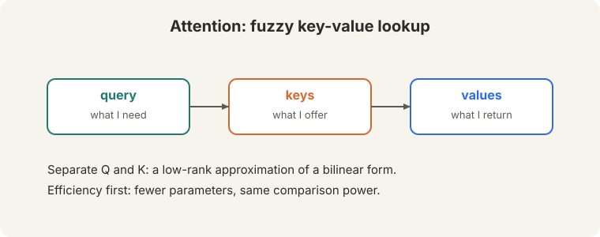
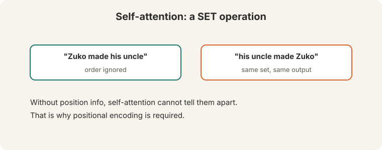
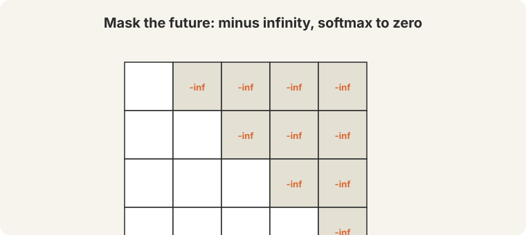
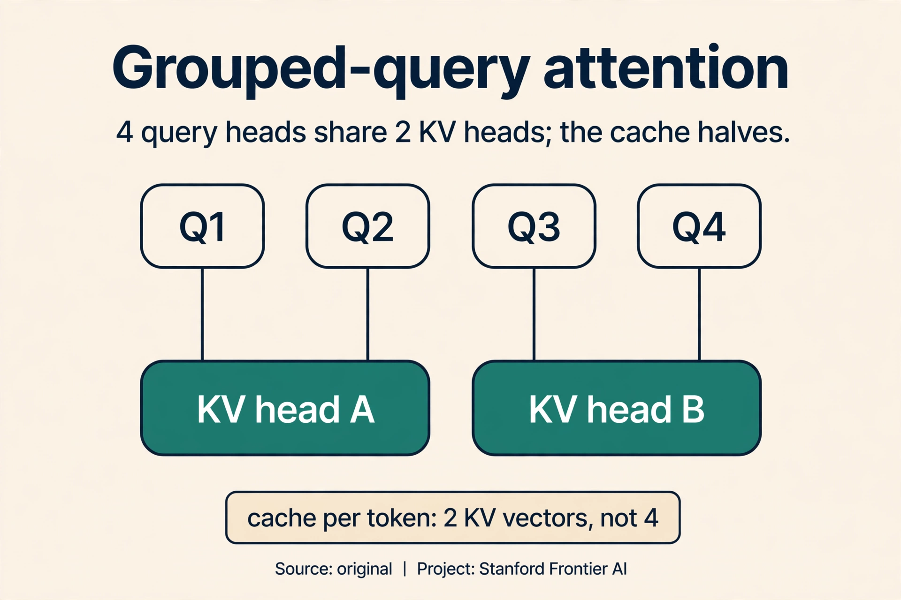
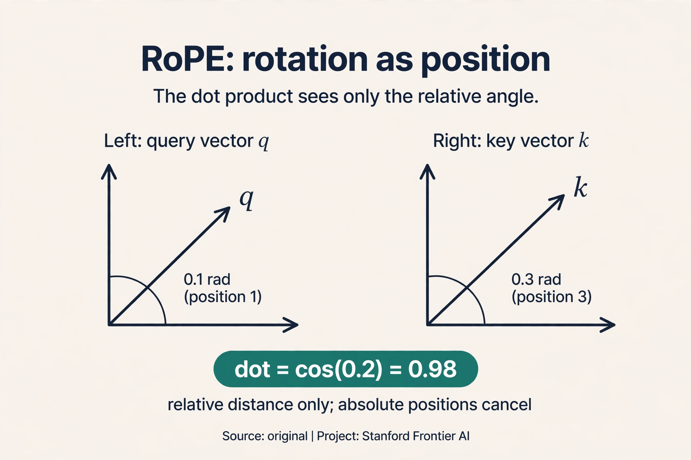

## The two failures, restated

Guest lecturer Anna Goldie opens by restating why the RNN had to go
([04:40](ts:04:40)). Two failures:

 sequential: GPUs cannot parallelize.")

1. **Linear interaction distance.** "The chef who went to the stores ...
   was." Subject and verb sit far apart. The RNN's memory fades across the
   gap: (0.5)^n kills the connection.
2. **O(n) sequential steps.** Each step waits for the last. Thousands of
   GPU cores idle.

Lecture 7's attention fixed the bottleneck but kept the decoder's for loop.
The key question: what if attention was the *whole* architecture, with no
recurrence at all?

**On this page:** [MHA, MQA, GQA](#subchapter-mha-mqa-gqa-the-kv-sharing-family) · [RoPE](#subchapter-rope-rotation-as-position) · [FlashAttention](#subchapter-flashattention-the-exact-speedup) · [Transformers in production, Oct 2026](#what-is-used-where-transformers-in-production-october-2026) · [Watch and go deeper](#watch-and-go-deeper)

## Self-attention: every word queries every word

Think of attention as a **fuzzy key-value lookup** ([12:03](ts:12:03)). The
**query** says what you need. The **keys** say what each position offers.
The **values** are what you get back. Keeping Q and K separate is a design
choice with a reason: it is a low-rank approximation of a bilinear form.
Fewer parameters, same comparison power.



**Self-attention** applies this within one sequence: every word queries
every word, all at once. Watch it on a toy, by hand. Three tokens,
two-dimensional vectors, identity projections (the real model learns them.
the mechanism is the same). The query is "frame" = [1, 1]:

```ascii
keys:    counselor [1,0]    helped [0,1]    frame [1,1]

step 1, scores (dot products):
  [1,1].[1,0] = 1     [1,1].[0,1] = 1     [1,1].[1,1] = 2

step 2, softmax:
  e^1 = 2.72, e^1 = 2.72, e^2 = 7.39. total 12.83
  weights = [0.21, 0.21, 0.58]

step 3, mix the values:
  0.21*[1,0] + 0.21*[0,1] + 0.58*[1,1] = [0.79, 0.79]
```

"Frame" pulled 21% from "counselor", 21% from "helped", 58% from itself.
Every pair met directly: O(1) interaction distance. All pairs computed as
matrix multiplies: fully parallel. The chain is gone.

Now the scaling detail that makes it train. Raw dot products grow with
dimension: for random vectors of dimension d, the dot product has variance
d. Watch what happens without scaling at d = 64. Typical scores look like
[8, 8, 16] instead of [1, 1, 2]:

```ascii
unscaled:  softmax([8, 8, 16]) -> weights ~ [0.00, 0.00, 1.00]  (saturated)
scaled:    [8,8,16] / sqrt(64) = [1, 1, 2] -> [0.21, 0.21, 0.58]  (healthy)
```

The unscaled softmax saturates: one weight goes to 1, the rest to 0, and
the gradients through the tiny weights die. Dividing by sqrt(d_k) brings
the variance back to 1 and keeps the softmax responsive. This is **scaled
dot-product attention**: one division, and large models train.

## The set problem: inject order

Self-attention has a blind spot. It is a **SET operation**. "Zuko made his
uncle" and "his uncle made Zuko" contain the same words ([14:48](ts:14:48),
[22:01](ts:22:01)). Without order information, self-attention treats them
as the same set and produces the same mixing. Word order carries meaning,
so order must be injected.



**Positional encoding** adds a position vector to each token embedding.
Two options:

- **Sinusoidal.** Fixed waves per position: position p gets
  [sin(p), cos(p), sin(p/100), ...]. Watch the first two dimensions:
  position 0 -> [sin(0), cos(0)] = [0.00, 1.00]. Position 1 ->
  [sin(1), cos(1)] = [0.84, 0.54]. Distinct positions get distinct vectors,
  and nearby positions stay similar (dot product 0.54). Elegant. But
  extrapolation "fails in practice": beyond trained lengths, the
  waves land where the model never learned to read them.
- **Learned.** A d-by-n embedding matrix: position i learns its own vector.
  Works, but crashes beyond the trained length n. It works because the
  position index correlates across examples: position 5 means "fifth word"
  in every sentence.

## Masking: hide the future

A language model predicts the next token. During training it sees the full
sequence, so nothing may reveal the answer. The model computes the full
n-by-n score matrix. For future positions, set the scores to **minus
infinity**. Softmax turns them to zero ([37:18](ts:37:18)). Watch row 1 of
a 3-word sentence, where only the past is visible:

```ascii
scores row 1:  [2.0, -inf, -inf]
softmax:       e^2.0 = 7.39, e^-inf = 0, e^-inf = 0. total 7.39
weights:       [1.00, 0.00, 0.00]
```

Position 1 attends only to itself. Position 2 will see positions 1 and 2.
The future stays hidden. Without the mask, training is "just too easy":
the model reads the answer, the loss falls to zero, and nothing is learned.



The **decoder masks**. The **encoder does not**: it builds a
representation of a complete input (a translation source, a text to
classify), and there is no prediction to cheat on. Padding tokens are
masked like the future: they are not real words.

> [!QA]
> Q: What breaks if you forget the causal mask?
> A: The model reads the answer during training. "It is just too easy": the loss falls to zero, and the model learns nothing about prediction. Every generated token would cheat.
> Follow-up: Why does the encoder get to see everything?
> A: Encoders do not predict the next token. They build representations of a complete input (translation source, classification text). No prediction means no cheating.

## Multi-head attention

One attention mixes everything into one weighted average. **Multi-head**
attention runs several attentions in parallel: 8 heads, each on d/8
dimensions ([42:31](ts:42:31)). The original model used d = 512, so each
head worked in 64 dimensions. The heuristic: at least 64 dimensions per
head. The hope is that heads "hopefully specialize" in different
relations: one tracks subjects, another tracks objects. Not guaranteed.
You can zero out some heads after training with little loss, which says
the specialization is partial at best.

In matrix form: XQ times XK-transpose gives the n-by-n score matrix.
Divide by sqrt(d_k). Softmax each row. Multiply by XV. Eight heads do this
in parallel, then their outputs concatenate.

### Subchapter: MHA, MQA, GQA, the KV-sharing family

Multi-head attention (MHA) gives every query head its own key and value
heads. At inference the keys and values are cached: the **KV cache**. With
H heads, each token stores H key vectors and H value vectors. The cache
grows with heads, and at long contexts it dominates memory. Three answers:

- **MHA.** H query heads, H KV heads. Full quality, full cache.
- **MQA** (multi-query attention). H query heads, **one** KV head shared
  by all. The cache shrinks by H. Slight quality cost.
- **GQA** (grouped-query attention). H query heads, G KV heads, each
  shared by H/G queries. The middle ground.

Watch GQA on a toy. 4 query heads, 2 KV heads. Queries 1-2 share KV head
A, queries 3-4 share KV head B. Each token caches 2 key vectors and 2
value vectors instead of 4: the cache halves, and quality stays close to
MHA. Llama 2/3 ship GQA. The rule: share keys and values where the model
can afford it, keep queries independent where expressivity lives.



### Subchapter: RoPE, rotation as position

Absolute positions label each slot: position 7 is position 7. **RoPE**
(rotary position embedding, Su et al., 2021) does something stranger: it
**rotates** each query and key by an angle proportional to its position.
Watch it on a toy, in two dimensions. Query q = [1, 0] at position m = 1,
key k = [1, 0] at position n = 3, base angle 0.1 per position:

```ascii
q rotated by 1 x 0.1 = 0.1 rad
k rotated by 3 x 0.1 = 0.3 rad
dot product = cos(0.3 - 0.1) = cos(0.2) = 0.98
```

The dot product depends on the **relative** distance (0.2 rad), never on
the absolute positions. Move both tokens 100 slots right: the rotations
grow, the difference stays 0.2, the score stays 0.98. Relative distance,
baked into the score itself, with no position vectors added to the
embeddings. That is why the field moved from absolute sinusoids to RoPE:
what "frame" needs is the distance to "counselor", not its own slot
number. Llama, Mistral, and most open models use RoPE. Its limit:
extrapolation past trained lengths still degrades, which is why long
context needs more than RoPE alone.



### Subchapter: FlashAttention, the exact speedup

The n-by-n score matrix is the cost and the memory hog. **FlashAttention**
(Dao et al., 2022) keeps the exact math and changes the execution.
GPUs have a small fast memory (SRAM) and a large slow one (HBM). The naive
implementation writes the full score matrix to HBM and reads it back:
memory-bound. FlashAttention **tiles**: load blocks of Q, K, V into SRAM,
compute partial attention per block, and track running softmax statistics
(max and sum) to combine blocks correctly without ever materializing the
full matrix.

Count it at N = 4,096. The naive matrix holds 16.7M floats: 67 MB per head
in fp32, written and read every layer. FlashAttention streams blocks
through SRAM and recomputes instead of storing. Same outputs, bit for bit.
2 to 4 times faster, far less memory. The follow-up (FlashAttention-2/3)
tuned the tiling further. The lesson: the algorithm was fine, the memory
traffic was the bottleneck. Modern training stacks all run some variant
of this.

## The block: residuals, normalization, repeat

Attention alone is not a network. The transformer block wraps it:

**Residual connections** add the input back: output = x + Attention(x).
The gradient through the addition is 1 on the identity path: dy/dx = 1 +
dF/dx. Even if the attention's own gradient vanishes, the 1 survives. Deep
stacks stay trainable because every layer carries an unbroken gradient
highway.

**LayerNorm** normalizes **per word**, not across the sequence or batch
([61:01](ts:61:01)). Watch it on x = [1.0, 2.0, 3.0]:

```ascii
mean mu = 2.0
variance = ((1-2)^2 + (2-2)^2 + (3-2)^2) / 3 = 0.667
normalized = (x - mu) / sqrt(variance) = [-1.22, 0.00, 1.22]
```

Then scale by gamma and shift by beta ([63:22](ts:63:22),
[63:36](ts:63:36)), both learned. Gamma and beta "maybe not that important": the normalization itself does the work.

The block: self-attention, add and norm, feedforward MLP, add and norm.
Repeat. **Cross-attention** (encoder-decoder): queries come from the
decoder, keys and values from the encoder. The lecturer's "personal
opinion" of the minimal thing: embed + position + self-attention + MLP +
masking, repeated.


## What is used where: transformers in production, October 2026

Every frontier model is a transformer. The differences are the answers to
this chapter's questions: who sees whom, where is position, who pays.

| Model | Attention | Positions | Public facts |
|---|---|---|---|
| BERT (2018) | bidirectional MHA | learned absolute | Public paper. No causal mask: reads, does not generate |
| T5 (2019) | self + cross | relative bias | Public paper. Encoder-decoder with span corruption |
| GPT-3 (2020) | causal MHA | learned absolute | Public paper. Decoder-only set the template |
| Llama 2/3 (2023-24) | GQA, causal | RoPE | Public model cards. The open-weights reference |
| Mistral 7B (2023) | sliding window + GQA | RoPE | Public paper. Long context on a budget |
| Llama 4 Maverick/Scout (Apr 2025) | [uncertain] | [uncertain] | Meta announced MoE and open weights. Attention internals not public |
| DeepSeek-V3 (Dec 2024) | MLA | decoupled RoPE | Public paper. Latent KV cache: 512-dim per token |
| DeepSeek-V4 (Apr 2026) | MLA + sparse attention | [uncertain] | MIT license, MoE, 1M context. R2 never shipped |
| GPT-5.x (2025-26) | [unknown] | [unknown] | Closed. OpenAI publishes no architecture |
| Gemini 3.x (2025-26) | [unknown] | [unknown] | Closed. Google publishes no architecture |
| Claude 4.x/5 (2026) | [unknown] | [unknown] | Closed. Anthropic publishes no architecture |

Read it as verified versus unknown. The open models (Llama 2/3, Mistral,
DeepSeek) publish enough to place on the map. The closed labs publish
capabilities, not architectures: anything about GPT-5.x, Gemini 3.x, or
Claude internals is a guess until the vendor says otherwise.

> [!QA]
> Q: Walk me through multi-head attention on the toy, naming every matrix.
> A: Three tokens, d = 4, H = 2 heads, so each head works in d/H = 2 dimensions. Input X is 3x4. Per head: Q = XW_q (3x2), K = XW_k (3x2), V = XW_v (3x2). Scores = QK^T / sqrt(2): a 3x3 matrix. Softmax each row. Output = weights x V: 3x2. Concatenate the two heads' outputs: 3x4. Project with W_o (4x4): 3x4. Same shape in, same shape out, two independent relations mixed per token.
> Follow-up: Why split d into H subspaces instead of running H full-width heads?
> A: Cost. H full-width heads cost H times the compute. Narrow heads keep the total cost near one full-width head while giving H independent votes. The split is the budget trick that makes "many relations" affordable.

> [!QA]
> Q: You are serving a 70B model at 128K context and the KV cache is eating your GPUs. MQA, GQA, or MLA?
> A: GQA if you are fine-tuning an existing GQA model (Llama 3 style): it is the drop-in answer, and the cache shrinks by the group size. MLA if you are training from scratch and can afford the complexity: DeepSeek's latent cache is the most aggressive public design. MQA only if quality is not the binding constraint: one KV head is the cheapest and the weakest. Measure quality per gigabyte of cache, not just gigabytes.
> Follow-up: Why not just quantize the KV cache?
> A: You should do both. Quantization shrinks bytes per vector. GQA/MLA shrink the number of vectors. They multiply. The frontier systems combine them: fewer heads, fewer bits each.

> [!QA]
> Q: RoPE or learned absolute positions for a new 128K-context model?
> A: RoPE. Learned absolute positions crash beyond the trained length n: position 130,000 has no vector. RoPE degrades more gracefully because distance is relative, and the long-context literature (NTK-aware scaling, YaRN) is built on RoPE. Neither extrapolates for free: budget for position interpolation work if you train short and serve long.
> Follow-up: What is the actual failure when you exceed the trained length?
> A: The rotation angles land where the model never learned to read them. Attention scores become effectively random at far distances, and the model loses the thread. It does not error: it confabulates. Test extrapolation explicitly before claiming the context length.

> [!QA]
> Q: Why did decoder-only win over encoder-decoder for large language models?
> A: Three reasons. One: the training objective (next-token prediction) needs no paired data, so it scales to trillions of words. Encoder-decoder pretraining needed span corruption machinery. Two: one stack is simpler to scale than two. Three: in-context learning emerged in decoder-only models at scale, which made the single stack do everything. Encoder-decoder survives where input and output differ in kind: translation, speech (Whisper), summarization.
> Follow-up: Is the victory permanent?
> A: Not necessarily. Retrieval-augmented and tool-using models reintroduce the two-sequence structure (query plus documents), and cross-attention is back in those designs. The decoder-only stack won pretraining. The architecture of use is still being negotiated.

> [!QA]
> Q: When does FlashAttention not help?
> A: When attention is not the bottleneck. At short sequences (N under ~1K) the n-by-n matrix is small and the kernel launch overhead dominates: tiling buys little. At small batch sizes on weak GPUs, memory bandwidth was never the binding constraint. And it never changes the math: if your model is wrong, exact-fast attention is exactly as wrong. Profile first: if HBM traffic is the wall, FlashAttention moves it. Otherwise it is ceremony.
> Follow-up: FlashAttention-2 and 3: what changed?
> A: Better tiling and warp-level parallelism, then hardware-specific async pipelines for H100s. Same exact math, better use of the chip. The lesson repeats: the algorithm was fine, the execution was the bottleneck.

## Mapping back: what the transformer answers

| RNN pain | Transformer answer | How |
|---|---|---|
| Linear interaction distance: "the chef ... Was" fades | O(1) interaction distance | Every pair meets in one step through the score matrix. The toy: [0.21, 0.21, 0.58] |
| O(n) sequential steps: GPUs idle | Fully parallel matrix ops | All n^2 scores compute at once. No step waits for another |
| Gradients vanish over long chains | Residuals + short paths | Gradient 1 flows through every identity. Attention paths are 1-2 steps |
| Set operation ignores order | Positional encoding | Sinusoidal or learned vectors inject position. Zuko sentences differ |
| Training could peek at answers | Causal masking | Future scores to -inf. Weights to 0. "too easy" is impossible |

## The honest price: quadratic

Deleting the chain has a price, written in the score matrix. It is n by
n: every token pairs with every token. N = 30 is fine: 900 scores
([28:07](ts:28:07)). N = 50,000 is infeasible: 2.5 billion scores per
layer per head, most of which must sit in memory. Double the length,
quadruple the work. This single fact drives the efficient-training
lecture (L12) and much of modern systems work. The lecture's verdict: "the original
Transformer plus a couple of modifications is still the best."

> [!QA]
> Q: Why did the transformer win over the LSTM?
> A: Two wins at once. Constant interaction distance: every word reaches every other word directly, so long dependencies survive. The toy shows "frame" pulling 58% from itself and 21% from each neighbor in one step. Full parallelization: all positions compute at once, so GPUs stay busy. The LSTM had neither.
> Follow-up: What did it lose?
> A: Order and efficiency. Self-attention is a set operation, so position must be injected artificially, and sinusoidal extrapolation does not work in practice. And the n-by-n score matrix costs quadratic time and memory: n = 30 is fine, n = 50,000 is infeasible.

## Recap: the whole lesson on one screen

1. **The two failures.** Linear interaction distance ("the chef ... Was")
   and O(n) sequential steps. Attention fixed the bottleneck. The queue
   remained.
2. **The key question.** What if attention was the whole architecture, no
   recurrence at all?
3. **Self-attention.** Every word queries every word. The toy: scores
   [1,1,2] -> weights [0.21, 0.21, 0.58] -> [0.79, 0.79]. O(1) distance,
   fully parallel.
4. **Scaling.** Divide by sqrt(d_k). Unscaled [8,8,16] saturates to
   [0,0,1]. Scaled [1,1,2] stays healthy. One division, trainable models.
5. **The set problem.** "Zuko made his uncle" versus "his uncle made
   Zuko": same set. Positional encoding injects order: sinusoidal waves
   ([0,1] vs [0.84,0.54]) or learned vectors.
6. **Masking.** Future scores to -inf, weights to 0. The toy: [2.0, -inf,
   -inf] -> [1, 0, 0]. Decoders mask. Encoders do not.
7. **Multi-head.** 8 heads on d/8 dims each, 64+ dims per head. Heads
   hopefully specialize. Zeroing some costs little.
8. **The block.** Attention, add and norm, MLP, add and norm. Residuals
   carry gradient 1. LayerNorm per word: [-1.22, 0, 1.22] for [1,2,3].
   Cross-attention: Q from decoder, K/V from encoder. The price:
   quadratic.

## Watch and go deeper

<div style="max-width:640px;margin:1.5rem 0">
<div style="position:relative;padding-bottom:56.25%;height:0;overflow:hidden;border-radius:8px;background:#000">
<iframe src="https://www.youtube-nocookie.com/embed/kCc8FmEb1nY" title="Let's build GPT: from scratch, in code, spelled out" style="position:absolute;top:0;left:0;width:100%;height:100%;border:0" loading="lazy" allowfullscreen></iframe>
</div>
<p><strong>Build GPT from scratch</strong> (Karpathy). The transformer block in code: attention, heads, residuals, LayerNorm.</p>
</div>

### Go deeper

- [Attention Is All You Need](https://arxiv.org/abs/1706.03762) (Vaswani et al., 2017). The original transformer paper.
- [The Annotated Transformer](https://nlp.seas.harvard.edu/annotated-transformer/) (Harvard NLP). The paper implemented line by line, with code.
- [The Illustrated Transformer](https://jalammar.github.io/illustrated-transformer/) (Jay Alammar). The architecture drawn piece by piece.
- [Stanford CS224N course site](https://web.stanford.edu/class/cs224n/). Slides, assignments, syllabus.

## Official sources and further reading

**Official:**
- Lecture 8 video and transcript.
- Vaswani et al. (2017), "Attention Is All You Need": the original
  transformer paper.

**Further reading:**
- The Annotated Transformer (Harvard NLP): line-by-line implementation of
  the paper.
- For the modern refinements (prenorm, rotary positions, grouped-query
  attention): CS336's architecture lecture, as a follow-up.

**Caveats from these sources.** "Extrapolation fails in practice"
is the lecturer's verdict on sinusoidal encodings, not a theorem. "The
original Transformer plus a couple of modifications is still the best" is
a 2024 opinion. The worked toys above are original teaching toys with the
same arithmetic used across this course.

## Connections to the other courses

- **This course:** L05-L07 built the RNN-to-attention arc. L09 uses the
  transformer for pretraining. L12 trains it efficiently despite the
  quadratic price.
- **CS336:** the modern transformer architecture (prenorm, rotary
  positions, grouped-query attention) and sub-quadratic attention
  variants.
- **CS229S:** the same attention story from the systems side. The low-rank
  Q/K approximation is matrix factorization in disguise.
