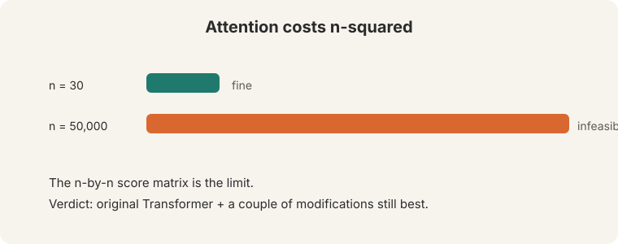
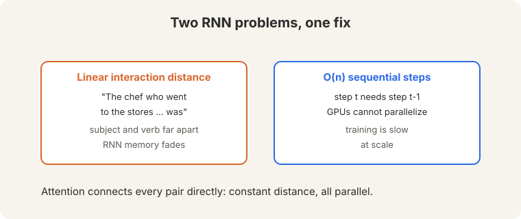
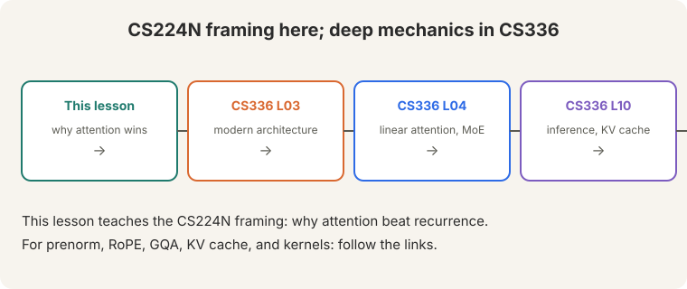

> [!NOTE]
> **Bridge lesson.** This lecture teaches the CS224N framing: why attention
> beat recurrence and what the transformer block contains. For deep
> mechanics, follow the links: [CS336 L03](../cs336/l03-architecture.html)
> (the modern architecture: prenorm, RoPE, GQA), [CS336 L04](../cs336/l04-linear-attention-moe.html)
> (linear attention and MoE), [CS336 L10](../cs336/l10-inference.html)
> (inference and the KV cache). This lesson never re-explains what those
> cover.

## How to read this lesson

This lesson has two levels. **Level 1 (Core)** derives the transformer from
the two failures of RNNs. **Level 2 (Deep)** covers multi-head attention,
scaling, residuals, normalization, and the full block.

## Level 1: Two problems attention solves

RNNs fail twice ([04:40](ts:04:40)):

 sequential: GPUs cannot parallelize.")

1. **Linear interaction distance.** "The chef who went to the stores ...
was." Subject and verb sit far apart. RNN memory fades across the gap.
2. **O(n) sequential steps.** Each step waits for the last. GPUs cannot
parallelize.

Attention connects every pair of positions directly: constant interaction
distance, fully parallel.

## Level 1: Attention as fuzzy key-value lookup

Think of attention as a **fuzzy key-value lookup** ([12:03](ts:12:03)). The
query says what you need. Keys say what each position offers. Values are
what you get back.

**Separate Q and K** is a design choice with a reason: it is a low-rank
approximation of a bilinear form. Fewer parameters, same comparison power.
Efficiency first.

## Level 1: Self-attention is a set operation

**Self-attention** applies attention within one sequence: every word queries
every word. It is a **SET operation**. "Zuko made his uncle" and "his uncle
made Zuko" contain the same words ([14:48](ts:14:48), [22:01](ts:22:01)).
Without order information, self-attention cannot tell them apart.

Hence **positional encoding**: inject order back in. Two options:

- **Sinusoidal.** Fixed waves per position. Elegant. Extrapolation "doesn't
work in practice."
- **Learned.** A d-by-n embedding matrix. Works, but crashes beyond the
trained length n. It works because the position index correlates across
examples.

## Level 1: Masking hides the future

Training must not reveal the answer. The model sees the full n-by-n score
matrix. For future positions, set scores to **minus infinity**. Softmax turns
them to zero ([37:18](ts:37:18)).

The **decoder masks**. The **encoder does not**: it may see the whole
sentence. Padding is masked like the future.

> [!QA]
> Q: What breaks if you forget the causal mask?
> A: The model reads the answer during training. "It is just too easy": loss falls to zero, and the model learns nothing about prediction. Every generated token would cheat.
> Follow-up: Why does the encoder get to see everything?
> A: Encoders do not predict the next token. They build representations of a complete input (translation source, classification text). No prediction means no cheating.

## Level 2: Scaled dot-product and multi-head attention

Raw dot products grow with dimension. Large dots flatten the softmax
gradient. Fix: **divide by sqrt(d_k)**. Scaled dot-product attention.

**Multi-head** attention runs several attentions in parallel: 8 heads, each
on d/H dimensions ([42:31](ts:42:31)). Heuristic: at least 64 dimensions per
head. Heads "hopefully specialize" in different relations. Not guaranteed.
You can zero out some heads after training with little loss.

In matrix form: XQ times XK-transpose gives the n-by-n score matrix. Softmax
rows. Multiply by XV.

## Level 2: Residuals and normalization

**Residual connections** add the input back: gradient 1 flows through the
identity path. Deep stacks stay trainable.

**LayerNorm** normalizes **per word**, not across the sequence or batch
([61:01](ts:61:01)): subtract the mean mu, divide by sqrt(sigma) ([63:22](ts:63:22)),
then scale by gamma and shift by beta ([63:36](ts:63:36)). Gamma and beta
"maybe isn't actually that important."

The block: self-attention, add and norm, feedforward, add and norm. Repeat.
**Cross-attention** (encoder-decoder): queries come from the decoder, keys
and values from the encoder.

The lecturer's "personal opinion" of the minimal thing: embed + position +
self-attention + MLP + masking, repeated.

## Level 2: Results and limits

## Level 2: Results and limits

Attention delivered: faster MT training, document generation, and the
pretraining revolution. The quadratic cost is the limit: n=30 is fine, n=50000
is infeasible ([28:07](ts:28:07)). The verdict: "the original Transformer plus
a couple of modifications is still the best."

For the modifications: [CS336 L03](../cs336/l03-architecture.html) covers
prenorm, RoPE, GQA, and SwiGLU. [CS336 L04](../cs336/l04-linear-attention-moe.html)
covers sub-quadratic attention. [CS336 L10](../cs336/l10-inference.html)
covers the KV cache that makes decoding affordable.

> [!QA]
> Q: Why did the transformer win over the LSTM?
> A: Two wins at once. Constant interaction distance: every word reaches every other word directly, so long dependencies survive. Full parallelization: all positions compute at once, so GPUs stay busy. The LSTM had neither.
> Follow-up: What did it lose?
> A: Order and efficiency. Self-attention is a set operation, so position must be injected artificially. And the n-by-n score matrix costs quadratic time and memory, which caps context length.

## Recap: the whole lesson on one screen

Eight ideas carry this lecture. Read each card. Say the core sentence out
loud. If you can, you own the lesson.

<strong>1. Attention fixes two RNN failures</strong>

Linear interaction distance ("the chef ... was") and O(n) sequential
steps. Attention connects every pair directly, all in parallel.

Key: constant distance, full parallelism

<strong>2. Fuzzy key-value lookup</strong>

Query: what I need. Keys: what I offer. Values: what I return. Separate
Q/K is a low-rank bilinear approximation: efficiency first.

Key: [12:03](ts:12:03)

<strong>3. Self-attention is a set operation</strong>

"Zuko made his uncle" versus "his uncle made Zuko": same set, same
output. Positional encoding injects order back in.

Key: order must be injected

<strong>4. Mask the future</strong>

Minus infinity for future positions; softmax turns them to zero.
Otherwise training is "just too easy". Encoders do not mask.

Key: no peeking

<strong>5. The minimal block, repeated</strong>

Embed + position + masked self-attention + MLP. Residuals and per-word
LayerNorm around each part. Repeat.

Key: the whole architecture

<strong>6. Multi-head: 8 heads, 64+ dims each</strong>

Heads hopefully specialize; not guaranteed. Divide dots by sqrt(d_k).
Zero out useless heads after training.

Key: divide by sqrt(d_k)

<strong>7. Cross-attention links encoder and decoder</strong>

Queries from the decoder, keys and values from the encoder. Residuals
carry gradient 1 through the identity.

Key: Q from decoder, K/V from encoder

<strong>8. Depth lives in CS336</strong>

This lesson: the framing. CS336 L03: prenorm, RoPE, GQA. L04: linear
attention. L10: KV cache. Never re-explained here.

Key: bridge, not duplicate

## Official sources and further reading

**Official:**
- Lecture 8 video and transcript.
- Vaswani et al. (2017): the transformer paper.

**Further reading:**
- [CS336 L03](../cs336/l03-architecture.html): the modern transformer architecture, the direct continuation.
- [CS336 L10](../cs336/l10-inference.html): KV cache and inference.
- The Annotated Transformer (Harvard NLP): line-by-line implementation.

**Caveats from these sources.** "Extrapolation doesn't work in practice" is the lecturer's verdict on sinusoidal encodings, not a theorem. "Original Transformer plus a couple modifications is still the best" is a 2024 opinion. Later work (L04 of CS336) challenges parts of it.

## Connections to the other courses

- **This course:** L05-L07 built the RNN-to-attention arc. L09 uses the transformer for pretraining. L12 trains it efficiently.
- **CS336:** L03 (architecture), L04 (linear attention, MoE), L10 (inference) carry the deep mechanics.
- **CS229S:** the low-rank Q/K approximation is matrix factorization in disguise.

> [!CHEAT]
> **Transformers cheatsheet.** Fixes: linear interaction distance, O(n) sequential. Attention: fuzzy key-value lookup. Separate Q/K = low-rank bilinear. Self-attention: set op. Needs position. Position: sinusoidal (no extrapolation) vs learned d-by-n (crashes past n). Mask: -inf future, softmax 0. Decoder masks, encoder does not. Scale: divide by sqrt(d_k). Heads: 8, d/H each, 64+ dims. Residual: gradient 1. LayerNorm: per word, mu/sigma, gamma/beta optional-ish. Block: attn -> add&norm -> FFN -> add&norm. Cross-attn: Q decoder, K/V encoder. Cost: quadratic. N=30 fine, n=50000 not.

> [!MEMORY]
> **Sets need order. Futures need masks.** Self-attention ignores order, so inject position. Training must not see answers, so mask the future. Two fixes, one architecture.
