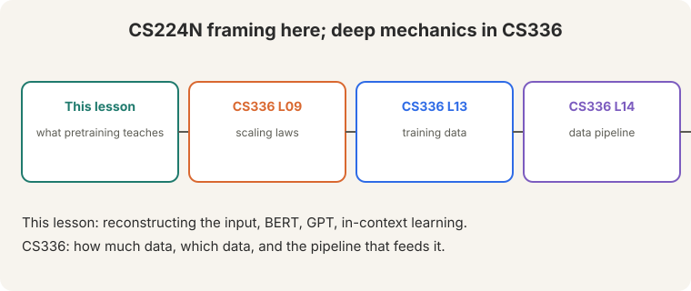

> [!NOTE]
> **Bridge lesson.** This lecture teaches the CS224N framing: what
> pretraining teaches and how BERT and GPT use it. For deep mechanics,
> follow the links: [CS336 L09](../cs336/l09-scaling-laws.html) (scaling
> laws, Chinchilla), [CS336 L13](../cs336/l13-training-data.html) (training
> data), [CS336 L14](../cs336/l14-data-pipeline.html) (the data pipeline).
> This lesson never re-explains what those cover.

## How to read this lesson

This lesson has two levels. **Level 1 (Core)** defines pretraining and shows
what it teaches. **Level 2 (Deep)** covers BERT, GPT, adaptation methods, and
the three-stage recipe.

## Level 1: Pretraining reconstructs the input

**Pretraining** trains on unlabeled text by **reconstructing the input**
([19:43](ts:19:43)). Mask part of a sentence ([19:53](ts:19:53)). Predict it
back.

"Stanford University is located in [MASK] Alto" ([20:15](ts:20:15)). The
label is "Palo". No human annotator needed. The data is free: at least five
trillion words on the internet ([33:07](ts:33:07)), against roughly a million
labeled examples.

## Level 1: What one objective teaches

One reconstruction objective teaches many things:

- **Trivia.** Stanford is in Palo Alto.
- **Syntax.** "put ____ fork": the blank takes a preposition.
- **Coreference.** "over ____ shoulder": whose shoulder.
- **Semantics.** Ocean words cluster together.
- **Sentiment.** "the movie was ____": positive or negative.
- **World models.** Zuko in the kitchen: who is where.
- **Surprises.** Fibonacci sequences. The model learns more than the
objective asks.

> [!QA]
> Q: Why does reconstruction teach so much?
> A: To fill blanks reliably across trillions of words, the model must learn grammar, facts, and reasoning patterns. The objective is simple. The data is rich. Rich data plus a hard prediction task forces broad knowledge.
> Follow-up: What does it not teach?
> A: Grounding. The model learns word patterns, not the world. Its answers "always look very fluent" but are "frequently wrong" ([62:18](ts:62:18)): a warning that survives into ChatGPT.

## Level 2: BERT

**BERT** masks 15% of tokens (80/10/10 rule) and predicts them. It adds
**segment embeddings** for sentence pairs ([43:22](ts:43:22)) and a **CLS
token** as an aggregate readout. Base: 110M parameters. Large: 340M. Trained
on a few billion words.

The **next-sentence prediction** (NSP) task turned out to be "not really
necessary" ([45:09](ts:45:09)): it halves the effective context, and later
work showed models were bad at it anyway. **Span masking** works better.
RoBERTa removed NSP.

On GLUE, BERT was a shock: "the field was taken aback in a way that's hard
to describe... sea change" ([49:35](ts:49:35)).

**Fine-tuning stays close** to the pretrained weights. **PEFT** methods adapt
cheaply: prefix tuning, prompt tuning, low-rank updates (LoRA)
([56:28](ts:56:28)).

## Level 2: GPT and in-context learning

The GPT line scales the same idea autoregressively:

- **GPT:** 117M parameters, 768 hidden, BooksCorpus ([64:11](ts:64:11)).
- **GPT-2:** 1.5B parameters, ~9B words.
- **GPT-3:** 175B parameters, 300B words.

**In-context learning**: give examples in the prompt, no weight updates.
thanks -> merci, hello -> bonjour, otter -> ? ([67:55](ts:67:55)).
**Chain of thought** is a scratch pad: more compute at inference time
([71:52](ts:71:52)).

**Chinchilla** corrected the sizing: GPT-3 was "comically oversized"
([71:22](ts:71:22)). Smaller models on more data win. Cost is roughly params
times tokens. Full treatment: [CS336 L09](../cs336/l09-scaling-laws.html).

## Level 2: The three-stage recipe

1. **Pretrain** on trillions of general words.
2. **Continue pretraining** on unlabeled task data ("Don't Stop
Pretraining").
3. **Fine-tune** on labeled task data ([26:02](ts:26:02)).

Each stage narrows the distribution. Fine-tuning starts near the pretrained
solution and stays close to it.

> [!QA]
> Q: Why continue pretraining instead of fine-tuning directly?
> A: The pretrained model knows general text, not your domain's vocabulary and style. Continued pretraining on unlabeled domain text adapts the representations cheaply. Fine-tuning then needs fewer labels and generalizes better.
> Follow-up: When does pretraining fail to help?
> A: When the task needs knowledge absent from the pretraining data, or when the fine-tuning data contradicts pretraining strongly. Also: fluent but wrong answers. Pretraining teaches form. It does not guarantee truth.

## Recap: the whole lesson on one screen

Eight ideas carry this lecture. Read each card. Say the core sentence out
loud. If you can, you own the lesson.

<strong>1. Pretraining reconstructs the input</strong>

Mask part of a sentence. Predict it back. Trillions of unlabeled words
versus a million labeled. The data is free.

Key: [19:43](ts:19:43)

<strong>2. One objective teaches many things</strong>

Trivia, syntax, coreference, semantics, sentiment, world models. Plus
surprises like Fibonacci.

Key: rich data, hard task

<strong>3. BERT: mask, segments, CLS</strong>

15% masking, segment embeddings, CLS readout. Base 110M, large 340M.
NSP was not necessary. GLUE was a sea change.

Key: [49:35](ts:49:35)

<strong>4. GPT scales autoregressively</strong>

117M to 1.5B to 175B. In-context learning: examples in the prompt, no
weight updates. Chinchilla: smaller plus more data.

Key: comically oversized

<strong>5. Pretrain, continue, fine-tune</strong>

General text, then unlabeled task text ("Don't Stop Pretraining"), then
labels. Fine-tuning stays close to the start.

Key: narrow the distribution

<strong>6. Adapt cheaply with PEFT</strong>

Prefix tuning, prompt tuning, LoRA: low-rank updates. Full fine-tuning
is the slider's far end.

Key: adapt, do not retrain

<strong>7. Fluent is not true</strong>

Answers "always look very fluent" and are "frequently wrong". Still true
of ChatGPT. Pretraining teaches form, not truth.

Key: [62:18](ts:62:18)

<strong>8. Depth lives in CS336</strong>

Scaling laws (L09), training data (L13), data pipeline (L14). This
lesson: the framing. CS336: the mechanics.

Key: bridge, not duplicate

## Official sources and further reading

**Official:**
- Lecture 9 video and transcript.
- Devlin et al. (2019): BERT.
- Brown et al. (2020): GPT-3 and in-context learning.

**Further reading:**
- [CS336 L09](../cs336/l09-scaling-laws.html): Chinchilla and scaling laws in full.
- [CS336 L13](../cs336/l13-training-data.html): what goes into pretraining data.
- Gururangan et al. (2020), "Don't Stop Pretraining": the continue-pretraining result.

**Caveats from these sources.** "Five trillion words" is the lecture's estimate of internet text, not a measured count. "Frequently wrong" is an observed failure mode, not a rate.

## Connections to the other courses

- **This course:** L08 provides the architecture. L10 adapts pretrained models (prompting, instruction tuning, RLHF). L12 trains them efficiently.
- **CS336:** L09 (scaling), L13 (data), L14 (pipeline) carry the deep mechanics.
- **CS329H:** preference modeling theory underlies the post-training of L10.

> [!CHEAT]
> **Pretraining cheatsheet.** Objective: reconstruct masked input. Data: ~5T words vs ~1M labeled. Teaches: trivia, syntax, coreference, semantics, sentiment, world models. BERT: 15% mask, 80/10/10, segments, CLS, 110M/340M; NSP unnecessary; GLUE sea change. PEFT: prefix/prompt/LoRA. GPT: 117M -> 1.5B -> 175B. In-context: examples, no updates; CoT: scratch pad. Chinchilla: smaller + more data. Cost ~ params x tokens. Recipe: pretrain -> continue -> fine-tune. Warning: fluent but frequently wrong.

> [!MEMORY]
> **Reconstruct to learn.** Mask, predict, repeat over trillions of words. One simple objective, many kinds of knowledge. Form is learned. Truth is not guaranteed.
