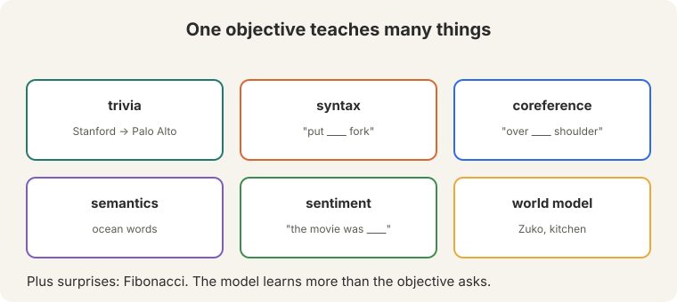
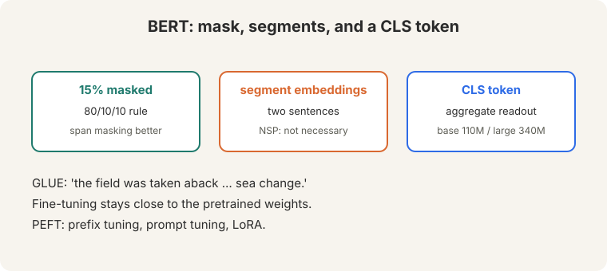
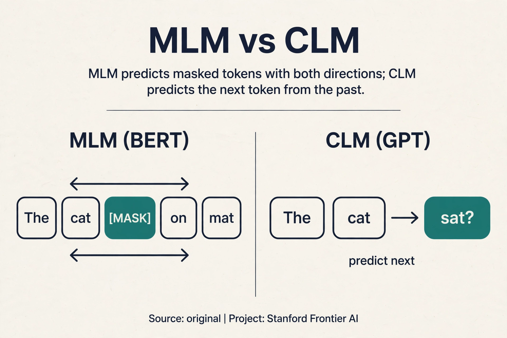
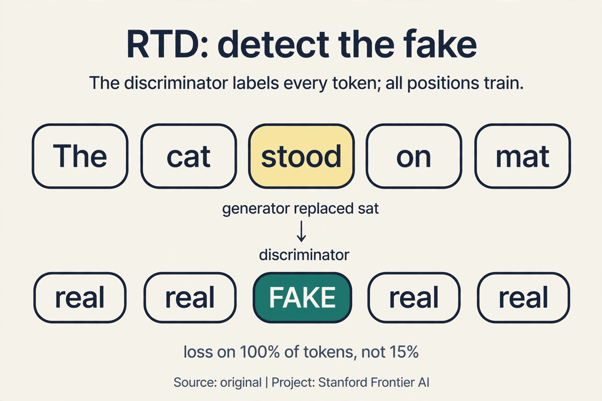
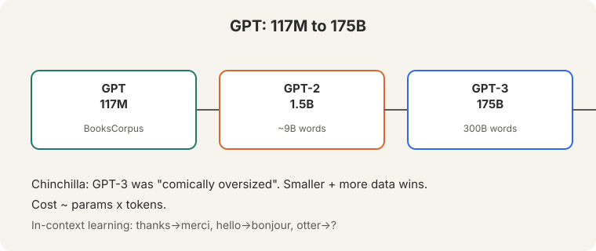
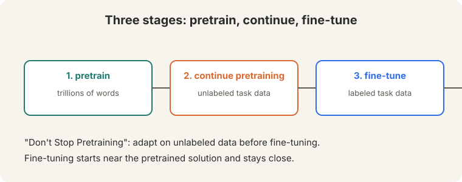

## The problem: labels are expensive, text is free

Every model so far needed labels: treebanks for the parser, translations
for seq2seq. Human labels cost money and time: roughly a million labeled
examples for a serious task. Meanwhile the internet holds at least five
trillion words ([33:07](ts:33:07)), free for the taking. The gap between a
million and five trillion is the opportunity of this lecture.

The key question: what if the input is its own label?

**On this page:** [MLM](#subchapter-mlm-the-bert-objective) · [CLM](#subchapter-clm-the-gpt-objective) · [Span corruption](#subchapter-span-corruption-mask-the-phrase) · [RTD](#subchapter-rtd-detect-the-fake) · [Full vs parameter-efficient fine-tuning](#subchapter-full-fine-tuning-move-everything-a-little) · [Adapters, prefix, LoRA](#subchapter-parameter-efficient-adapters-prefix-lora) · [Pretraining in production, Oct 2026](#what-is-used-where-pretraining-in-production-october-2026) · [Watch and go deeper](#watch-and-go-deeper)

## Pretraining: reconstruct the input

**Pretraining** trains on unlabeled text by **reconstructing the input**
([19:43](ts:19:43)). Mask part of a sentence ([19:53](ts:19:53)). Predict it
back.


"Stanford University is located in [MASK] Alto" ([20:15](ts:20:15)). The
label is "Palo". No human annotator wrote that label. The text supplied it.
Watch the training step on a toy. The model outputs a distribution over the
vocabulary at the masked position:

```ascii
P(Palo | context)  = 0.60
P(San              = 0.25
P(Santa            = 0.10
P(rest             = 0.05
loss = -log(0.60) = 0.51
```

The gradient pushes "Palo" up and the rest down. Repeat over trillions of
words. Every sentence becomes thousands of training examples, for free.

## What one objective teaches

One reconstruction objective teaches many things. Each is a fill-in-the
blank the model must solve:



- **Trivia.** "Stanford University is located in [MASK] Alto." The model
  must know the fact.
- **Syntax.** "Put [MASK] fork." Only a preposition fits the blank. The
  model learns grammar to place its bets.
- **Coreference.** "He threw the ball over [MASK] shoulder." Whose
  shoulder? The model tracks who is who.
- **Semantics.** Ocean words cluster together across contexts.
- **Sentiment.** "The movie was [MASK]." Positive or negative completions
  separate by context.
- **World models.** Zuko in the kitchen: who is where, what happened.
- **Surprises.** Fibonacci sequences. The model learns more than the
  objective asks, because the data contains more than the objective names.

Why does reconstruction teach so much? To fill blanks reliably across
trillions of words, the model must learn grammar, facts, and reasoning
patterns. The objective is simple. The data is rich. Rich data plus a hard
prediction task forces broad knowledge.

> [!QA]
> Q: Why does reconstruction teach so much?
> A: To fill blanks reliably across trillions of words, the model must learn grammar, facts, and reasoning patterns. The objective is simple. The data is rich. Rich data plus a hard prediction task forces broad knowledge.
> Follow-up: What does it not teach?
> A: Grounding. The model learns word patterns, not the world. Its answers "always look very fluent" but are "frequently wrong" ([62:18](ts:62:18)): a warning that survives into ChatGPT.

## BERT: masks, segments, and a readout token

**BERT** (Devlin et al., 2019) is the canonical masked model. It masks 15%
of tokens and predicts them. The masking follows an 80/10/10 rule: of the
chosen tokens, 80% become [MASK], 10% become a random word, 10% stay
unchanged. Why the theater? Because [MASK] never appears at fine-tuning
time. If every chosen token became [MASK], the model would over-rely on a
token it will never see again. The random and unchanged cases force it to
build good representations regardless. In 1,000 tokens: 150 chosen, 120
masked, 15 randomized, 15 unchanged.

BERT adds **segment embeddings** for sentence pairs ([43:22](ts:43:22)):
token 0 marks sentence A, token 1 marks sentence B. And a **CLS token** at
the start serves as an aggregate readout: its final vector represents the
whole input for classification.

Sizes: Base, 110M parameters. Large, 340M. Trained on a few billion words.
The **next-sentence prediction** (NSP) task turned out to be "not really
necessary" ([45:09](ts:45:09)): it halves the effective context, and later
work showed models were bad at it anyway. **Span masking** (masking whole
phrases instead of single tokens) works better. RoBERTa removed NSP.



On GLUE, the language-understanding benchmark, BERT was a shock: "the field
was taken aback in a way that is hard to describe... Sea change"
([49:35](ts:49:35)). One pretrained model, fine-tuned per task, beat
everything.

### Subchapter: MLM, the BERT objective

**Masked language modeling** is BERT's training objective, stated as a
recipe. Take a sentence. Choose 15% of its tokens. Of those, mask 80%,
randomize 10%, leave 10% unchanged. Predict the originals.

Watch it on one sentence, by hand. "The cat sat on the mat", 6 tokens.
15% of 6 is about 1 token: choose "sat". The 80% case: replace with
[MASK]. Input: "The cat [MASK] on the mat". The model outputs a
distribution at the masked position:

```ascii
P(sat | context) = 0.70
P(stood            = 0.15
P(rest             = 0.15
loss = -log(0.70) = 0.36
```

The gradient pushes "sat" up. The 10% random case ("The cat zebra on the
mat") forces the model to distrust the observed word: it must predict
"sat" even though "zebra" sits there. The 10% unchanged case forces it to
build a good representation of the real word instead of leaning on the
[MASK] token.



### Subchapter: CLM, the GPT objective

**Causal language modeling** is the GPT objective: predict each token from
the tokens before it. No masks. The same sentence: input "The cat",
predict "sat". Input "The cat sat", predict "on". Every position is a
training example, and the causal mask (Lecture 8) keeps the future hidden.

Compare the two objectives on what they buy. MLM sees both directions, so
its representations suit understanding: classification, extraction, QA
encoding. CLM sees only the past, so its model generates: it is a
language model in the Lecture 5 sense, scaled up. BERT reads. GPT writes.
The data efficiency differs too: MLM trains on 15% of tokens per pass,
CLM on 100%. That is one reason the GPT line scaled further on the same
compute.

### Subchapter: span corruption, mask the phrase

MLM masks single tokens. **Span corruption** (T5, Raffel et al., 2019)
masks whole spans. "The cat sat on the mat" becomes "The cat <X> the
<Y>", where <X> replaces "sat on" and <Y> replaces "mat". The model must
generate the missing spans: "<X> sat on <Y> mat". One increment beyond
MLM: the model predicts multi-token chunks, which suits generation tasks
better than single-token blanks. T5 framed every task this way:
translation, summarization, classification, all as "fill the spans". The
objective is public and widely reused in encoder-decoder pretraining.

### Subchapter: RTD, detect the fake

MLM trains on 15% of tokens and wastes the other 85%. **Replaced token
detection** (ELECTRA, Clark et al., 2020) uses all of them. A small
generator proposes replacements for masked tokens ("The cat stood on the
mat"). A discriminator reads the corrupted sentence and predicts, for
*every* token, original or replaced.

Watch the efficiency. MLM's loss touches 15% of positions. RTD's loss
touches 100%: each token gets a binary label. The discriminator learns
from every token in every pass, which is why ELECTRA matches BERT's
quality with far less compute. The price: two models to train (generator
plus discriminator), and the generator's quality caps the signal.



## GPT: the autoregressive line

The GPT line scales the same idea in the autoregressive direction: predict
the next token, left to right, no masks.



- **GPT:** 117M parameters, 768 hidden dimensions, BooksCorpus
  ([64:11](ts:64:11)).
- **GPT-2:** 1.5B parameters, about 9B words.
- **GPT-3:** 175B parameters, 300B words.

**In-context learning**: give examples in the prompt, no weight updates.
"thanks -> merci, hello -> bonjour, otter -> ?" ([67:55](ts:67:55)). The
model completes the pattern: "loutre". **Chain of thought** is a scratch
pad: let the model write intermediate steps, which buys more compute at
inference time ([71:52](ts:71:52)).

Then **Chinchilla** corrected the sizing. GPT-3 was "comically oversized"
([71:22](ts:71:22)): 175B parameters on only 300B words. Smaller models
trained on more data win at fixed compute. Cost is roughly parameters times
tokens, so the optimal split balances the two.

## The three-stage recipe



1. **Pretrain** on trillions of general words. Learn language itself.
2. **Continue pretraining** on unlabeled task data ("Don't Stop
   Pretraining"). Adapt to the domain's vocabulary and style, cheaply.
3. **Fine-tune** on labeled task data ([26:02](ts:26:02)). Each stage
   narrows the distribution.

**Fine-tuning stays close** to the pretrained weights: the updates are
small, because the pretrained model is already near a good solution.
**PEFT** (parameter-efficient fine-tuning) adapts even more cheaply:
prefix tuning, prompt tuning, and **LoRA**, low-rank updates
([56:28](ts:56:28)). LoRA freezes the big weight matrix W and learns only
a small change ΔW = BA, where B and A are thin: for a 4096-by-4096 matrix
with rank 8, that is 2 x 4096 x 8 = 65,536 learned numbers instead of
16.7M. Same adaptation power, a fraction of the parameters.

### Subchapter: full fine-tuning, move everything a little

**Full fine-tuning** updates every weight. The pretrained model is
already near a good solution, so the updates stay small: a low learning
rate, a few epochs, and the model bends toward the task without forgetting
the language. Watch the scale. BERT-Base has 110M parameters: full
fine-tuning trains all 110M on your task data. That was affordable in
2019. GPT-3 has 175B: full fine-tuning trains all 175B, which needs the
same cluster class as pretraining. Full fine-tuning wins when the task
needs large, global changes: a new language, a new modality, a sharp
distribution shift. It loses on cost and on overfitting: 175B free
parameters on 10,000 examples memorizes the examples.

### Subchapter: parameter-efficient, adapters, prefix, LoRA

**PEFT** freezes the model and trains a small addition. Three flavors:

- **Adapters** (Houlsby et al., 2019). Insert small bottleneck layers
  between the frozen layers. Only the bottlenecks train: about 3-4% of
  parameters. The price: extra layers at inference, small but nonzero
  latency.
- **Prefix/prompt tuning** (Li and Liang, 2021). Prepend learned virtual
  tokens to the input. Only the prefix vectors train: under 1% of
  parameters. The price: the prefix eats context length, and optimization
  is finicky.
- **LoRA** (Hu et al., 2021). Learn a low-rank delta per weight matrix.
  At inference, merge BA into W: zero extra latency, byte-identical
  shape. That merge property is why LoRA won: adapters and prefixes
  change the model, LoRA disappears into it. Lecture 12 derives it fully.

The decision rule: full fine-tuning when the shift is large and the
budget allows. LoRA when batch-1 barely fits or data is small. Adapters
when you must serve many tasks from one frozen backbone.

> [!QA]
> Q: Why continue pretraining instead of fine-tuning directly?
> A: The pretrained model knows general text, not your domain's vocabulary and style. Continued pretraining on unlabeled domain text adapts the representations cheaply. Fine-tuning then needs fewer labels and generalizes better.
> Follow-up: When does pretraining fail to help?
> A: When the task needs knowledge absent from the pretraining data, or when the fine-tuning data contradicts pretraining strongly. Also: fluent but wrong answers. Pretraining teaches form. It does not guarantee truth.

## What is used where: pretraining in production, October 2026

| Model family | Objective | Status |
|---|---|---|
| BERT / RoBERTa | MLM | Public. Encoders still run classification and retrieval pipelines |
| T5 / BART | span corruption / denoising | Public. Encoder-decoder pretraining for seq2seq tasks |
| ELECTRA | RTD | Public. The efficient encoder baseline |
| GPT-1/2/3 | CLM | Public through GPT-3. Decoder-only set the template |
| Llama 2/3/4, Mistral, Qwen | CLM | Public cards. Decoder-only at scale |
| DeepSeek-V3/V4 | CLM | Public papers. MLA attention, MoE, open weights |
| GPT-4/5.x, Gemini 3.x, Claude | [unknown] | Closed. Presumed CLM-family, not published |

By 2026 every frontier model pretrains decoder-only with a next-token
objective. MLM survives in encoders for understanding tasks. RTD survives
as the efficiency answer. Span corruption survives in encoder-decoder
models.

> [!QA]
> Q: Walk me through MLM on one sentence, naming every step.
> A: Sentence: "The cat sat on the mat", 6 tokens. Step 1: choose 15%, about 1 token: "sat". Step 2: roll the 80/10/10 die. Say 80%: replace with [MASK]. Input: "The cat [MASK] on the mat". Step 3: forward pass, read the distribution at the masked position: P(sat) = 0.70, P(stood) = 0.15, rest 0.15. Step 4: loss = -log(0.70) = 0.36. Step 5: backprop pushes the representation toward "sat". If the die had said 10% random, the input would show "zebra" and the model must still predict "sat": it learns not to trust the surface word.
> Follow-up: Why 15% and not 50%?
> A: Context. Mask too much and the sentence has no context left to predict from: the task becomes impossible and the gradients are noise. 15% leaves 85% of the sentence as evidence. It is a tuned constant, not a theorem.

> [!QA]
> Q: You need a sentiment classifier for product reviews. MLM-pretrained encoder or CLM-pretrained decoder?
> A: The MLM encoder (BERT-style). Classification reads the whole input: bidirectional context helps ("not good" needs both words). Fine-tune with a CLS head: cheap, fast, accurate. The decoder can do it too, but causally: each token sees only the past, which handicaps understanding. Use the architecture whose pretraining matches the task's information flow.
> Follow-up: When would you pick the decoder anyway?
> A: When you need generation alongside: explain the rating, not just predict it. Or when no good encoder exists for your language and a multilingual decoder does. Match the tool to the whole task, not just the first subtask.

> [!QA]
> Q: Why is RTD more sample-efficient than MLM?
> A: Count the supervised positions. MLM's loss touches 15% of tokens per pass: 85% of the compute teaches nothing directly. RTD's discriminator labels every token as original or replaced: 100% of positions train. Same corpus, roughly 6 times the training signal per pass. ELECTRA matches BERT's quality with far less compute because it wastes nothing.
> Follow-up: What caps RTD's gains?
> A: The generator. If the generator is too weak, its replacements are obvious and the discriminator learns nothing subtle. If it is too strong, the task is impossible. The two must be balanced: a small generator, a larger discriminator, tuned together.

> [!QA]
> Q: Walk me through the Chinchilla sizing correction.
> A: GPT-3: 175B parameters, 300B training tokens. Chinchilla's finding: at fixed compute, loss is minimized when parameters and tokens scale together, roughly 20 tokens per parameter. For GPT-3's compute budget, the optimum was closer to 70B parameters on 1.4T tokens. GPT-3 was "comically oversized": too many parameters, starved of data. The field had been buying parameters when it should have been buying tokens.
> Follow-up: Does Chinchilla say small models always win?
> A: No. It says balance wins at fixed training compute. Inference changes the math: a smaller model trained on more tokens costs less to serve per query, which is why the Chinchilla-optimal models also became the deployment favorites. Training-optimal and serving-cheap pointed the same way.

> [!QA]
> Q: You have one A100 and a 7B model to adapt to legal contracts. Full fine-tuning or LoRA?
> A: LoRA. Full fine-tuning of 7B needs the 16-bytes-per-parameter budget: 112 GB, which overflows one 80 GB A100 before batch 1. LoRA trains 65K to a few million numbers (rank 8-64 on attention matrices): it fits with room to spare. Legal contracts are a style and vocabulary shift, not a new modality: low-rank adaptation covers it. Go full only if LoRA's quality plateaus below your bar.
> Follow-up: What rank?
> A: Start at 16. Rank 8 is the lecture's example. 16-64 is the practical range. Higher rank approaches full fine-tuning's expressivity at higher cost. Tune it like any hyperparameter: raise until the dev metric stops moving.

## Watch and go deeper

<div style="max-width:640px;margin:1.5rem 0">
<div style="position:relative;padding-bottom:56.25%;height:0;overflow:hidden;border-radius:8px;background:#000">
<iframe src="https://www.youtube-nocookie.com/embed/DGfCRXuNA2w" title="CS224N Spring 2024 Lecture 9: Pretraining" style="position:absolute;top:0;left:0;width:100%;height:100%;border:0" loading="lazy" allowfullscreen></iframe>
</div>
<p><strong>Lecture 9: Pretraining</strong> (Christopher Manning, Spring 2024). The original lecture: masked pretraining, BERT, GPT, and in-context learning. If the embed does not load, watch the lecture directly on YouTube: https://www.youtube.com/watch?v=DGfCRXuNA2w</p>

<div style="max-width:640px;margin:1.5rem 0">
<div style="position:relative;padding-bottom:56.25%;height:0;overflow:hidden;border-radius:8px;background:#000">
<iframe src="https://www.youtube-nocookie.com/embed/zjkBMFhNj_g" title="Intro to Large Language Models" style="position:absolute;top:0;left:0;width:100%;height:100%;border:0" loading="lazy" allowfullscreen></iframe>
</div>
<p><strong>Intro to large language models</strong> (Karpathy). Pretraining, RLHF, and inference in one hour.</p>
</div>
</div>

### Go deeper

- [BERT: Pre-training of Deep Bidirectional Transformers](https://arxiv.org/abs/1810.04805) (Devlin et al., 2019). MLM, the 80/10/10 rule, NSP.
- [Language Models are Few-Shot Learners](https://arxiv.org/abs/2005.14165) (Brown et al., 2020). GPT-3 and in-context learning.
- [LoRA: Low-Rank Adaptation of Large Language Models](https://arxiv.org/abs/2106.09685) (Hu et al., 2021). The mergeable adapter.
- [The Illustrated BERT](https://jalammar.github.io/illustrated-bert/) (Jay Alammar). BERT drawn piece by piece.
- [Stanford CS224N course site](https://web.stanford.edu/class/cs224n/). Slides, assignments, syllabus.

## Mapping back: what pretraining answers

| Old regime | Pretraining answer | How |
|---|---|---|
| Labels cost money: ~1M per task | Labels manufacture themselves | Mask and predict: 5T words become trillions of examples |
| One model per task, trained from scratch | One model, fine-tuned per task | BERT on GLUE: a sea change. Fine-tuning stays near the pretrained weights |
| Adaptation means retraining everything | PEFT adapts cheaply | LoRA: 65K learned numbers instead of 16.7M |
| Bigger is always better | Chinchilla balances params and data | GPT-3 was comically oversized. Smaller + more data wins |

## The honest price

Two bills. First, compute: trillions of words through billion-parameter
transformers. Pretraining is the most expensive step in NLP, by far.
Second, truth. Pretraining teaches the *form* of knowledgeable text, not
knowledge itself. The answers "always look very fluent" and are "frequently
wrong" ([62:18](ts:62:18)). A model that predicts "Palo" after "located in"
has learned a strong statistical association, not geography. Lecture 10
teaches the model to follow instructions. Lecture 11 asks how to tell when
it is wrong.

## Recap: the whole lesson on one screen

1. **The problem.** Labels: ~1M per task, expensive. Text: 5T+ words, free.
   The key question: what if the input is its own label?
2. **Reconstruct.** Mask part of a sentence, predict it back. The toy:
   P(Palo) = 0.60, loss = -log(0.60) = 0.51. Trillions of free examples.
3. **One objective, many lessons.** Trivia, syntax ("put [MASK] fork"),
   coreference, semantics, sentiment, world models, surprises (Fibonacci).
   Rich data plus a hard task forces broad knowledge.
4. **BERT.** 15% masking, 80/10/10 rule (120 masked, 15 random, 15
   unchanged per 1,000 tokens). Segment embeddings, CLS readout. 110M /
   340M. NSP was not necessary. GLUE: a sea change.
5. **GPT.** 117M to 1.5B to 175B, autoregressive. In-context learning:
   examples in the prompt, no updates. Chain of thought: a scratch pad.
6. **Chinchilla.** GPT-3 was comically oversized. Cost is roughly params
   times tokens. Smaller models on more data win.
7. **Three stages.** Pretrain on trillions, continue on unlabeled domain
   text, fine-tune on labels. PEFT (LoRA: 65K vs 16.7M) adapts cheaply.
8. **The price.** Enormous compute. And fluent is not true: "always fluent,
   frequently wrong". Form is learned. Truth is not guaranteed.

## Official sources and further reading

**Official:**
- Lecture 9 video and transcript.
- Devlin et al. (2019): BERT.
- Brown et al. (2020): GPT-3 and in-context learning.

**Further reading:**
- Gururangan et al. (2020), "Don't Stop Pretraining": the
  continue-pretraining result.
- Hoffmann et al. (2022), "Training Compute-Optimal Large Language
  Models" (Chinchilla): the sizing correction.
- Hu et al. (2021), LoRA: low-rank adaptation.

**Caveats from these sources.** "Five trillion words" is the lecture's
estimate of internet text, not a measured count. "Frequently wrong" is an
observed failure mode, not a rate. The worked toys above are original
teaching toys.

## Connections to the other courses

- **This course:** L08 provides the architecture. L10 adapts pretrained
  models (prompting, instruction tuning, RLHF). L11 evaluates them. L12
  trains them efficiently.
- **CS336:** scaling laws (Chinchilla in full), training data curation,
  and the data pipeline.
- **CS329H:** preference modeling theory underlies the post-training of
  L10.
