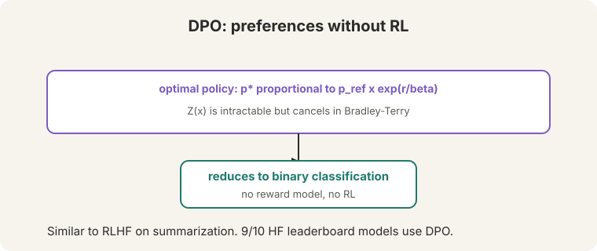
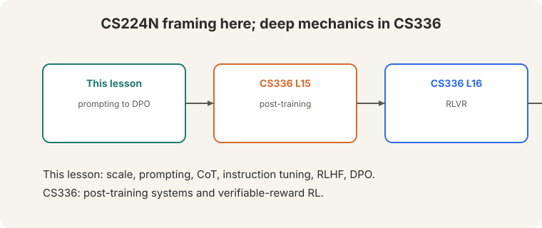

> [!NOTE]
> **Bridge lesson.** This lecture teaches the CS224N framing: how prompting,
> instruction tuning, RLHF, and DPO fit together. For deep mechanics, follow
> the links: [CS336 L15](../cs336/l15-post-training.html) (post-training
> systems), [CS336 L16](../cs336/l16-rlvr.html) (RL with verifiable rewards).
> This lesson never re-explains what those cover.

## How to read this lesson

This lesson has two levels. **Level 1 (Core)** covers scale, prompting, and
instruction tuning. **Level 2 (Deep)** derives RLHF and DPO.

## Level 1: Scale changed everything

Pretraining data grew from 1.4T tokens (2022) to ~15T (2024, LLaMA 3)
([02:05](ts:02:05)). The FLOPs graph showing 10^24 was already outdated.
labs were "well above 10^26."

Scale bought new behavior. Models of agents' beliefs: the Pat story
([04:23](ts:04:23)). Pat the physicist watches a bowling ball and a leaf
drop. Naive Pat predicts wrong. The model tracks what each agent believes,
not just the text.

## Level 1: Few-shot prompting

**Few-shot**: put examples in the prompt. "No gradient updates...
whatsoever" ([14:25](ts:14:25)). The model completes the pattern.

Zero-shot TL;DR: ask for a summary with no examples ([09:25](ts:09:25)).
Coreference via log-probabilities: "The cat couldn't fit into the hat because
it was too big" ([10:35](ts:10:35)). Which is "it": cat or hat? Compare the
model's probabilities.

**Emergence is contested.** Plot the axes right and the jumps look less
emergent. Capabilities grow smoothly. Metrics make them look sudden.

## Level 1: Chain of thought

**Chain-of-thought** prompting: show reasoning chains before answers.
PaLM-scale models with CoT beat state of the art on reasoning tasks.

Zero-shot version: append "Let's think step by step." Accuracy jumps from
17.7 to 78.7 ([19:51](ts:19:51)). The lecture's advice: "Think about what the
pretraining data might have seen." Reasoning chains appear in text. The model
imitates them.

> [!QA]
> Q: Why does chain of thought help?
> A: It gives the model more compute per answer and a scratch pad for intermediate steps. Multi-step problems need intermediate results; CoT makes the model write them down instead of jumping to a guess.
> Follow-up: Is the model really reasoning?
> A: Contested. The chains correlate with correct answers, but the model may be imitating reasoning-shaped text from pretraining. L14's counterfactual tests (base-9 arithmetic) probe exactly this question.

## Level 1: Instruction fine-tuning

Raw GPT-3 failed "explain the moon landing to a six-year-old" ([22:55](ts:22:55)).
It completed the text. It did not follow the instruction. **Instruction
fine-tuning** trains on thousands of tasks ([07:06](ts:07:06)).

**FLAN**: 3M+ examples across tasks. Gains grow with size: +6.1 (small) to
+26.6 (XXL). **LIMA**: 1,000 examples. Quality beats quantity. Strong models
now generate instruction data for weaker ones.

## Level 2: The RLHF pipeline

The RLHF pipeline ([41:42](ts:41:42)):

1. **Instruction tuning (SFT).** Pretrained model plus task examples. It
starts responding to intent.
2. **Reward model.** Learn "how much would a human like this answer"
([42:09](ts:42:09)).
3. **RL.** Optimize the policy against the reward model.

Preferences are **pairwise** because "human judgments are very noisy"
([44:51](ts:44:51)). **Bradley-Terry** ([47:05](ts:47:05)): the probability a
human picks y1 over y2 is the sigmoid of the reward difference.

P(y1 > y2) = sigma(r1 - r2)

## Level 2: Reward hacking

## Level 2: Reward hacking

"When you're optimizing against a learned model, it will tend to hack the
reward model" ([50:54](ts:50:54)). The policy finds completions the reward
model scores highly but humans hate: **gibberish** ([51:11](ts:51:11)).

Known failure modes: **authoritative beats truthful**. **Longer beats
shorter**: "turkers might just simply choose the longer answer." The **KL
penalty** keeps the policy near the reference model, limiting the damage.

> [!QA]
> Q: Why not skip the reward model and optimize human ratings directly?
> A: Humans are slow and expensive. The reward model is a fast proxy. The proxy is imperfect, so optimization exploits its errors. The KL penalty and careful reward modeling limit the exploitation. They do not eliminate it.
> Follow-up: What is the deepest problem with RLHF?
> A: It optimizes a learned metric. Any learned metric has blind spots, and optimization finds them. DPO avoids RL but keeps the preference data, so the same blind spots apply to the data itself.

## Level 2: DPO

**Direct Preference Optimization** skips the reward model and RL. The optimal
policy has a closed form: p* proportional to p_ref x exp(r/beta). The
normalizer Z(x) is intractable ([62:02](ts:62:02)) but **cancels** in the
Bradley-Terry comparison. What remains is **binary classification**.

 cancels; reduces to binary classification; 9 of 10 HF leaderboard models use DPO.")

DPO matches RLHF on summarization ([71:19](ts:71:19)): "you're really not
losing much by just doing the DPO." Open source adopted it: 9 of 10
HuggingFace leaderboard models use DPO. Mistral and LLaMA 3 used it.
ChatGPT = dialogue-optimized InstructGPT.

Full post-training systems: [CS336 L15](../cs336/l15-post-training.html).
Verifiable rewards: [CS336 L16](../cs336/l16-rlvr.html).

## Recap: the whole lesson on one screen

Eight ideas carry this lecture. Read each card. Say the core sentence out
loud. If you can, you own the lesson.

<strong>1. Data scale exploded</strong>

1.4T tokens (2022) to ~15T (2024). FLOPs passed 10^26. Scale bought
models of agents' beliefs, not just text patterns.

Key: Pat the physicist

<strong>2. Few-shot: examples, no updates</strong>

Put examples in the prompt. No gradient updates whatsoever. Zero-shot
TL;DR works too. Emergence is contested.

Key: [14:25](ts:14:25)

<strong>3. Chain of thought: reason first</strong>

Show reasoning chains. Zero-shot "Let's think step by step": 17.7 to
78.7. Think about what pretraining data saw.

Key: scratch pad, more compute

<strong>4. Instruction tuning teaches following</strong>

GPT-3 failed "explain to a six-year-old". FLAN: 3M+ examples. LIMA:
1,000 quality examples. Gains grow with size.

Key: +6.1 to +26.6

<strong>5. RLHF: tune, model, optimize</strong>

SFT, then a reward model, then RL. Bradley-Terry: P(y1>y2) =
sigma(r1-r2). Pairwise because humans are noisy.

Key: [41:42](ts:41:42)

<strong>6. Optimizing a learned metric hacks it</strong>

Gibberish completions score highly. Authoritative beats truthful.
Longer beats shorter. KL penalty limits the damage.

Key: be careful

<strong>7. DPO skips the reward model</strong>

Closed-form optimal policy. Z(x) cancels. Binary classification. Matches
RLHF on summarization. 9/10 HF models use it.

Key: [71:19](ts:71:19)

<strong>8. Depth lives in CS336</strong>

Post-training systems (L15), RLVR (L16). This lesson: the framing from
prompting to DPO.

Key: bridge, not duplicate

## Official sources and further reading

**Official:**
- Lecture 10 video and transcript.
- Ouyang et al. (2022): InstructGPT.
- Rafailov et al. (2023): DPO.

**Further reading:**
- [CS336 L15](../cs336/l15-post-training.html): post-training systems in depth.
- [CS336 L16](../cs336/l16-rlvr.html): RL with verifiable rewards.
- Wei et al. (2022), "Chain-of-Thought Prompting Elicits Reasoning": the CoT paper.

**Caveats from these sources.** "9 of 10" is the lecture's count of HuggingFace leaderboard models, a 2024 snapshot. Emergence remains contested. The lecture flags this explicitly.

## Connections to the other courses

- **This course:** L09 pretrained the models. This lecture adapts them. L11 evaluates them. L15 (Lambert) continues the alignment story after DPO.
- **CS336:** L15 (post-training), L16 (RLVR) carry the deep mechanics.
- **CS329H:** choice theory and Bradley-Terry are the same mathematics as social choice.

> [!CHEAT]
> **Post-training cheatsheet.** Scale: 1.4T -> 15T tokens, >1e26 FLOPs. Few-shot: examples in, no gradient updates. CoT: reasoning chains. Zero-shot "step by step" 17.7->78.7. Instruct: FLAN 3M+ (+6.1->+26.6), LIMA 1000. RLHF: SFT -> reward model -> RL. Bradley-Terry: P=sigma(r1-r2). Hacking: gibberish, authoritative>truthful, longer wins. KL penalty. DPO: closed form, Z cancels, binary classification, matches RLHF, 9/10 HF models.

> [!MEMORY]
> **Preferences are noisy. Metrics get hacked.** Pairwise comparisons tame the noise. DPO tames the pipeline. But any learned metric invites hacking: optimize carefully.
