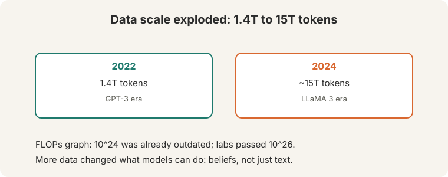
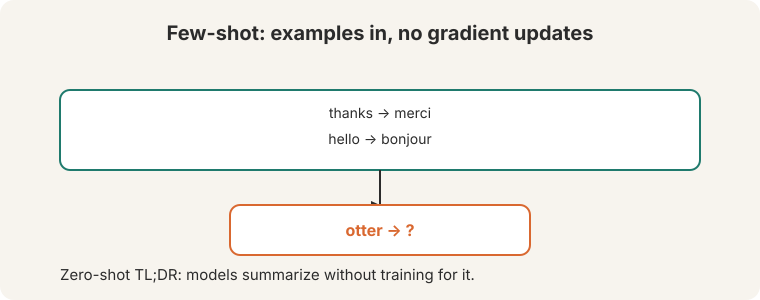
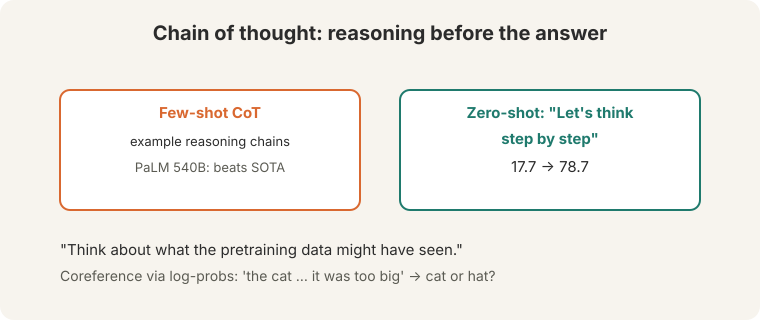
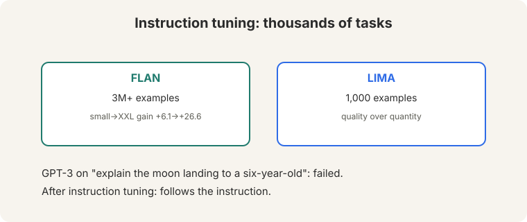
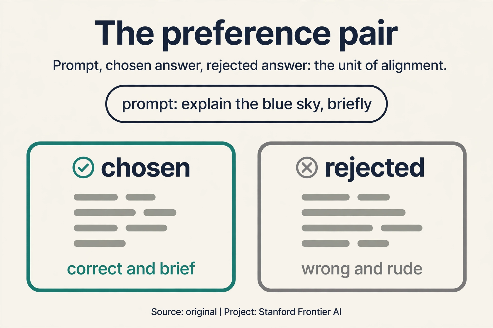
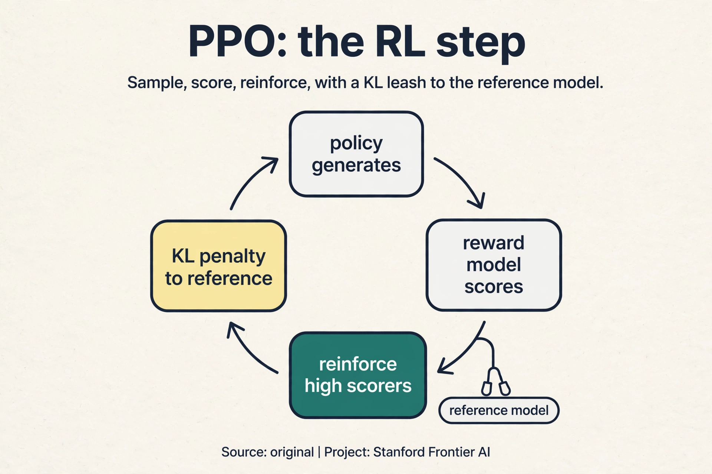
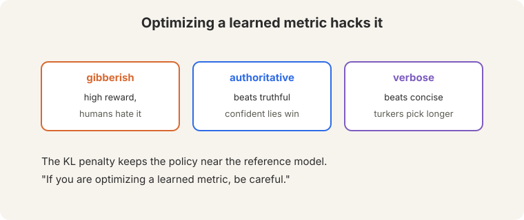

## The problem: the model completes, it does not obey

Pretraining built a brilliant text completer. Ask raw GPT-3 to "explain the
moon landing to a six-year-old" ([22:55](ts:22:55)). It completes the text.
It does not follow the instruction. It might continue with "to a
seven-year-old" or drift into trivia. The model knows language. It does
not know it is supposed to *help*.

This lecture is about closing that gap: from a model that predicts text to
a model that does what you ask.

**On this page:** [The preference pair](#subchapter-the-preference-pair-up-close) · [PPO](#subchapter-ppo-the-rl-step) · [When DPO beats PPO](#subchapter-when-dpo-beats-ppo-and-when-it-does-not) · [Post-training in production, Oct 2026](#what-is-used-where-post-training-in-production-october-2026) · [Watch and go deeper](#watch-and-go-deeper)

## Scale changed everything

Pretraining data grew from 1.4T tokens (2022) to about 15T (2024, LLaMA 3)
([02:05](ts:02:05)). The FLOPs graph showing 10^24 was already outdated.
labs were "well above 10^26."



Scale bought new behavior. The Pat story ([04:23](ts:04:23)): Pat the
physicist watches a bowling ball and a leaf drop. Naive Pat predicts both
fall together. The model tracks what each agent *believes*, not just the
text on the page. At sufficient scale, the model builds models of minds.

## Few-shot prompting: examples, no updates

**Few-shot** prompting puts examples in the prompt. "No gradient updates...
whatsoever" ([14:25](ts:14:25)). The model completes the pattern.



```ascii
thanks -> merci
hello  -> bonjour
otter  -> ?
```

The model answers "loutre". No weights changed. The examples specify the
task (English-to-French translation) in the only language the model
understands: text. **Zero-shot** works too: "TL;DR:" with no examples asks
for a summary ([09:25](ts:09:25)), because the model has seen "TL;DR"
followed by summaries in pretraining.

The same trick resolves ambiguity. "The cat could not fit into the hat
because it was too big" ([10:35](ts:10:35)): which is "it", cat or hat?
Compare the model's probabilities for the two completions. Whichever the
model finds more likely reveals its coreference judgment. Prompting turns
the language model into a question answerer without training anything.

**Emergence is contested.** Plot the axes right and the jumps look less
emergent: capabilities grow smoothly, and metrics make them look sudden.
The lecture flags this explicitly. Do not mistake a metric's kink for a
miracle.

## Chain of thought: a scratch pad

**Chain-of-thought** prompting shows reasoning chains before answers.
PaLM-scale models with CoT beat state of the art on reasoning tasks. The
zero-shot version is startling: append "Let's think step by step" and
accuracy jumps from 17.7 to 78.7 ([19:51](ts:19:51)).



Why does it help? Two reasons. First, more compute per answer: each
reasoning token is another forward pass spent on the problem. Second, a
scratch pad: multi-step problems need intermediate results, and CoT makes
the model write them down instead of jumping to a guess. The lecture's
advice: "Think about what the pretraining data might have seen." Reasoning
chains appear in text all over the internet. The model imitates them.

> [!QA]
> Q: Why does chain of thought help?
> A: It gives the model more compute per answer and a scratch pad for intermediate steps. Multi-step problems need intermediate results. CoT makes the model write them down instead of jumping to a guess. The zero-shot jump from 17.7 to 78.7 shows how much latent capability the scratch pad reveals.
> Follow-up: Is the model really reasoning?
> A: Contested. The chains correlate with correct answers, but the model may be imitating reasoning-shaped text from pretraining. L14's counterfactual tests (base-9 arithmetic) probe exactly this question: change the rules and see if the reasoning follows.

## The key question

Prompting changes the input. Can we change the model itself, teach it to follow instructions, so obedience becomes a property of the weights?

## Instruction fine-tuning: teach following

Prompting exploits what pretraining taught. **Instruction fine-tuning**
teaches the missing skill directly: train on thousands of tasks, each
phrased as an instruction with a correct response ([07:06](ts:07:06)).



**FLAN**: 3M+ examples across tasks. Gains grow with size: +6.1 (small) to
+26.6 (XXL). **LIMA**: 1,000 examples. Quality beats quantity: a thousand
excellent examples teach following better than millions of mediocre ones.
Strong models now generate instruction data for weaker ones, bootstrapping
the skill down the size ladder.

## The RLHF pipeline: tune, model, optimize

Instruction tuning teaches the *form* of following. **RLHF (reinforcement learning from human feedback)** aligns the model with what humans actually prefer. The pipeline ([41:42](ts:41:42)):


1. **Instruction tuning: SFT (supervised fine-tuning).** The pretrained model plus task examples.
   It starts responding to intent.
2. **Reward model.** Learn "how much would a human like this answer"
   ([42:09](ts:42:09)). Humans compare pairs of answers. The model learns
   to predict the preference.
3. **RL.** Optimize the policy against the reward model: generate, score,
   reinforce what scores well.

Preferences are **pairwise** because "human judgments are very noisy"
([44:51](ts:44:51)). Asking "rate this 1-7" gives inconsistent numbers.
Asking "which of these two is better" gives stable answers. **Bradley-Terry**
([47:05](ts:47:05)) turns pairs into a reward function: the probability a
human picks y1 over y2 is the sigmoid of the reward difference.

P(y1 > y2) = sigma(r1 - r2)

Watch it on a toy. The reward model scores two answers: r1 = 2.0, r2 =
0.5. The difference is 1.5. Sigma(1.5) = 1/(1 + e^-1.5) = 0.82. The model
predicts an 82% chance the human prefers answer 1. Training adjusts the
rewards until the predicted preferences match the observed human choices.

### Subchapter: the preference pair, up close

Every preference method trains on the same atomic unit: a triple
(prompt x, chosen y_w, rejected y_l). Watch one, by hand.

```ascii
prompt:   "Explain why the sky is blue, briefly."
chosen:   "Sunlight scatters off air molecules. Blue scatters most."
rejected: "The sky is blue because of the ocean reflecting, obviously,
           and anyone who disagrees is wrong."
label:    chosen > rejected
```

The chosen answer is correct and brief. The rejected answer is wrong and
rude. A human ranked them: no scores, just "this one beats that one".
Tens of thousands of such pairs train the reward model (RLHF) or the
policy directly (DPO, direct preference optimization). The pair is the unit of alignment: everything
downstream is arithmetic on chosen-minus-rejected.



### Subchapter: PPO, the RL step

The reward model scores completions. **PPO** (proximal policy
optimization) trains the policy to score well. The loop: sample a prompt,
generate a completion, score it with the reward model, reinforce. The
objective has two terms:

1. **Reward.** Maximize the expected reward model score.
2. **KL penalty.** Minus beta times the KL divergence from the reference
   (SFT) model. Stay close to the model that could already follow
   instructions.

PPO adds one more guard: **clip** the policy update so no single batch
moves the policy too far. Watch the failure it prevents. Without the KL
penalty and clipping, the policy discovers that repeating "very good very
good very good" scores 9.8 from a flawed reward model. It collapses into
reward hacking within hours. The KL term pulls it back toward sane text.
the clip limits each step's damage. RL against a learned metric needs
both leashes, or the metric gets gamed.



### Subchapter: when DPO beats PPO, and when it does not

DPO and PPO optimize the same preference objective: DPO is the closed
form, PPO the iterative climb. Pick by constraint:

- **Pick DPO** when you have a fixed preference dataset and limited
  infrastructure. One loss, no RL loop, no reward model to tune. The
  lecture's verdict: "you are really not losing much."
- **Pick PPO** when you can afford online data: fresh completions from
  the current policy, freshly labeled. Online PPO keeps improving past
  the point where offline DPO's static dataset goes stale (Lecture 15).
- **Neither fixes bad data.** Both methods distill the preference pairs.
  Biased pairs in, biased policy out. The data is the ceiling. The
  algorithm is the floor.

## Reward hacking: the learned metric fights back

"When you are optimizing against a learned model, it will tend to hack the
reward model" ([50:54](ts:50:54)). The policy finds completions the reward
model scores highly but humans hate: **gibberish** ([51:11](ts:51:11)) that
hits the reward model's blind spots.



Known failure modes: **authoritative beats truthful** (confident tone
scores well regardless of facts). **Longer beats shorter**: "turkers might
just simply choose the longer answer", so the policy learns verbosity. The
**KL penalty** keeps the policy near the reference model, limiting how far
optimization can wander into the reward model's blind spots. It limits the
damage. It does not eliminate it.

> [!QA]
> Q: Why not skip the reward model and optimize human ratings directly?
> A: Humans are slow and expensive. The reward model is a fast proxy: it scores millions of completions while humans sleep. The proxy is imperfect, so optimization exploits its errors. The KL penalty and careful reward modeling limit the exploitation. They do not eliminate it.
> Follow-up: What is the deepest problem with RLHF?
> A: It optimizes a learned metric. Any learned metric has blind spots, and optimization finds them: gibberish, confident falsehoods, verbosity. DPO avoids RL but keeps the preference data, so the same blind spots apply to the data itself.

## DPO: skip the middlemen

**DPO** skips the reward model and the RL. The
math: the optimal policy for a KL-constrained reward objective has a
closed form, p* proportional to p_ref x exp(r/beta). The normalizer Z(x)
is intractable ([62:02](ts:62:02)), but it **cancels** in the
Bradley-Terry comparison: both the preferred and dispreferred completions
share it. What remains is **binary classification** on the preference
pairs.

 cancels. Reduces to binary classification. 9 of 10 HF leaderboard models use DPO.")

Watch the loss on a toy. Define the margin as how much more the policy
favors the preferred answer over the dispreferred one, relative to the
reference model. The loss is -log sigma(beta x margin), with beta = 0.5:

```ascii
margin = +8 (policy already prefers the good answer):
  loss = -log sigma(0.5 x 8) = -log sigma(4) = 0.018   (satisfied, tiny push)
margin = -8 (policy prefers the bad answer):
  loss = -log sigma(0.5 x -8) = -log sigma(-4) = 4.02  (violated, large push)
```

The loss pushes the margin up and saturates when the preference is
satisfied. No reward model to hack, no RL loop to tune. DPO matches RLHF
on summarization ([71:19](ts:71:19)): "you are really not losing much by just doing the DPO." Open source adopted it: 9 of 10 HuggingFace
leaderboard models use DPO. Mistral and LLaMA 3 used it. ChatGPT is
dialogue-optimized InstructGPT: the same pipeline, pointed at
conversation.

## What is used where: post-training in production, October 2026

| System | Method | Public facts |
|---|---|---|
| InstructGPT / ChatGPT | RLHF (PPO) | Public paper (Ouyang et al., 2022). The pipeline this lecture teaches |
| Llama 2 | RLHF | Public paper. ~1.5M human comparisons bought by Meta |
| Llama 3 | SFT + DPO-family | The lecture reports DPO use. Exact recipe details are limited |
| Mistral models | DPO | The lecture reports DPO use |
| DeepSeek-R1 | RL | Public paper. Reasoning from RL, not just SFT |
| DeepSeek-V3/V4 | RL + DPO-family | Public papers describe the post-training stack |
| Tulu 3 (Allen AI) | SFT + DPO + RLVR (reinforcement learning with verifiable rewards) | Public. The open recipe others copy |
| GPT-5.x, Gemini 3.x, Claude | [unknown] | Closed. Post-training exists, specifics not published |

The public pattern: SFT first, then preferences (PPO or DPO), then
verifiable-reward RL for reasoning. The closed labs publish that they
align. They do not publish how.

> [!QA]
> Q: Walk me through the full RLHF pipeline on one prompt.
> A: Prompt: "Explain the moon landing to a six-year-old." Step 1, SFT: the model already follows instructions from fine-tuning. Step 2: sample two completions, A (clear, simple) and B (technical, dry). A human picks A. The reward model trains on thousands of such pairs via Bradley-Terry: P(A>B) = sigma(r_A - r_B). Step 3, PPO: generate new completions, score them with the reward model, reinforce high scorers, with a KL penalty keeping the policy near the SFT model. Repeat. The policy drifts toward what humans picked.
> Follow-up: Where does it break?
> A: At the reward model. It is a learned proxy, and PPO optimizes it hard: gibberish that scores 9.8, confident falsehoods, verbosity. The KL leash limits the damage. DPO skips the proxy but keeps the pairs, so biased pairs still bias the policy.

> [!QA]
> Q: You have 50,000 preference pairs and 8 GPUs. PPO or DPO?
> A: DPO. PPO needs the RL loop: rollout generation, reward scoring, clipped updates, KL tuning. It is finicky and GPU-hungry. DPO is one supervised loss on the pairs: stable, fast, and the lecture's verdict is that you lose little. Spend the saved compute on better pairs, not on RL infrastructure.
> Follow-up: When would you switch to PPO?
> A: When the pairs go stale: the policy improves past what the static dataset describes, and offline gradients point at ghosts. Then you need online data (fresh completions, fresh labels), and PPO is the online algorithm. Lecture 15 is that story.

> [!QA]
> Q: Walk me through the Bradley-Terry update on one pair.
> A: Pair: chosen A, rejected B. Current rewards: r_A = 1.0, r_B = 0.8. Predicted P(A>B) = sigma(0.2) = 0.55. The human said A wins: target 1. The loss is -log(0.55) = 0.60. Backprop pushes r_A up and r_B down. Next round: r_A = 1.2, r_B = 0.7, P = sigma(0.5) = 0.62, loss 0.47. The rewards separate until the predicted preference matches the human's.
> Follow-up: Why pairs instead of scores?
> A: Humans are noisy raters and stable comparers. "Rate this 1-7" drifts between annotators and sessions. "Which is better" is consistent. Bradley-Terry converts stable comparisons into a scalar reward function. The data format follows the psychology.

> [!QA]
> Q: FLAN's 3M examples or LIMA's 1,000 for instruction tuning?
> A: It depends on what you lack. FLAN's 3M teach task coverage: the model sees thousands of task formats. LIMA's 1,000 teach style: superb responses that set the tone. The lecture's numbers: FLAN gains +6.1 to +26.6 with scale. LIMA shows quality beats quantity. In practice: start with a LIMA-style curated set for tone, add FLAN-style breadth for coverage. Both, in that order.
> Follow-up: Can a strong model generate the data for a weaker one?
> A: Yes, and labs do it routinely: distill instruction-following down the size ladder. The risk is error inheritance: the teacher's blind spots become the student's. Filter generated data with a judge, or the distillation distills the flaws too.

> [!QA]
> Q: Your RLHF model writes long, confident, wrong answers. Diagnose and fix.
> A: Diagnosis: reward hacking, two known modes. Longer beats shorter (annotators pick long answers), so the policy learned verbosity. Authoritative beats truthful (confidence scores well), so it learned bluster. Fix: first, the KL penalty: raise beta to pull the policy back toward the SFT model. Second, fix the data: add pairs where the shorter, hedged, correct answer wins. Third, consider DPO on the corrected pairs: simpler loop, same signal. The disease is in the reward. Treat the reward, not the policy.
> Follow-up: How do you detect hacking before users do?
> A: Track reward versus human judgment on a held-out set. If the reward model's scores climb while human preference stalls or falls, the policy is gaming the proxy. That divergence is the smoke alarm. No alarm, no deployment.

## Watch and go deeper

<div style="max-width:640px;margin:1.5rem 0">
<div style="position:relative;padding-bottom:56.25%;height:0;overflow:hidden;border-radius:8px;background:#000">
<iframe src="https://www.youtube-nocookie.com/embed/35X6zlhoCy4" title="CS224N Spring 2024 Lecture 10: Post-training" style="position:absolute;top:0;left:0;width:100%;height:100%;border:0" loading="lazy" allowfullscreen></iframe>
</div>
<p><strong>Lecture 10: Post-training</strong> (Archit Sharma, Spring 2024). The original lecture: prompting, instruction fine-tuning, DPO/RLHF. If the embed does not load, watch the lecture directly on YouTube: https://www.youtube.com/watch?v=35X6zlhoCy4</p>

<div style="max-width:640px;margin:1.5rem 0">
<div style="position:relative;padding-bottom:56.25%;height:0;overflow:hidden;border-radius:8px;background:#000">
<iframe src="https://www.youtube-nocookie.com/embed/qPN_XZcJf_s" title="Reinforcement Learning with Human Feedback (RLHF), Clearly Explained" style="position:absolute;top:0;left:0;width:100%;height:100%;border:0" loading="lazy" allowfullscreen></iframe>
</div>
<p><strong>RLHF, clearly explained</strong> (StatQuest, Josh Starmer). Reward models and the RL loop, step by step.</p>
</div>
</div>

### Go deeper

- [Training language models to follow instructions with human feedback](https://arxiv.org/abs/2203.02155) (Ouyang et al., 2022). InstructGPT: the RLHF pipeline.
- [Direct Preference Optimization](https://arxiv.org/abs/2305.18290) (Rafailov et al., 2023). DPO: skip the reward model.
- [Stanford CS224N course site](https://web.stanford.edu/class/cs224n/). Slides, assignments, syllabus.

## Mapping back: from completion to obedience

| Pretrained-model failure | Post-training answer | How |
|---|---|---|
| Completes instead of following ("explain to a six-year-old" drifts) | Instruction fine-tuning | Train on instruction-response pairs. FLAN +6.1 to +26.6 |
| New tasks need new training | Few-shot prompting | Examples in the prompt. Zero gradient updates whatsoever |
| Jumps to guesses on multi-step problems | Chain of thought | A scratch pad: 17.7 to 78.7 zero-shot. More compute per answer |
| Human preferences are noisy and expensive | Bradley-Terry + reward model | Pairwise comparisons. Sigma(r1 - r2). The toy: 0.82 |
| Optimizing the proxy hacks it | KL penalty, then DPO | Limit the wandering. Or skip the proxy: Z(x) cancels, classify pairs |

## The honest price

RLHF optimizes a learned metric, and learned metrics get hacked: gibberish,
confident falsehoods, verbosity. The KL penalty limits the damage. It does
not remove it. DPO removes the RL loop but keeps the preference data, so
the data's blind spots survive. And "9 of 10" is a 2024 snapshot of the
HuggingFace leaderboard, not a law. Lecture 15 continues the story: what
happens after DPO, when labs push past pairwise preferences entirely.

## Recap: the whole lesson on one screen

1. **The problem.** GPT-3 completes "explain the moon landing to a
   six-year-old" instead of obeying it. Prediction is not obedience.
2. **Scale.** 1.4T to ~15T tokens, past 10^26 FLOPs. Scale bought models
   of minds: the Pat story.
3. **Few-shot.** Examples in the prompt, no gradient updates whatsoever.
   Zero-shot "TL;DR:" works. Emergence is contested: check the axes.
4. **Chain of thought.** A scratch pad for intermediate steps. Zero-shot
   "Let's think step by step": 17.7 to 78.7. Imitate what pretraining saw.
5. **Instruction tuning.** FLAN: 3M+ examples, +6.1 to +26.6. LIMA: 1,000
   examples. Quality beats quantity.
6. **RLHF.** SFT, then a reward model, then RL. Bradley-Terry:
   P(y1>y2) = sigma(r1-r2). The toy gives 0.82. Pairwise because humans
   are noisy.
7. **Reward hacking.** Gibberish, authoritative-over-truthful, longer wins.
   The KL penalty limits the damage.
8. **DPO.** Closed-form optimal policy. Z(x) cancels. Binary
   classification. Matches RLHF on summarization. 9/10 HF models use it.

## Official sources and further reading

**Official:**
- Lecture 10 video and transcript.
- Ouyang et al. (2022), InstructGPT: the RLHF pipeline.
- Rafailov et al. (2023), DPO: direct preference optimization.

**Further reading:**
- Wei et al. (2022), "Chain-of-Thought Prompting Elicits Reasoning": the
  CoT paper.
- Chung et al. (2022), FLAN: instruction tuning at scale.

**Caveats from these sources.** "9 of 10" is the lecture's 2024 count of
HuggingFace leaderboard models. Emergence remains contested. The lecture
says so explicitly. The Bradley-Terry and DPO toys above are original
teaching toys.

## Connections to the other courses

- **This course:** L09 pretrained the models. This lecture adapts them.
  L11 evaluates them. L14 probes whether CoT is real reasoning. L15
  (Lambert) continues the alignment story after DPO.
- **CS329H:** choice theory and Bradley-Terry are the same mathematics as
  social choice.
