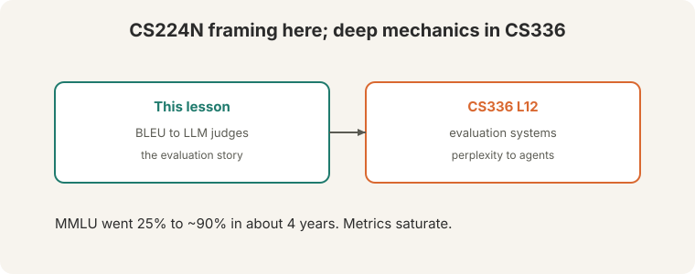

> [!NOTE]
> **Bridge lesson.** This lecture teaches the CS224N framing: the full
> evaluation story from BLEU to LLM judges. For deep mechanics, follow the
> link: [CS336 L12](../cs336/l12-evaluation.html) (perplexity to agents,
> contamination, scaffolds). This lesson never re-explains what that covers.

## How to read this lesson

This lesson has two levels. **Level 1 (Core)** covers why we evaluate and
how n-gram metrics fail. **Level 2 (Deep)** covers human evaluation, arenas,
and LLM judges.

## Level 1: Why evaluate

Four purposes:

- **Train:** the loss guides optimization.
- **Dev:** early stopping picks the checkpoint.
- **Deploy:** does it work in the real world?
- **Publish:** academic eval must be reproducible, standardized, fast, and
cheap. What matters is the **direction over 10 years**, not one number.

Tasks split into **closed** (fewer than 10 answers) and **open-ended**.
MMLU climbed from 25% to ~90% in about 4 years. Metrics saturate. The field
moves on.

## Level 1: BLEU and ROUGE

**BLEU**: n-gram precision plus a **brevity penalty**. Without the penalty,
predicting only "the" would game precision.

**ROUGE** flips it: **recall** instead of precision. Semantic metrics
(2016-2019) averaged embeddings and took cosines.

## Level 1: Overlap is not meaning

Reference: "heck yes" ([23:54](ts:23:54)):

; 'heck no' matches ~7x words (false positive).")

- "yes": 67% BLEU. Partial match.
- "yep": 0 BLEU. **False negative** ([24:39](ts:24:39)): means the same,
scores zero.
- "heck no": matches ~7x words. **False positive**: means the opposite,
scores well.

N-gram overlap is not meaning. ROUGE-L is uncorrelated with human judgments
on standard references, though the lecture notes "the references are usually
not great": with expert-written summaries, correlation improves.

> [!QA]
> Q: When is BLEU still useful?
> A: For fast iteration on similar systems. BLEU is cheap, reproducible, and directionally right when comparing close variants. It fails for open-ended generation, where many valid answers share no n-grams with the reference.
> Follow-up: What replaced n-gram metrics for open-ended tasks?
> A: Human evaluation first, then LLM judges. Reference-free evaluation asks a strong model (AlpacaEval, MT-Bench) to judge directly. No reference means no overlap gaming.

## Level 2: Human evaluation is a noisy gold standard

Human eval is the **gold standard**. Axes: fluency, coherence, common sense,
style, grammaticality, redundancy. And it is noisy:

**AlpacaFarm**: 5 researchers, 2-3 hours writing rubrics, only **67%
agreement** (50% is random). People even disagree with themselves
(intra-annotator disagreement). **Never compare human evals across papers**:
different rubrics, different annotators, different numbers.

**Chatbot Arena** ([44:03](ts:44:03)): 200,000 human votes, **Elo ratings**.
Pairwise preferences, chess-style ranking, live leaderboard.

## Level 2: LLM judges

**LLM-as-judge**: 100x faster and 100x cheaper than humans ([46:42](ts:46:42)).
GPT-4's agreement with the human majority beats humans' agreement with each
other. AlpacaEval reaches **98% rank correlation** with Chatbot Arena
([51:24](ts:51:24)).

Biases: **length bias**, humans and models prefer longer outputs ~70%
([49:41](ts:49:41)). **Monoculture**: one judge's bias applied to every model
is worse than diverse human biases. Fix: **detailed rubrics** for LLM judges.

**HELM** and the HuggingFace leaderboard "look at everything."
Implementation matters: LLaMA 65B MMLU reads 63.7 (HELM), 63.6 (original),
48.8 (harness). Same model, different harness, different number.

The closing line: "never just believe numbers" ([79:45](ts:79:45)).

> [!QA]
> Q: Should LLM judges replace human evaluation?
> A: For iteration, yes: they are 100x faster and cheaper with 98% rank correlation. For final claims, keep humans. LLM judges share one model's biases. A monoculture of judgment is worse than noisy humans. Use detailed rubrics either way.
> Follow-up: What is the biggest trap in reading eval numbers?
> A: Implementation variance. The same model scores 63.7, 63.6, or 48.8 on MMLU depending on the harness. Never compare numbers across papers or harnesses. Reproduce the setup or do not cite the number.

## Recap: the whole lesson on one screen

Eight ideas carry this lecture. Read each card. Say the core sentence out
loud. If you can, you own the lesson.

<strong>1. Evaluate for a purpose</strong>

Train, dev, deploy, publish. Academic eval: reproducible, fast, cheap.
Direction over 10 years matters.

Key: purpose decides the metric

<strong>2. BLEU: precision plus brevity penalty</strong>

N-gram overlap against references. The penalty stops "the"-only gaming.
ROUGE uses recall. Both are cheap and crude.

Key: overlap, not meaning

<strong>3. Overlap fails both ways</strong>

"yep": 0 BLEU, means the same. "heck no": matches words, means the
opposite. False negatives and false positives.

Key: [23:54](ts:23:54)

<strong>4. Humans are gold and noisy</strong>

67% agreement after hours of rubrics. People disagree with themselves.
Never compare human evals across papers.

Key: gold standard, noisy gold

<strong>5. Chatbot Arena: 200,000 votes, Elo</strong>

Pairwise human preferences, chess-style ratings, live leaderboard. The
human-eval standard of the era.

Key: [44:03](ts:44:03)

<strong>6. LLM judges: 100x faster, 100x cheaper</strong>

GPT-4 beats human-human agreement. AlpacaEval: 98% rank correlation.
Length bias ~70%. Monoculture risk.

Key: use detailed rubrics

<strong>7. Implementation decides the number</strong>

LLaMA 65B MMLU: 63.7, 63.6, or 48.8 by harness. Same model. Never trust
a number without its setup.

Key: harness is half the score

<strong>8. Depth lives in CS336</strong>

CS336 L12: perplexity to agents, contamination, scaffolds. "Never just
believe numbers."

Key: [79:45](ts:79:45)

## Official sources and further reading

**Official:**
- Lecture 11 video and transcript.
- Liang et al. (2022): HELM.

**Further reading:**
- [CS336 L12](../cs336/l12-evaluation.html): evaluation systems in depth.
- Zheng et al. (2023), "Judging LLM-as-a-Judge": the bias analysis.
- Chatbot Arena (LMSYS): the live leaderboard.

**Caveats from these sources.** "100x faster and cheaper" is the lecture's price comparison at the time. Prices move. "98% rank correlation" is AlpacaEval versus Chatbot Arena specifically.

## Connections to the other courses

- **This course:** L10's models are what L11 evaluates. L07's BLEU section was the preview.
- **CS336:** L12 (evaluation) carries the deep mechanics: perplexity, contamination, agent benchmarks.
- **CS329H:** social choice theory explains why pairwise voting (Elo) aggregates preferences.

> [!CHEAT]
> **Evaluation cheatsheet.** Purposes: train, dev, deploy, publish. Closed <10 answers. Open-ended. MMLU 25%->90% in ~4y. BLEU: n-gram precision + brevity penalty. ROUGE: recall. "heck yes": yes=67%, yep=0 (FN), heck no ~7x (FP). Human: gold, noisy; 67% agreement. Never cross-compare. Arena: 200k votes, Elo. LLM judge: 100x faster/cheaper, GPT-4 > human-human; 98% rank corr. Length bias 70%. Monoculture. HELM: look at everything. Harness changes numbers: 63.7/63.6/48.8. Rule: never just believe numbers.

> [!MEMORY]
> **Overlap is not meaning. Numbers are not truth.** BLEU counts n-grams. Humans disagree. Judges have biases. Harnesses move scores. Believe the direction, verify the setup.
