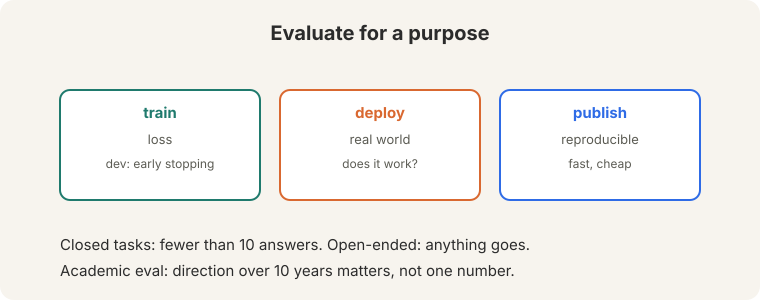
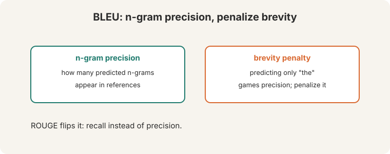
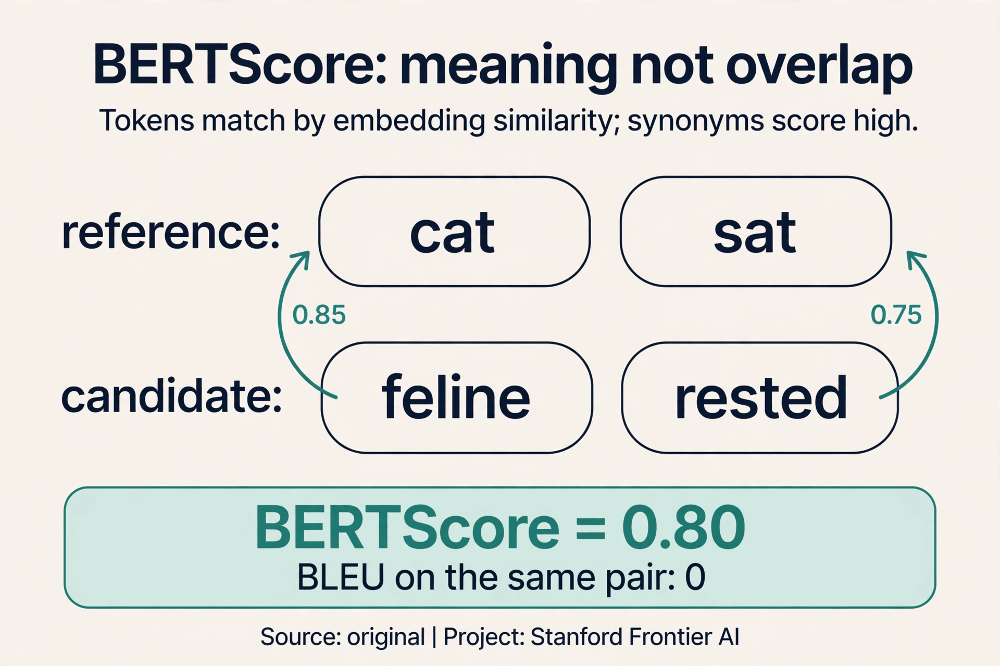
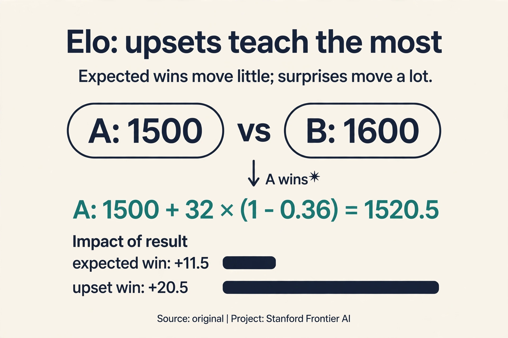
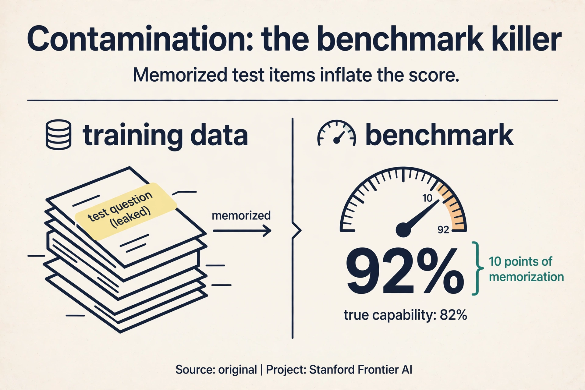
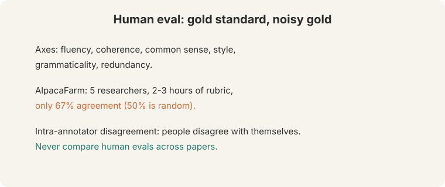
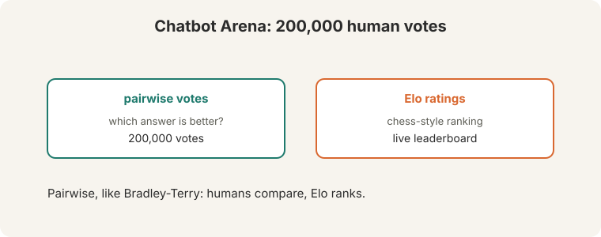
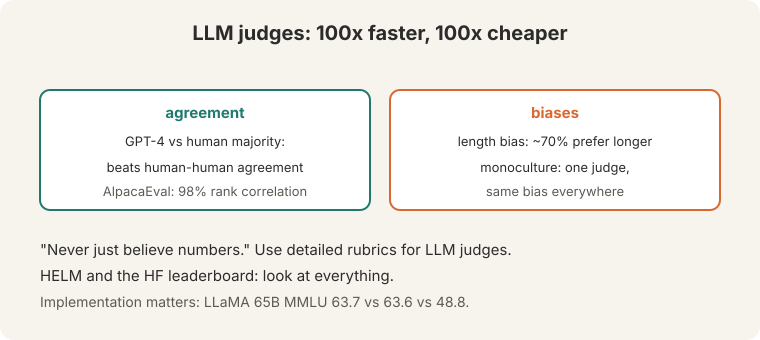

## The problem: which model is better

Two models. One scoreboard. The question sounds simple and decides
everything: what to ship, what to publish, what to train next. But "better"
depends on the purpose, and the purpose decides the metric.



Four purposes:

- **Train:** the loss guides optimization. It must be differentiable, not
  truthful.
- **Dev:** early stopping picks the checkpoint. It must rank models
  correctly.
- **Deploy:** does it work in the real world? It must measure what users
  feel.
- **Publish:** academic eval must be reproducible, standardized, fast, and
  cheap. What matters is the **direction over 10 years**, not one number.

Tasks split into **closed** (fewer than 10 answers: multiple choice) and
**open-ended** (summaries, dialogue). MMLU climbed from 25% to about 90%
in roughly 4 years. Metrics saturate. The field moves on. A benchmark is a
ruler, and rulers wear out.

## First attempt: count overlaps

The cheapest automatic metrics count n-gram overlap against references.

**BLEU**: n-gram precision plus a **brevity penalty**. Watch why the
penalty exists. Reference: "the cat sat on the mat" (6 words). Candidate:
"the".

```ascii
unigram precision: "the" appears (clipped) 1/1 = 1.00
brevity penalty:   exp(1 - 6/1) = exp(-5) = 0.0067
BLEU ≈ 0.0067
```

Without the penalty, predicting only "the" would game precision to 1.00.
The penalty multiplies it by 0.0067. **ROUGE** flips the fraction: it uses
**recall** instead of precision (how much of the reference did you cover).
Semantic metrics (2016-2019) averaged embeddings and took cosines: overlap
in meaning-space instead of word-space.



## Where overlap breaks: "heck yes"

Reference: "heck yes" ([23:54](ts:23:54)). Three candidates:

. 'heck no' matches ~7x words (false positive).")

- "yes": 67% BLEU. Partial match, partial credit. Fine.
- "yep": 0 BLEU. **False negative** ([24:39](ts:24:39)): means the same
  thing, scores zero. The metric punishes a correct answer.
- "heck no": matches about 7x words. **False positive**: means the
  opposite, scores well. The metric rewards a wrong answer.

N-gram overlap is not meaning. It fails in both directions at once.
ROUGE-L is uncorrelated with human judgments on standard references,
though the lecture notes "the references are usually not great": with
expert-written summaries, correlation improves. The metric is only as good
as the reference it compares against.

**On this page:** [ROUGE](#subchapter-rouge-recall-instead-of-precision) · [BERTScore](#subchapter-bertscore-meaning-not-overlap) · [Elo math](#subchapter-elo-math-how-ratings-move) · [Contamination](#subchapter-contamination-the-benchmark-killer) · [Eval in production, Oct 2026](#what-is-used-where-eval-in-production-october-2026) · [Watch and go deeper](#watch-and-go-deeper)

### Subchapter: ROUGE, recall instead of precision

BLEU asks: of the words you wrote, how many were in the reference?
**ROUGE** asks the reverse: of the reference's words, how many did you
cover? Watch it on a toy. Reference: "the cat sat on the mat" (6 words).
Candidate: "the cat sat" (3 words).

```ascii
ROUGE-1 recall: 3/6 = 0.50   (covered half the reference)
BLEU precision: 3/3 = 1.00   (everything written was correct)
```

BLEU without the brevity penalty calls this perfect. ROUGE calls it half.
Summarization wants recall: a summary that drops half the content fails
even if every kept word is right. Translation wants precision: extra
words are the sin. The metric follows the task. ROUGE-L uses the longest
common subsequence instead of raw n-grams, which forgives reordering a
little. All ROUGE variants still count words, not meaning.

### Subchapter: BERTScore, meaning not overlap

"The feline rested on the rug" means the same as "the cat sat on the
mat" and scores near zero on BLEU. **BERTScore** (Zhang et al., 2020)
fixes the representation: embed each token with a pretrained model, then
match candidate tokens to reference tokens by **cosine similarity**.

Watch it on a toy. Reference tokens: {cat, sat}. Candidate: {feline,
rested}. Cosine similarities: cat-feline 0.85, cat-rested 0.20,
sat-feline 0.15, sat-rested 0.75. Greedy matching: feline to cat (0.85),
rested to sat (0.75). BERTScore: (0.85 + 0.75) / 2 = 0.80. BLEU on the
same pair: 0. Synonyms match because the embeddings know they are close.
The price: BERTScore inherits the embedding model's blind spots, and it
still needs a reference. It measures meaning better than overlap, not
meaning itself.



### Subchapter: Elo math, how ratings move

Chatbot Arena ranks models with **Elo**, the chess rating. Two models,
A at 1500, B at 1600. A user prefers A's answer. Watch the update, with
K = 32:

```ascii
expected score of A = 1 / (1 + 10^((1600-1500)/400)) = 1 / (1 + 10^0.25)
                   = 1 / (1 + 1.78) = 0.36
actual score of A = 1 (it won)
new rating of A = 1500 + 32 x (1 - 0.36) = 1500 + 20.5 = 1520.5
new rating of B = 1600 - 20.5 = 1579.5
```

The upset moves 20.5 points: beating a stronger opponent pays more than
beating a weaker one. Expected wins move almost nothing. 200,000 votes
make the leaderboard stable. The weakness: Elo assumes transitive skill (if A
beats B and B beats C, A beats C), which fails when models have different
strengths on different tasks.



### Subchapter: contamination, the benchmark killer

A benchmark measures generalization only if the model has not seen the
test. **Contamination** is test data leaking into training. The web-scale
corpora that train LLMs swallow benchmarks whole: MMLU questions appear
in training text, and the model memorizes the answers. Watch the effect.
A model scores 90% on a benchmark. Half the test items were in its
training data (memorized: 100%), half were not (generalized: 80%). The
reported 90% overstates true capability by 10 points.

Detection is n-gram filtering: flag test items whose long n-grams appear
in training. Prevention is canary strings and fresh test sets. The deep
problem: at web scale, perfect decontamination is impossible, and every
public benchmark decays as it gets absorbed into training. The lecture's
rule generalizes: never just believe numbers, and believe public
benchmark numbers least of all.



> [!QA]
> Q: When is BLEU still useful?
> A: For fast iteration on similar systems. BLEU is cheap, reproducible, and directionally right when comparing close variants: if your change adds 2 BLEU on the same test set, it probably helped. It fails for open-ended generation, where many valid answers share no n-grams with the reference.
> Follow-up: What replaced n-gram metrics for open-ended tasks?
> A: Human evaluation first, then LLM judges. Reference-free evaluation asks a strong model (AlpacaEval, MT-Bench) to judge directly. No reference means no overlap gaming. But the judge brings its own biases, covered below.

## The key question: what if humans judge

The gold standard is human evaluation. Axes: fluency, coherence, common
sense, style, grammaticality, redundancy. And the gold standard is noisy:



**AlpacaFarm**: 5 researchers, 2-3 hours writing rubrics, and annotators
reached only **67% agreement**. Random guessing gives 50%. People even
disagree with themselves: show the same annotator the same pair twice and
the answers differ (**intra-annotator disagreement**). The rule: **never
compare human evals across papers**. Different rubrics, different
annotators, different numbers. A "human eval" score without its protocol is
meaningless.

**Chatbot Arena** ([44:03](ts:44:03)) industrialized the idea: 200,000
human votes, pairwise preferences, **Elo ratings** like chess, a live
leaderboard. Pairwise is the right shape because humans are noisy:
"which is better" is stable where "rate 1-7" is not.



## LLM judges: 100x faster, with biases

**LLM-as-judge**: ask a strong model to judge. **100x faster and 100x
cheaper** than humans ([46:42](ts:46:42)). GPT-4's agreement with the human
majority beats humans' agreement with each other. AlpacaEval reaches
**98% rank correlation** with Chatbot Arena ([51:24](ts:51:24)). For
iteration, this is transformative: evaluate in minutes what took weeks.



But the judge has biases, and they are measured:

- **Length bias**: humans and models prefer longer outputs about **70%**
  of the time ([49:41](ts:49:41)), regardless of quality. Verbose wrong
  answers beat concise right ones.
- **Monoculture**: one judge's bias applied to every model is worse than
  diverse human biases. Every model gets graded by the same prejudices.
- Fix: **detailed rubrics** for LLM judges. Vague instructions let biases
  run free. Specific criteria constrain them.

**HELM** and the HuggingFace leaderboard "look at everything": many tasks,
many metrics, no single number. And the deepest trap: **implementation
decides the number**. LLaMA 65B on MMLU reads 63.7 (HELM), 63.6
(original), 48.8 (harness). Same model, different harness, different
number. Never compare numbers across papers or harnesses. Reproduce the
setup or do not cite the number.

> [!QA]
> Q: Should LLM judges replace human evaluation?
> A: For iteration, yes: 100x faster and cheaper with 98% rank correlation to human arenas. For final claims, keep humans. LLM judges share one model's biases, and a monoculture of judgment is worse than noisy humans. Use detailed rubrics either way.
> Follow-up: What is the biggest trap in reading eval numbers?
> A: Implementation variance. The same model scores 63.7, 63.6, or 48.8 on MMLU depending on the harness. Never compare numbers across papers or harnesses. Reproduce the setup or do not cite the number.

## What is used where: eval in production, October 2026

| System | What it is | Public facts |
|---|---|---|
| LMArena (Chatbot Arena) | human pairwise votes, Elo | Public. The live leaderboard the field watches |
| AlpacaEval | LLM judge vs reference | Public. 98% rank correlation with Arena (2024 figure) |
| HELM | many tasks, many metrics | Public (Stanford). No single number |
| SWE-bench | real GitHub issues, tests | Public. The coding-eval standard |
| MMLU / GPQA / ARC-AGI | static benchmarks | Public. Contamination-decayed; still cited |
| Company-internal evals | private task suites | Not public. Every lab runs them; none publish the details |

The public stack is for comparison. The private stack is for shipping.
No frontier lab picks a model on public benchmarks alone.

> [!QA]
> Q: Walk me through BLEU on the "heck yes" toy, naming every step.
> A: Reference: "heck yes". Candidate 1: "yes". Step 1, clipped unigram precision: "yes" appears once in the candidate and once in the reference: 1/1 = 1.00. Bigrams: "yes" alone has no bigram: skip. Step 2, brevity penalty: candidate length 1, reference length 2: exp(1 - 2/1) = exp(-1) = 0.37. BLEU = 1.00 x 0.37 = 0.37. Candidate 2: "yep". Unigram precision: 0/1 = 0. BLEU = 0. Same meaning, zero score: the false negative. Candidate 3: "heck no". "heck" matches: unigram 1/2 = 0.50, no brevity penalty (same length). Opposite meaning, nonzero score: the false positive.
> Follow-up: Why clip the counts?
> A: Without clipping, "the the the the" scores 4/4 = 1.00 against any reference containing "the". Clipping caps each word's matches at its reference count: "the" can match at most twice if the reference has it twice. Clipping stops pure repetition from gaming precision.

> [!QA]
> Q: You need to evaluate a news summarizer. Design the eval.
> A: Three rungs. Rung 1, automatic: ROUGE-L for iteration speed, BERTScore for meaning. Both need references: use expert-written summaries, because the lecture shows correlation improves with good references. Rung 2, LLM judge: pairwise against the current production model, with a detailed rubric (faithfulness, coverage, concision). Rung 3, human: a sample of 200 summaries, pairwise, blind. Ship on rung 3, iterate on rungs 1-2. Never ship on ROUGE alone: it rewards extractive copying over good abstraction.
> Follow-up: How many summaries do humans need to read?
> A: Enough for the comparison to be significant: a few hundred pairwise judgments typically separate close models. Fewer if the gap is large. Budget for annotator disagreement: 67% agreement means you need more pairs than the math suggests.

> [!QA]
> Q: Walk me through one Elo update after an upset.
> A: A at 1500, B at 1600, K = 32. Expected score of A: 1/(1 + 10^(100/400)) = 0.36. A wins: actual 1. Update: A gains 32 x (1 - 0.36) = 20.5 points, B loses 20.5. If the favorite had won, B would gain 32 x (1 - 0.64) = 11.5: expected wins pay less. The system learns most from surprises.
> Follow-up: Why K = 32 and not 320?
> A: K sets the learning rate of the ratings. Too high and one lucky vote swings the board: noise. Too low and real skill changes take thousands of votes to register: lag. 32 is the chess standard, tuned over decades. Arena-scale voting (200K votes) tolerates it.

> [!QA]
> Q: LLM judge or human eval for your final model selection?
> A: Both, in sequence. LLM judges for the shortlist: 100x faster and cheaper, 98% rank correlation, detailed rubrics to constrain bias. Humans for the final: the top 2-3 candidates, pairwise, blind, with a written rubric. The judge's monoculture (one model's biases grading everything) is the risk you pay a human panel to remove. Never let the judge pick the winner alone.
> Follow-up: How do you de-bias the LLM judge?
> A: Detailed rubrics first: vague instructions let length bias (70%) run free. Swap answer order to kill position bias. Use two different judge models and keep only agreements. And calibrate: measure the judge against human votes on a sample before trusting it.

> [!QA]
> Q: Your model scores 92% on a public benchmark. How do you check for contamination?
> A: N-gram filtering: take long n-grams (13-grams are standard) from the test items and search the training corpus. Matches mean the model may have memorized the item. Then run a clean split: score only the items with no matches. If the clean score drops far below 92%, the headline number was memorization. Also test on a fresh, private set: the gap between public and private scores is the contamination estimate.
> Follow-up: Can you ever fully decontaminate web-scale training?
> A: No. The web contains the benchmarks, their discussions, and their paraphrases. N-gram filters catch verbatim copies, not rewordings. Treat every public benchmark score as an upper bound on true capability, and build private evals for decisions that matter.

## Watch and go deeper

<div style="max-width:640px;margin:1.5rem 0">
<div style="position:relative;padding-bottom:56.25%;height:0;overflow:hidden;border-radius:8px;background:#000">
<iframe src="https://www.youtube-nocookie.com/embed/7uy9vp_iDf0" title="What is BLEU Score?" style="position:absolute;top:0;left:0;width:100%;height:100%;border:0" loading="lazy" allowfullscreen></iframe>
</div>
<p><strong>What is BLEU score?</strong> (Standarity). N-gram precision and the brevity penalty.</p>
</div>

### Go deeper

- [Holistic Evaluation of Language Models](https://arxiv.org/abs/2211.09110) (Liang et al., 2022). HELM: many tasks, many metrics.
- [BLEU: a Method for Automatic Evaluation of Machine Translation](https://aclanthology.org/P02-1040/) (Papineni et al., 2002). The original metric paper.
- [LMArena](https://lmarena.ai). The live human-preference leaderboard.
- [Stanford CS224N course site](https://web.stanford.edu/class/cs224n/). Slides, assignments, syllabus.

## Mapping back: what each method answers

| Measurement failure | Answer | How |
|---|---|---|
| Precision gaming ("the" scores 1.00) | Brevity penalty | exp(1 - 6/1) = 0.0067 kills the gaming |
| Overlap is not meaning ("yep" scores 0, "heck no" scores well) | Human judgment | AlpacaFarm, Chatbot Arena: 200,000 votes, Elo |
| Humans are slow, expensive, 67% agreement | LLM judges | 100x faster/cheaper. GPT-4 beats human-human agreement |
| One judge's bias everywhere | Detailed rubrics + HELM | Constrain the judge. Look at everything |
| Numbers move with the harness (63.7/63.6/48.8) | Never compare across setups | Reproduce or do not cite |

## The honest price

Every rung of the ladder has a cost. N-gram metrics are cheap and wrong
about meaning. Humans are right and noisy: 67% agreement after hours of
rubrics, and incomparable across papers. LLM judges are fast and biased:
length wins 70%, and one judge's prejudice grades every model. The
lecture's closing line: "never just believe numbers" ([79:45](ts:79:45)).
Believe the direction over 10 years. Verify the setup behind every number.

## Recap: the whole lesson on one screen

1. **The problem.** Which model is better? Four purposes: train, dev,
   deploy, publish. Purpose decides the metric. Benchmarks saturate: MMLU
   25% to ~90% in ~4 years.
2. **First attempt.** BLEU: n-gram precision plus brevity penalty. The toy:
   "the" alone scores 1.00 precision, killed to 0.0067 by the penalty.
   ROUGE uses recall.
3. **Overlap breaks.** "heck yes": "yes" 67%, "yep" 0 (false negative),
   "heck no" ~7x words (false positive). Overlap is not meaning, in both
   directions.
4. **Humans: gold and noisy.** 67% agreement (50% is random) after 2-3
   hours of rubrics. People disagree with themselves. Never compare across
   papers.
5. **Chatbot Arena.** 200,000 pairwise votes, Elo ratings, live
   leaderboard. Pairwise because humans are noisy.
6. **LLM judges.** 100x faster and cheaper. GPT-4 beats human-human
   agreement. AlpacaEval: 98% rank correlation. Length bias ~70%.
   Monoculture risk. Detailed rubrics.
7. **Implementation decides.** LLaMA 65B MMLU: 63.7, 63.6, or 48.8 by
   harness. Same model. Reproduce the setup or do not cite.
8. **The rule.** Never just believe numbers. Believe the direction.
   Verify the setup.

## Official sources and further reading

**Official:**
- Lecture 11 video and transcript.
- Liang et al. (2022), HELM: holistic evaluation.

**Further reading:**
- Zheng et al. (2023), "Judging LLM-as-a-Judge": the bias analysis.
- Chatbot Arena (LMSYS): the live leaderboard.
- Papineni et al. (2002), BLEU: the original metric paper.

**Caveats from these sources.** "100x faster and cheaper" is the lecture's
price comparison at the time. Prices move. "98% rank correlation" is
AlpacaEval versus Chatbot Arena specifically. The brevity-penalty toy above
is an original teaching toy.

## Connections to the other courses

- **This course:** L10's models are what L11 evaluates. L07's BLEU section
  was the preview. L04's UAS/LAS are the same idea: task-specific metrics.
- **CS336:** evaluation systems in depth: perplexity, contamination,
  agent benchmarks.
- **CS329H:** social choice theory explains why pairwise voting (Elo)
  aggregates noisy preferences.
