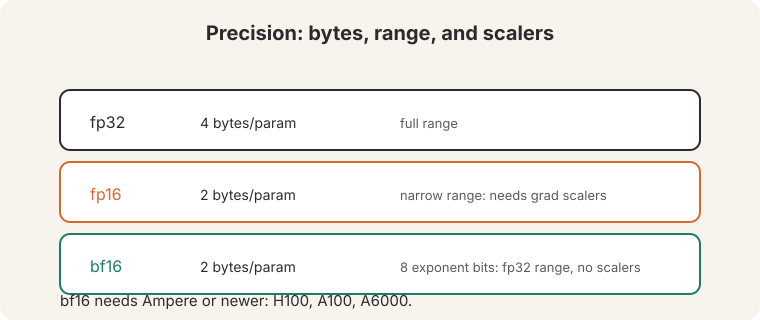
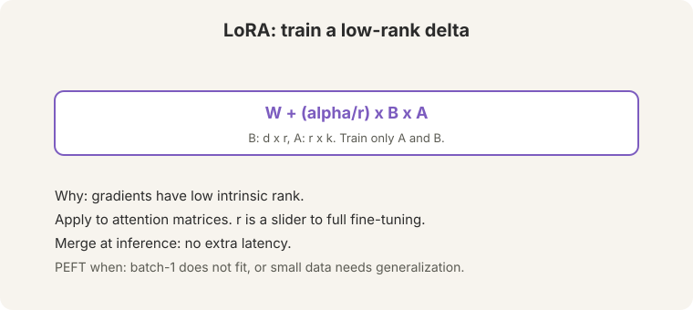
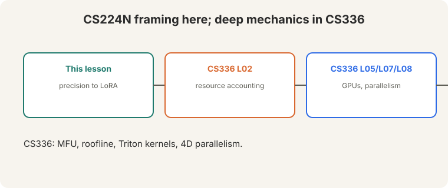

> [!NOTE]
> **Bridge lesson.** This lecture teaches the CS224N framing: what costs
> memory and how to cut it. For deep systems, follow the links:
> [CS336 L02](../cs336/l02-resource-accounting.html) (FLOPs, bytes, roofline),
> [CS336 L05](../cs336/l05-gpus.html) (GPUs), [CS336 L07](../cs336/l07-parallelism.html)
> and [L08](../cs336/l08-4d-parallelism.html) (parallelism at scale),
> [CS336 L06](../cs336/l06-triton-kernels.html) (kernels). This lesson never
> re-explains what those cover.

## How to read this lesson

This lesson has two levels. **Level 1 (Core)** covers precision and the
memory budget. **Level 2 (Deep)** covers distributed training, LoRA, and
sustainability.

## Level 1: Precision formats

Three formats:

- **fp32**: 4 bytes per parameter. Full dynamic range.
- **fp16**: 2 bytes. Narrow range: tiny gradients underflow to zero, so
training needs **gradient scalers**.
- **bf16** ("brain float 16", [11:39](ts:11:39)): 2 bytes, **8 exponent
bits**. Same range as fp32, less precision. No scalers needed ([12:02](ts:12:02)).
Needs Ampere or newer: H100, A100, A6000 ([12:22](ts:12:22)).

## Level 1: The memory budget

Mixed-precision training keeps several copies per parameter:

- Parameters (fp16): 2 bytes.
- Gradients (fp16): 2 bytes.
- Master weights (fp32): 4 bytes.
- Momentum (fp32): 4 bytes.
- Variance (fp32): 4 bytes.

**16 bytes per parameter, on every GPU.** Optimizer states dominate.
Activations add more, scaling with batch size: **gradient checkpointing**
trades recompute for activation memory ([37:58](ts:37:58)).

> [!QA]
> Q: Why keep fp32 master weights if everything else is fp16?
> A: fp16 cannot represent tiny updates: they round to zero and training stalls. The fp32 master accumulates the small steps exactly. The fp16 copy is for fast math. Precision where it matters, speed where it counts.
> Follow-up: What is the first thing to shard when memory runs out?
> A: The optimizer states: 12 of the 16 bytes. ZeRO stage 1 shards them across GPUs. Parameters are last, because sharding them costs communication on every forward pass.

## Level 2: Data parallel and ZeRO

**DDP** (distributed data parallel): each GPU holds a full copy, runs forward
and backward on different data, then synchronizes gradients with **all-reduce**
([16:25](ts:16:25)). Communication: 2 bytes per parameter ([16:47](ts:16:47)).

**ZeRO** (Microsoft DeepSpeed) shards instead of replicating:

- Stage 1: shard optimizer states.
- Stage 2: add gradients.
- Stage 3: add parameters.

**Reduce-scatter** replaces all-reduce under sharding. **FSDP** is PyTorch's
ZeRO-3. When even batch-1 does not fit, shard first, checkpoint second.

## Level 2: LoRA

**PEFT** (parameter-efficient fine-tuning) exists for two reasons: (1) the
model does not fit even at batch size 1, (2) small data plus an
overparameterized model generalizes better with fewer trained parameters.

**LoRA**: gradients have **low intrinsic rank** ([45:38](ts:45:38)). Freeze W.
Train a low-rank delta:

BA: train only A and B; apply to attention matrices; r is a slider to full fine-tuning; merge at inference.")

W + (alpha/r) x B x A

- B is d-by-r, A is r-by-k. Train only A and B.
- Apply to attention matrices.
- r is a slider: larger r approaches full fine-tuning.
- **Merge at inference**: fold BA into W. No extra latency.

Alternatives: adapters, BitFit. LoRA won on the merge property.

> [!QA]
> Q: Why does a low-rank update suffice?
> A: Fine-tuning gradients live in a low-dimensional subspace: the task needs only a few directions of change. LoRA parameterizes exactly those directions. The rank r trades expressivity for parameters.
> Follow-up: When does LoRA fail?
> A: When the task needs large changes everywhere: a new language, a new modality, or pretraining-scale shifts. Then the low-rank assumption breaks and full fine-tuning (or continued pretraining) wins.

## Level 2: Sustainability

The lecture's closing chart: largest-model training compute (red) versus
global compute capacity (blue). "Not sustainable" ([39:56](ts:39:56)).
Training demand outruns capacity. Concentration follows: few organizations
can train frontier models.

## Recap: the whole lesson on one screen

Eight ideas carry this lecture. Read each card. Say the core sentence out
loud. If you can, you own the lesson.

<strong>1. bf16 is the sweet spot</strong>

fp32: 4 bytes. fp16: 2 bytes, needs grad scalers. bf16: 2 bytes, 8
exponent bits, fp32 range, no scalers. Needs Ampere+.

Key: brain float 16

<strong>2. 16 bytes per parameter</strong>

2 + 2 + 4 + 4 + 4: params, grads, master, momentum, variance. Optimizer
states dominate. Checkpoint activations.

Key: 16B/param per GPU

<strong>3. DDP: copy everywhere, all-reduce</strong>

Full copy per GPU. Different data. All-reduce gradients: 2 bytes per
parameter of communication.

Key: synchronize gradients

<strong>4. ZeRO: shard, do not replicate</strong>

Stage 1: optimizer. Stage 2: + gradients. Stage 3: + parameters.
Reduce-scatter. FSDP in PyTorch.

Key: shard the 12 bytes first

<strong>5. LoRA: low-rank deltas</strong>

W + (alpha/r)BA. Train A and B only. Attention matrices. r slides to
full fine-tuning. Merge at inference.

Key: low intrinsic rank

<strong>6. PEFT for two reasons</strong>

Batch-1 does not fit. Small data plus overparameterization: fewer
trained parameters generalize better.

Key: fit and generalize

<strong>7. Training compute is not sustainable</strong>

Largest-model demand outruns global capacity. Concentration: few
organizations can train frontier models.

Key: [39:56](ts:39:56)

<strong>8. Depth lives in CS336</strong>

Resource accounting (L02), GPUs (L05), parallelism (L07, L08), Triton
(L06). This lesson: the framing.

Key: bridge, not duplicate

## Official sources and further reading

**Official:**
- Lecture 12 video and transcript.
- Hu et al. (2021): LoRA.
- Rajbhandari et al. (2020): ZeRO.

**Further reading:**
- [CS336 L02](../cs336/l02-resource-accounting.html): the full memory and FLOPs accounting.
- [CS336 L08](../cs336/l08-4d-parallelism.html): 4D parallelism at scale.
- Micikevicius et al. (2018), "Mixed Precision Training": the fp16 recipe with grad scalers.

**Caveats from these sources.** "16 bytes per parameter" is the Adam mixed-precision budget. Other optimizers differ. The sustainability chart is the lecture's illustration, not a measured forecast.

## Connections to the other courses

- **This course:** L08-L10 built the models. This lecture trains them affordably. L15 continues the alignment-efficiency story.
- **CS336:** L02 (accounting), L05 (GPUs), L06 (kernels), L07-L08 (parallelism) carry the deep systems.
- **CS229S:** low-rank updates are the same mathematics as matrix approximation.

> [!CHEAT]
> **Efficient training cheatsheet.** fp32 4B. Fp16 2B + scalers. Bf16 2B, 8 exp bits, no scalers, Ampere+. Memory: 2+2+4+4+4 = 16B/param/GPU. DDP: full copies, all-reduce 2B/param. ZeRO: 1 optimizer, 2 +grads, 3 +params. Reduce-scatter; FSDP. Checkpointing: trade compute for activation memory. LoRA: W+(a/r)BA, train A/B, attention matrices, r slider, merge at inference. PEFT: fit batch-1, small-data generalization. Sustainability: demand > capacity, concentration.

> [!MEMORY]
> **Shard the states, rank the updates.** Optimizer states are 12 of 16 bytes: shard them first. Fine-tuning needs few directions: train a low-rank delta.
