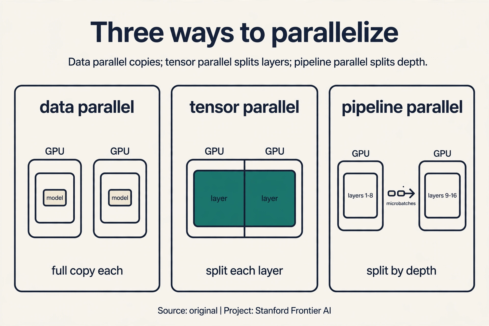
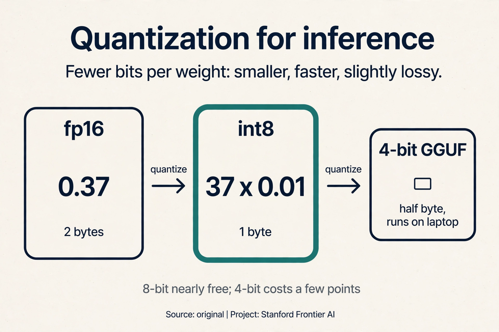
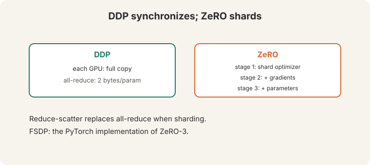
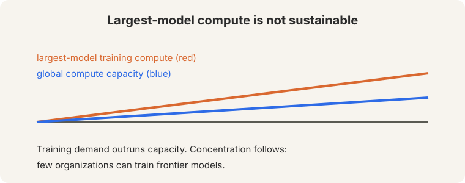

## The problem: the model does not fit

Count the bytes. Mixed-precision training keeps five numbers per
parameter: fp16 parameters (2 bytes), fp16 gradients (2 bytes), fp32
master weights (4 bytes), fp32 momentum (4 bytes), fp32 variance (4
bytes). Total: **16 bytes per parameter, on every GPU**. A 7B model needs
112 GB. One A100 holds 80 GB. The model does not fit. The job of this
lecture: count bytes honestly, then cut them.

## Precision: fewer bits per number

Three formats:


- **fp32**: 4 bytes per parameter. Full dynamic range.
- **fp16**: 2 bytes. Narrow range: the smallest normal value is about
  6.1e-5. A gradient of 1e-6 underflows to zero, so the update vanishes
  and training stalls. Training needs **gradient scalers**: multiply the
  loss up before backprop, unscale after.
- **bf16** ("brain float 16", [11:39](ts:11:39)): 2 bytes, **8 exponent
  bits**. Same range as fp32, less precision. Gradients of 1e-6 survive.
  No scalers needed ([12:02](ts:12:02)). Needs Ampere or newer: H100,
  A100, A6000 ([12:22](ts:12:22)).

The demonstration: fp16's max is 65,504 and its min normal is 6.1e-5, a
range of about 10^9. The fp32 and bf16 formats span about 10^79. Neural gradients live
at 1e-6 and below. The fp16 format rounds them to zero, while bf16 keeps them. Range beats
precision for training.

## The memory budget


2 + 2 + 4 + 4 + 4 = 16 bytes per parameter. **Optimizer states dominate**:
12 of the 16 bytes are momentum, variance, and master weights. Activations
add more, scaling with batch size and sequence length: **gradient
checkpointing** trades recompute for activation memory ([37:58](ts:37:58)):
discard activations in the forward pass, recompute them in the backward
pass. Memory down, compute up.

Why keep fp32 master weights if everything else is fp16? Because fp16
cannot represent tiny updates: they round to zero and training stalls. The
fp32 master accumulates the small steps exactly. The fp16 copy is for fast
math. Precision where it matters, speed where it counts.

**On this page:** [Tensor parallelism](#subchapter-tensor-parallelism-split-the-matrix) · [Pipeline parallelism](#subchapter-pipeline-parallelism-split-the-layers) · [The gradient scaler](#subchapter-the-gradient-scaler-step-by-step) · [Quantization for inference](#subchapter-quantization-for-inference) · [Training stacks, Oct 2026](#what-is-used-where-training-stacks-october-2026) · [Watch and go deeper](#watch-and-go-deeper)

### Subchapter: tensor parallelism, split the matrix

Data parallel copies the model. **Tensor parallelism** splits it: each
GPU holds part of every layer. Watch a matrix multiply split two ways
(Megatron-LM style). W is 4x4, split across 2 GPUs:

- **Column-parallel:** GPU 0 holds columns 1-2, GPU 1 holds columns 3-4.
  Each computes half the output. Concatenate: no communication needed
  until the next layer.
- **Row-parallel:** GPU 0 holds rows 1-2, GPU 1 holds rows 3-4. Each
  computes a partial sum. All-reduce the partials: one communication per
  layer.

Alternate them: column-parallel then row-parallel needs only one
all-reduce per two layers. The price is communication on every forward
and backward pass: tensor parallelism wants GPUs with fast interconnects
(NVLink), not a cluster spread across racks. Split the model when one GPU
cannot hold a layer; shard the data when it can.

### Subchapter: pipeline parallelism, split the layers

**Pipeline parallelism** splits by depth: GPU 0 holds layers 1-8, GPU 1
holds layers 9-16. A microbatch flows through: GPU 0 computes, sends
activations to GPU 1, starts the next microbatch while GPU 1 works. Watch
the schedule with 4 microbatches on 2 GPUs:

```ascii
time:  1    2    3    4    5
GPU0:  m1   m2   m3   m4   idle
GPU1:  idle m1   m2   m3   m4
```

The **bubble** is the idle time: GPU 1 waits at step 1, GPU 0 idles at
step 5. More microbatches shrink the bubble fraction. The price is still
there: pipeline parallelism never reaches 100% utilization, and a slow
stage stalls everything behind it. Combine all three: data parallel
across replicas, tensor parallel within a node, pipeline parallel across
nodes. That 3D combination trains the largest models.



### Subchapter: the gradient scaler, step by step

fp16's smallest normal value is 6.1e-5. Gradients live at 1e-6 and below:
they underflow to zero and training stalls. The **gradient scaler**
multiplies the loss up before backprop and unscales after. Watch it on a
toy, scale factor 1024:

```ascii
loss = 2.0, true gradient = 1e-6
scaled loss = 2.0 x 1024 = 2048
scaled gradient = 1e-6 x 1024 = 1.024e-3   (representable in fp16)
unscale: 1.024e-3 / 1024 = 1e-6 in fp32    (exact)
```

The backward pass runs in fp16 on scaled-up values that survive. The
unscale happens in fp32 after. If any scaled gradient overflows fp16's max
(65,504), the scaler halves itself and skips the update: no corrupt step
is ever applied. bf16 made the scaler unnecessary (8 exponent bits cover
the range), which is why modern training uses bf16 and skips this
machinery entirely.

### Subchapter: quantization for inference

Training needs gradients. Inference needs only the forward pass, so the
weights can be stored in fewer bits. **INT8 quantization** maps each fp16
weight to 8 bits: 4x smaller, roughly 2x faster matrix math. Watch the
mapping on a toy weight 0.37 with scale 0.01: round(0.37 / 0.01) = 37,
stored in one byte. Dequantize: 37 x 0.01 = 0.37. Per-tensor scales are
crude; per-channel scales are the standard.

**GGUF** is the community format for quantized LLMs: 4-bit, 5-bit, 8-bit
variants that run on CPUs and laptops. **QLoRA** combines 4-bit quantized
base weights with LoRA adapters in bf16: fine-tune a 65B model on one
48GB GPU. The price of quantization is accuracy: 8-bit is nearly free,
4-bit costs a few points on hard tasks. The rule: quantize for serving,
never for training.



> [!QA]
> Q: Why keep fp32 master weights if everything else is fp16?
> A: fp16 cannot represent tiny updates: a gradient of 1e-6 rounds to zero and training stalls. The fp32 master accumulates the small steps exactly. The fp16 copy is for fast math. Precision where it matters, speed where it counts.
> Follow-up: What is the first thing to shard when memory runs out?
> A: The optimizer states: 12 of the 16 bytes. ZeRO stage 1 shards them across GPUs. Parameters are last, because sharding them costs communication on every forward pass.

## The key question: what if GPUs shared the load

One GPU cannot hold 112 GB. Eight GPUs hold 640 GB between them, but data
parallel training replicates the full model on each: 8 copies of 112 GB,
and 7 of them are redundant. What if the GPUs split the model instead of
copying it?

## Data parallel, then ZeRO

**DDP** (distributed data parallel): each GPU holds a full copy, runs
forward and backward on different data, then synchronizes gradients with
**all-reduce** ([16:25](ts:16:25)). Communication per step: 2 bytes per
parameter ([16:47](ts:16:47)). For the 7B model: 14 GB per GPU per step,
every step. The redundancy is the price of simplicity.

**ZeRO** (Microsoft DeepSpeed) shards instead of replicating:



- Stage 1: shard optimizer states. The 12 bytes split across GPUs.
- Stage 2: add gradients. The 2 gradient bytes split too.
- Stage 3: add parameters. Everything splits.

**Reduce-scatter** replaces all-reduce under sharding: each GPU receives
only its shard's gradients. **FSDP** is PyTorch's ZeRO-3. Count the win on
8 GPUs with ZeRO-3: 112 GB / 8 = 14 GB per GPU. The 7B model that overflowed
one A100 now fits with room to spare. When even batch-1 does not fit, shard
first, checkpoint second.

## LoRA: train a fraction

**PEFT** (parameter-efficient fine-tuning) exists for two reasons: (1) the
model does not fit even at batch size 1, so full fine-tuning is impossible.
(2) small data plus an overparameterized model generalizes better with
fewer trained parameters.

**LoRA**: fine-tuning gradients have **low intrinsic rank**
([45:38](ts:45:38)). Freeze W. Train a low-rank delta:

BA: train only A and B. Apply to attention matrices. R is a slider to full fine-tuning. Merge at inference.")

W + (alpha/r) x B x A

B is d-by-r, A is r-by-k. Train only A and B. Apply to the attention
matrices. Count it for d = 4096, r = 8: 2 x 4096 x 8 = 65,536 learned
numbers, versus 4096 x 4096 = 16.7M for the full matrix. That is 256x
fewer parameters. R is a slider: larger r approaches full fine-tuning.
**Merge at inference**: fold BA into W, so there is no extra latency.
Alternatives exist (adapters, BitFit). LoRA won on the merge property:
after training, the model is byte-identical in shape to the original.

> [!QA]
> Q: Why does a low-rank update suffice?
> A: Fine-tuning gradients live in a low-dimensional subspace: the task needs only a few directions of change. LoRA parameterizes exactly those directions. The rank r trades expressivity for parameters: 65,536 numbers at r = 8 versus 16.7M for the full matrix.
> Follow-up: When does LoRA fail?
> A: When the task needs large changes everywhere: a new language, a new modality, or pretraining-scale shifts. Then the low-rank assumption breaks and full fine-tuning (or continued pretraining) wins.

## The honest price: not sustainable

The lecture's closing chart: largest-model training compute (red) versus
global compute capacity (blue). "Not sustainable" ([39:56](ts:39:56)).
Training demand outruns capacity. Concentration follows: few organizations
can train frontier models. Every technique in this lecture (bf16, ZeRO,
checkpointing, LoRA) stretches the budget. None of them changes the curve.



## What is used where: training stacks, October 2026

| Tool | What it does | Public facts |
|---|---|---|
| PyTorch FSDP2 | ZeRO-3 sharding | Public. The standard for large training runs |
| DeepSpeed ZeRO | stages 1-3, offload | Public (Microsoft). ZeRO-Offload spills to CPU/NVMe |
| Megatron-LM | tensor + pipeline parallel | Public (NVIDIA). The 3D parallelism reference |
| vLLM | PagedAttention serving | Public. The default LLM serving engine |
| TensorRT-LLM | optimized inference | Public (NVIDIA). Kernel-level serving speed |
| QLoRA / GGUF | 4-bit fine-tune / serve | Public. The community efficiency stack |
| Closed-lab stacks | [unknown] | Every lab runs custom infrastructure; details not published |

The open stack trains and serves anything up to frontier scale. The
closed labs' advantage is scale and data, not secret parallelism math.

> [!QA]
> Q: Walk me through the ZeRO-3 memory math for a 7B model on 8 GPUs.
> A: Mixed precision: 16 bytes per parameter. 7B x 16 = 112 GB total. ZeRO-3 shards everything: parameters, gradients, optimizer states. Per GPU: 112 / 8 = 14 GB. One A100 holds 80 GB, so the model fits with room for activations. Without ZeRO (DDP), each GPU holds the full 112 GB: overflow. The price of sharding: communication. Parameters are gathered before each layer's forward pass and scattered after: the network carries what memory saved.
> Follow-up: When does ZeRO-3 hurt?
> A: On small models with fast GPUs: the gather/scatter communication dominates and training slows. ZeRO-1 (shard optimizer states only, 12 of 16 bytes) is often the sweet spot: most of the memory win, little of the communication cost. Scale the stage to the problem.

> [!QA]
> Q: You have 2x A100 (80GB each) and a 7B model to fine-tune. Plan it.
> A: Full fine-tuning needs 112 GB: does not fit on one GPU, fits across two with ZeRO-3 (56 GB each) plus activation memory. Cheaper: LoRA. Freeze the 7B in bf16 (14 GB), train rank-16 adapters (a few million parameters): fits on one GPU with room to spare, faster, and the merge gives zero inference latency. Only go full fine-tuning if LoRA underperforms on your dev set. And use gradient checkpointing if activations overflow: recompute is cheaper than a third GPU.
> Follow-up: What batch size?
> A: As large as fits, with gradient accumulation to reach the effective batch you want. Microbatch 1-2 per GPU with accumulation over 32-64 steps is normal. The effective batch sets the gradient noise; the microbatch is just plumbing.

> [!QA]
> Q: Walk me through one scaled backward step.
> A: Loss = 2.0, scaler = 1024. Step 1: scaled loss = 2048. Step 2: backward in fp16. A true gradient of 1e-6 becomes 1.024e-3: representable, survives. Step 3: check for overflow. If any gradient is inf (exceeded 65,504), halve the scaler and skip the update: no corrupt step. Step 4: unscale in fp32: divide by 1024, apply the optimizer step to the fp32 master weights. The fp16 gradients did the fast math; the fp32 master kept the precision.
> Follow-up: Why not just use bf16 and skip all this?
> A: That is exactly what the field did. bf16's 8 exponent bits cover fp32's range, so 1e-6 gradients survive without scaling. Ampere and newer run bf16 natively. The scaler is legacy machinery for pre-Ampere GPUs. New training: bf16, no scaler.

> [!QA]
> Q: Gradient checkpointing: when is the recompute worth it?
> A: When activations are the binding constraint: long sequences, large batches, deep models. Checkpointing discards activations in the forward pass and recomputes them in the backward: memory down by roughly the number of checkpointed segments, compute up by one extra forward pass (~33% slower). Worth it when the alternative is a smaller batch (noisier gradients) or model parallelism (communication overhead). Not worth it when memory is plentiful: then it is pure slowdown.
> Follow-up: What do you checkpoint?
> A: Whole transformer blocks, not individual ops. The granularity trades memory saved against recompute cost: block-level is the standard. Finer granularity saves more memory but recomputes more.

> [!QA]
> Q: LoRA or QLoRA for fine-tuning 70B on 2x A100?
> A: QLoRA. 70B in bf16 is 140 GB: does not fit even across 2x80GB with optimizer states. 4-bit quantized base is ~35 GB: fits on one GPU, LoRA adapters in bf16 train on top. The lecture's 7B math scales up: quantization is what makes 70B fine-tuning possible on workstation hardware. Quality cost is small on most tasks. Full fine-tuning of 70B needs a cluster; QLoRA needs a desk.
> Follow-up: What breaks at 4-bit?
> A: Hard reasoning tasks lose a few points: the quantization noise hits the long tail of precise computations. And the base model is frozen in 4-bit: the adapters must compensate for anything the quantization damaged. Measure on your hardest dev slice, not the average.

## Watch and go deeper

<div style="max-width:640px;margin:1.5rem 0">
<div style="position:relative;padding-bottom:56.25%;height:0;overflow:hidden;border-radius:8px;background:#000">
<iframe src="https://www.youtube-nocookie.com/embed/87GhCIQudEA" title="Mixed Precision Training - Explained" style="position:absolute;top:0;left:0;width:100%;height:100%;border:0" loading="lazy" allowfullscreen></iframe>
</div>
<p><strong>Mixed precision training, explained</strong>. Why fp16 breaks, and how the master copy and loss scaling fix it.</p>
</div>

### Go deeper

- [ZeRO: Memory Optimizations Toward Training Trillion Parameter Models](https://arxiv.org/abs/1910.02054) (Rajbhandari et al., 2020). Shard instead of replicate.
- [LoRA: Low-Rank Adaptation of Large Language Models](https://arxiv.org/abs/2106.09685) (Hu et al., 2021). Train a fraction.
- [vLLM documentation](https://docs.vllm.ai). PagedAttention and the modern serving stack.
- [Stanford CS224N course site](https://web.stanford.edu/class/cs224n/). Slides, assignments, syllabus.

## Mapping back: what each technique answers

| Memory pain | Answer | How |
|---|---|---|
| 16 bytes/param: 7B needs 112 GB, one A100 holds 80 | bf16 + ZeRO-3 | 2-byte params. 112/8 = 14 GB per GPU on 8 GPUs |
| fp16 underflows gradients below 6.1e-5 | bf16's 8 exponent bits | fp32's range at 2 bytes. No scalers |
| Optimizer states are 12 of 16 bytes | ZeRO stage 1 | Shard the 12 bytes first. Parameters last |
| Activations scale with batch x length | Gradient checkpointing | Discard, recompute in backward. Memory down, compute up |
| Full fine-tuning needs the whole model | LoRA | 65,536 numbers instead of 16.7M. Merge at inference |

## Recap: the whole lesson on one screen

1. **The problem.** 16 bytes per parameter per GPU. 7B x 16 = 112 GB. One
   A100: 80 GB. The model does not fit.
2. **Precision.** fp32: 4 bytes. fp16: 2 bytes, underflows below 6.1e-5, needs scalers. bf16: 2 bytes, 8 exponent bits, fp32 range, no scalers.
   Ampere+.
3. **The budget.** 2+2+4+4+4 = 16. Optimizer states are 12 of 16. The fp32
   master accumulates tiny updates exactly. Checkpointing trades recompute
   for activation memory.
4. **DDP.** Full copy per GPU, all-reduce gradients: 2 bytes/param/step.
   14 GB per step for 7B. Simple, redundant.
5. **ZeRO.** Shard, do not replicate. Stage 1: optimizer. Stage 2: +
   gradients. Stage 3: + parameters. 112/8 = 14 GB per GPU. FSDP in
   PyTorch.
6. **LoRA.** Low intrinsic rank. W + (alpha/r)BA, train A and B only:
   65,536 vs 16.7M at r = 8. Merge at inference: no extra latency.
7. **PEFT's two reasons.** Batch-1 does not fit. Fewer trained parameters
   generalize better on small data.
8. **The price.** Largest-model compute outruns global capacity. Not
   sustainable. Training concentrates in few organizations.

## Official sources and further reading

**Official:**
- Lecture 12 video and transcript.
- Hu et al. (2021), LoRA: low-rank adaptation.
- Rajbhandari et al. (2020), ZeRO: memory optimizations.

**Further reading:**
- Micikevicius et al. (2018), "Mixed Precision Training": the fp16
  scaler technique.
- DeepSpeed documentation: ZeRO stages in practice.

**Caveats from these sources.** The 16-byte budget assumes Adam with fp32
states and mixed precision. Other optimizers differ. "Not sustainable" is
the lecture's reading of the compute chart, not a proof. The LoRA
parameter counts above are worked from the lecture's formula.

## Connections to the other courses

- **This course:** L08's quadratic attention is the other memory hog.
  L09's pretraining is what needs all this machinery.
- **CS336:** resource accounting (FLOPs, bytes, roofline), GPUs, and
  parallelism at scale carry the deep systems mechanics.
- **CS229S:** memory-efficient training (FlashAttention, KV cache) attacks
  the same budget from the architecture side.
