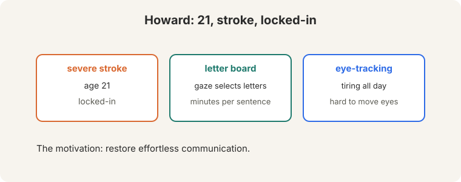
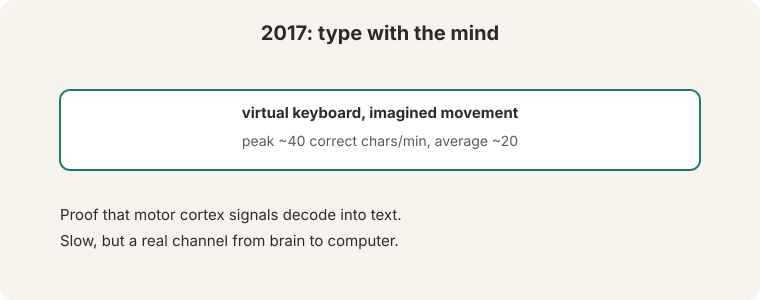
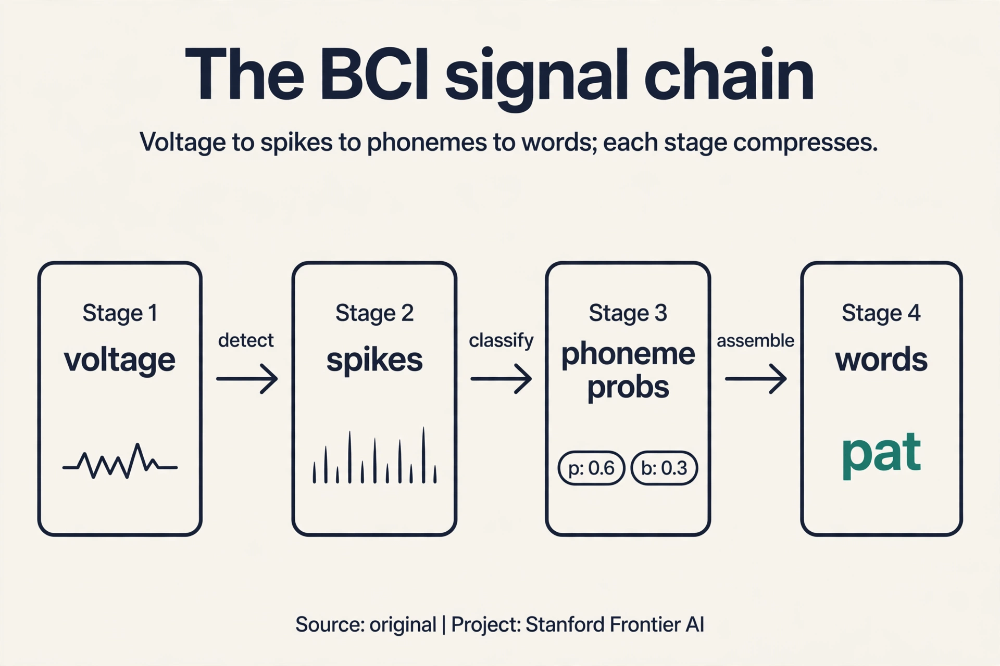
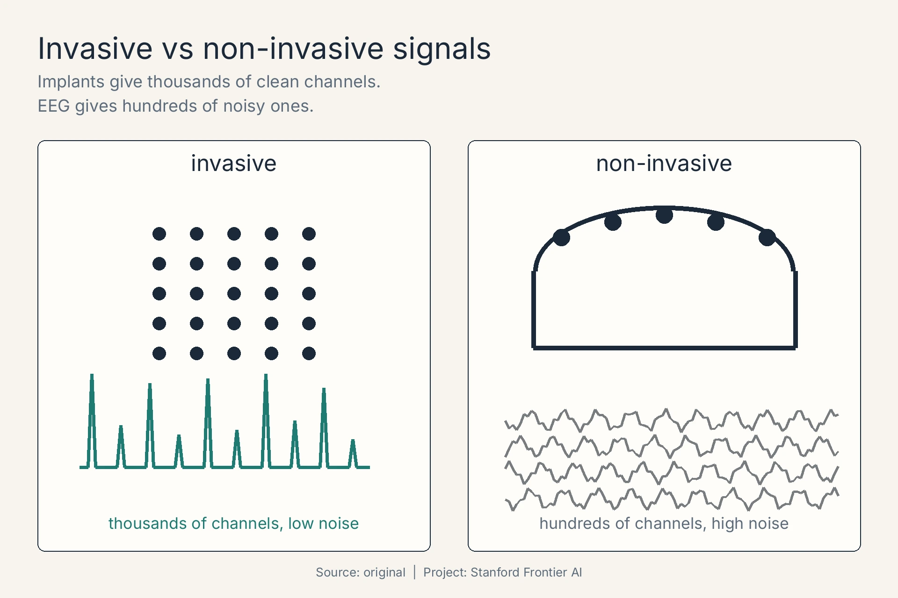
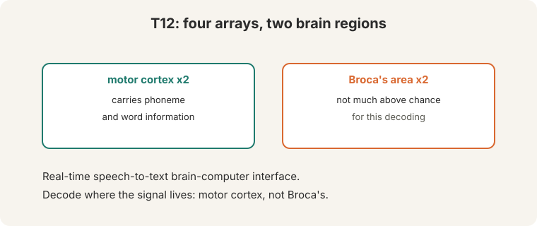
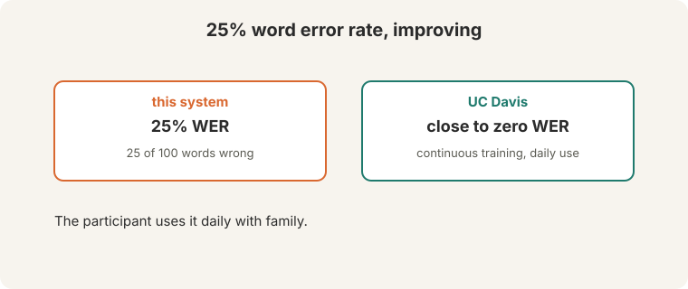
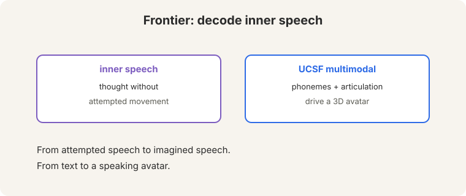

## The problem: a working brain with no way out

Howard was 21 when a severe stroke left him **locked-in** ([01:23](ts:01:23)):
a fully functioning brain, no way to move or speak. He communicated with a
**letter board**: someone watches his gaze, letter by letter. Minutes per
sentence. Imagine spelling every word of every thought at that speed, all
day.

**Eye-tracking** helped but tired him: staring at a screen all day is
exhausting, and moving the eyes precisely is hard for locked-in patients
([03:38](ts:03:38)). The bottleneck is the body, not the device.

> [!QA]
> Q: Why not just improve eye-tracking?
> A: The bottleneck is the body, not the device. Locked-in patients struggle to move their eyes precisely, and sustained gaze is tiring. A brain interface bypasses the broken output path entirely: it reads the intention, not the muscle.
> Follow-up: What does "locked-in" mean exactly?
> A: Full consciousness with near-total paralysis. The brain works. The muscles do not respond. Communication must route around the body.

## The 2017 breakthrough: the channel exists

In 2017, a participant **typed on a virtual keyboard with imagined
movement**: imagining hand movements drove a cursor, selecting letters.
Peak: about 40 correct characters per minute. Average: about 20
([28:57](ts:28:57)).

Count what that means. An average English word is about 5 characters plus
a space: 6 characters. Forty characters per minute is under 7 words per
minute. Slow. But speed was not the point. The point was the channel:
motor cortex signals decode into text. The brain's output, read directly.

## The key question

If the speech channel is gone, can we read the intention at the source, decode the words directly from the brain that tried to speak them?

## The implanted system: decode where the signal lives

Participant T12 (ALS, recruited 2022) received **four microelectrode
arrays** ([41:56](ts:41:56)): two in **motor cortex**, two in **Broca's
area**.

**On this page:** [The signal chain](#subchapter-the-signal-chain-spikes-to-phonemes) · [The language model in the decoder](#subchapter-the-language-model-in-the-decoder) · [Invasive vs non-invasive](#subchapter-invasive-versus-non-invasive) · [Watch and go deeper](#watch-and-go-deeper)

### Subchapter: the signal chain, spikes to phonemes

Electrodes record voltage. Decoding turns voltage into words in stages.
Watch the chain:

1. **Spike detection.** Threshold each electrode's signal: crossings are
   neural firing events. 128 electrodes become 128 spike trains.
2. **Binning.** Count spikes in 20ms windows: each window is a 128-dim
   feature vector, 50 vectors per second.
3. **Phoneme classifier.** A neural net maps each window's features to
   phoneme probabilities: P("p" | window) = 0.6, P("b") = 0.3, rest 0.1.
4. **Sequence assembly.** String the phoneme probabilities over time into
   candidate word sequences.

Each stage compresses: megahertz voltages to 50 feature vectors per
second to phoneme probabilities to words. The classifier is the same
machinery as Lecture 2's NER: features in, labels out, cross-entropy
loss. New channel, old math.

### Subchapter: the language model in the decoder

Phoneme probabilities are noisy: "p" at 0.6 versus "b" at 0.3 is a coin
flip away from wrong. The **language model** constrains the output. It
scores candidate word sequences: P("pat the cat") is high, P("bat the
cat") is lower in context. The decoder searches for the sequence that
maximizes phoneme evidence times language model probability.

Watch it resolve an ambiguity. Phonemes suggest "I" then either "scream"
or "ice cream". The acoustic evidence is 55/45: nearly tied. The language
model knows "ice cream" follows "I want" far more often than "I scream"
does in this context. The LM term breaks the tie. This is Lecture 5's
language model pointed at electrodes: same scoring, same search (beam
search over word sequences), new input channel. Decoding is language
modeling where the observations happen to be neural.

### Subchapter: invasive versus non-invasive

Signal quality trades against surgery. Three rungs:

- **Intracortical arrays (Utah).** Electrodes in cortex. Single-neuron
  resolution. 60-70 wpm in the lecture. Price: brain surgery, scarring,
  signal decay over years.
- **ECoG.** Electrodes on the brain surface. No penetration: coarser
  signal, still surgical. Between the two on quality and risk.
- **EEG.** Electrodes on the scalp. No surgery. The skull blurs the
  signal: tens of words per minute at best, high error rates.

The lecture's numbers are all intracortical: the best signal money can
buy, bought with surgery. Non-invasive decoding is the dream and the
gap: safe, but the skull is a low-pass filter that no algorithm fully
undoes. The field's bet: invasive for locked-in patients now,
non-invasive if the signal processing ever catches up.

The motor cortex arrays carry phoneme and word information: the signal for
attempted speech lives there. The Broca's area arrays score not much above
chance for this decoding. **Decode where the signal lives**: anatomy guides
engineering. The system is a real-time speech-to-text BCI: attempted
speech in, words out.

## How good: error rates

**Word error rate: about 25%.** For every 100 words the participant
attempts, 25 come out wrong ([66:14](ts:66:14)). Feel what 25% means. If
errors hit independently, a 10-word sentence survives intact with
probability 0.75^10 = 0.056. Over 94% of sentences contain at least one
error. That is high.

But the trajectory matters more than the number. UC Davis collaborators
reach **close to zero WER** after continuous training ([66:28](ts:66:28)):
the decoder keeps learning the participant's signals, and the errors fall.
The participant uses the system daily with family ([65:52](ts:65:52)). A
25% system used daily beats a 0% system that does not exist.

## How fast: the speed ladder

Maximum decoding speed: **60-70 words per minute**. Natural speech: **150
wpm** ([67:30](ts:67:30)). Stack the alternatives ([35:44](ts:35:44)):

| Channel | Speed |
|---|---|
| Natural speech | 150 wpm |
| Speech BCI | 60-70 wpm |
| Handwriting | 13-14 wpm |
| Eye-tracking | ~5 wpm |
| 2017 imagined typing | ~7 wpm |

Half the speed of speech. Twelve times eye-tracking. Ten times the 2017
system. Every non-invasive alternative is far behind, and the gap is
growing.

## The frontier

Two frontiers:

1. **Inner speech.** Decode thought without attempted movement
   ([67:23](ts:67:23)): effortless, natural communication. The hard part
   is ground truth. Attempted speech has an intended output you can
   verify against. Inner speech has no observable target, so training
   labels are hard to get, and the signal is weaker without motor
   execution.
2. **Multimodal decoding (UCSF).** Decode phonemes **and** articulation to
   drive a **3D avatar** ([65:28](ts:65:28)): speech you can see, not just
   read. The face carries the half of communication that text drops.

> [!QA]
> Q: What is the hardest part of inner speech decoding?
> A: Ground truth. Attempted speech has an intended output you can verify: the participant tried to say a known sentence. Inner speech has no observable target, so training labels are hard to get. The signal is also weaker without motor execution.
> Follow-up: Why does this lecture belong in an NLP course?
> A: Decoding is language modeling over neural signals. Phonemes, words, and language models structure the output exactly as in speech recognition. The course's tools transfer to the brain: the decoder is an LM whose input channel happens to be electrodes.

> [!QA]
> Q: Walk me through the full decoding pipeline, naming every stage.
> A: Four implanted arrays record voltage from motor cortex. Stage 1: threshold crossings detect spikes on 128 electrodes. Stage 2: bin spikes into 20ms windows, 50 feature vectors per second. Stage 3: a neural classifier maps each window to phoneme probabilities, say P("p") = 0.6, P("b") = 0.3. Stage 4: assemble phonemes into candidate word sequences. Stage 5: the language model scores candidates and beam search picks the winner: phoneme evidence times LM probability. Voltage in, words out.
> Follow-up: Where does the 25% word error rate come from?
> A: Every stage leaks. Spike detection misses firing events. The phoneme classifier confuses similar sounds. The language model cannot fix what the acoustics destroyed. The errors compound down the chain: each stage's output is the next stage's noisy input.

> [!QA]
> Q: Is 25% word error rate usable?
> A: For daily family communication, yes: the participant uses it daily. For anything formal, no: 94% of 10-word sentences contain an error under independence. Usability is not a single number: it depends on the cost of an error (a garbled "I love you" versus a garbled medication request) and on whether the conversation partner can ask for clarification. The trajectory matters: UC Davis near zero after continuous training says the number is not the ceiling.
> Follow-up: Why does continuous training help so much?
> A: The decoder adapts to the participant's specific signals: electrode drift, day-to-day variation, personal articulation patterns. A static decoder fights a moving target. A learning decoder tracks it. The brain and the decoder co-adapt.

> [!QA]
> Q: You are designing the clinical trial's primary endpoint. WER or words per minute?
> A: Neither alone: the endpoint should be functional communication rate, meaning correctly conveyed words per minute. WER measures accuracy, wpm measures speed. A fast wrong system and a slow right system both fail the patient. Define success as information transfer: correct words per minute above a threshold that replaces the letter board (which manages a few words per minute). Secondary endpoints: daily usage hours (does the patient actually use it?) and error cost (are the errors recoverable in conversation?).
> Follow-up: Why not just use WER like speech recognition?
> A: Speech recognition serves dictation: transcription accuracy is the product. BCI serves a locked-in person: communication is the product. A 25% WER system used daily beats a 5% system abandoned for fatigue. Measure the life, not the transcript.

> [!QA]
> Q: Why did the motor cortex arrays carry the signal while Broca's area scored near chance?
> A: The task was attempted speech: the participant tried to move the speech articulators. Motor cortex drives movement, so it encodes the articulatory commands: phonemes as muscle instructions. Broca's area handles language formulation, a step removed from execution. For this decoding target (phonemes from attempted movement), the execution signal is the rich one. Decode where the signal lives: match the brain region to the behavior being decoded.
> Follow-up: Would Broca's win for inner speech?
> A: Possibly: inner speech without attempted movement has no motor execution, so the formulation areas may carry what the motor cortex no longer provides. That is the hypothesis behind the inner-speech frontier. Unproven at lecture time: the ground-truth problem blocks the experiment.

> [!QA]
> Q: Invasive or non-invasive for the next decade of patients?
> A: Invasive for locked-in patients now: 60-70 wpm versus ~5 for eye-tracking is the difference between conversation and spelling. The surgery's risk is justified by the communication gain. Non-invasive for everyone else: EEG cannot justify brain surgery for convenience. The research bet is two-track: make invasive last longer (signal decay is the enemy) while pushing non-invasive signal processing toward usability. Do not promise the non-invasive track on the invasive track's timeline.
> Follow-up: What is the hardest engineering problem in invasive BCI?
> A: Longevity. Electrodes scar, signals drift, arrays fail over years. A system that works for a trial's months must work for a patient's decades. The decoding algorithms are ahead of the materials science.

## Watch and go deeper

<iframe src="https://www.youtube-nocookie.com/embed/DaWb1ukmYHQ" title="Stanford's brain implants help woman speak again" style="position:absolute;top:0;left:0;width:100%;height:100%;border:0" loading="lazy" allowfullscreen></iframe>

<strong>Stanford's speech brain implant</strong> (Stanford Medicine). The Willett 2023 speech-decoding result, on video.

### Go deeper

- [A high-performance speech neuroprosthesis](https://www.nature.com/articles/s41586-023-06377-x) (Willett et al., 2023). The Stanford speech BCI results.
- [Stanford CS224N course site](https://web.stanford.edu/class/cs224n/). Slides, assignments, syllabus.

## Mapping back: the communication ladder

| Channel | Speed | Cost |
|---|---|---|
| Letter board | Minutes per sentence | Exhausting, needs a partner |
| Eye-tracking | ~5 wpm | Tiring, imprecise for locked-in patients |
| 2017 imagined movement | ~7 wpm | Proved the channel. Too slow to use |
| Speech BCI (T12) | 60-70 wpm | Invasive surgery. 25% WER here, near zero at UC Davis |
| Inner speech (frontier) | Unknown | No ground truth for training yet |

## The honest price

Brain surgery. Four arrays implanted in cortex is not a product. It is a
clinical trial. The numbers are participant- and system-specific: one
person's 25% is not everyone's. And 94% of sentences containing an error is
still far from natural conversation. But the direction is unmistakable:
from minutes per sentence to 60-70 words per minute in under a decade,
with the error rate falling as decoders keep learning.

## Recap: the whole lesson on one screen

1. **The problem.** Locked-in: the brain works, the body does not.
   Howard, 21, stroke. Letter board: minutes per sentence. Eye-tracking:
   tiring. Bypass the broken output path.
2. **2017: the channel exists.** Imagined movement drives a virtual
   keyboard: ~40 chars/min peak, ~20 average. Under 7 wpm. Slow, but the
   signal decodes.
3. **T12: four arrays.** Two in motor cortex (phoneme and word
   information), two in Broca's area (near chance). Decode where the
   signal lives.
4. **25% WER, falling.** 25 of 100 words wrong. 94% of 10-word sentences
   hit an error. UC Davis: close to zero after continuous training.
   Daily use with family.
5. **60-70 wpm.** Half of natural speech (150). Twelve times eye-tracking
   (~5). Ten times the 2017 system.
6. **Frontier 1: inner speech.** Thought without attempted movement. The
   blocker: no observable ground truth for training labels.
7. **Frontier 2: avatar.** UCSF decodes phonemes plus articulation into a
   3D avatar. Speech you can see.
8. **Why NLP.** Decoding is language modeling over neural signals. Same
   tools, new channel.

## Official sources and further reading

**Official:**
- Lecture 13 video and transcript.

**Further reading:**
- Willett et al. (2023), "A high-performance speech neuroprosthesis": the
  Stanford speech BCI results.
- Metzger et al. (2023, UCSF), "Generalizable spelling and speech
  decoding": the multimodal avatar work.

**Caveats from these sources.** WER and speed numbers are participant-
and system-specific. They vary across labs and sessions. "Close to zero"
is the lecture's report of UC Davis results. The sentence-survival
arithmetic above is an original illustration assuming independent errors.

## Connections to the other courses

- **This course:** L05's language models structure BCI output. L09's
  pretraining intuition (predict from context) applies to neural signals.
- **CS336:** multimodality: neural signals are another input modality.
- **CS229:** signal processing and decoding theory underlie the implants.
