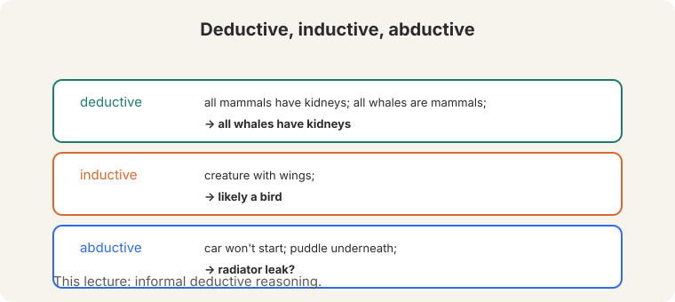
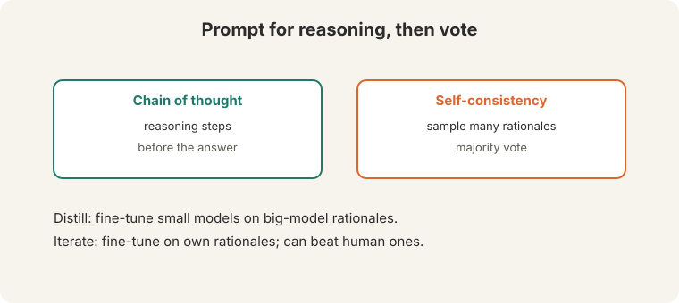
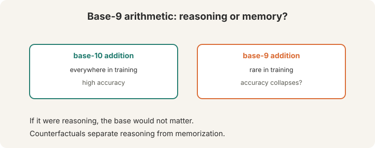
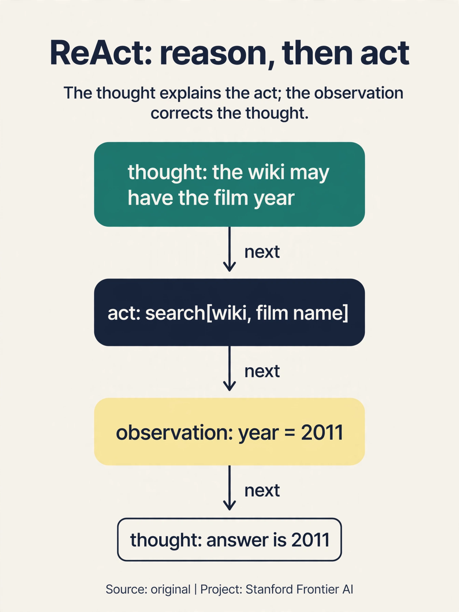
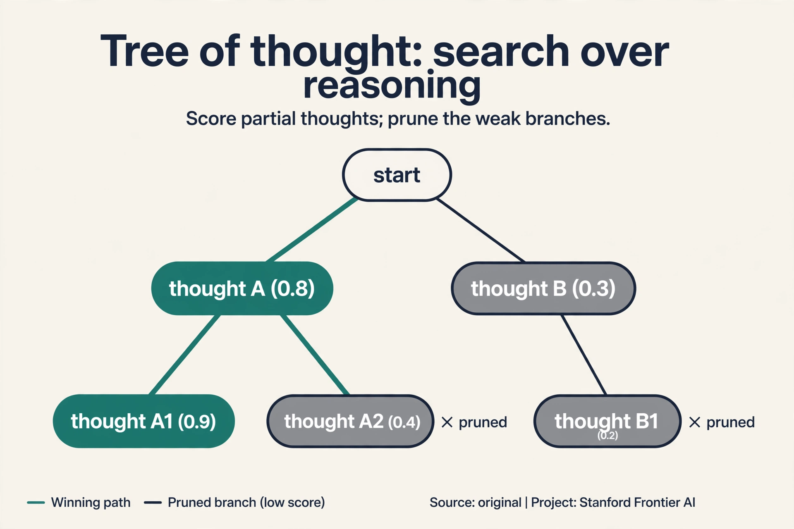
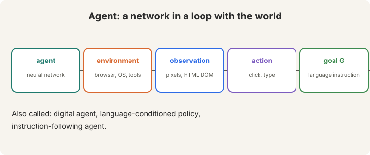
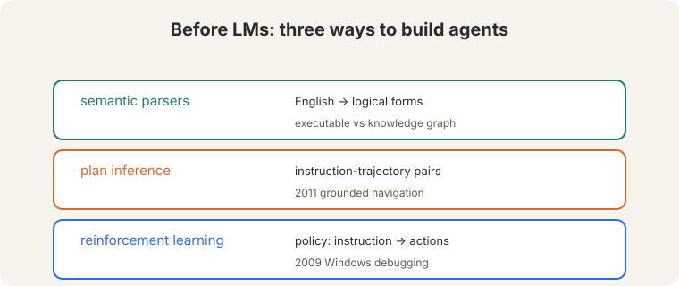
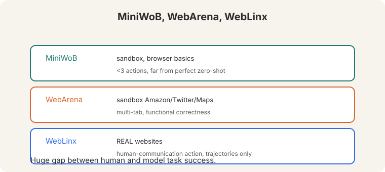
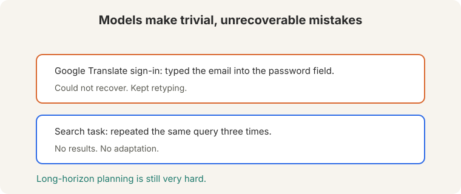

## The problem: reasoning or recall

A model answers a math question correctly. Did it reason, or did it
remember? The training data holds billions of worked examples. A correct
answer proves nothing about the method.

First, the vocabulary. Three kinds of reasoning:



- **Deductive.** All mammals have kidneys ([01:49](ts:01:49)). All whales
  are mammals. Therefore all whales have kidneys. Certain, given the
  premises.
- **Inductive.** A creature with wings is likely a bird. Probable, not
  certain.
- **Abductive.** The car will not start and there is a puddle underneath
  ([02:46](ts:02:46)): probably a radiator leak. The best explanation of
  the evidence.

This lecture studies **informal deductive** reasoning: everyday inference,
not formal proofs.

## Prompting reasoning: steps, then votes

Two prompting methods get reasoning behavior:



1. **Chain-of-thought prompting.** Write reasoning steps before the answer.
   The steps are a scratch pad: intermediate results get written down
   instead of guessed.
2. **Self-consistency** ([05:04](ts:05:04)). Sample multiple rationales
   ([05:14](ts:05:14)), take the **majority vote**. Watch it on a toy.
   Five samples give answers [42, 42, 17, 42, 17]. Majority: 42, with 3
   of 5 votes. The wrong paths scatter. The right path concentrates.
   Helps on math reasoning tasks.

Training methods go further. Generate rationales from a big model,
fine-tune a small model on them (**distillation**): the small model
inherits the big one's reasoning traces. Or fine-tune the big model on
its **own rationales iteratively** ([17:35](ts:17:35)): performance can
keep improving and even beat human-provided rationales.

## The counterfactual test: base-9 addition

Are models reasoning, or recalling? **Counterfactual evaluation**: change
the task so training data cannot explain success. Instead of base-10
addition, test **base-9 addition** ([25:49](ts:25:49)).



Watch the arithmetic. 8 + 7 in base 10 is 15. In base 9, 8 + 7 = 15 in
decimal, which is 1 x 9 + 6: written "16". The algorithm is identical:
add, carry at the base. Only the symbols change. If the model truly
reasons, the base should not matter. If it answers "15" in base 9, it
memorized base-10 facts. Base-10 addition is everywhere in training.
base-9 is rare. The gap between the two scores measures memorization.

Be careful about data contamination before claiming reasoning: if the
counterfactual itself appears in training, the test is void.

> [!QA]
> Q: Why is base-9 a fair test?
> A: The algorithm is identical. Only the symbols change. A reasoner applies the same algorithm to new symbols. A memorizer has no base-9 examples to recall. The gap between the two scores measures memorization.
> Follow-up: Does failing base-9 prove the model cannot reason?
> A: No. It proves this task's success came from data, not reasoning. The model might reason elsewhere. Counterfactuals falsify specific claims. They do not certify general inability.

## The key question

What happens when a model that can reason gets to act, to call tools, see the results, and try again?

**On this page:** [ReAct](#subchapter-react-reason-and-act-interleaved) · [Tree of thought](#subchapter-tree-of-thought-search-over-thoughts) · [Reflexion](#subchapter-reflexion-the-critic-in-the-loop) · [Agents in production, Oct 2026](#what-is-used-where-agents-in-production-october-2026) · [Watch and go deeper](#watch-and-go-deeper)

### Subchapter: ReAct, reason and act interleaved

Chain-of-thought reasons. Acting calls tools. **ReAct** (Yao et al., 2022)
interleaves them: Thought, Action, Observation, repeat. Watch one loop on
"book a flight from SF to NYC":

```ascii
Thought:    I need flight options. I will search the airline site.
Action:     type("SFO to JFK next Friday") + click(search)
Observation: 3 flights listed: $289, $340, $410.
Thought:    The $289 flight works. I will select it.
Action:     click(flight $289)
Observation: seat selection page.
```

The Thought steps are chain-of-thought: the model reasons about what to
do next. The Action steps touch the world. The Observation steps ground
the next thought in reality: no more reasoning in a vacuum. ReAct beats
reason-only (which cannot act) and act-only (which cannot plan) on
knowledge-heavy tasks. One increment on the lecture's agent loop: the
loop now thinks out loud between actions.



### Subchapter: tree of thought, search over thoughts

Chain-of-thought walks one reasoning path. **Tree of thought** (Yao et
al., 2023) searches many: generate several candidate thoughts at each
step, score them, keep the promising branches, prune the dead ones.
Watch it on a toy with breadth 2, depth 2:

```ascii
step 1:  thought A ("check prices first")   thought B ("check dates first")
  score:  A 0.8, B 0.4 -> keep A, prune B
step 2:  from A: A1 ("sort by price") 0.9,  A2 ("filter direct") 0.7
  keep both, answer from A1
```

Self-consistency samples full paths and votes. Tree of thought scores
*partial* paths and searches: it abandons bad branches early instead of
walking them to the end. The price is the search itself: breadth times
depth model calls, each a full forward pass. Use it where the reasoning
branches genuinely (math, planning, puzzles), not where the first path is
usually right.



### Subchapter: Reflexion, the critic in the loop

ReAct acts. Tree of thought searches. **Reflexion** (Shinn et al., 2023)
adds a critic: an actor tries, an evaluator scores the trajectory, and a
self-reflection step writes verbal feedback into memory for the next
attempt. Watch the loop:

```ascii
attempt 1: books the $410 flight (too expensive)
critic:    "The task said cheapest. You picked the first option."
memory:    "Always compare all prices before selecting."
attempt 2: compares $289, $340, $410, books $289
```

No weight updates: the learning lives in the textual memory, not the
parameters. That is the point and the limit. Reflexion improves within a
task session, but the lessons do not transfer to new sessions unless they
are saved externally. Three patterns, one ladder: ReAct thinks between
actions, tree of thought searches thoughts, Reflexion critiques whole
attempts. Each adds one loop the previous one lacked.

## What an agent is: a network in a loop

An **agent** is a neural network in a loop with the world:



- **Agent:** the neural network.
- **Environment:** web browser, digital assistants, programming tools, UI
  automation, Spotify, plugins.
- **Observation:** what the agent sees: pixels or HTML DOM.
- **Action:** what it does: click, type, move the mouse.
- **Goal G:** a language instruction, e.g. Book a flight from SF to NYC
  ([31:56](ts:31:56)).

Also called: digital agent, language-conditioned policy,
instruction-following agent.

Before language models, three approaches: **semantic parsers** (translate
English commands to **logical forms**, executable against a knowledge
graph, [34:16](ts:34:16)). **plan inference** (learn executable plans from
instruction-trajectory pairs. 2011 grounded navigation). **reinforcement
learning** (learn a policy from instructions to actions. 2009 automated
Windows debugging).



## The 2024 reframing: decisions as language modeling

The key move: **generative trajectory modeling**.
P(trajectory | goal) = transition dynamics x policy. An autoregressive LM
predicts the next action, conditioned on everything so far.

The simple LM agent: the action space written in text, plus the
instruction, plus the action/observation history, predicts the next
action. "Just Chain of Thought prompting in a loop" ([42:35](ts:42:35)).
Watch one loop iteration:

```ascii
instruction:  book a flight from SF to NYC
action space: click(x,y), type(text), scroll, ...
history:      opened airline site, clicked "book"
next action:  click(search box)      <- the LM predicts this
environment:  returns the focused search box (observation)
repeat until the goal is done
```

Each iteration is one forward pass. The world supplies the observations.
the model supplies the actions.


Training data is the bottleneck. Human demonstrations as few-shot examples
do not scale. The fix: **synthetic demonstrations**. Let the model explore
randomly, then use a second LM to label or relabel the trajectories
(**hindsight relabeling**, [62:54](ts:62:54)). Watch the trick: the agent
wanders and accidentally books a flight to Boston. The original goal was
NYC: a failure. Relabel the trajectory as a demonstration of "book a
flight to Boston": a success. Every random walk becomes training data for
whatever it actually achieved. Iterate.

## Benchmarks and the embarrassment of failures



- **MiniWoB** ([43:11](ts:43:11)). Sandbox browser basics: retweet,
  forward email. Under 3 actions. Best LMs "far from perfect" zero-shot
  ([43:53](ts:43:53)).
- **WebArena** ([44:38](ts:44:38)). Sandbox approximating Amazon, Twitter,
  Maps. Multi-tab browsing. Functional correctness.
- **WebLinx** ([45:31](ts:45:31)). **Real websites**, not sandboxed. A new
  human-communication action for credit-card requests. Trajectories only,
  no exploration.

The failures are embarrassingly simple:



GPT-4V signing into Google Translate **typed the email into the password
field** and could not recover ([59:39](ts:59:39)). Another model repeated
the same search term three times with no results. Count why long horizons
are brutal. If each step succeeds with probability 0.95, a 10-step task
succeeds with 0.95^10 = 0.60. A 20-step task: 0.95^20 = 0.36. Every step
is a chance to derail, and the model has no recovery mechanism: a human
notices the wrong field, deletes, and retypes. The model commits to its
trajectory and cannot step back.

> [!QA]
> Q: Why do agents fail at such simple tasks?
> A: No error recovery. A human notices the wrong field, deletes, and retypes. The model commits to its trajectory and cannot step back. Long horizons multiply the failure: at 0.95 per step, 10 steps succeed with probability 0.60 and 20 steps with 0.36.
> Follow-up: What would fix this?
> A: The lecture points at training: synthetic demonstrations with hindsight relabeling teach recovery implicitly. Explicit planning, verification steps, and the ability to ask the user (WebLinx's communication action) are the architectural directions.

## What is used where: agents in production, October 2026

| System | What it is | Public facts |
|---|---|---|
| Claude Code (Anthropic) | agentic coding in the terminal | Public product. The ReAct loop pointed at codebases |
| OpenAI Agents SDK / Operator | tool-using agents | Public. Function calling plus computer use |
| Microsoft Copilot | agents in Office/GitHub | Public. The enterprise agent surface |
| Browser-use / OpenHands | open-source agent frameworks | Public. The community agent stack |
| Startup agent products | [uncertain] | Many claim autonomy; verify per product before citing |

The lecture's 2024 benchmarks (MiniWoB, WebArena) measured the gap. The
2026 products sell across it: the loop is the same, the reliability
engineering is what changed. Anything about a specific product's
internals is [uncertain] unless the vendor documented it.

> [!QA]
> Q: Walk me through one ReAct loop iteration, naming each part.
> A: Goal: book a flight SF to NYC. Thought: "I need options. I will search." This is chain-of-thought: reasoning about the next move. Action: type("SFO to JFK Friday") and click search. This touches the world. Observation: "3 flights: $289, $340, $410." This grounds the next thought: no more reasoning in a vacuum. Next Thought: "The $289 works. I will select it." Each iteration is one model call producing a thought plus an action, and the world replies with an observation. Reason, act, see, repeat.
> Follow-up: What breaks if you remove the Thought steps?
> A: You get act-only: the model calls tools with no plan. It searches, clicks, and wanders: the email-in-the-password-field failure. The Thoughts are the plan. Remove them and the loop has no memory of what it is trying to do.

> [!QA]
> Q: Build a flight-booking agent. What is the architecture?
> A: Start with the lecture's loop: instruction + action space + history predicts the next action. Add ReAct: Thought steps between actions so the agent plans. Add tools: search_flights, select_flight, enter_payment, each with a typed schema. Add guardrails: never enter payment without explicit user confirmation (WebLinx's human-communication action). Add recovery: if a step fails, the Thought step replans instead of committing to the trajectory. Evaluate on WebArena-style tasks: success rate, steps to completion, and dollars booked wrong (the metric that matters).
> Follow-up: How do you stop it booking the wrong flight?
> A: Confirmation gates on irreversible actions. The agent can search and compare freely. Payment needs a human yes. And idempotency: the booking tool must tolerate retries without double-booking. The reliability is in the harness, not the model.

> [!QA]
> Q: Self-consistency or tree of thought for a math word problem?
> A: Tree of thought if the problem branches: multiple plausible first steps, dead ends that waste full rollouts. Score partial paths and prune early. Self-consistency if the paths are mostly independent attempts at the same computation: sample fully, majority vote. The cost differs: ToT pays breadth times depth in scoring calls. Self-consistency pays samples times full length. For a single-path arithmetic problem, self-consistency is cheaper. For a puzzle with real branch points, ToT earns its cost.
> Follow-up: Can you combine them?
> A: Yes: search with ToT, then self-consistency vote among the surviving branches. More compute, better answers. The combination is standard where accuracy beats cost.

> [!QA]
> Q: Walk me through hindsight relabeling on a failed trajectory.
> A: Goal: "book a flight to NYC". The agent explores randomly and books Boston. Original label: failure. Relabel: treat the trajectory as a demonstration of "book a flight to Boston": success. The trajectory's actions (search, compare, select, pay) are correct for Boston: the only wrong thing was the goal string. Train on the relabeled pair. Every random walk becomes training data for whatever it actually achieved. Iterate: explore, relabel, train, explore better.
> Follow-up: What is the failure mode?
> A: The relabeled goals may be useless: "click randomly for 20 steps" is a valid relabeling of a wandering trajectory, and training on it teaches wandering. Filter: keep relabelings whose achieved goals resemble real tasks. The trick needs a curriculum, not just a trick.

> [!QA]
> Q: How do you evaluate an agent before letting it touch production?
> A: Three gates. Gate 1, sandbox benchmarks: MiniWoB, WebArena. Measure task success rate and steps. Gate 2, fault injection: wrong fields, changed layouts, slow pages. Measure recovery: does the agent notice and replan, or commit to the trajectory? Gate 3, blast radius: run with real tools but capped consequences (test credit card, confirmation gates). Measure dollars at risk per 1,000 tasks. Ship when gate 3's number is below what the business accepts. The lecture's embarrassments (email in the password field) are gate-2 failures.
> Follow-up: Why not just measure task success?
> A: Because success rate hides the failure distribution. An agent that succeeds 95% and books a wrong $2,000 flight 5% of the time is worse than one that succeeds 90% and fails safely. Measure the cost of failure, not just its frequency.

## Watch and go deeper

<div style="max-width:640px;margin:1.5rem 0">
<div style="position:relative;padding-bottom:56.25%;height:0;overflow:hidden;border-radius:8px;background:#000">
<iframe src="https://www.youtube-nocookie.com/embed/VNxgUchyelQ" title="Retrieve On Demand, Not Upfront: The ReAct Pattern" style="position:absolute;top:0;left:0;width:100%;height:100%;border:0" loading="lazy" allowfullscreen></iframe>
</div>
<p><strong>The ReAct pattern</strong> (AI TechBook). Thought, action, observation, with a worked multi-hop example.</p>
</div>

### Go deeper

- [Chain-of-Thought Prompting Elicits Reasoning in Large Language Models](https://arxiv.org/abs/2201.11903) (Wei et al., 2022). The CoT paper.
- [Self-Consistency Improves Chain of Thought Reasoning in Language Models](https://arxiv.org/abs/2203.11171) (Wang et al., 2023). Sample and vote.
- [ReAct: Synergizing Reasoning and Acting in Language Models](https://arxiv.org/abs/2210.03629) (Yao et al., 2022). Thought, Action, Observation.
- [Stanford CS224N course site](https://web.stanford.edu/class/cs224n/). Slides, assignments, syllabus.

## Mapping back: from answers to actions

| Reasoning/agent pain | Answer | How |
|---|---|---|
| Correct answers prove nothing about method | Counterfactual evaluation | Base-9 addition: same algorithm, new symbols. The gap measures memorization |
| Single samples are noisy | Self-consistency | Sample many rationales. Majority vote: [42,42,17,42,17] -> 42 |
| Human demos do not scale | Synthetic demonstrations | Explore randomly. Hindsight relabeling turns failures into data |
| Each step can derail (0.95^20 = 0.36) | Recovery via training + verification | Relabeled trajectories teach recovery. Ask-the-user actions help |

## The honest price

Long-horizon planning is still very hard, and the human-model gap is huge:
under-3-action sandbox tasks are "far from perfect" zero-shot. The
counterfactual tests cut both ways: they falsify specific reasoning claims
but certify nothing. And the agent that books your flight is the same model
that typed the email into the password field. The loop is simple. Making
it reliable is not.

## Recap: the whole lesson on one screen

1. **The problem.** Correct answers prove nothing: reasoning or recall?
   Three kinds: deductive (certain), inductive (probable), abductive (best
   explanation). This lecture: informal deductive.
2. **Prompt it.** Chain of thought: steps before answers. Self-consistency:
   sample many, majority vote. The toy: [42,42,17,42,17] -> 42.
   Distillation and self-iteration go further.
3. **Test it.** Counterfactuals: base-9 addition. Same algorithm, new
   symbols. 8+7 = "16" in base 9. Answering "15" means memorization.
4. **The agent.** A neural network in a loop: agent, environment,
   observation, action, goal G. Book a flight SF to NYC.
5. **Before LMs.** Semantic parsers to logical forms, plan inference from
   trajectories, RL policies. Each worked somewhere. None scaled.
6. **The reframing.** P(trajectory | goal) = dynamics x policy. CoT
   prompting in a loop: instruction + action space + history -> next
   action.
7. **The training fix.** Synthetic demonstrations with hindsight
   relabeling: a failed NYC booking becomes a Boston demo. Iterate.
8. **The price.** MiniWoB under 3 actions, still far from perfect. Email
   in the password field. 0.95^20 = 0.36: long horizons multiply failure,
   and nothing recovers.

## Official sources and further reading

**Official:**
- Lecture 14 video and transcript.

**Further reading:**
- Wei et al. (2022), "Chain-of-Thought Prompting Elicits Reasoning in
  Large Language Models."
- Wang et al. (2023), "Self-Consistency Improves Chain of Thought
  Reasoning."
- Zhou et al. (2023): WebArena, WebLinx, and MiniWoB++.

**Caveats from these sources.** "Far from perfect" is the lecture's
zero-shot verdict. Fine-tuned agents do better. The base-9 and
self-consistency toys above are original teaching toys. Base-9 results are
illustrative of the method, not a fixed benchmark.

## Connections to the other courses

- **This course:** L10's CoT returns as the agent's loop. L11's evaluation
  framing applies to agent benchmarks.
- **CS336:** verifiable rewards train the reasoning the lecture prompts.
- **CS329A:** test-time compute and verification are the agent's missing
  pieces.
- **CS329Z:** agentic systems in depth.
