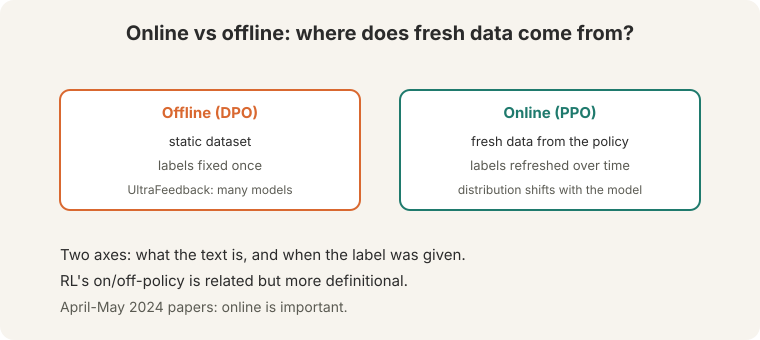
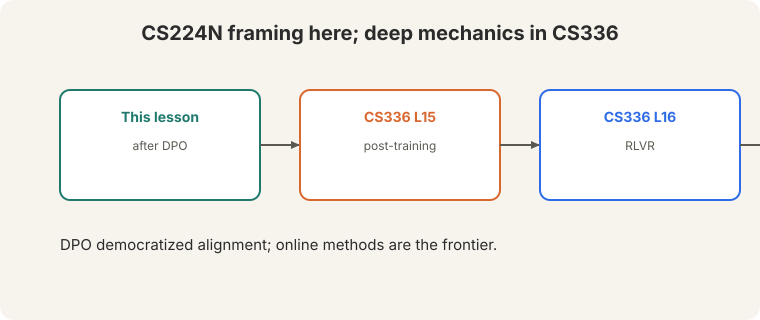

> [!NOTE]
> **Bridge lesson.** This invited talk frames the alignment moment after
> DPO. For deep mechanics, follow the links:
> [CS336 L15](../cs336/l15-post-training.html) (post-training systems),
> [CS336 L16](../cs336/l16-rlvr.html) (RL with verifiable rewards). This
> lesson never re-explains what those cover.

## How to read this lesson

This lesson has two levels. **Level 1 (Core)** sets the scene: the speaker,
the data scale, and the online/offline distinction. **Level 2 (Deep)** covers
self-rewarding models, beyond-pairwise methods, and the open questions.

## Level 1: The moment after DPO

**Nathan Lambert**: PhD at UC Berkeley, then HuggingFace, now AI2
([00:26](ts:00:26)). RL background: robots first, language models after.
His talk: "Life after DPO." DPO was "the story of last year" (2023). The
question: what is the field interested in now?

The premise: more and more of the labs' action moved from pretraining to
**post-training**. Alignment research is now the main event.

## Level 1: Preference data at lab scale

- **Chatbot Arena**: ~800,000 public data points ([02:49](ts:02:49)).
- **Meta's LLaMA 2 paper**: ~1.5M comparisons bought ([02:53](ts:02:53)).
Both "years outdated." OpenAI and Anthropic buy far more.

Researchers cannot match that scale. The talk's challenge: what can research
do without lab resources?

> [!QA]
> Q: Why does preference data scale matter so much?
> A: Post-training is preference learning. More comparisons mean better reward models and better policies. Labs treat preference data as a moat: a great open reward model "would help people catch up in alignment."
> Follow-up: What can researchers do instead?
> A: Methods that need less data: DPO variants, self-rewarding loops, synthetic preferences, and better use of small high-quality sets. The talk's research agenda is efficiency, not scale.

## Level 1: Online versus offline

The central distinction ([47:47](ts:47:47)):

: static dataset, fixed labels. Online (PPO): fresh data from the policy, refreshed labels.")

- **Offline (DPO).** A static dataset. Labels fixed once. UltraFeedback
distills generations from many models (Alpaca, Vicuna, GPT-3.5, GPT-4,
LLaMA) into one policy.
- **Online (PPO).** Fresh data generated from the current policy. Labels
refreshed over time. The distribution shifts as the model improves.

Two axes: **what the text is** and **when the label was given**. RL's
on/off-policy distinction is related but "more definitional" ([47:21](ts:47:21)).
alignment cares about fresh data and fresh labels. April-May 2024 papers
agree: **online is important**.

Note: DPO "still has a reward model" in the math ([13:17](ts:13:17)): the
reference policy plays the reward's role. Skipping the explicit reward model
does not skip the concept.

## Level 2: Self-rewarding models

**Self-Rewarding LMs** (Meta): the DPO model judges its own generations as
an LLM judge, relabels the data, and iterates DPO ([49:55](ts:49:55)).

Strong scores across rounds. Variations: batched DPO with data refreshes,
**discriminator-guided DPO** (reward models plus DPO training). The pattern:
close the loop between generation and judgment.

## Level 2: Beyond pairwise

Pairwise preferences are not the only signal ([61:21](ts:61:21)):

- **KTO** (Stanford): **one-sided** preferences. Customer apps already
collect "was this helpful: yes/no." Different loss, same idea.
- **Starling**: **k-wise** preferences. Five or nine answers per prompt, a
ranking loss. One of the few open models that "broke through."
- **SteerLM** (Nvidia): **fine-grained** labels per completion:
conciseness, helpfulness, honesty.

"All of social choice needs to get condensed into these things"
([62:50](ts:62:50)). Preference learning is voting theory with gradients.

> [!QA]
> Q: When is one-sided feedback better than pairwise?
> A: When pairwise data does not exist. Products collect thumbs up/down, not A/B comparisons. KTO uses the abundant signal instead of demanding the scarce one. Use pairwise where you can afford it. Use one-sided where you must.
> Follow-up: Why fine-grained labels?
> A: One reward conflates qualities: a long answer can be helpful but not concise. Separate labels let you steer each axis independently. The cost is annotation complexity.

## Level 2: Open questions

1. **What do reward models actually learn?** "Mostly distribution matching,"
the speaker guesses ([60:08](ts:60:08)). Grading PPO answers with a reward
model trained on the same prompts is circular.
2. **How do we exceed human performance?** Old CS ideas return: **search**
as exploration in RL, generating new data ([63:41](ts:63:41)). Humans get it
"across the line" where search cannot.
3. **Why are good reward models closed?** Because they are a moat. Opening
one would help everyone catch up.

## Recap: the whole lesson on one screen

Eight ideas carry this lecture. Read each card. Say the core sentence out
loud. If you can, you own the lesson.

<strong>1. DPO was the 2023 story</strong>

Lambert (Berkeley, HF, AI2): post-training is where the action moved.
The question is what comes after DPO.

Key: alignment is the main event

<strong>2. Labs buy preference data at scale</strong>

Arena: 800k public. Meta: 1.5M for LLaMA 2. Both outdated. Researchers
cannot match it. Research must be efficient.

Key: data is a moat

<strong>3. Online versus offline</strong>

Offline: static data, fixed labels. Online: fresh data from the policy,
refreshed labels. Two axes: text and label timing.

Key: [47:47](ts:47:47)

<strong>4. Judge your own generations</strong>

Self-Rewarding LMs: LLM-as-judge relabels, iterate DPO. Close the loop
between generation and judgment.

Key: [49:55](ts:49:55)

<strong>5. Beyond pairwise</strong>

KTO: one-sided yes/no. Starling: k-wise ranking. SteerLM: fine-grained
axes. Social choice with gradients.

Key: [61:21](ts:61:21)

<strong>6. Reward models may just match distributions</strong>

Grading with a model trained on the same prompts is circular. What do
reward models really learn?

Key: [60:08](ts:60:08)

<strong>7. Search plus synthetic data to exceed humans</strong>

Old CS ideas return: search as exploration. Humans get it across the
line where search cannot.

Key: [63:41](ts:63:41)

<strong>8. Depth lives in CS336</strong>

Post-training systems (L15), RLVR (L16). This talk: the framing of the
moment after DPO.

Key: bridge, not duplicate

## Official sources and further reading

**Official:**
- Lecture 15 video and transcript.
- Rafailov et al. (2023): DPO.

**Further reading:**
- [CS336 L15](../cs336/l15-post-training.html): post-training systems in depth.
- [CS336 L16](../cs336/l16-rlvr.html): RL with verifiable rewards.
- Yuan et al. (2024), "Self-Rewarding Language Models": the Meta paper.
- Ethayarajh et al. (2024), KTO: the one-sided method.

**Caveats from these sources.** Data counts (800k, 1.5M) are the talk's 2024 figures. "Online is important" summarizes April-May 2024 papers, not a settled theorem.

## Connections to the other courses

- **This course:** L10 built RLHF and DPO. This talk asks what follows. L11 evaluates the results.
- **CS336:** L15 (post-training), L16 (RLVR) carry the deep mechanics.
- **CS329H:** social choice theory is the formal home of preference aggregation.

> [!CHEAT]
> **Life after DPO cheatsheet.** Speaker: Lambert, Berkeley/HF/AI2, RL background. Moment: post-training is the action. Data: Arena 800k, Meta 1.5M, labs more. Researchers priced out. Online vs offline: fresh data + fresh labels vs static. UltraFeedback: many models distilled. Self-rewarding: judge own data, iterate DPO. Beyond pairwise: KTO one-sided, Starling k-wise, SteerLM fine-grained. Open Qs: distribution matching? search + synthetic to exceed humans? reward models as moat?

> [!MEMORY]
> **Fresh data, fresh labels.** Static datasets go stale as the policy improves. Online methods close the loop. The frontier is efficiency: do more with less preference data.
