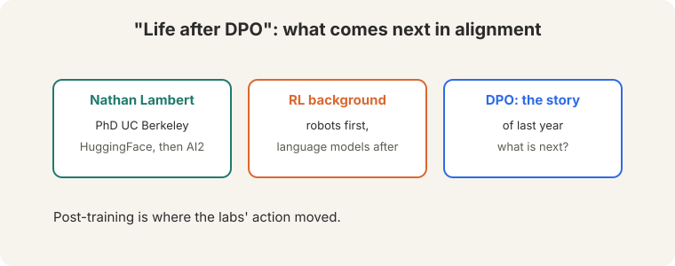
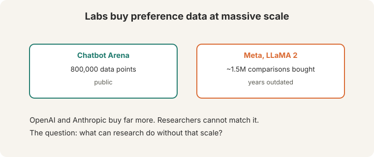
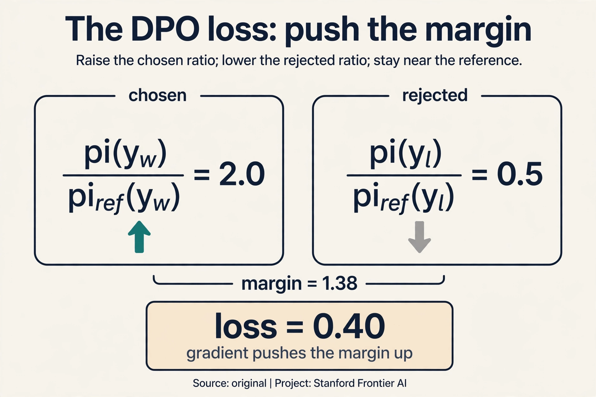
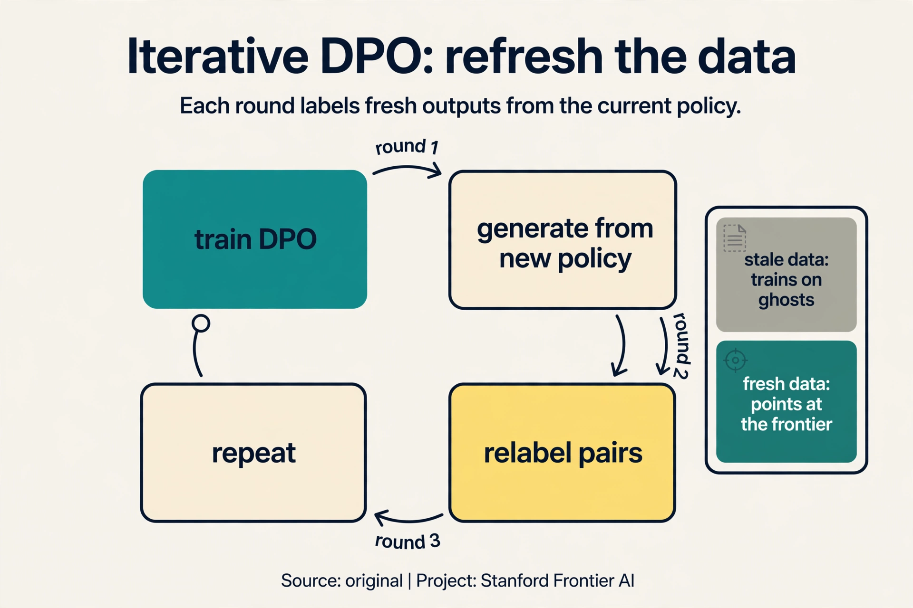
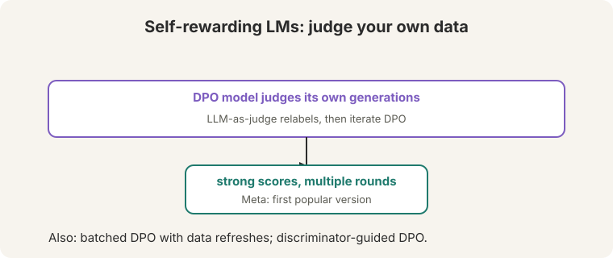
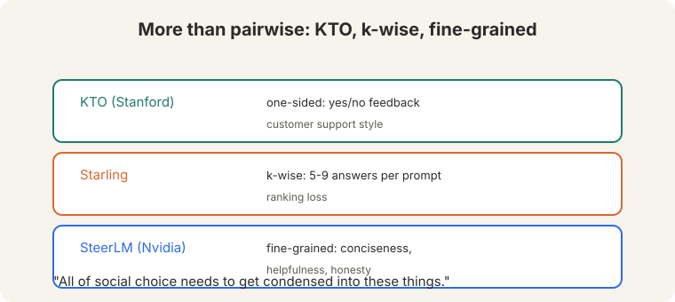
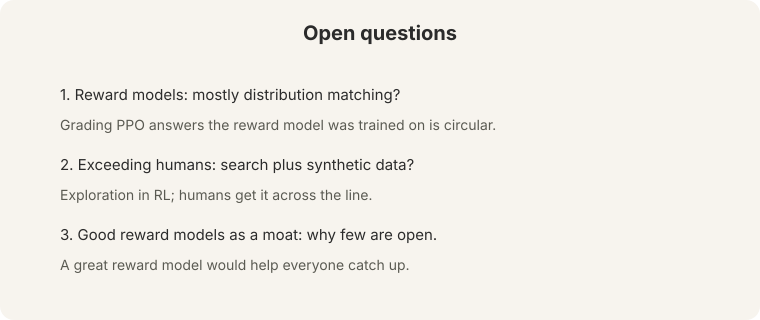

## The moment after DPO

**Nathan Lambert**: PhD at UC Berkeley, then HuggingFace, now AI2
([00:26](ts:00:26)). RL background: robots first, language models after.
His talk: "Life after DPO." DPO was "the story of last year" (2023): the
method that replaced RLHF's pipeline with binary classification on
preference pairs. The question of the talk: what is the field interested
in now?



The premise: more and more of the labs' action moved from pretraining to
**post-training**. The base models are built. The differentiation, and the
alignment research, happens after. Alignment is now the main event.

## Preference data at lab scale

Post-training is preference learning, and preferences are bought:



- **Chatbot Arena**: about 800,000 public data points ([02:49](ts:02:49)).
- **Meta's LLaMA 2 paper**: about 1.5M comparisons bought
  ([02:53](ts:02:53)).

Both "years outdated." OpenAI and Anthropic buy far more. Researchers
cannot match that scale. The talk's challenge: what can research do without
lab resources? The agenda is efficiency, not scale: DPO variants,
self-rewarding loops, synthetic preferences, better use of small
high-quality sets. A great open reward model "would help people catch up
in alignment."

> [!QA]
> Q: Why does preference data scale matter so much?
> A: Post-training is preference learning. More comparisons mean better reward models and better policies. Labs treat preference data as a moat: the comparisons encode what good behavior looks like, and nobody else has them.
> Follow-up: What can researchers do instead?
> A: Methods that need less data: DPO variants, self-rewarding loops, synthetic preferences, and better use of small high-quality sets. The talk's research agenda is efficiency, not scale.

## The key question

If the data keeps shifting under our feet, what stays still — what kind
of feedback remains a reliable teacher no matter how good the model gets?

**On this page:** [The DPO loss, term by term](#subchapter-the-dpo-loss-term-by-term) · [Iterative DPO](#subchapter-iterative-dpo-and-online-variants) · [Reward model evaluation](#subchapter-reward-model-evaluation) · [Alignment in production, Oct 2026](#what-is-used-where-alignment-in-production-october-2026) · [Watch and go deeper](#watch-and-go-deeper)

### Subchapter: the DPO loss, term by term

DPO's loss looks cryptic until each term earns its place. For one
preference pair (prompt x, chosen y_w, rejected y_l):

```ascii
loss = -log sigma( beta x [ log(pi(y_w)/pi_ref(y_w)) - log(pi(y_l)/pi_ref(y_l)) ] )
```

Read it inside out. pi(y_w) is the policy's probability of the chosen
answer; pi_ref(y_w) is the reference model's. The ratio says how much
*more* the policy favors the chosen answer than the reference did. Same
for the rejected answer. The bracket is the margin: preference for chosen
minus preference for rejected, each measured against the reference. Beta
scales it. Sigma turns it into a probability. Negative log is the
classification loss.

Watch it on a toy, beta = 0.5. The policy assigns pi(y_w) = 0.4,
pi_ref(y_w) = 0.2 (ratio 2.0, log 0.69). For the rejected: pi(y_l) = 0.1,
pi_ref(y_l) = 0.2 (ratio 0.5, log -0.69). Margin = 0.69 - (-0.69) = 1.38.
Loss = -log sigma(0.5 x 1.38) = -log sigma(0.69) = -log(0.67) = 0.40. The
gradient pushes the margin up: raise pi(y_w), lower pi(y_l), while the
reference ratios keep the policy from wandering. Classification on pairs,
with the reference as the anchor.



### Subchapter: iterative DPO and online variants

Offline DPO trains once on a static dataset. **Iterative DPO** closes the
loop: train DPO, generate new completions from the updated policy, label
them (human or model judge), train DPO again. Each round's data comes
from a better policy, so the labels describe the present instead of the
past. Watch the staleness it fixes. Round 1: the policy is weak, pairs
rank weak outputs. Round 3: the policy is strong. Training on round-1
pairs teaches it to beat outputs it no longer produces: the gradient
points at ghosts. Fresh pairs each round point at the current frontier.

The cost is the labeling: every round needs fresh judgments. Self-
rewarding (the lecture's Meta method) pays it with the model's own
judgments: cheaper, with the bias-amplification risk. Batched online DPO
splits the difference: refresh the data every K steps instead of every
step. One increment on DPO: the dataset becomes a stream.



### Subchapter: reward model evaluation

A reward model is a measuring instrument. Calibrate it before trusting
it. Three checks:

1. **Best-of-N.** Sample N completions, pick the reward model's top
   choice, have humans judge it. If best-of-16 underperforms the human
   pick, the reward model misranks.
2. **Pairwise accuracy.** On held-out human pairs, how often does the
   reward model agree with the human? Below ~70%, the signal is noise.
3. **Reward hacking probe.** Optimize hard against the reward model and
   inspect the winners. Gibberish at the top means the instrument is
   broken, however good its accuracy looked.

The lecture's open question returns here: if reward models mostly match
distributions, best-of-N just picks the most typical output. Evaluate the
evaluator, or the whole pipeline grades itself against a mirror.

## The central distinction: online versus offline

The talk's central distinction ([47:47](ts:47:47)):

: static dataset, fixed labels. Online (PPO): fresh data from the policy, refreshed labels.")

- **Offline (DPO).** A static dataset. Labels fixed once. UltraFeedback
  distills generations from many models (Alpaca, Vicuna, GPT-3.5, GPT-4,
  LLaMA) into one policy. The data never changes.
- **Online (PPO).** Fresh data generated from the current policy. Labels
  refreshed over time. The distribution shifts as the model improves.

Two axes: **what the text is** and **when the label was given**. RL's
on/off-policy distinction is related but "more definitional"
([47:21](ts:47:21)). Alignment cares about fresh data and fresh labels.
April-May 2024 papers agree: **online is important**.

Why does freshness matter? Watch a static dataset go stale. Round 1: the
model is weak, humans rank its outputs, DPO trains. Round 3: the model is
much stronger. The old labels rank outputs the current model never
produces: the gradient points at ghosts. The labels were correct for a
model that no longer exists. Online methods regenerate the data from the
current policy, so the labels always describe the present.

One subtlety: DPO "still has a reward model" in the math
([13:17](ts:13:17)). The reference policy plays the reward's role in the
derivation. Skipping the explicit reward model does not skip the concept.

## Self-rewarding models: close the loop

**Self-Rewarding LMs** (Meta): the DPO model judges its own generations as
an LLM judge, relabels the data, and iterates DPO ([49:55](ts:49:55)).



Round 1: DPO on human preferences. Round 2: the round-1 model generates new
answers, judges them itself, and DPO trains on the self-labeled pairs.
Round 3: repeat. Strong scores across rounds. Variations: batched DPO with
data refreshes, **discriminator-guided DPO** (reward models plus DPO
training). The pattern: close the loop between generation and judgment, so
the data refreshes even without new human labels.

## Beyond pairwise: new shapes of feedback

Pairwise preferences are not the only signal ([61:21](ts:61:21)):



- **KTO** (Stanford): **one-sided** preferences. Customer apps already
  collect "was this helpful: yes/no." No pairs, just thumbs. Different
  loss, same idea: use the abundant signal instead of demanding the scarce
  one.
- **Starling**: **k-wise** preferences. Five or nine answers per prompt, a
  ranking loss over all of them. One of the few open models that "broke
  through."
- **SteerLM** (Nvidia): **fine-grained** labels per completion:
  conciseness, helpfulness, honesty, each scored separately. One reward
  conflates qualities: a long answer can be helpful but not concise.
  Separate labels steer each axis independently, at the cost of annotation
  complexity.

"All of social choice needs to get condensed into these things"
([62:50](ts:62:50)). Preference learning is voting theory with gradients:
how a population's noisy judgments become one model's behavior.

> [!QA]
> Q: When is one-sided feedback better than pairwise?
> A: When pairwise data does not exist. Products collect thumbs up/down, not A/B comparisons. KTO uses the abundant signal instead of demanding the scarce one. Use pairwise where you can afford it. Use one-sided where you must.
> Follow-up: Why fine-grained labels?
> A: One reward conflates qualities: a long answer can be helpful but not concise. Separate labels let you steer each axis independently. The cost is annotation complexity: every axis needs its own judgments.

## Open questions



1. **What do reward models actually learn?** "Mostly distribution
   matching," the speaker guesses ([60:08](ts:60:08)). Grading PPO answers
   with a reward model trained on the same prompts is circular: the judge
   learned what the policy's outputs look like, not what good looks like.
2. **How do we exceed human performance?** Old CS ideas return: **search**
   as exploration in RL, generating new data ([63:41](ts:63:41)). But
   search alone stalls. Humans get it "across the line" where search
   cannot. The combination is the open problem.
3. **Why are good reward models closed?** Because they are a moat. Opening
   one "would help people catch up in alignment," which is exactly why
   labs do not.

## What is used where: alignment in production, October 2026

| Effort | Method | Public facts |
|---|---|---|
| Llama 2 (Meta) | RLHF | Public paper. 1.5M comparisons |
| DeepSeek-R1 | RL on verifiable rewards | Public paper. Reasoning from RL |
| DeepSeek-V3/V4 | RL + preference methods | Public papers describe the stack |
| Tulu 3 (Allen AI) | SFT + DPO + RLVR | Public. The open alignment recipe |
| Starling | k-wise preferences | Public paper. One of the few open breakthroughs |
| KTO / SteerLM | one-sided / fine-grained | Public papers. The beyond-pairwise frontier |
| GPT-5.x, Gemini 3.x, Claude | [unknown] | Closed. Alignment exists, recipes not published |

The open world runs DPO-family methods on public preference sets
(UltraFeedback and its successors). The closed world runs online methods
at lab scale. The lecture's efficiency agenda is the open world's only
lever.

> [!QA]
> Q: Walk me through self-rewarding on one round.
> A: Start: a DPO model trained on human pairs (round 1). Step 1: generate 4 new answers to a prompt from the round-1 model. Step 2: the same model judges them as an LLM judge, ranking best to worst. Step 3: form new preference pairs from its own rankings. Step 4: train DPO on the self-labeled pairs: round 2. Repeat. The data refreshes without new human labels: the loop is closed between generation and judgment. The risk: the judge and the judged share a brain, so biases amplify instead of washing out.
> Follow-up: How do you detect bias amplification?
> A: Hold out human-labeled pairs and track agreement each round. If the model's self-rankings drift from human rankings while its confidence rises, the loop is amplifying itself. Stop the loop or inject fresh human labels. The mirror test from the reward-model subchapter applies to the judge too.

> [!QA]
> Q: You have 10,000 preference pairs and no labeling budget. Choose the alignment method.
> A: DPO, offline, one round. 10K pairs is enough for DPO to move the policy and not enough to justify PPO's infrastructure. No budget means no online refresh: accept the staleness, it is one round. Spend effort on pair quality (clear prompts, real disagreements, no ties) rather than algorithm cleverness. If the pairs are one-sided thumbs (no chosen/rejected structure), use KTO instead: it is built for exactly that signal.
> Follow-up: When do you revisit the choice?
> A: When you get a labeling budget or the policy plateaus. Plateau on static data is the signal from Lecture 15: the pairs describe a weaker model than the one you have. Then go iterative: generate, relabel, repeat.

> [!QA]
> Q: Online or offline alignment for a customer-support model updated monthly?
> A: Offline DPO per release, with a monthly refresh. The model updates monthly anyway, so batch the alignment to the release: generate from the current policy, label the new pairs, train DPO, ship. That is iterative DPO at release cadence: fresh enough without the cost of continuous online RL. Full online PPO only pays if the model updates continuously and the preference distribution shifts faster than your release cycle.
> Follow-up: What breaks if you skip the refresh?
> A: Staleness compounds. Month 3's policy trains on month 1's pairs: the gradient points at ghosts, and each release improves less. The refresh is the whole game: data freshness beats algorithm choice.

> [!QA]
> Q: KTO or DPO for a product with thumbs up/down feedback?
> A: KTO. DPO needs pairs (chosen vs rejected for the same prompt). Products collect one-sided signals: this answer got a thumbs up, that one a thumbs down, on different prompts. KTO's loss is built for that: it learns from desirable and undesirable examples separately, grounded in prospect theory's asymmetry (losses loom larger than gains). Do not manufacture fake pairs from thumbs: the pairing would be arbitrary and the DPO math assumes real comparisons.
> Follow-up: What does KTO lose versus DPO?
> A: The comparison signal. A pair says "A beats B on this prompt": precise. A thumbs-up says "this was fine": vague. KTO does more with less, but less is less. Where you can afford pairs, DPO's signal is richer.

> [!QA]
> Q: Your reward model hits 85% pairwise accuracy. Ship it?
> A: Not yet. Run the hacking probe: optimize hard against it and inspect the winners. 85% accuracy with gibberish at the top is a broken instrument wearing a good number. Also check best-of-16 against human picks: if the reward model's favorite loses to the human favorite, the accuracy number measured the easy pairs. Accuracy is necessary, not sufficient. The probe is the gate.
> Follow-up: What accuracy is good enough?
> A: There is no threshold, only a tradeoff. Higher accuracy with a hacking probe failure is worse than lower accuracy that is robust. Report both numbers together, always. A reward model is a measuring instrument: calibrate it like one.

## Watch and go deeper

<div style="max-width:640px;margin:1.5rem 0">
<div style="position:relative;padding-bottom:56.25%;height:0;overflow:hidden;border-radius:8px;background:#000">
<iframe src="https://www.youtube-nocookie.com/embed/XZLc09hkMwA" title="Direct Preference Optimization: Your Language Model is Secretly a Reward Model" style="position:absolute;top:0;left:0;width:100%;height:100%;border:0" loading="lazy" allowfullscreen></iframe>
</div>
<p><strong>DPO, paper explained</strong> (AI Coffee Break). From the RLHF objective to the DPO loss, derived.</p>
</div>

### Go deeper

- [Direct Preference Optimization](https://arxiv.org/abs/2305.18290) (Rafailov et al., 2023). The DPO paper.
- [Self-Rewarding Language Models](https://arxiv.org/abs/2401.10020) (Yuan et al., 2024). Close the loop.
- [KTO: Model Alignment as Prospect Theoretic Optimization](https://arxiv.org/abs/2402.01306) (Ethayarajh et al., 2024). One-sided feedback.
- [Stanford CS224N course site](https://web.stanford.edu/class/cs224n/). Slides, assignments, syllabus.

## Mapping back: the post-DPO agenda

| DPO-era limit | After-DPO answer | How |
|---|---|---|
| Static datasets go stale as the policy improves | Online learning | Fresh data from the current policy, refreshed labels. April-May 2024 papers agree |
| Human labels are expensive and finite | Self-rewarding loops | The model judges its own generations and iterates DPO |
| Pairwise data is scarce in products | KTO one-sided feedback | Thumbs up/down with a different loss |
| One reward conflates qualities | SteerLM fine-grained labels | Conciseness, helpfulness, honesty scored separately |
| Researchers cannot buy lab-scale data | Efficiency agenda | DPO variants, synthetic preferences, small high-quality sets |

## The honest price

Online methods cost what offline avoids: continuous generation and
labeling, which is expensive at lab scale. Self-rewarding risks amplifying
the model's own biases: the judge and the judged share a brain. And the
deepest question stands open: if reward models mostly match distributions,
the whole edifice grades outputs against a mirror. The talk ends where
research begins.

## Recap: the whole lesson on one screen

1. **The moment.** Lambert (Berkeley, HF, AI2). DPO was the 2023 story.
   Post-training is where the action moved. Alignment is the main event.
2. **Data is a moat.** Arena: ~800k public. Meta: ~1.5M for LLaMA 2. Both
   outdated. Labs buy far more. Researchers must work efficiently.
3. **Online versus offline.** Offline: static data, fixed labels
   (UltraFeedback). Online: fresh data from the policy, refreshed labels.
   Two axes: text and label timing. Online is important.
4. **Staleness.** Labels from round 1 rank outputs round 3 never produces.
   The gradient points at ghosts. Freshness fixes it.
5. **Self-rewarding.** Judge your own generations, relabel, iterate DPO.
   Close the loop between generation and judgment.
6. **Beyond pairwise.** KTO: one-sided yes/no. Starling: k-wise ranking.
   SteerLM: fine-grained axes. Social choice with gradients.
7. **Open questions.** Reward models as distribution matching (circular
   grading)? Search plus synthetic data to exceed humans? Good reward
   models as moat?
8. **The price.** Online costs continuous labeling. Self-judgment risks
   bias amplification. The mirror problem stands open.

## Official sources and further reading

**Official:**
- Lecture 15 video and transcript.
- Rafailov et al. (2023), DPO.
- Yuan et al. (2024), "Self-Rewarding Language Models": the Meta paper.

**Further reading:**
- Ethayarajh et al. (2024), KTO: the one-sided method.
- Wang et al. (2024), SteerLM: fine-grained steering.

**Caveats from these sources.** Data counts (800k, 1.5M) are the talk's
2024 figures. "Online is important" summarizes April-May 2024 papers, not
a settled theorem. The staleness illustration above is an original
teaching toy.

## Connections to the other courses

- **This course:** L10 built RLHF and DPO. This talk asks what follows.
  L11 evaluates the results.
- **CS329H:** social choice theory is the formal home of preference
  aggregation.
