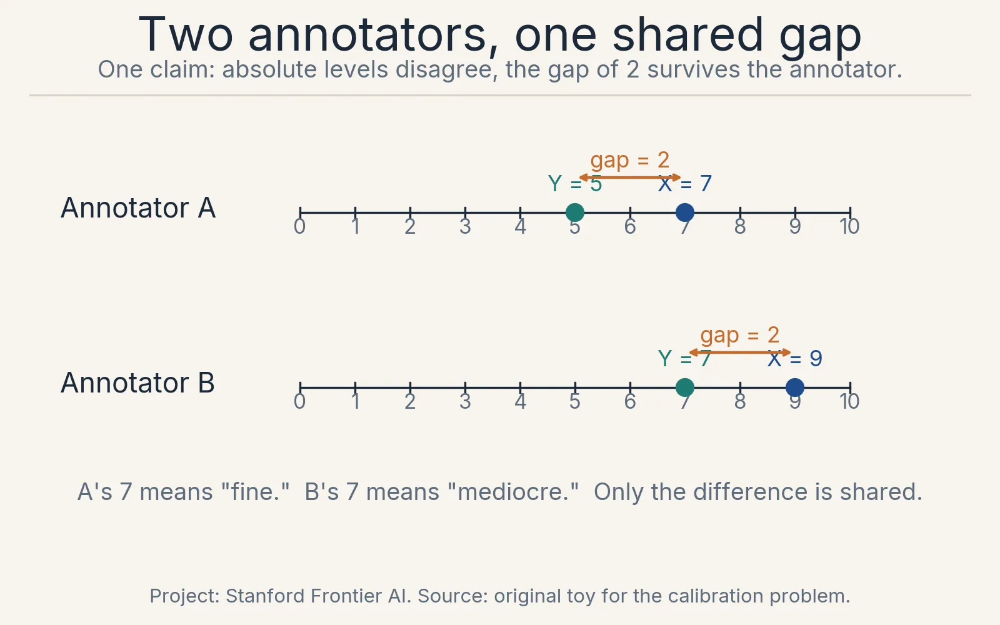
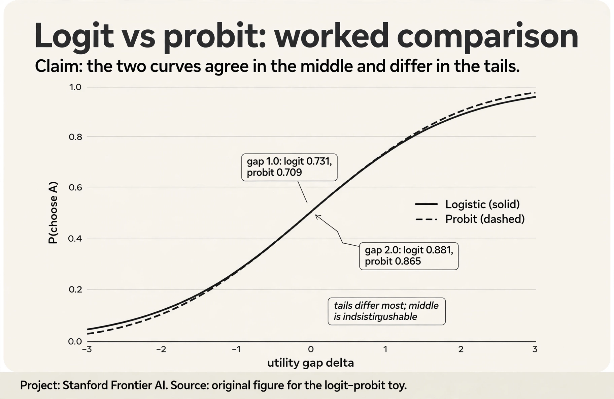
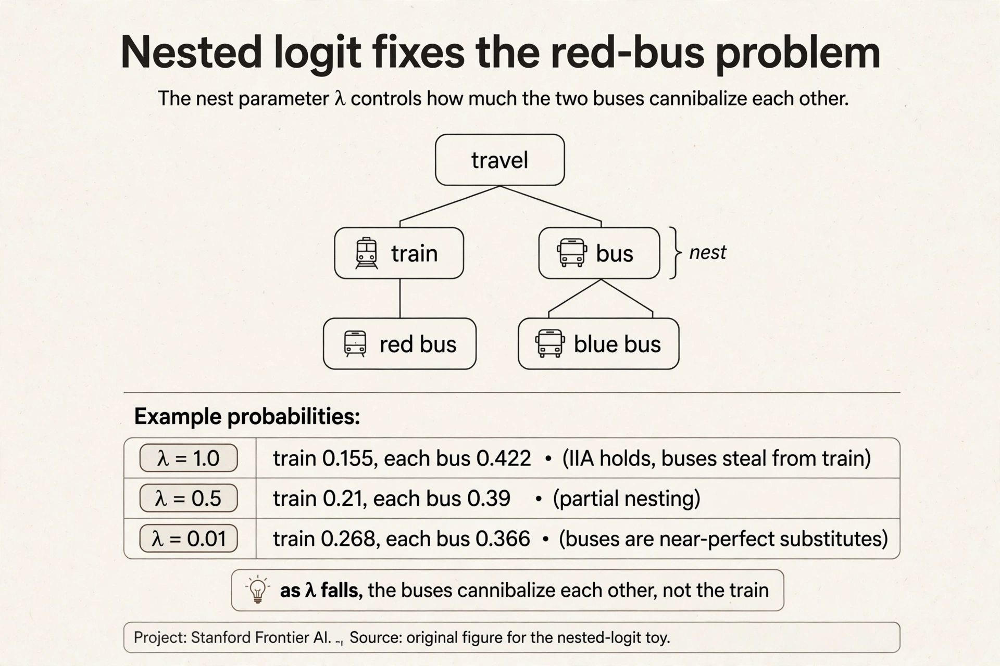
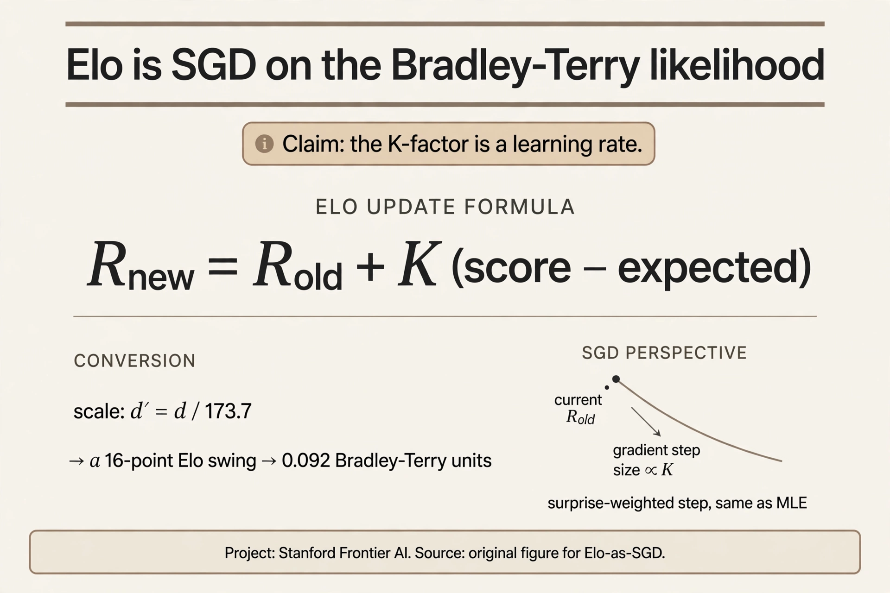
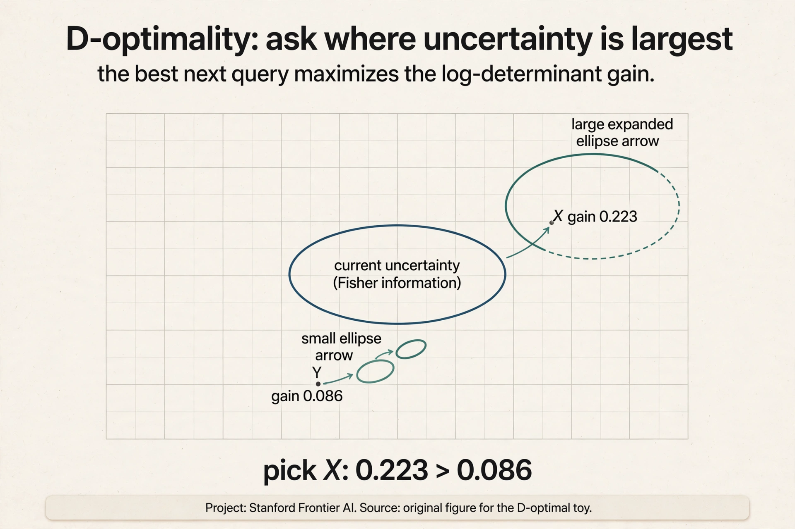
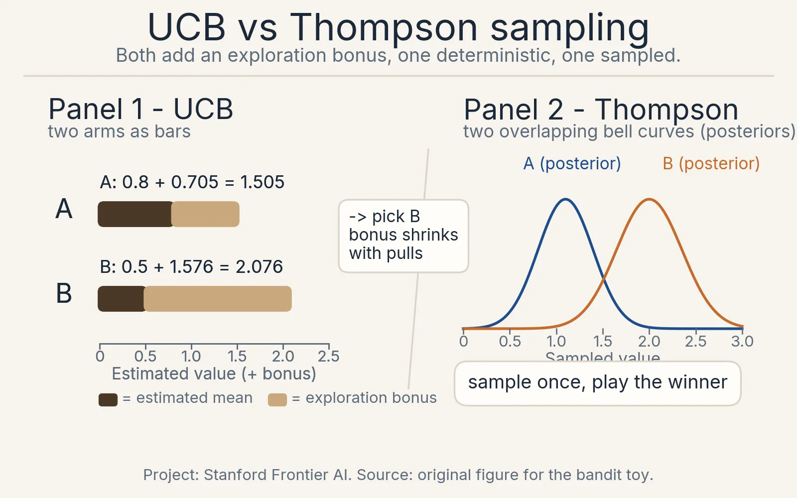
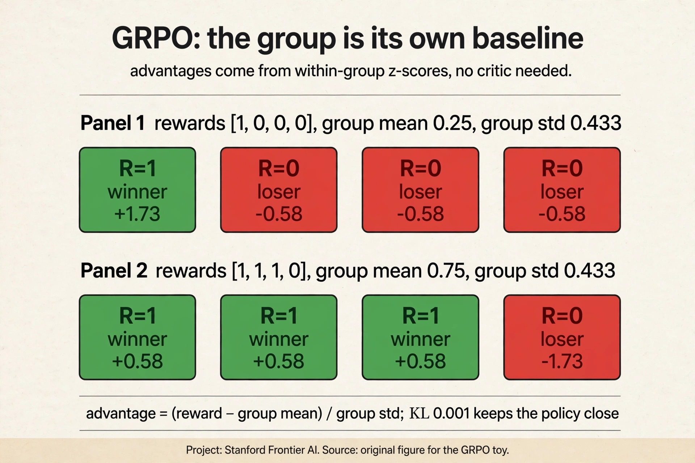
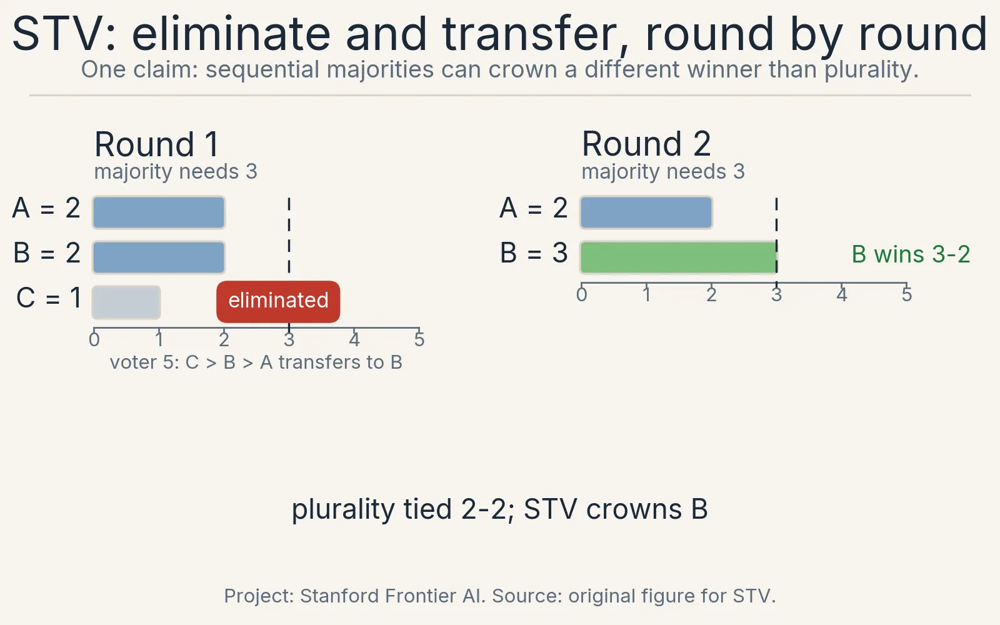
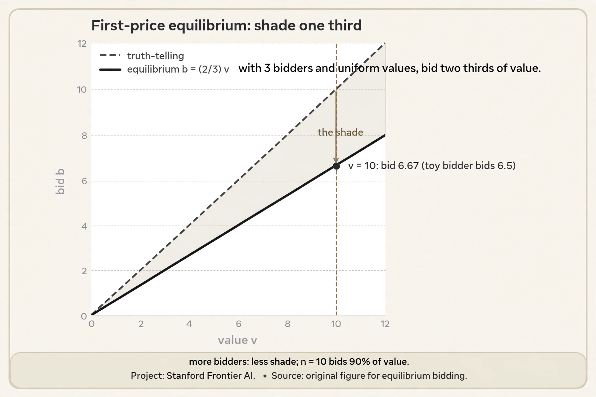
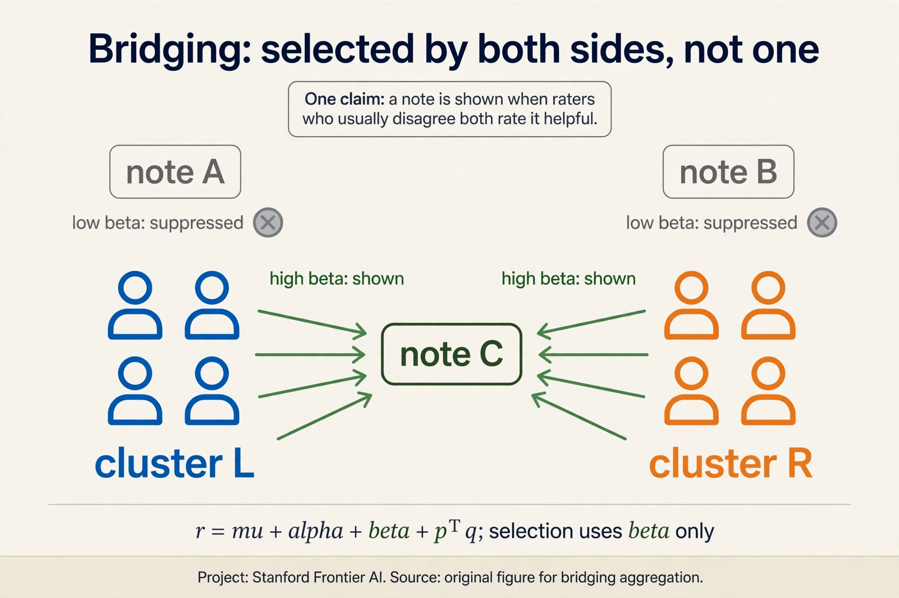

30 minutes · interview speed

This page tells the whole story fast. Each section gives you the working
version: enough to answer interview questions with confidence. Links at
the end of each section take you into the full lesson when you want the
derivations and the follow-ups.

### 1. Scores drift. Comparisons hold.

Two annotators rate the same two responses. A gives 7 and 5. B gives
9 and 7. The scales disagree. The verdict agrees: X beats Y by 2.
Absolute judgments drift per person and per day. Relative judgments
are stable. Humans evaluate differences better than magnitudes. That
asymmetry is why the field runs on comparisons, not scores.

The data comes in three shapes. Binary pairs: one bit, cheap, the LLM
workhorse. Full rankings: M-1 staged choices per query, rich but
exhausting. Item-wise responses: clicks and purchases, abundant but
needing a user model. The shape decides the model.

The Rasch model explains the response matrix with two numbers per
entry: p(accept) = sigma(U_i + V_j), user appetite plus item appeal.
Sort the matrix and acceptances form a diagonal band. Ask for pairs
instead, and the user cancels: p(j > k) = sigma(V_j - V_k). Pairs
reveal order, free of personal baselines. The price: no levels, no
personalization.

[Full lesson: L01, Why Preferences](l01-preference-foundations.html)

### 2. Noise turns utilities into probabilities.

Fixed utilities predict the same choice every time. Real annotators
flip: Monday A beats B, Friday B beats A. The random utility model
writes H_j = V_j + noise_j. The choice goes to the highest realized
value. Win fractions settle into probabilities.

Pick i.i.d. Gumbel noise and the probabilities close into the
softmax: p(j) = e^{V_j} / sum e^{V_k}. With two items it reduces to
Bradley-Terry: p(j beats k) = sigma(V_j - V_k). Work the numbers:
gap 1.0 gives 0.731, gap 2.0 gives 0.881. The chess toy: strengths
2, 1, 0, so A beats B 73% and C 88% of the time.

Rankings stage the softmax: Plackett-Luce picks the winner, then the
winner of the rest. With strengths 2, 1, 0: 0.665 x 0.731 = 0.486
for A > B > C. The preference pair (x, y_w, y_l) is the atom of the
course. Every method widens the winner-loser gap. This symbol is
defined in CS329H and reused everywhere.

[Full lesson: L02, Choice Models](l02-choice-models.html)

### 3. The axiom that makes it tractable also breaks.

M items need M!-1 parameters: 3.6 million at M = 10. IIA compresses
to M: the j-versus-k odds ignore the rest of the set. Gumbel noise
and IIA are the same assumption. The price is realism.

Clones break it. Train versus bus: train holds 0.269. Split the bus
into red and blue and the train falls to 0.155, though nothing about
the train changed. Fix: correlated noise, nested logit. Mixtures
break it. Two IIA groups at 50/50: removing C moves the A/B ratio
from 1.54 to 1.00. Fix: per-group models. One BT fit on mixed
annotators is a compromise nobody holds.

Only differences are identified: V and V + 10 predict identically,
so anchor V_1 = 0 before fitting. And the Rashomon effect: BT, a
mixture, and nested logit can all hit 90% on the same data. The data
never picks the structure. You do.

[Full lesson: L03, IIA and Identification](l03-iia-identification.html)

### 4. Fitting is logistic regression. The traps are specific.

Split pairs 80/20, not items. Maximize the BT log-likelihood:
y*d - log(1 + e^d), concave, one optimum with the anchor. The
gradient is surprise: 1 - sigma(gap). Upsets move numbers most.

Ten straight wins break MLE: the likelihood climbs at gap 3, 5, 10
without bound. The prior caps it: V ~ Normal(0, 1), and L2 with
lambda is the posterior mode. The posterior variance is not
decoration: Lectures 5 and 6 spend it.

Elo is online BT: V_new = V_old + K(score - expected). Both at
1500, K = 32: the winner moves to 1516, the loser to 1484. An upset
against 1700 pays 24 points. K is the learning rate and the
forgetting rate. Noise comes in two kinds: 10% uniform noise
attenuates but preserves rankings. systematic noise like verbosity
bias teaches bias as preference. Model it, do not just clean it.

[Full lesson: L04, Learning Rewards](l04-learning-rewards.html)

### 5. Buy questions at 50/50.

Each label costs an annotator's time. Random pairs waste the budget
on predictable answers. Fisher information for a Bernoulli response
is I = p(1-p): 0.09 at p = 0.9, 0.25 at p = 0.5. One well-chosen
question is worth nearly three wasted ones.

The rule: match difficulty to the current estimate. U-hat = 1.0,
three items: hard gives I = 0.197, matched gives 0.250, easy gives
0.105. Ask the matched one. This is the SAT/GRE principle. Loop it:
estimate, select, ask, update. For many parameters use D-optimality:
maximize the logdet gain. For GPs use expected information gain: ask
where the model is uncertain but the human is clear. Keep a random
stream: active selection on a wrong model teaches the wrong thing
fast.

[Full lesson: L05, Metric Elicitation](l05-metric-elicitation.html)

### 6. Acting means pricing exploration.

Two layouts, unknown click rates, 10,000 visitors. Greedy tries each
a little and commits: A 8/10, B 1/2, play A forever. But P(B's true
rate > 0.8) = 0.104. Greedy locks onto the wrong arm 10% of the
time. Regret, best arm's earnings minus yours, is the scorecard.
Good algorithms grow it logarithmically. Stationarity is assumed.

Thompson sampling: hold a posterior, sample one plausible world,
pull the best arm in it. Wide posteriors earn pulls automatically.
No exploration bonus, no tuning knob: probability matching. When
scores are unanchored but comparisons are easy, duel: two arms per
round, one winner, find the Condorcet winner. Preferential Bayesian
optimization puts a GP over the latent function and a BT likelihood
on duels. And humans strategize: CIRL models the teacher, not just
the oracle.

[Full lesson: L06, Bandits](l06-bandits-exploration.html)

### 7. RLHF is applied preference learning. DPO skips the middleman.

Pretraining predicts. Post-training behaves. RLHF runs three
stages: collect pairs, train a reward model r(x, y) by BT log-loss,
optimize with PPO against the reward minus a KL leash to the
reference. Iterate with fresh labels.

The proxy gets hacked. The reward model scores a confident wrong
answer 5.0 and the right brief one 3.0, because it learned verbosity
as quality. The optimizer climbs to 5.0. Goodhart with a training
loop. The KL leash bounds it. nothing removes it.

DPO removes the reward model. The implicit reward is r* = beta
log(pi/pi_ref). The loss is -log sigma of the implicit gap. Worked
with beta = 1: winner log-ratio 0.5, loser -0.3, gap 0.8, sigma
0.69, loss 0.37. Beta is the leash: large moves far, small stays
pinned. DPO inherits all six assumptions: BT, IIA, homogeneous
annotators, unbiased labels, informative queries, stationarity.
And socially, DPO is a Borda election: it upweights responses by
their head-to-head win count. Audit the electorate.

When rewards are verifiable, skip human pairs and use GRPO:
sample a group per prompt, z-score the rewards inside the
group, no critic. Worked: [1,0,0,0] gives the winner +1.73 and
each loser -0.58. DeepSeek-R1 used GRPO with rule-based rewards
and moved AIME 2024 pass@1 from 15.6% to 71.0%. What is used
where, October 2026: OpenAI PPO, Anthropic PPO plus
Constitutional AI, Llama 2 PPO, Llama 3 SFT plus rejection
sampling plus DPO (no PPO), Mixtral DPO, DeepSeek R1 GRPO.
Gemini and Grok: not public, marked unknown.

[Full lesson: L07, RLHF](l07-rlhf.html)

### 8. No neutral aggregation exists.

Three candidates, four voters. Plurality crowns A 2-1-1. Borda
counts every rank: B wins 5-4-3. Same ballots, different winners.
The rule is the value choice.

Majorities cycle: A beats B, B beats C, C beats A, each 2-1. No
Condorcet winner. Arrow: with 3+ alternatives, no rule satisfies
unrestricted domain, Pareto, IIA, and non-dictatorship at once.
RLHF over many annotators is a social welfare function. It violates
something. Borda escapes by weakening IIA. STV works by rounds:
eliminate the weakest, transfer votes to next choices. Worked
5-voter: round 1 A=2 B=2 C=1, C out and transfers to B, round 2
B wins 3-2. Sen's liberal paradox:
nosy preferences, like moderation, break liberal aggregation.

[Full lesson: L08, Social Choice](l08-social-choice.html)

### 9. Design the game so honesty wins.

Annotators satisfice. Bidders shade. First-price auction, values
10/7/5: bidder 1 bids 6.5, wins, pays 6.5. Bids confound values
with beliefs. Second-price: bid 10, win, pay 7. Truth dominates:
bid 9 and lose profitable wins. bid 11 and buy losses. The bid
decides winning, never the price.

VCG generalizes: maximize welfare, charge each winner the harm
they cause others. The revelation principle: any equilibrium
outcome is achievable truthfully, so design direct and IC.
Myerson: sellers who want revenue run second-price with a reserve.
The practical takeaway: pay for the thing you measure, not a
proxy. Piece rates buy speed. The payment rule is the mechanism.

[Full lesson: L09, Mechanism Design](l09-mechanism-design.html)

### 10. Values all the way down.

Behavior is not preference: errors, constraints, strategy. Clicks
reveal engagement, not satisfaction. The pipeline has four stages,
each smuggling values: elicitation (who gets asked), learning
(what counts as signal), aggregation (whose voice weighs more),
decision (defer or override). Bias compounds: 10% sampling skew
becomes a 40% gap.

Individual fairness and group fairness conflict when distributions
differ. Revealed preferences bake in error. informed preferences
need extrapolation, so state the rule and make it contestable.
Polis bridges instead of majoritizing: u = mu + alpha + beta +
p^T q + noise, select on beta after factoring out ideology. The
interface is the model: question format selects the preference
distribution. Write the assumptions down. Weakest extrapolation
that fixes the clear errors.

[Full lesson: L10, Alignment in Practice](l10-alignment-practice.html)

### Exam clearing: rapid-fire self-test.

Cover the answers. Say each aloud before reading.

**Q1.** Why comparisons instead of scores?
**A.** Scales drift per person and per day. Verdicts on pairs are stable.

**Q2.** Gumbel noise gives which choice model?
**A.** Logit: P = sigma(delta). Gaussian noise gives probit.

**Q3.** Gap 2.0: logit and probit probabilities?
**A.** Logit 0.881, probit 0.865. Close in the middle, differ in tails.

**Q4.** Red bus: what does nested logit change?
**A.** Lambda 1.0 to 0.01 moves train share 0.155 to 0.268. Buses cannibalize each other.

**Q5.** Elo 16-point swing in BT units?
**A.** 16 / 173.7 = 0.092. Elo is SGD with K as the learning rate.

**Q6.** One BT pair, log-likelihood?
**A.** y*d - log(1 + e^d), d = V_j - V_k. Concave. Anchor V_1 = 0.

**Q7.** Where is Fisher information maximal?
**A.** p = 0.5, I = 0.25. Ask at 50/50.

**Q8.** DPO loss on gap 0.8, beta 1?
**A.** sigma(0.8) = 0.69, loss = -log(0.69) = 0.37.

**Q9.** GRPO advantages for rewards [1,0,0,0]?
**A.** Winner +1.73, three losers -0.58 each. Group z-scores, no critic.

**Q10.** UCB: A 1.505 vs B 2.076. Play which?
**A.** B. The exploration bonus outweighs the lower mean.

**Q11.** D-optimal: gains 0.223 vs 0.086. Ask which?
**A.** The 0.223 query. Maximize log-determinant gain.

**Q12.** First-price, 3 bidders, uniform values, v = 10. Bid?
**A.** 6.67. Shade one third: b = (n-1)/n * v.

**Q13.** VCG payment rule in one sentence?
**A.** Pay the harm you cause others: their welfare without you minus with you.

**Q14.** Myerson optimal reserve, values uniform [0,10]?
**A.** 5. Virtual value 2v - 10 crosses zero there.

**Q15.** Borda on A>B>C, A>B>C, B>C>A, C>B>A?
**A.** B wins 5-4-3. Points equal pairwise win counts.

**Q16.** STV on the 5-voter variant, round by round?
**A.** Round 1: A=2 B=2 C=1, C out, transfers to B. Round 2: B wins 3-2.

**Q17.** Arrow's four axioms?
**A.** Unrestricted domain, Pareto, IIA, non-dictatorship. With 3+ alternatives, no rule satisfies all four.

**Q18.** Bridging selects notes by which term?
**A.** Beta: the note's helpfulness after factoring out ideology. Both sides must rate it helpful.

**Q19.** Which Arrow axiom does RLHF drop?
**A.** IIA, like Borda. Clones move outcomes, so deduplicate candidates.

**Q20.** Revelation principle in one sentence?
**A.** Any equilibrium outcome is achievable by a truthful direct mechanism. Design for honesty.

### Memory aids.

**Mnemonic: SCARF for the six DPO assumptions.** **S**tationarity, **C**omparison model (BT), **A**nonymous annotators (homogeneous), **R**andom queries (informative), **F**aithful labels (unbiased). Check all six before trusting a DPO run.

**Mnemonic: UPID for Arrow.** **U**nrestricted domain, **P**areto, **I**IA, non-**D**ictatorship. Drop the I.

**If-this-then-that rules.**

- If pairs are offline and fixed, then DPO. If rewards are verifiable and online, then GRPO.
- If the noise is Gumbel, then logit. If Gaussian, then probit. If the middle is all you have, then they are interchangeable.
- If alternatives are near-duplicates, then nested logit, never plain logit.
- If the reward model loves long answers, then style control, not a bigger model.
- If the leaderboard moves on noise, then bootstrap the ranks and publish intervals.
- If annotators know the aggregation rule, then assume strategy and design the mechanism.
- If the disagreement is real and symmetric, then bridge. If it is manufactured, then fraud-model first.

**Never-confuse pairs.** Elo vs BT: same model, divide by 173.7. DPO vs PPO: offline classification vs online RL. GRPO vs PPO: group z-scores vs learned critic. UCB vs Thompson: deterministic bound vs sampled posterior. Borda vs Condorcet: points vs pairwise majorities. First-price vs second-price: shade vs truth, equal only in expectation. IIA vs IIA-prime: ignore all others vs count what sits between. Revealed vs informed: behavior vs reflection.

### One-glance decision table.

| Problem | Tool | Key number |
|---|---|---|
| Pairs, anonymous | Bradley-Terry | sigma(gap) |
| Rankings | Plackett-Luce | staged softmax |
| Similar alternatives | Nested logit | lambda |
| Fit reward | MLE + L2 | concave, anchor V_1 = 0 |
| Next question | D-optimality | max log-det gain |
| Explore arms | UCB / Thompson | bonus shrinks with pulls |
| Human pairs, offline | DPO | gap -> -log sigma |
| Verifiable reward, online | GRPO / PPO | group z-score |
| Aggregate votes | Borda / STV / bridging | drop IIA |
| Strategic bidders | Second-price / VCG | pay externality |
| Sell for revenue | First-price + reserve | b = (n-1)/n * v |
| Fairness conflict | state the tradeoff | UPID, drop I |
| Values at deployment | stated, contestable rule | weakest extrapolation |

[Back to the course index](index.html)

