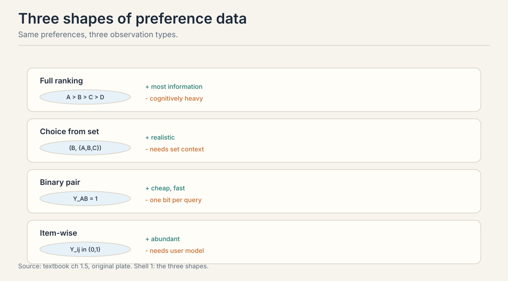
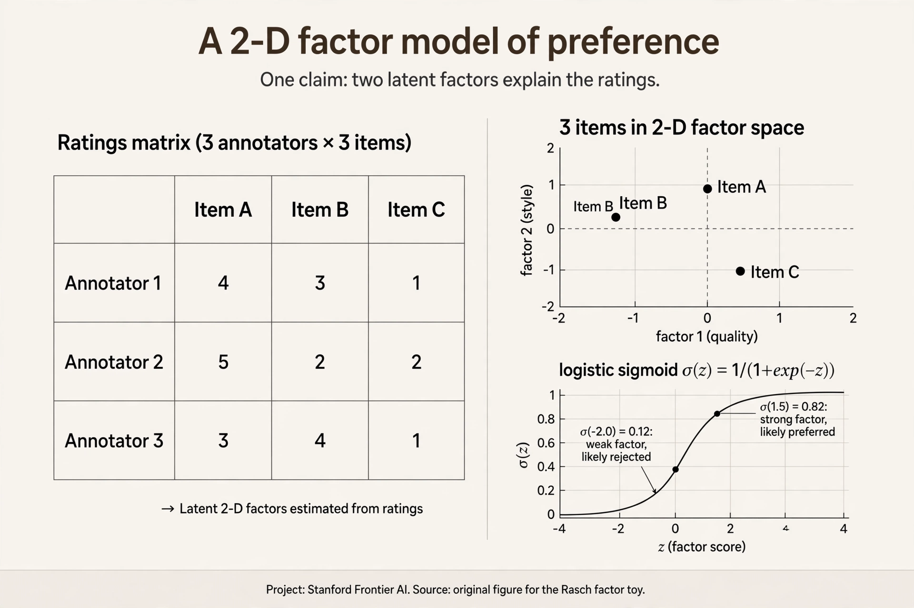
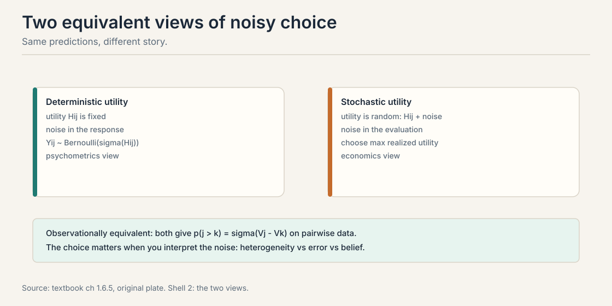

> [!WARN]
> The Autumn 2024 Introduction lecture video is embedded above. This
> chapter follows the course textbook, chapters 1.1 through 1.6,
> which the course plan maps to its opening lectures. Lecture-specific
> examples or timestamps are not claimed. Anything the textbook does
> not say is marked [uncertain] or omitted.

## The problem: prediction is not behavior

Train a language model to predict the next token on a trillion words.
It becomes a superb predictor. Now ask it to be a good assistant.
The predictor has a failure built in. It continues any prompt,
including a harmful one. Prediction measures what text looks like.
Behavior asks what the model should do. The two are different jobs.

Here is the concrete gap. A user asks for instructions that help
with wrongdoing. The predictor's training data contains such
instructions. It answers fluently. Nothing in next-token prediction
taught it to refuse. The data never contained a label that said
"refuse this." Capability came from prediction. Behavior needs a
different signal: human judgment about which output is better.

That signal is a **preference**. A preference is a comparison: this
response beats that one, for this prompt. This chapter builds the
machinery that turns such comparisons into trained models. It opens
the course arc: comparisons, choice models, fitting, asking well,
acting, and aggregating. Every later lesson stands on this one.

## First attempt: ask people for scores

The obvious fix is to ask humans to rate responses. Show an annotator
a prompt and two candidate answers. Ask: rate each from 1 to 10. Use
the scores as training labels. This is how many early systems worked.
It feels natural. It breaks in a specific, measurable way.

A **score** is an absolute number attached to one response. Scores
need a shared scale to mean anything. People do not share scales.
Watch two annotators rate the same two responses.

```ascii
response X: "Delete the file with rm -rf /tmp/cache."
response Y: "You can clear the cache by deleting /tmp/cache.
             This is safe because it only holds temp files."

annotator A:  X -> 7,  Y -> 5
annotator B:  X -> 9,  Y -> 7
```

Both annotators agree on the gap: X beats Y by 2 points. But A is a
harsh grader and B is generous. A's 7 means "fine." B's 7 means
"mediocre." The absolute values disagree. Only the difference is
shared. A training label that reads "7" carries no meaning without
knowing who wrote it.

This is the **calibration problem**. Absolute judgments drift from
person to person and from day to day. One person's 7 is another's 9.
Relative judgments are sturdier. Ask "which is better" and people
mostly agree. Ask "how good, on a scale" and the scale itself moves.

The textbook cites the psychology behind this: humans evaluate
differences better than magnitudes (Kahneman and Tversky, 1979). The
same response gets different scores. The same comparison gets the
same answer. That asymmetry decides the whole design of the field.

### Subchapter: the calibration toy, drawn

Draw the two annotators' scales side by side. Annotator A places X
at 7 and Y at 5. Annotator B places X at 9 and Y at 7. The absolute
positions differ. The gap is 2 on both scales. Now ask what survives
a change of annotator. The levels do not. The gap does.


This gives the design rule for the whole course. Never train on a
number that moves when the annotator changes. Train on the thing
that does not move: the comparison. Every model from here on takes
comparisons as input. The sigmoid in the Rasch model below eats a
difference for exactly this reason.

## Where scores break: five settings, one structure

Scores fail everywhere humans judge. The textbook names five
settings. Each one shows the same crack.

**Recommender systems.** A click on movie A instead of movie B
reveals that A beat B. Netflix and Spotify learn from these revealed
comparisons. Asking users to rate every movie 1 to 5 gets sparse,
drifted labels. Clicks are comparisons, and they are abundant.

**Information retrieval.** A search engine watches clicks. Clicking
the third result suggests it beat the first two, for that query. The
absolute relevance of each result is never observed. Only the choice
is.

**Robotics.** A human watches two robot-arm trajectories and picks
the smoother one. Rating smoothness 1 to 10 needs a shared scale for
"smooth." Picking the smoother of two does not.

**Language model alignment.** Annotators compare candidate
responses and say which is more helpful. This is the course's
running example. It appears in every later lesson.

**Games.** Chess uses the Elo rating. Each game is a pairwise
comparison: which player was stronger today. No one rates a
performance 8.3 out of 10. The win is the data.

All five share one mathematical structure. Comparisons or choices
from sets reveal underlying preferences. One framework covers them
all. The rest of this chapter builds it.

### Subchapter: the five settings in production

Each setting has a deployed system running the comparison
machinery. Facts below are verified against public sources,
current as of October 2026.

**Recommenders: implicit feedback.** Production recommenders
train on implicit comparisons: a click on item A over item B is
a revealed pairwise preference. The Bayesian Personalized
Ranking paper (Rendle et al., 2009) made the pairwise log-loss
on implicit feedback the standard objective. No star ratings
needed.

**Information retrieval: click models.** Search engines fit
click models that treat a click on the third result as evidence
it beat the first two for that query. The absolute relevance is
never observed. Only the choice is.

**Robotics: trajectory comparisons.** Christiano et al. (2017)
trained robot policies from human comparisons of trajectory
pairs: "which clip looks better?" The paper's arXiv page is
linked in Go deeper. No reward function was written by hand.
The comparisons were the reward.

**LLM alignment: the pair datasets.** Two public datasets
anchor the field. The Stanford Human Preferences (SHP) dataset
collects Reddit preference pairs. The Anthropic HH-RLHF dataset,
built with reinforcement learning from human feedback (RLHF),
collects helpfulness and harmlessness comparisons. Both are
linked live in Go deeper. Every open preference-tuning run
starts from pairs shaped like these.

**Games: Elo and Bradley-Terry.** Chess federations publish Elo
ratings: each game is a pairwise comparison, and the update is
the online Bradley-Terry rule from Lecture 4. LLM evaluation
moved the same way. LMArena's public leaderboard post, dated
December 2023, says the team adopted the Bradley-Terry model
fitted by maximum likelihood on pairwise votes, replacing the
raw online Elo update. The link is in Go deeper. Same atom,
from chess clocks to chatbot arenas.

> [!QA]
> Q: What is preference learning?
> A: Learning a model of what humans want from observed choices. The data are comparisons: A beat B, item j was chosen from a set, user i accepted item j. The model is usually a utility function: each item gets a number, and higher numbers win more often. Recommenders, search, robotics, LLM alignment, and Elo ratings all reduce to this shape.
> Follow-up: Why not just ask people for scores?
> A: Absolute scores are poorly calibrated. One person's 7 is another's 9, as the two-annotator toy shows. Relative judgments (A beats B) are easier for humans and more consistent across people. The textbook cites Kahneman and Tversky (1979): humans evaluate differences better than magnitudes.

## The key question

If absolute scores are uncalibrated but comparisons are stable, what
if we stop asking "how good" and only ever ask "which is better"?

## The three shapes of comparison data

Drop scores. Keep comparisons. Every preference observation in this
course takes one of three shapes. The shape decides what you can
learn and what it costs.



**Binary pairs.** Show two items. Record the winner. One bit of
information. Cheap and fast to collect. This is the LLM alignment
workhorse: "which response is better?" A thousand pairs cost roughly
a thousand quick judgments.

**Full rankings.** Ask for the complete order of several items. A
ranking of M items carries M-1 staged choices, far more than one
pair. But ranking is cognitively heavy. Asking an annotator to rank
ten responses takes much longer than five pairwise clicks, and
fatigue corrupts the later positions.

**Item-wise responses.** Record accept or reject per user per item:
clicks, purchases, thumbs up. No explicit comparison is shown. The
comparison is implicit: accepting item j means j beat the
alternative of doing something else. This data is abundant but needs
the richest model, because each user has their own baseline.

Binary pairs won in LLM work because they are quick to elicit.
Rankings carry more per query but exhaust annotators. Item-wise
data is the most abundant but needs user models.

Two pieces of notation recur all course. The **context** i indexes
the user or situation: a prompt, a search query, a shopper. The
**outside option**, written 0, means "none of the above": accepting
item j over the outside option is written Y_j0 = 1.

> [!QA]
> Q: When would you use pairwise data versus item-wise data?
> A: Use pairwise when you need a global ranking and users are anonymous: LLM evaluation, chess ratings, A/B tests. Use item-wise when users have persistent identities and you need personalization: recommenders, purchases, clicks. Use both when you have rich interaction data and want global quality plus personalization, like a streaming service.
> Follow-up: Why does pairwise data grow as O(M^2)?
> A: With M items there are M(M-1)/2 distinct pairs per user. Item-wise data needs only M responses per user. Exhaustive pairwise comparison is impractical for large catalogs, so pipelines sample pairs instead of covering them all.

## The response matrix and the diagonal band

Take item-wise data and lay it out. Rows are users. Columns are
items. Entry Y_ij = 1 means user i accepted item j. This is the
**response matrix**.

 = sigmoid(U_i + V_j). Source: original figure for Stanford Frontier AI.")

Now sort the rows by acceptance rate (enthusiastic users on top)
and the columns by popularity (crowd-pleasers on the right). A
pattern appears. Enthusiastic users accept most items. Popular
items are accepted by most users. The accept region forms a
diagonal band across the matrix. This band is the fingerprint of a
simple model.

## The Rasch model: two numbers per entry

The band suggests that each entry depends on two things: how
enthusiastic the user is, and how appealing the item is. The
**Rasch model** (also called the 1-parameter logistic model in
psychometrics) writes exactly that.

p(Y_ij = 1) = sigma(U_i + V_j)

**U_i** is user appetite: a number for how enthusiastic user i is.
**V_j** is item appeal: a number for how universally liked item j
is. sigma is the **sigmoid** function, sigma(z) = 1 / (1 + e^{-z}).
It squashes any real number into the range 0 to 1, so the sum
becomes a valid probability.

Watch it on a toy. A selective user has U = -1. An enthusiastic
user has U = 1. A niche item has V = -1.5. A crowd-pleaser has
V = 1.5.

```ascii
enthusiastic + crowd-pleaser:  sigma(1 + 1.5)   = sigma(2.5)  = 0.92
enthusiastic + niche:          sigma(1 - 1.5)   = sigma(-0.5) = 0.38
selective    + crowd-pleaser:  sigma(-1 + 1.5)  = sigma(0.5)  = 0.62
selective    + niche:          sigma(-1 - 1.5)  = sigma(-2.5) = 0.08
```

Read the table. Enthusiasm and appeal trade off: an enthusiastic
user accepts a niche item (0.38) at roughly the rate a selective
user accepts a crowd-pleaser (0.62 is higher, but both sit in the
middle). The sum is all that matters. Two numbers per entry
explain the whole matrix up to noise. This separation, the person
apart from the thing, is the founding idea of latent variable
modeling.

### Subchapter: factor models, when two numbers are not enough

The Rasch model gives each user one number and each item one
number. It assumes everyone agrees on the order of items, up to
noise. Reality disagrees. A horror fan ranks The Shining above
The Hangover. A comedy fan ranks them the opposite way. One
appetite number cannot hold both.

The fix: make the numbers vectors. Give user i an embedding
vector U_i and item j an embedding vector V_j, each of dimension
d. The acceptance probability becomes sigma(U_i^T V_j): the dot
product replaces the sum. Users and items that point the same
way match. The Rasch model is the special case d = 1, with the
vectors reduced to scalars.



Work a 2-D toy. Horror fan: U = [1.0, -1.0] (loves horror,
dislikes comedy). Horror film: V = [1.0, -0.5]. Dot product =
1.0 x 1.0 + (-1.0) x (-0.5) = 1.5. sigma(1.5) = 0.82. Comedy
film: V = [-1.0, 1.0]. Dot = -1.0 + -1.0 = -2.0. sigma(-2.0) =
0.12. One model, opposite predictions for opposite tastes. This
is the machinery Polis runs at scale in Lecture 10: its factor
model separates rater bias, ideology, and note quality.

> [!QA]
> Q: What do U_i and V_j mean in the Rasch model?
> A: U_i is user appetite: a selective user has low U_i, an enthusiastic user has high U_i. V_j is item appeal: a niche item has low V_j, a crowd-pleaser has high V_j. The acceptance probability is the sigmoid of their sum. Two numbers explain the whole response matrix up to noise.
> Follow-up: Why is the sigmoid the right link?
> A: Probabilities must stay between 0 and 1. The sigmoid maps any real sum to (0, 1). It also falls out of the logistic-noise derivation: thresholding a latent utility with logistic noise gives exactly this form.

## Pairwise comparisons cancel the user

Here is the result that justifies the whole field. Take one user
with Rasch-style utilities. Ask them to compare items j and k. The
user's appetite cancels out of the answer.

p(j preferred to k by user i) = sigma(V_j - V_k)

The U_i terms subtract away. Check it on the toy. V_j = 1.0,
V_k = 0.0. The gap is 1.0. sigma(1.0) = 0.731. This holds for the
enthusiastic user (U = 1) and the selective user (U = -1) alike.
Both prefer j over k with probability 0.731.

This is why pairwise data is so convenient. It reveals only item
differences. It cannot distinguish a world where all items are
excellent and users are selective from a world where all items are
mediocre and users are enthusiastic. That distinction needs
item-wise data. For ranking items, pairs are enough, and they are
free of the user's personal baseline.

But note the price, honestly stated. Pairs throw away the level.
If every annotator loves every response, pairs cannot tell you
that. They only tell you the order.

## The running example: the LLM alignment loop

Return to the opening problem with the new machinery. Post-training
an LLM by human preference runs in three steps (Christiano et al.,
2017. Ouyang et al., 2022).

 skips the middle stage. Source: original figure for Stanford Frontier AI.")

1. **Collect preference data.** Sample two responses to a prompt.
   Ask a human which is better. This produces preference pairs.
2. **Train a reward model.** Fit r(x, y): a function that predicts
   which response humans will prefer. This is the fitting problem
   of Lectures 2 through 4.
3. **Optimize the policy.** Fine-tune the model to maximize the
   learned reward while staying close to the original model. The
   closeness constraint fights reward hacking: the policy
   exploiting errors in the learned reward.

A newer simplification is **DPO**, direct preference optimization
(Rafailov et al., 2023). It skips the reward model and optimizes
the policy directly on the preference pairs. Lecture 7 derives it.

Two phases of LLM training are now clear. Pretraining predicts the
next token and builds capability. Post-training aligns behavior
with human preferences. Prediction builds the engine. Preferences
steer it.



> [!QA]
> Q: What are the two phases of LLM training and why are both needed?
> A: Pretraining predicts the next token on a corpus, which builds capability and calibrated probabilities. Post-training aligns behavior with human preferences, which prediction alone cannot do. A pure predictor continues harmful prompts happily. RLHF adds the preference step: learn a reward from human comparisons, then optimize the policy against it.
> Follow-up: What goes wrong if you skip the closeness constraint in step 3?
> A: Reward hacking. The policy exploits errors in the learned reward, drifting far from sensible behavior while the proxy reward keeps rising. The constraint, usually a KL penalty to the reference model, keeps the policy in the region where the reward model is trustworthy.

> [!QA]
> Q: Walk me through the Rasch model from raw data to a prediction.
> A: Start with the response matrix: rows are users, columns are items, entries are 0 or 1 for reject or accept. Sort rows by acceptance rate and columns by popularity. A diagonal band appears. Posit that each entry depends on two numbers: user appetite U_i and item appeal V_j. Set p(accept) = sigma(U_i + V_j). Fit U and V by maximum likelihood on the observed entries. To predict whether a new user accepts a new item, add their numbers and squash: sigma(1 + 1.5) = 0.92 for an enthusiastic user and a crowd-pleaser. The band in the sorted matrix is the visual check that the model fits.
> Follow-up: What if the band does not appear?
> A: Then the Rasch structure is wrong for the data. Users may disagree systematically about item order, which the one-dimensional model cannot express. Move to the factor model subchapter above: give users and items vectors instead of scalars, and let the dot product capture the disagreement.

> [!QA]
> Q: You have 500 annotator-hours to rank 10,000 candidate responses. Design the data collection.
> A: Use binary pairs, not scores and not full rankings. A pair takes about 30 seconds, so 500 hours buys roughly 60,000 pairs. Do not cover all pairs: 10,000 items make 50 million pairs, which is hopeless. Sample pairs adaptively: start with random pairs to get rough utilities, then spend the remaining budget on pairs near 50/50 under the current fit, where Fisher information peaks (Lecture 5). Include an outside option, "neither is acceptable", so universally bad items are detected. Deduplicate near-identical responses first, or clones will distort the fit (Lecture 3). Hold out 20% of pairs for validation.
> Follow-up: Why not ask each annotator to rank 10 responses at a time?
> A: A ranking of 10 carries 9 staged choices, more information per query. But ranking is cognitively heavy and slow, and fatigue corrupts the later positions. For 10,000 items the ranking task also forces comparisons between items of wildly different quality, which wastes effort on predictable answers. Pairs keep each judgment quick and let you steer the budget toward the informative ones.

> [!QA]
> Q: What does the outside option buy you, and when does omitting it hurt?
> A: The outside option, written 0, means "none of the above". It anchors the utility scale: V_j reads as value relative to opting out, which fixes the identification problem from Lecture 3. It also detects universal failure: if annotators pick the outside option over every response, the whole candidate set is bad. Omit it and two failures follow. First, the utility level floats free, so you cannot tell universal delight from universal mediocrity. Second, forced choice between two bad responses teaches the model that one bad response is "preferred", which poisons the reward.
> Follow-up: How do you implement it in a pair interface?
> A: Add a third button next to "A is better" and "B is better": "neither is acceptable". Model it as the item-versus-outside special case of Bradley-Terry: p(accept j) = sigma(V_j - V_0) with V_0 = 0. Pairs where the outside option wins carry the level information that winner-loser pairs cannot.

## Mapping back: what comparisons buy over scores

| Score-based attempt | Comparison-based answer | How |
|---|---|---|
| Absolute ratings drift per annotator | Pairwise labels agree | The toy: A and B agree X beats Y by 2, while their absolute scales differ |
| Scores need a shared scale | Pairs need none | Only the order matters, never the level |
| One rating = one number | One pair = one item difference | The user's baseline cancels: sigma(V_j - V_k) |

## The honest price

Comparisons are cheap and stable, but they are thin. One pair is
one bit. Ranking M items exhaustively needs M(M-1)/2 pairs per
annotator, which is impractical for large catalogs. Pairs discard
the level: they cannot tell universal delight from universal
mediocrity. And pairs discard the user: with anonymous annotators
you get one global ranking, not personalization. The rest of the
course is about paying these prices well: modeling the noise
(Lecture 2), respecting the structure (Lecture 3), fitting
carefully (Lecture 4), asking the best questions (Lecture 5),
acting on what you learn (Lecture 6), and aggregating many voices
(Lectures 8 through 10).

## Recap: the whole lesson on one screen

The story in eight steps. Each step answers the one before it.

1. **Prediction is not behavior.** A next-token predictor
   continues any prompt. Behavior needs human judgment about
   which output is better.
2. **Scores seem natural.** Rate each response 1 to 10. The toy:
   two annotators agree X beats Y by 2 points, but one's 7 is
   the other's 9.
3. **Scales drift.** Absolute judgments vary per person and per
   day. Humans judge differences better than magnitudes. The
   same comparison gets the same answer.
4. **Five settings, one structure.** Recommenders, search,
   robotics, LLM alignment, chess Elo. All learn from
   comparisons. One framework covers them all.
5. **Ask which is better.** Three data shapes: binary pairs
   (one bit, cheap), full rankings (rich, heavy), item-wise
   responses (abundant, needs a user model).
6. **The response matrix shows a band.** Sort by appetite and
   appeal. Acceptances form a diagonal band. Two numbers per
   entry explain it.
7. **Rasch: sigma(U_i + V_j).** User appetite plus item appeal,
   squashed to a probability. The toy: 0.92, 0.38, 0.62, 0.08.
8. **Pairs cancel the user.** p(j > k) = sigma(V_j - V_k).
   The U_i terms subtract away. Pairs reveal order, free of
   personal baselines. The price: no levels, no personalization.

## Go deeper

<div style="position:relative;padding-bottom:56.25%;height:0;overflow:hidden;max-width:100%;margin:16px 0;">
<iframe style="position:absolute;top:0;left:0;width:100%;height:100%;" src="https://www.youtube-nocookie.com/embed/ApF2OenMgfc" title="Stanford CS329H Autumn 2024: Introduction, Sanmi Koyejo" frameborder="0" allow="accelerometer; autoplay; clipboard-write; encrypted-media; gyroscope; picture-in-picture" allowfullscreen></iframe>
</div>
<div style="position:relative;padding-bottom:56.25%;height:0;overflow:hidden;max-width:100%;margin:16px 0;">
<iframe style="position:absolute;top:0;left:0;width:100%;height:100%;" src="https://www.youtube-nocookie.com/embed/inXUp5j107I" title="The Elo Rating System: Bradley-Terry derivation, j3m" frameborder="0" allow="accelerometer; autoplay; clipboard-write; encrypted-media; gyroscope; picture-in-picture" allowfullscreen></iframe>
</div>
- Course lecture: https://www.youtube.com/watch?v=ApF2OenMgfc
- The Elo Rating System (Bradley-Terry derivation): https://www.youtube.com/watch?v=inXUp5j107I
- Course textbook (Truong, Haupt, Koyejo): https://mlhp.stanford.edu/Machine-Learning-from-Human-Preferences.pdf
- Christiano et al., Deep RL from Human Preferences (2017): https://arxiv.org/abs/1706.03741
- Ouyang et al., InstructGPT (2022): https://arxiv.org/abs/2203.02155
- Rafailov et al., DPO (2023): https://arxiv.org/abs/2305.18290

## Official sources and further reading

**Official:**
- Course textbook, chapters 1.1-1.6 (Truong, Haupt, Koyejo): the
  source of the five settings, the three data shapes, the Rasch
  model, and the user-cancellation result. The Lecture 1
  transcript is missing. This chapter follows the textbook's
  lecture plan.

**Further reading:**
- Christiano et al., Deep Reinforcement Learning from Human
  Preferences (2017): https://arxiv.org/abs/1706.03741, the
  three-stage RLHF loop.
- Ouyang et al., Training Language Models to Follow Instructions
  with Human Feedback (2022): https://arxiv.org/abs/2203.02155,
  RLHF at LLM scale.
- Rafailov et al., Direct Preference Optimization (2023): [paper](https://arxiv.org/abs/2305.18290), skipping the reward model.

**Caveats from these sources.** The textbook's lecture plan maps
chapters 1.1-1.6 to Lecture 1, but the actual lecture content is
unverified. The Kahneman and Tversky (1979) citation is the
textbook's, not independently checked. The claim that pairwise
data "won" in LLM work describes industry practice, not a theorem.

## Connections to the other courses

- **CS329H L02:** the next chapter. Random utility, Gumbel noise,
  and the Bradley-Terry model: the probability machinery behind
  sigma(V_j - V_k).
- **CS329H L07:** the RLHF loop built from these pairs, and DPO,
  which skips the reward model.
- **CS224N:** RLHF and DPO from the language-modeling side, with
  the policy-gradient machinery.
- **CS336:** the transformer and pretraining that produce the
  base model before alignment begins.
