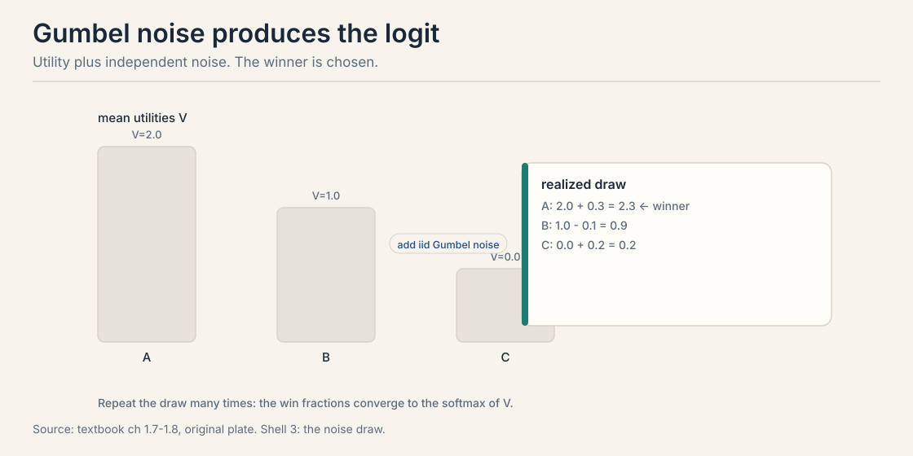
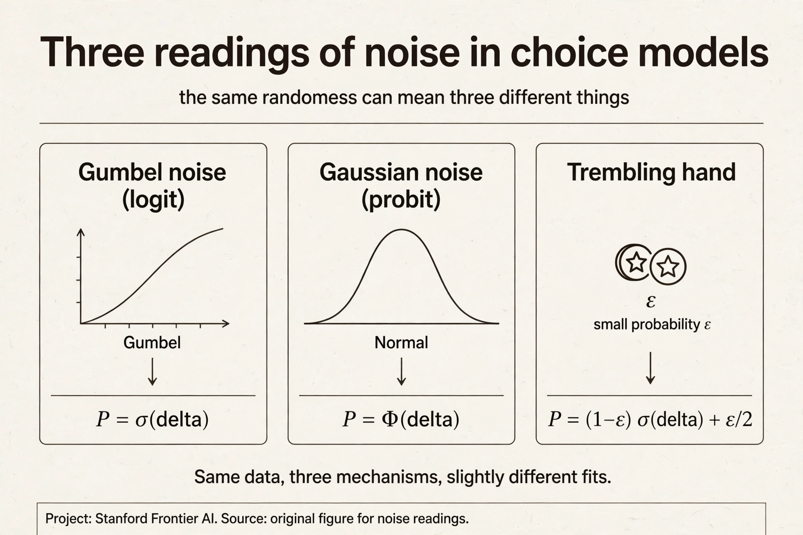
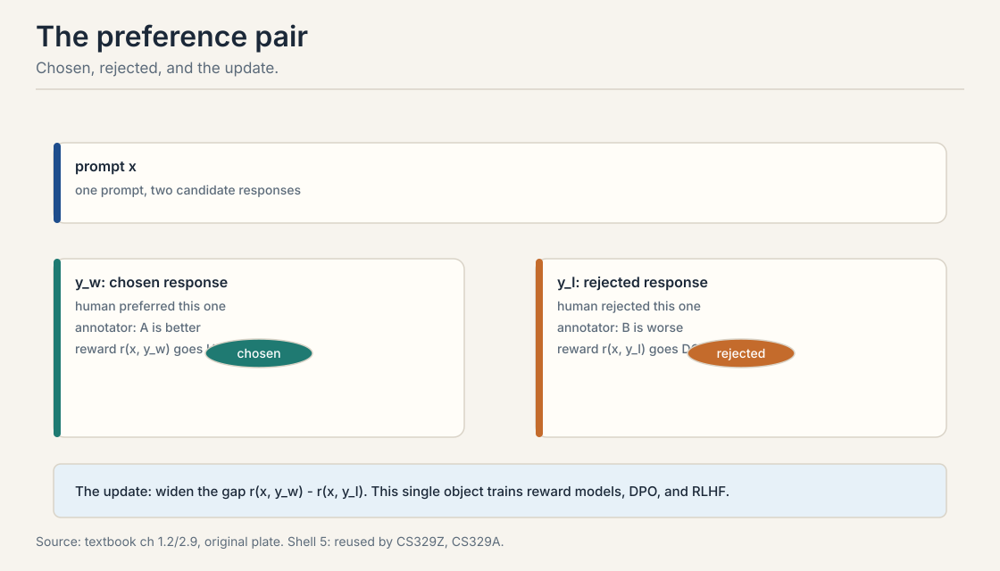
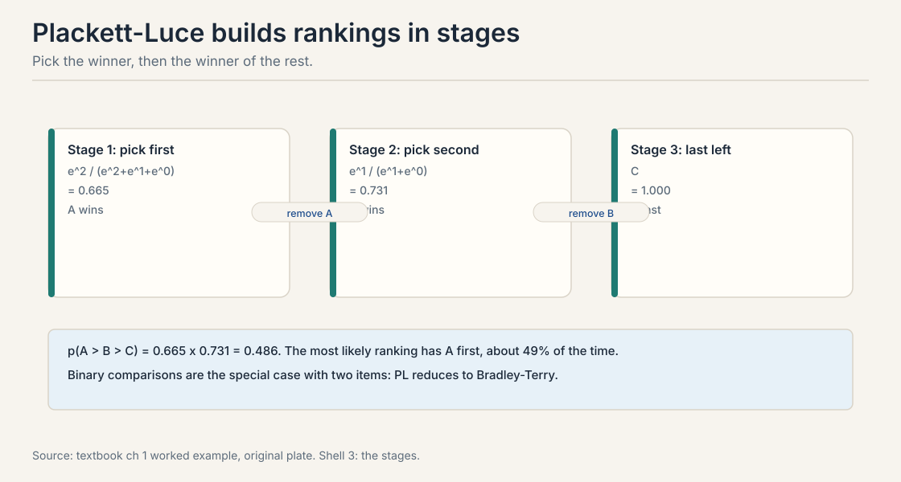

## The problem: preferences jitter

Lecture 1 gave each item a fixed utility V_j. Ask an annotator to
compare the same two responses on Monday and on Friday. Sometimes
the answer flips. Monday: A beats B. Friday: B beats A. Nothing
about the responses changed. The person did.

A fixed utility predicts the same choice every time. Real data
shows reversals. Three readings of the noise exist, and the
textbook names all three. It can be population heterogeneity:
different decision-makers. It can be decision error: bounded
rationality, the person is noisy. It can be the designer's belief
about unknown preferences: the model is uncertain. The reading
decides what the data licenses. A model that cannot represent
jitter cannot fit, cannot report confidence, and cannot explain
disagreement. We need utility with noise built in.

## First attempt: fixed utilities, pick the max

Before the noise, see what breaks without it. Give each item a
fixed number. The choice rule: pick the item with the highest
number. Three items: V_A = 2.0, V_B = 1.0, V_C = 0.0.

The rule predicts: A always beats B. B always beats C. A always
beats C. Deterministic. Now watch it fail on three counts.

First, it cannot explain a reversal. If the annotator picks B over
A once in ten trials, the model says that trial was impossible.
Second, it reports no confidence. It treats "A barely beats B"
and "A crushes B" identically: both are just "A wins." Third, it
gives no likelihood. With no probabilities, there is nothing to
maximize when fitting. Lecture 4 would have no loss function.

The toy gap: V_A - V_B = 1.0 and V_B - V_C = 1.0. The model
cannot say the first gap is as strong as the second in any graded
way. It only says "wins." We need the gap to mean something
quantitative.

## The key question

What if the utility itself is random, so the same gap produces
the same win probability every time, and close contests come out
near 50/50?

## Random utility: add noise to the number

The **random utility model** writes:

H_j = V_j + noise_j

V_j is the mean utility of item j. noise_j is a random shock,
independent across items, drawn fresh on each choice. The choice
goes to the highest realized value H_j. Repeat the draw many
times. The win fractions settle into probabilities.

A concrete instance. Two chess players. Mean strengths V_A = 2.0,
V_B = 1.0. On any given day, each player's realized strength is
their mean plus a shock: form, luck, the opening. The stronger
player wins most days but not every day. The model now predicts a
number, not a verdict.

## Gumbel noise gives the softmax

The noise distribution decides the model. Choose independent
**Gumbel** noise and something remarkable happens. The choice
probabilities take a closed form, the **softmax**:

p(j chosen from set S) = e^{V_j} / sum_{k in S} e^{V_k}

The Gumbel distribution is the unique noise, up to regularity
conditions, that yields this form and the IIA (independence
of irrelevant alternatives) property of Lecture 3. Other noises give other models: Gaussian noise gives the probit
(see the end of this chapter). Gumbel wins on tractability:
closed-form probabilities and easy gradients.

Watch the softmax on the toy. V = (2.0, 1.0, 0.0).

```ascii
e^2.0 = 7.39,  e^1.0 = 2.72,  e^0.0 = 1.00
total = 7.39 + 2.72 + 1.00 = 11.11

p(A) = 7.39 / 11.11 = 0.665
p(B) = 2.72 / 11.11 = 0.245
p(C) = 1.00 / 11.11 = 0.090
```

A wins two thirds of the time. B wins a quarter. C wins rarely.
The gaps now mean something quantitative: a one-unit gap is worth
about 0.42 of win probability at these values.



One property you will use constantly. Adding the same constant to
every V_j changes nothing. e^{V_j + c} = e^c e^{V_j}, and the e^c
cancels top and bottom. Only differences matter. This is the
identification problem of Lecture 3, previewed early because you
will trip on it otherwise.

> [!QA]
> Q: Why model utilities as random instead of just adding noise to responses?
> A: Both views give the same pairwise probabilities, so the choice is conceptual. The random utility view is the economics tradition: the evaluation itself fluctuates with mood, context, and unmeasured factors. It also yields the theory: with the right noise distribution, choice probabilities take a closed form, and that closed form is the softmax.
> Follow-up: What goes wrong with a purely deterministic model?
> A: It predicts the same choice every time. Real data shows reversals: the same annotator picks A over B on Monday and B over A on Friday. Without a noise model there is no likelihood, no fitting, and no way to say how confident the ranking is.

### Subchapter: three readings of the noise, one equation

The equation H_j = V_j + noise_j is fixed. Its meaning is not.
The textbook names three readings, and each one changes what the
fitted numbers mean and what you should do next.

**Reading 1: population heterogeneity.** The noise is different
people. V_j is the population mean utility. sigma(V_j - V_k) =
0.73 means 73% of people prefer j. The fix for uncertainty is
more annotators.

**Reading 2: decision error.** The noise is one person's
inconsistency. V_j is that person's true value. The 0.73 means
this person picks j 73% of the time. The fix is repeated queries
to the same person, or a better elicitation interface.

**Reading 3: designer belief.** The noise is our uncertainty
about the true preference. V_j is our best estimate. The 0.73 is
our credence. The fix is more data of any kind, processed
through Bayes.



Same curve, three stories, three interventions. The readings
also choose the lecture that fixes the problem. Reading 1 made
explicit is Lecture 3's mixture model. Reading 3 made explicit
is Lecture 4's posterior. Reading 2 ignored is Lecture 10's
inversion failure: you modeled noise but the person was
strategizing. When someone quotes a fitted win probability, ask
which reading they mean. The number cannot tell you.

## Bradley-Terry: the two-item case

Take the softmax with two items. It reduces to a **sigmoid** of
the gap. This is the **Bradley-Terry (BT) model** (Bradley and Terry,
1952), the most used equation in this course.

p(j beats k) = sigma(V_j - V_k) = 1 / (1 + e^{-(V_j - V_k)})

The win probability depends only on the utility gap. Work the
numbers by hand.

```ascii
gap 0.0:  sigma(0) = 1 / (1 + 1)      = 0.500   (coin flip)
gap 1.0:  sigma(1) = 1 / (1 + 0.368)  = 0.731
gap 2.0:  sigma(2) = 1 / (1 + 0.135)  = 0.881
gap 3.0:  sigma(3) = 1 / (1 + 0.050)  = 0.953
```

Equal gap, equal probability, every time. Now the chess toy from
the textbook. V_A = 2.0, V_B = 1.0, V_C = 0.0.

p(A beats B) = sigma(1.0) = 0.731
p(A beats C) = sigma(2.0) = 0.881
p(B beats C) = sigma(1.0) = 0.731

The strongest beats the middle 73% of the time and the weakest
88%. Elo ratings are Bradley-Terry utilities on a scaled axis:
Elo's expected score is exactly this sigmoid.

 = sigma(V_j - V_k). Worked points: gap 1.0 gives 0.73, gap 2.0 gives 0.88. Source: original figure for Stanford Frontier AI.")

> [!QA]
> Q: Derive Bradley-Terry from the random utility model in one paragraph.
> A: Start with H_j = V_j + noise_j with i.i.d. Gumbel noise. Item j beats k when H_j > H_k. Condition on noise_j = t: then k loses when noise_k < V_j - V_k + t, which has Gumbel CDF probability. Integrate over t with the Gumbel density. The integral collapses to e^{V_j} / (e^{V_j} + e^{V_k}), which equals sigma(V_j - V_k). The subchapter below shows every step.
> Follow-up: Why is this the same math as logistic regression?
> A: It is logistic regression. The log-loss on a pair (j, k) with label y is -[y log sigma(V_j - V_k) + (1-y) log(1 - sigma(V_j - V_k))]. Fitting Bradley-Terry by maximum likelihood is exactly logistic regression on pair differences. Lecture 4 builds on this.

### Subchapter: the derivation, shown in full

The lesson asserted that i.i.d. Gumbel noise gives the sigmoid.
Here is the proof, every step. It is the one derivation this
course cannot leave as an exercise, because everything downstream
stands on it.

Setup. Two items, j and k. Mean utilities V_j and V_k. Write d
for the gap V_j - V_k. The noises e_j and e_k are independent
draws from the standard Gumbel distribution. Item j wins when
V_j + e_j > V_k + e_k, which rearranges to e_k - e_j < d.

The standard Gumbel has CDF F(t) = exp(-exp(-t)) and density
f(t) = exp(-t) exp(-exp(-t)). These are definitions, not
results. Check the density integrates to 1: substitute u =
exp(-t) and the integral becomes the integral of exp(-u) from 0
to infinity, which is 1.

Step 1: condition on e_j. Fix e_j = t. Then j wins exactly when
e_k < d + t. Since e_k is Gumbel, this happens with probability
F(d + t) = exp(-exp(-(d + t))).

Step 2: average over e_j. The unconditional win probability is
the integral over t of f(t) times F(d + t):

p = integral of exp(-t) exp(-exp(-t)) exp(-exp(-(d+t))) dt

Step 3: substitute u = exp(-t). Then du = -exp(-t) dt, so
-exp(-t) dt becomes du with flipped limits, and exp(-(d+t)) =
exp(-d) exp(-t) = u exp(-d). The integral becomes:

p = integral from 0 to infinity of exp(-u) exp(-u exp(-d)) du
  = integral from 0 to infinity of exp(-u (1 + exp(-d))) du

Step 4: evaluate. The integral of exp(-a u) from 0 to infinity
is 1/a. Here a = 1 + exp(-d). So:

p = 1 / (1 + exp(-d)) = sigma(d)

That is Bradley-Terry. The sigmoid is not a modeling choice
layered on top. It is what falls out of Gumbel noise.

Verify by simulation, not just algebra. Draw 400,000 Gumbel
pairs per gap using the inverse CDF, -log(-log(u)) for uniform
u. Count how often d + e_j exceeds e_k.

```ascii
gap 0.0:  Monte Carlo 0.5007,  theory sigma(0) = 0.5000
gap 1.0:  Monte Carlo 0.7304,  theory sigma(1) = 0.7311
gap 2.0:  Monte Carlo 0.8800,  theory sigma(2) = 0.8808
```

All three agree within 0.001. The integral and the simulation
say the same thing.

Two things the proof reveals. First, the difference of two
independent Gumbels follows the logistic distribution. That is
the real content: Gumbel minus Gumbel is logistic, and the
logistic CDF is the sigmoid. Second, the proof used
independence at exactly one point: e_k < d + t has probability
F(d + t) only if e_k is independent of e_j. Correlated noise
breaks this step, which is why Lecture 3's red-bus problem
needs a different model. The derivation shows its own exit.



## The preference pair: the atom of the course

One object powers everything downstream. Define it carefully now,
because every later lesson reuses it.

A **preference pair** is a triple (x, y_w, y_l). The prompt x. The
chosen response y_w, the winner. The rejected response y_l, the
loser. A human, or a model judge, said y_w beats y_l for this
prompt.

The update rule for every method in this course: widen the gap
between the winner and the loser. Reward models raise r(x, y_w)
and lower r(x, y_l). DPO raises the implicit reward gap directly.
PPO optimizes a policy against the learned gap. Same atom, three
algorithms. This symbol is first defined here in CS329H. Later
courses reuse it without redefinition.

## Plackett-Luce: rankings in stages

Pairs handle two items. Rankings need more. The **Plackett-Luce**
model builds a ranking in stages: pick the winner from the full
set, then the winner from the rest, and so on.

p(A > B > C) = [e^{V_A} / (e^{V_A} + e^{V_B} + e^{V_C})] x [e^{V_B} / (e^{V_B} + e^{V_C})]

Work it with V = (2, 1, 0), using the exponentials from above.

```ascii
stage 1, A wins the full set:  7.39 / 11.11 = 0.665
stage 2, B beats C of the rest: 2.72 / (2.72 + 1.00) = 2.72 / 3.72 = 0.731
full ranking A > B > C:  0.665 x 0.731 = 0.486
```

The most likely ranking puts A first, about 49% of the time. Each
stage is a softmax over the survivors. Binary Bradley-Terry is the
two-item special case. Accept-reject, item versus the outside
option, is the item-versus-one special case: sigma(V_j - V_0).
One model, four feedback types. The table at the end of the
chapter consolidates them.



> [!QA]
> Q: When would you use Plackett-Luce instead of Bradley-Terry?
> A: When annotators give full or partial rankings, not just pairs. A ranking of M items carries M-1 staged choices, more information per query than one pair. But rankings cost more annotator effort and the staged model assumes the same IIA structure at every stage. Most LLM pipelines stick to pairs: cheaper, faster, and BT is the special case anyway.
> Follow-up: Does the stage order matter?
> A: The model defines the ranking probability as the product over stages in rank order: first place, then second, and so on. Any total order has exactly one such factorization, so the probability is well defined. The stages are a modeling choice, not a claim about how humans actually rank.

## Where the noise model still fails

Three failures motivate the rest of the course. Each gets its own
lecture. Name them now so you can spot them.

**Context effects.** Preferences depend on what else is shown.
Adding a decoy changes choices. BT assumes the pair probability
never moves when the set changes. Lecture 3.

**Intransitivity.** A > B > C > A cycles exist in real data. No
utility vector explains a cycle, because numbers are transitive
and the data is not. Lectures 3 and 8.

**Heterogeneity.** Different annotators have different utilities.
BT learns a compromise that may match nobody. Lectures 3 and 8
through 10.

DPO inherits all three. It assumes the BT model is correctly
specified. When the assumption fails, DPO learns a compromise
policy. The textbook is explicit: check the assumption before
trusting the fit.

## Mapping back: what random utility buys

| Fixed-utility pain | Random-utility answer | How |
|---|---|---|
| Reversals are impossible | Reversals get a probability | sigma(1.0) = 0.731, so B beats A 27% of the time |
| No confidence | Gaps are graded | Gap 1.0 vs 2.0: 0.73 vs 0.88 |
| Nothing to fit | A likelihood exists | Log-loss on pairs. Lecture 4 maximizes it |

## The honest price: IIA

The softmax has a strong property hiding inside it. The ratio of
two choice probabilities ignores everything else in the set. Add
a third option and the j-versus-k odds do not move. This is the
**Independence of Irrelevant Alternatives**, IIA. The textbook
proves the equivalence: a random utility model satisfies IIA if
and only if the noise is i.i.d. Gumbel. Gumbel noise and IIA are
two names for the same assumption.

IIA is what makes learning tractable: M numbers determine every
choice probability. It is also the first thing reality breaks.
Clone an option and watch the odds move. That is Lecture 3, and
it starts with buses.

## Consolidation: one model, four feedback types

| Feedback type | Model name | Formula |
|---|---|---|
| Binary pair | Bradley-Terry | sigma(V_j - V_k) |
| Full ranking | Plackett-Luce | staged softmax |
| Accept / reject | Logistic regression | sigma(V_j - V_0) |
| Choice from set | Multinomial logit | softmax over S |

## Logit versus probit

Gumbel noise gives the logit. Gaussian noise gives the **probit**.
For binary comparisons the two are nearly identical after
rescaling: the logistic and normal CDFs have similar shapes. The
choice is empirically inconsequential for pairs.

### Subchapter: how close are they, exactly

Rescale so the slopes match at zero. The logistic distribution
has variance pi^2/3, so its standard deviation is about 1.81.
The matched probit uses Phi(gap / 1.81). Work both at two gaps.

```ascii
gap 1.0:  logit sigma(1) = 0.731     probit Phi(0.55) = 0.709
gap 2.0:  logit sigma(2) = 0.881     probit Phi(1.10) = 0.864
```

The curves differ by about 0.02 across the practical range. No
dataset distinguishes them on pairs alone. This is why the field
standardized on the logit: identical predictions, closed-form
math.


The difference matters for multi-way choices. Gaussian noise
allows a covariance matrix over items, so similar items can have
correlated shocks. That correlation is exactly what the
red-bus/blue-bus problem needs, covered in Lecture 3. The price is
computation: probit choice probabilities have no closed form and
need numerical integration.

Rule of thumb: pairs, use logit. Many similar alternatives,
consider probit or nested logit.

> [!QA]
> Q: What is the Gumbel distribution doing in this model?
> A: It is the noise distribution that makes the math close. With i.i.d. Gumbel shocks, the probability that item j has the highest realized utility equals the softmax of the mean utilities. The textbook proves this by conditioning on one noise draw and integrating. No other common noise gives a closed form this clean.
> Follow-up: Is Gumbel a realistic model of human noise?
> A: It is a convenience, not a psychological fact. Gaussian noise, the probit model, is arguably as plausible and gives nearly identical binary predictions. Gumbel wins on tractability: closed-form probabilities, easy gradients, and the IIA structure that makes learning scale.

> [!QA]
> Q: Walk me through the softmax computation on three items, by hand.
> A: Take mean utilities V = (2.0, 1.0, 0.0). Step one: exponentiate each. e^2.0 = 7.39, e^1.0 = 2.72, e^0.0 = 1.00. Step two: add them. Total = 11.11. Step three: divide each by the total. p(A) = 7.39/11.11 = 0.665, p(B) = 2.72/11.11 = 0.245, p(C) = 1.00/11.11 = 0.090. The three numbers sum to 1. The story behind the arithmetic: each item's realized utility is its mean plus a Gumbel shock, the choice goes to the highest realized value, and the win fractions over many draws equal these probabilities. With two items the same steps give Bradley-Terry: p(A beats B) = 7.39/(7.39+2.72) = 0.731.
> Follow-up: What happens to the probabilities if I add 10 to every utility?
> A: Nothing. e^{V_j+10} = e^{10} e^{V_j}, and the e^{10} factors out of every term and cancels. This is the identification problem: choice data sees differences only. Always anchor one utility before fitting.

> [!QA]
> Q: Design an Elo rating system for an online coding-interview platform. Candidates solve problems head to head.
> A: Treat each candidate as a player and each head-to-head as a game. Start everyone at 1500. After each match, update with V_new = V_old + K(score - expected), where expected = 1/(1 + 10^{(opp - you)/400}). Pick K = 24 for established candidates and K = 40 for newcomers with fewer than 20 matches, so new ratings move fast and stable ones do not jitter. Handle draws as score 0.5. Guard the traps: undefeated newcomers explode without a prior, so shrink ratings toward 1500 by 5% each month. problem difficulty varies, so track per-topic ratings or add a problem-difficulty term, otherwise easy-problem specialists look stronger than they are. and ratings drift as candidates practice, so the K-factor's forgetting is a feature, not a bug.
> Follow-up: Online Elo or batch Bradley-Terry: which and when?
> A: Online Elo when matches stream in and you need a number now: leaderboards, matchmaking. Batch BT when you can wait: end-of-season rankings, where the full likelihood uses all games at once and gives proper uncertainty. Elo is stochastic gradient descent on the BT log-loss, so they agree in the long run. The batch fit also lets you add the prior that stops undefeated players from exploding.

> [!QA]
> Q: When would you abandon the Gumbel noise and pay for something richer?
> A: When the data shows the IIA failures of Lecture 3. Near-duplicate items need correlated noise: the red-bus/blue-bus clones steal share under independent shocks. Use nested logit, which groups similar items into nests, or probit with a covariance matrix. Mixed populations need mixtures: fit one BT model per annotator group instead of one compromise. Context effects need context in the utility: V_j becomes V_j(x). The rule: start with Gumbel for tractability, and upgrade the noise exactly where the data rejects independence.
> Follow-up: How do you detect that the noise assumption is wrong?
> A: Two tests. The clone test: add a near-duplicate of one item and watch the others' shares. Under IIA they fall proportionally. in real data they barely move. The mixture test: fit per-group models and compare with the pooled fit. If per-group utilities disagree sharply, the pool is a compromise nobody holds. Both tests are cheap. Run them before trusting the fit.

## Recap: the whole lesson on one screen

The story in eight steps. Each step answers the one before it.

1. **Preferences jitter.** Same annotator, Monday A beats B,
   Friday B beats A. Fixed utilities call the reversal
   impossible.
2. **Fixed max breaks three ways.** No reversals, no
   confidence, no likelihood to fit.
3. **Add noise to the utility.** H_j = V_j + noise_j. The
   choice goes to the highest realized value. Win fractions
   settle into probabilities.
4. **Gumbel gives the softmax.** p(j) = e^{V_j} / sum e^{V_k}.
   The toy: 0.665, 0.245, 0.090. Only differences matter.
5. **Two items give Bradley-Terry.** p(j beats k) =
   sigma(V_j - V_k). Gap 1.0 is 0.731. Gap 2.0 is 0.881.
   Chess toy: A beats B 73%, A beats C 88%.
6. **The preference pair is the atom.** (x, y_w, y_l).
   Every method widens the winner-loser gap. Defined here,
   reused everywhere.
7. **Rankings stage the softmax.** Plackett-Luce: 0.665 x
   0.731 = 0.486 for A > B > C. One model, four feedback
   types.
8. **The price is IIA.** The odds ignore the rest of the set.
   Tractable and strong. Clones break it. Lecture 3 shows how.

## Go deeper

<div style="position:relative;padding-bottom:56.25%;height:0;overflow:hidden;max-width:100%;margin:16px 0;">
<iframe style="position:absolute;top:0;left:0;width:100%;height:100%;" src="https://www.youtube-nocookie.com/embed/inXUp5j107I" title="The Elo Rating System: Bradley-Terry derivation, j3m" frameborder="0" allow="accelerometer; autoplay; clipboard-write; encrypted-media; gyroscope; picture-in-picture" allowfullscreen></iframe>
</div>
- The Elo Rating System (Bradley-Terry derivation): https://www.youtube.com/watch?v=inXUp5j107I
- Course textbook (Truong, Haupt, Koyejo): https://mlhp.stanford.edu/Machine-Learning-from-Human-Preferences.pdf
- Bradley and Terry, Rank Analysis of Incomplete Block Designs (1952): via the textbook bibliography.
- Train (2009), Discrete Choice Methods with Simulation: the logit/probit reference.

## Official sources and further reading

**Official:**
- The Elo Rating System (external explainer, video id inXUp5j107I):
  derives Bradley-Terry for a two-player game, builds the Elo update
  from Zermelo's model, and notes the Thurstone alternative.
- Course textbook, chapter 1.7: random utility, Gumbel, BT,
  Plackett-Luce, the worked chess example.

**Further reading:**
- Bradley and Terry (1952): the original paired-comparison
  paper.
- Train (2009), Discrete Choice Methods with Simulation: the
  reference for logit, probit, nested and mixed logit.

**Caveats from these sources.** The Gumbel-IIA equivalence holds
under regularity conditions the textbook states. the proof is
left as an exercise. The "unique noise" claim is up to those
conditions. The DPO-inherits-BT warning is the textbook's
explicit caution, not a proven failure rate.

## Connections to the other courses

- **CS329H L01:** fixed utilities and the Rasch model. pairs
  cancel the user. This lesson adds the noise.
- **CS329H L03:** IIA, identification, and where BT fails.
  Read next.
- **CS329H L04:** fitting BT by maximum likelihood, which is
  logistic regression on pair differences.
- **CS329H L07:** DPO as BT with the reward parameterized
  through the policy.
- **CS224N:** the same BT/DPO math from the language-modeling
  side.
