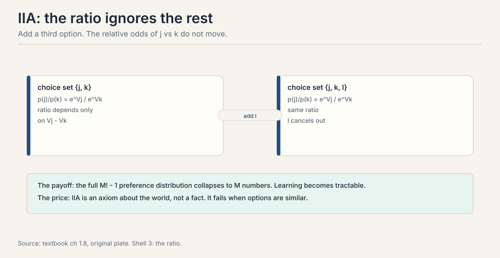
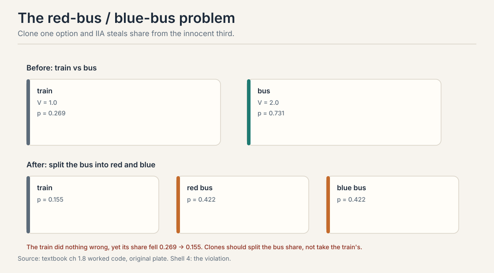
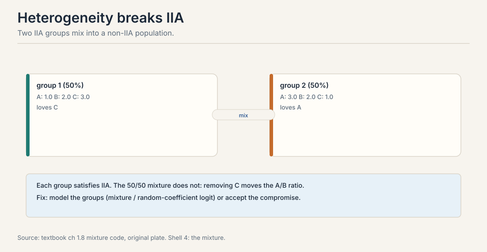
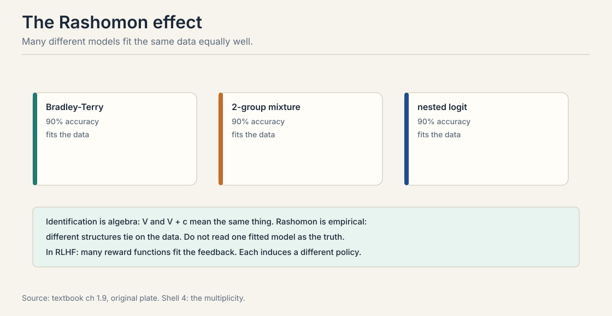

## The problem: too many numbers to learn

Lecture 2's softmax is convenient. It is also suspiciously
strong. Count what it claims. The full preference distribution
over M items needs one probability per ordering: M! - 1 free
parameters. For M = 4 that is 23. For M = 10 it is over 3.6
million. Learning that object from data is hopeless. No dataset
covers 3.6 million orderings.

The softmax claims M numbers determine all of it: every pair
probability, every set choice, every ranking. That is an enormous
compression. It rests on one axiom. This chapter stress-tests the
axiom, watches it break twice, and maps what survives.

## First attempt: the IIA axiom

The **Independence of Irrelevant Alternatives** (IIA) says: the
relative odds of j versus k do not change when a third option l
enters or leaves the choice set.

p(j|S) / p(k|S) = p(j|S + l) / p(k|S + l)

In the softmax the ratio is e^{V_j} / e^{V_k}. The rest of the
set cancels. The ratio depends only on the gap V_j - V_k.



The textbook proves an equivalence: a random utility model
satisfies IIA if and only if the noise is i.i.d. Gumbel. Gumbel
noise and IIA are two names for the same assumption. This is why
Lecture 2's softmax is both convenient and strong. You cannot
have the closed form without the axiom.

> [!QA]
> Q: What does IIA buy you?
> A: Tractability. Without IIA you must estimate the full distribution over all M! orderings. With IIA, M utility numbers determine every choice probability: pairs, sets, and full rankings. Bradley-Terry, Plackett-Luce, and the multinomial logit are all IIA models. The price is realism: IIA is an axiom about the world, and the world often violates it.
> Follow-up: Is IIA testable?
> A: Yes, in principle. Observe choices from set S and from S + l. If the j/k odds ratio moves, IIA fails. In practice you need enough data in both sets, and selection effects, who sees which set, confound the test. The red-bus/blue-bus example below is the canonical violation.

## Where IIA breaks, part 1: clones steal share

Three options: train, red bus, blue bus. The two buses are nearly
identical. Set V_train = 1.0 and V_bus = 2.0.

Before the split, the choice is train versus bus. The softmax:

```ascii
e^1.0 = 2.72,  e^2.0 = 7.39,  total = 10.11
p(train) = 2.72 / 10.11 = 0.269
p(bus)   = 7.39 / 10.11 = 0.731
```

Now split the bus into red and blue, each with V = 2.0.

```ascii
total = 2.72 + 7.39 + 7.39 = 17.50
p(train)    = 2.72 / 17.50 = 0.155
p(red bus)  = 7.39 / 17.50 = 0.422
p(blue bus) = 7.39 / 17.50 = 0.422
```



The train did nothing wrong, yet its share fell from 0.269 to
0.155. Intuition says the two buses should split the old bus
share between themselves, leaving the train untouched. IIA cannot
do that. It treats red bus and blue bus as independent
competitors, so each steals proportionally from everyone,
including the train.

The failure is in the noise assumption. IIA needs independent
shocks. But the red and blue bus shocks should move together:
they are the same bus. The fix is correlated noise. The
**nested logit** groups similar items into nests: choose a nest
first, then an item within it. IIA holds within nests but not
across them. The **probit** model, Gaussian noise with a
covariance matrix, handles it naturally at the cost of numerical
integration.

> [!QA]
> Q: Explain the red-bus/blue-bus problem in one minute.
> A: IIA says the train-versus-bus odds ignore everything else. Clone the bus into red and blue. Under IIA each clone competes independently, so the train's share drops from 0.269 to 0.155 even though nothing about the train changed. Real intuition: the clones should split the bus share. The model is wrong because it assumes independent shocks for near-identical items. Correlated noise or nested logit fixes it.
> Follow-up: Where does this bite in LLM work?
> A: When candidate responses are near-duplicates. A reward model with IIA structure spreads probability across paraphrases instead of concentrating on the best answer. Pair sampling that includes many similar responses distorts the implicit Borda aggregation in DPO. Deduplicate candidates or model the correlation.

### Subchapter: nested logit, worked

The fix for clones is a two-stage choice. Group the items into
**nests**: {train} and {red bus, blue bus}. The chooser picks a
nest first, then an item inside the nest. IIA holds within each
nest but not across nests. The buses now compete with each other
before they compete with the train.


Work it with the textbook's numbers. Give the bus nest a
dissimilarity parameter lambda: lambda = 1 means no correlation,
lambda near 0 means the two buses are near-perfect clones. The
nest choice uses inclusive values. the item choice happens
inside the nest.

```ascii
lambda = 1.0 (no correlation):  train 0.155, each bus 0.422
lambda = 0.5:                   train 0.206, each bus 0.397
lambda = 0.1:                   train 0.256, each bus 0.372
lambda = 0.01 (near-clones):    train 0.268, each bus 0.366
```

Read the column. As the correlation rises, the train's share
climbs back from 0.155 toward its pre-split value 0.269. The
clone stops stealing from the train and steals from its
sibling instead, which is what intuition demanded. At lambda =
1 the model reduces to the flat softmax: the clone problem
returns in full.

The price: you must specify the nests. Wrong nests give wrong
substitution. With three nests the model has three extra
parameters. with learned nests it becomes a clustering problem.
The nested logit is the tractable middle ground between the
plain softmax, which assumes no correlation, and the full
probit, which estimates every correlation at the cost of
numerical integration.

## Where IIA breaks, part 2: mixtures

IIA fails for a second reason: populations are mixed. Take two
groups, each satisfying IIA. Group 1, half the population, has
utilities A: 1, B: 2, C: 3. Group 2, the other half, has A: 3,
B: 2, C: 1. Watch the A-versus-B ratio when C is removed.

```ascii
choice set {A, B, C}:
  group 1: e = (2.72, 7.39, 20.09), p(A)=0.090, p(B)=0.245
  group 2: e = (20.09, 7.39, 2.72), p(A)=0.665, p(B)=0.245
  mixture: p(A) = 0.378, p(B) = 0.245,  ratio A/B = 1.54

choice set {A, B} (C removed):
  group 1: p(A)=0.269, p(B)=0.731
  group 2: p(A)=0.731, p(B)=0.269
  mixture: p(A) = 0.500, p(B) = 0.500,  ratio A/B = 1.00
```

Each group alone is a clean logit with a fixed ratio. The 50/50
mixture is not: removing C moves the A/B ratio from 1.54 to 1.00.
Why? IIA is about ratios of probabilities. A mixture averages
probabilities, not ratios. When the set changes, each group's
mass shifts differently, and the average ratio moves.



This matters because every real annotator pool is a mixture. Some
annotators prefer concise answers, others prefer thorough ones.
Fitting one Bradley-Terry model to mixed annotators learns a
compromise ranking. The compromise may match no individual's true
preferences. Fixes: model the mixture explicitly, use random
coefficients with utilities drawn per person from a distribution,
or condition on user features so each subpopulation gets its own
model. The textbook notes the random-coefficient logit can
approximate any random utility model.

> [!QA]
> Q: Why does a mixture of IIA models violate IIA?
> A: IIA is about ratios of choice probabilities. A mixture averages probabilities, not ratios. The average of two constant ratios is not constant when the choice set changes, because the weights shift with the set. Each group's softmax ratio is fixed, but the mixture ratio depends on which other options absorb each group's mass.
> Follow-up: What is the practical consequence for RLHF?
> A: Annotators disagree systematically: some prefer concise answers, others prefer thorough ones. One reward model averages them into a middle style nobody asked for. If disagreement is structured, fit per-annotator or per-group models, or elicit the disagreement explicitly instead of averaging it away.

## The key question

Clones break IIA. Mixtures break IIA. So what does choice data
actually pin down, even when the model is right?

## Identification: only differences survive

Choice data identifies utility differences, never levels. For any
constant c, the vectors V and V + c give identical choice
probabilities. The c cancels in every softmax and every sigmoid.
No amount of data removes this ambiguity. It is structural, not
statistical.

```ascii
V      = (0.0, 1.0, 2.0)    ->  p = (0.09, 0.24, 0.67)
V + 10 = (10.0, 11.0, 12.0) ->  p = (0.09, 0.24, 0.67)
identical predictions. The level is invisible.
```

The fix is a normalization. Anchor one item: set V_1 = 0, so every
other utility reads as value relative to item 1. Or anchor an
outside option: V_0 = 0 makes utilities interpretable as value
relative to opting out. In DPO, the reference policy plays this
role: the implicit reward measures deviation from the reference.

A common pitfall: fitting all utilities freely without a
constraint. The likelihood has a flat direction, optimization
wanders, and standard errors are meaningless. Always impose the
anchor before fitting.

## The Rashomon effect: the data cannot pick the structure

Identification is algebra: V and V + c mean the same thing within
one model. The **Rashomon effect** is empirical: structurally
different models fit the same data equally well.



Fit 100 pairwise comparisons among 5 items three ways: plain
Bradley-Terry, a 2-group mixture, a nested logit. All three reach
90% accuracy. Each is identified internally. The data cannot say
which structure is true.

The consequences are practical. Do not read one fitted model as
ground truth. Report sets of good models when the science
matters. In RLHF, many reward functions in the Rashomon set agree
on the training pairs but induce different policies. Optimizing
one of them is a choice, not a discovery.

> [!QA]
> Q: Distinguish the identification problem from the Rashomon effect.
> A: Identification is within one model class: V and V + c are algebraically equivalent, so the ambiguity never resolves no matter how much data arrives. Rashomon is across model classes: a BT model, a mixture model, and a nested logit can tie on the same dataset even though each is identified. One is math, the other is empirical multiplicity.
> Follow-up: How do you navigate Rashomon in practice?
> A: Three tools. Regularization prefers simpler models in the set. Bayesian averaging keeps the uncertainty instead of picking one. Structural assumptions from domain knowledge rule out implausible members. None of them finds "the truth." They make the choice explicit and auditable.

> [!QA]
> Q: Walk me through the red-bus/blue-bus arithmetic from start to finish.
> A: Start with two options: train with V = 1.0, bus with V = 2.0. Exponentiate: 2.72 and 7.39. Total 10.11. Shares: train 2.72/10.11 = 0.269, bus 0.731. Now split the bus into red and blue, each V = 2.0. Exponentials: 2.72, 7.39, 7.39. Total 17.50. New shares: train 2.72/17.50 = 0.155, each bus 0.422. The train lost 0.114 of share without changing at all. The mechanism: IIA forces the j-versus-k odds to ignore the rest of the set, so each clone competes independently and steals proportionally from everyone. Intuition says the clones should split the old bus share 0.731 between themselves and leave the train at 0.269. Nested logit with a near-zero dissimilarity parameter delivers exactly that: train 0.268, each bus 0.366.
> Follow-up: Why can not the plain softmax be patched with a quick fix?
> A: The failure is in the noise assumption, not a parameter value. IIA is equivalent to i.i.d. Gumbel noise: independent shocks for every item. No utility vector fixes it because the utilities are not the problem. You must change the correlation structure of the shocks, which means a different model: nested logit, probit with covariance, or explicit deduplication before fitting.

> [!QA]
> Q: Your LLM eval pipeline samples 4 responses per prompt and the annotator picks the best. Near-duplicates keep appearing. Redesign the pipeline.
> A: Three changes. First, deduplicate before showing: embed the 4 candidates and drop any pair with cosine similarity above 0.95, resampling replacements. This removes the clones that break IIA instead of modeling them. Second, switch the query from "pick the best of 4" to pairwise comparisons on the deduplicated set, and fit Bradley-Terry. Pairs are cheaper per judgment and the BT likelihood is the best-understood object in the course. Third, log the choice set with every label. If you ever need set-choice probabilities later, you need to know what else was on screen. without the set, the labels are uninterpretable under any model richer than BT.
> Follow-up: What if you cannot deduplicate because the duplicates are the point, say you are studying paraphrase robustness?
> A: Then model the correlation instead of removing it. Fit a nested logit with paraphrase clusters as nests, or a probit with a covariance block per cluster. The plain softmax will spread probability across the paraphrases and understate the best answer's share. Name the nest structure in the report: it is a modeling choice, and the Rashomon effect says the data will not pick it for you.

> [!QA]
> Q: When is IIA a safe assumption, and when is it reckless?
> A: Safe when the choice set is fixed and the items are genuinely distinct: chess players in a tournament, job candidates with different profiles, responses that differ in substance. The odds ratio then has no reason to move, and the softmax's tractability is pure win. Reckless when the set changes across observations, when items are near-duplicates, or when the population mixes distinct taste groups. The three tests: does the choice set vary, are any two items close substitutes, do annotators disagree in structured ways. One yes means you need nests, mixtures, or per-group models. The cost of ignoring a yes is a fit that looks precise and is wrong.
> Follow-up: Does DPO need IIA to be true?
> A: DPO needs the BT model to be correctly specified, and BT implies IIA. In practice DPO runs on pipelines that violate it: near-duplicate candidates, mixed annotators. The result is the distorted Borda count from Lecture 7: the policy upweights responses by head-to-head wins under a misspecified model. DPO still often works because the distortion is small relative to the signal. But when candidates cluster into near-duplicate groups, the distortion stops being small, and that is when you audit the sampling.

## The model family for IIA failures

The textbook's optional section extends the family. Each member
trades tractability for realism at one specific failure.

**Probit.** Gaussian noise with a covariance matrix. Correlated
shocks handle red-bus/blue-bus naturally. Cost: no closed form,
numerical integration required.

**Nested logit.** Group similar items into nests. Choose a nest,
then an item inside it. IIA holds within nests, flexible
substitution across nests. The tractable middle ground.

**Mixed logit.** Utility coefficients are random draws per
decision-maker. Captures heterogeneity. Can approximate any
random utility model. Estimated by simulation.

**Gaussian processes.** Drop linearity entirely. Model the reward
as a smooth function with an RBF kernel. A GP can prefer the
moderate middle, which no linear model can express. Cost is
O(n^3) without approximations.

## Mapping back: what survives the stress test

| Threat | What survives | How |
|---|---|---|
| Clones steal share | Correlated noise | Nested logit or probit. IIA within nests only |
| Mixed populations | Per-group models | Mixtures or random coefficients. one BT fit is a compromise |
| Level ambiguity | Anchors | Fix V_1 = 0 or use the reference policy. never fit unconstrained |
| Structural ambiguity | Model sets | Rashomon: report the set, regularize, or average. do not crown one fit |

## The honest price: assumptions all the way down

IIA bought tractability for M!-1 parameters. The price is a model
of the world that the world often rejects. Clones, mixtures,
context effects, and cycles each demand their own extension, and
each extension costs tractability. There is no free structure.

The practical rule: match the model to the failure you fear.
Near-duplicate candidates demand nested or correlated structure.
Disagreeing annotators demand mixtures. Small clean datasets work
fine with plain BT. And whatever you fit, remember the Rashomon
set: the data never told you the structure. You chose it.

## Recap: the whole lesson on one screen

The story in eight steps. Each step answers the one before it.

1. **Too many numbers.** M! - 1 parameters for M items. M = 10
   needs 3.6 million. Learning it is hopeless.
2. **IIA compresses to M.** The j-versus-k odds ignore the
   rest of the set. Gumbel noise and IIA are the same
   assumption.
3. **Clones break it.** Red bus splits into red and blue. The
   train's share falls 0.269 to 0.155. Independent shocks are
   wrong for near-identical items.
4. **Mixtures break it.** Two IIA groups, 50/50. Removing C
   moves the A/B ratio 1.54 to 1.00. Averages of ratios are
   not ratios.
5. **Only differences are identified.** V and V + c predict
   identically. Anchor one item or the outside option. DPO
   uses the reference policy as the anchor.
6. **Rashomon: the data cannot pick.** BT, mixture, nested
   logit all reach 90%. Optimizing one is a choice, not a
   discovery.
7. **The family extends.** Probit for correlation, nested
   logit for groups, mixed logit for heterogeneity, GPs for
   nonlinear rewards. Each costs tractability.
8. **Match the model to the failure.** Clones need nests.
   Mixtures need groups. Plain BT needs a clean small world.

## Official sources and further reading

**Official:**
- The Elo Rating System (external explainer, video id inXUp5j107I):
  the Thurstone model segment motivates the probit alternative.
- Course textbook, chapters 3.x: IIA, red-bus/blue-bus,
  identification, Rashomon, the extended model family. [link](https://mlhp.stanford.edu/Machine-Learning-from-Human-Preferences.pdf)

**Further reading:**
- Train (2009), Discrete Choice Methods with Simulation: nested
  logit, mixed logit, probit estimation.
- Breiman (2001) on the Rashomon effect: many models, similar
  accuracy.

**Caveats from these sources.** The Gumbel-IIA equivalence needs
the textbook's regularity conditions. The mixture numbers above
are worked from the textbook's example values. The Rashomon 90%
figure is the textbook's illustration on synthetic data, not a
universal rate.

## Connections to the other courses

- **CS329H L02:** the softmax and BT that IIA makes tractable.
- **CS329H L04:** the anchor requirement before fitting. the
  flat direction that unconstrained MLE wanders along.
- **CS329H L07:** DPO inherits IIA and the identification
  structure. the reference policy is the anchor.
- **CS329H L08:** Borda escapes Arrow by weakening IIA to
  IIA-prime.
