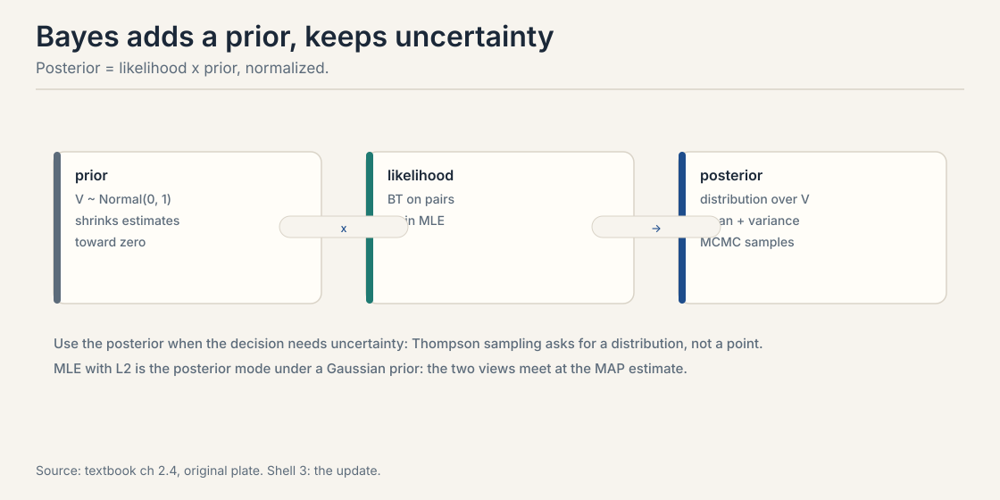
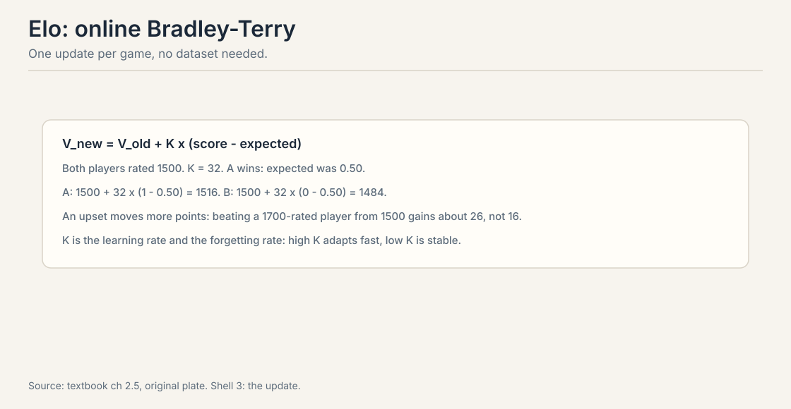
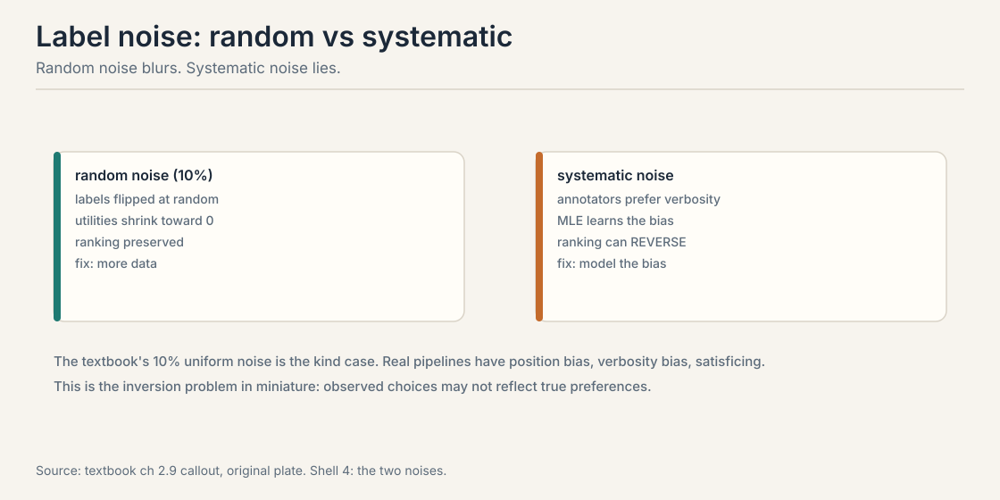
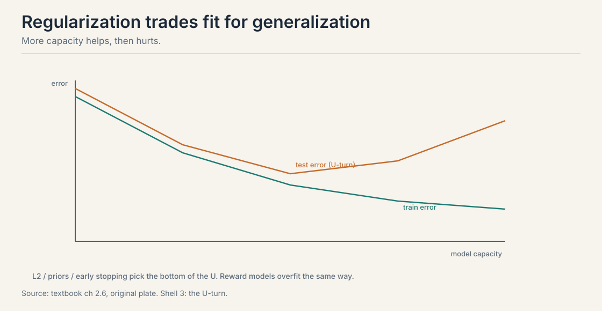

## The problem: from pairs to numbers

Lectures 1 through 3 defined the models. Now fit them. The input
is preference data: pairs (j, k) with labels y = 1 when j won.
The output is a utility vector V that predicts new comparisons.
Everything downstream, reward models, Elo ratings, DPO, stands
on this fitting step. Get it wrong and the policy optimizes a
mirage.

Split the data first. The textbook uses 80% train, 20% test on
the pair matrix. The split is over pairs, not items: the same
items appear in both sets, but no pair appears in both. Test
accuracy then measures generalization to unseen comparisons,
which is the quantity you care about. Splitting by items would
test the wrong thing: you want to predict new matchups among
known items, not cold-start strangers.

## First attempt: maximum likelihood

Choose the utilities that make the observed wins most probable.
For Bradley-Terry the log-likelihood of one pair is:

y * (V_j - V_k) - log(1 + e^{V_j - V_k})

Sum over pairs, maximize by gradient ascent. This is logistic
regression on pair differences, so every GLM fact transfers:
concave loss, unique optimum given the anchor, standard errors
from the Hessian.

, apply log-loss, ascend the gradient. Anchor V_1 = 0. Source: original figure for Stanford Frontier AI.")

Watch one gradient step by hand. Start V_A = V_B = 0. Observe A
beats B. The gradient of the log-likelihood with respect to V_A
is 1 - sigma(V_A - V_B) = 1 - 0.5 = 0.5. V_A moves up, V_B moves
down by the same amount. The update is proportional to surprise:
a win you already expected, sigma near 1, barely moves the
numbers. An upset moves them a lot.

Two practical notes. First, anchor before fitting: fix V_1 = 0
or the likelihood has a flat direction from Lecture 3. Second,
perfectly separated pairs push utilities to infinity: if j beats
k every time, the MLE wants V_j - V_k = infinity. The fix is
regularization or a prior, covered below.

> [!QA]
> Q: Why is BT maximum likelihood convex?
> A: The log-likelihood is a sum of terms y*d - log(1 + e^d) with d = V_j - V_k. Each term is concave in d, the logistic log-likelihood, and d is linear in V, so the sum is concave in V. Concave maximization has one global optimum. The anchor removes the flat direction. This is why BT fitting is reliable where deep reward models are not.
> Follow-up: What breaks convexity?
> A: Mixtures and latent user types. A mixture of two BT models has a non-convex likelihood with local optima. Neural reward models r_theta(x, y) are non-convex in theta. The convex case is the linear-utility, single-population BT model only.

## Where MLE breaks: the undefeated item

Ten games. Item j beats item k all ten times. What does MLE say
the gap V_j - V_k should be? The likelihood of the data at gap d
is sigma(d)^{10}. This is maximized as d goes to infinity. Watch
the numbers:

```ascii
d = 3:   sigma = 0.953,  likelihood = 0.953^10 = 0.62
d = 5:   sigma = 0.993,  likelihood = 0.993^10 = 0.93
d = 10:  sigma = 0.99995, likelihood = 0.99995^10 = 0.9995
```

Every increase helps. The optimum is at infinity. The model is
certain that j always wins, so it wants infinite certainty. The
data cannot distinguish "wins 99.9% of the time" from "wins
99.999% of the time," but the optimizer keeps climbing anyway.

This is not a rare edge case. In LLM annotation, some responses
are unanimously preferred. In chess, a new player wins their
first games. Unregularized fitting explodes on exactly the data
you trust most.

## The key question

How do we keep the estimates finite, honest about uncertainty,
and updated as new data arrives?

## The Bayesian answer: priors keep numbers finite

MLE gives a point. Bayes gives a distribution. Put a prior on
utilities, commonly V ~ Normal(0, 1). Multiply by the BT
likelihood. The posterior is proportional to prior times
likelihood.



Two effects. First, the prior kills the infinity: the posterior
mode balances fit against the prior's pull toward zero, so the
undefeated item gets a large but finite gap. Second, the
posterior variance tells you which utilities are uncertain. That
uncertainty is not decoration. Thompson sampling in Lecture 6
needs a distribution to sample from. Active elicitation in
Lecture 5 picks queries by expected information gain under the
posterior.

The textbook's default: a zero-mean Gaussian with standard
deviation 1 to 3. This encodes that utility gaps beyond a few
units are implausible: sigma(6) is already 0.9975, so larger gaps
add no predictive power. The prior also fixes the anchoring
problem softly by pulling the mean toward zero.

Note the connection the textbook stresses: MLE with L2 penalty
lambda is exactly the posterior mode under a Gaussian prior with
variance 1/(2*lambda). The textbook's regularized fit with
lambda = 0.05 corresponds to a prior standard deviation of about
3.2. Two views, one computation.

> [!QA]
> Q: When is the Bayesian version worth the extra compute?
> A: When decisions depend on uncertainty. Picking the next pair to label in active learning, balancing exploration and exploitation in bandits, or deciding whether the evidence supports a ranking change all need the posterior, not a point. If you only need the ranking, regularized MLE is cheaper and nearly as good.
> Follow-up: What prior should you use for BT utilities?
> A: A zero-mean Gaussian with standard deviation 1 to 3 is the textbook default. It encodes that utility gaps beyond a few units are implausible: sigma(6) is already 0.9975, so larger gaps add no predictive power. The prior also fixes the anchoring problem softly by pulling the mean toward zero.

## The online answer: Elo updates one pair at a time

Batch fitting needs the whole dataset. Online methods update
after each observation. The canonical example is Elo.

V_new = V_old + K * (score - expected)



Work it by hand. Both players rated 1500, K = 32. A wins. The
expected score was sigma(0) = 0.50. A moves to 1500 + 32 * 0.50
= 1516. B moves to 1500 - 32 * 0.50 = 1484. Sixteen points change
hands on an even matchup.

Now the upset. A at 1500 beats B at 1700. On the Elo scale the
expected score is 1 / (1 + 10^{(1700-1500)/400}) = 1 / (1 + 3.16)
= 0.24. The surprise is 1 - 0.24 = 0.76. A gains 32 * 0.76 = 24
points, not 16. Beating a stronger player pays more because the
update is proportional to surprise. This is stochastic gradient
descent on the BT log-loss, one pair at a time.

K plays two roles. It is the learning rate: high K adapts fast.
It is also the forgetting rate: high K discards old evidence
fast, which is how Elo tracks drifting strength. The textbook's
stationarity warning applies: if abilities drift, batch MLE on
old data is stale and online methods with forgetting win.

## Noise: random versus systematic

The textbook's LLM simulation adds 10% uniform label noise: one
in ten annotations is random. Uniform noise is the kind case. It
attenuates utilities toward zero but preserves their ranking.
More data fixes it.



Real pipelines have systematic noise. Annotators prefer verbose
responses. Position bias favors the first option shown.
Satisficing rewards skimming. Systematic noise does not
attenuate: it teaches the MLE the annotators' biases as if they
were genuine preferences. A verbosity bias can reverse the true
ranking, promoting the wordiest response over the best one.

The fix is to model the bias: annotator-specific offsets,
position terms, or down-weighting unreliable annotators. This is
the inversion problem in miniature from Lecture 10: observed
choices may not reflect the preferences you want to learn.

> [!QA]
> Q: How can you tell random noise from systematic bias in annotation data?
> A: Fit annotator-specific terms and test whether they are zero. Random noise leaves no structure: per-annotator offsets scatter around zero. Systematic bias shows structure: most annotators share a verbosity direction, or position effects replicate across annotators. A second test is disagreement with a trusted gold set: random noise disagrees uniformly, bias disagrees directionally.
> Follow-up: Should you clean the data or model the noise?
> A: Model it when the bias is structured and measurable. Cleaning, dropping suspicious labels, throws away the signal about who is biased, and the bias returns in the next batch. Explicit bias terms transfer: you learn the annotator, not just the average label.

## Regularization and the overfitting U-turn

More capacity helps, then hurts. Train error falls monotonically.
Test error falls, then rises: the U-turn. The textbook's LLM
simulation shows it on reward models too.



The tools are standard. L2 shrinks utilities. Early stopping
halts before the U-turn. Cross-validation picks the strength.
For BT models the failure mode is specific: undefeated items get
infinite utilities without a prior. For neural reward models the
failure mode is familiar: memorizing annotator quirks instead of
learning quality.

> [!QA]
> Q: How do you detect reward-model overfitting in practice?
> A: Hold out pairs and watch pairwise accuracy. When train accuracy keeps climbing and held-out accuracy stalls or falls, stop. Also watch the utility scale: exploding score gaps on training pairs with flat held-out accuracy signal memorization. A second check is downstream: does optimizing against the reward still improve human-judged quality, or has Goodhart set in?
> Follow-up: Why is overfitting worse for reward models than for classifiers?
> A: The reward model is optimized against, not just evaluated. A classifier's overfit regions sit unused. A policy optimizer actively seeks the reward model's overfit regions because they look like high reward. Small errors in the reward become large errors in the policy. This is why RLHF needs the KL constraint from Lecture 1.

## Model selection and optimization

BT versus mixture versus factor model is a model selection
problem. Cross-validated pairwise accuracy is the workhorse
metric. Penalized likelihood, AIC or BIC, is cheaper. The
Rashomon warning from Lecture 3 applies: near-ties in validation
score mean the data cannot pick the structure, so pick by domain
knowledge and say so.

Optimization: linear BT is convex, so gradient ascent or L-BFGS
converges to the one optimum. Neural reward models use Adam on
the BT log-loss over embeddings. The textbook's regularized fit
uses learning rate 0.1 for 300 epochs on the toy problem.
Production reward models train like any other finetune: batches
of pairs, gradient clipping, early stopping on held-out pairs.

## Mapping back: what each estimator buys

| Fitting pain | Estimator answer | How |
|---|---|---|
| Flat direction, wandering optimum | Anchor first | Fix V_1 = 0 before any fitting |
| Undefeated items explode to infinity | Prior or L2 | Gaussian prior caps the gap at a finite value |
| Stale batch estimates under drift | Online updates | Elo: V_new = V_old + K(score - expected), K forgets |
| Systematic annotator bias | Bias terms | Model verbosity and position; do not clean blindly |
| Overfit reward gets optimized against | Held-out pairs | Watch the U-turn; the optimizer seeks your errors |

## The honest price: points hide uncertainty

Every estimator here makes a tradeoff. MLE is cheap and convex
but reports a point with no uncertainty. Bayes reports the
uncertainty but costs MCMC or approximations. Elo is online but
its K must be tuned and it forgets. The deepest price: a fitted
reward is a proxy. Lecture 7 shows the optimizer exploiting
exactly the errors this lecture's fitting leaves behind.

## Recap: the whole lesson on one screen

The story in eight steps. Each step answers the one before it.

1. **Pairs in, numbers out.** 80% of pairs train, 20% test.
   Same items, no shared pairs. Test accuracy measures new
   matchups.
2. **MLE is logistic regression.** Log-likelihood y*d -
   log(1 + e^d). Concave. One optimum with the anchor. The
   gradient is surprise: 1 - sigma(gap).
3. **Undefeated items explode.** Ten wins, zero losses: the
   likelihood climbs at d = 3, 5, 10 without bound. Certainty
   wants infinity.
4. **Priors cap it.** V ~ Normal(0, 1). Posterior mode is
   finite. The variance drives Lectures 5 and 6. L2 with
   lambda is the same computation.
5. **Elo learns online.** 1500 vs 1500, K = 32: winner to
   1516, loser to 1484. Upset vs 1700 pays 24 points. K is the
   learning rate and the forgetting rate.
6. **Noise comes in two kinds.** 10% uniform noise attenuates
   but preserves rankings. Systematic noise, verbosity and
   position, teaches bias as preference. Model it.
7. **Test error U-turns.** Train falls, test falls then rises.
   Stop at the bottom. Overfit rewards are worse than overfit
   classifiers: the optimizer hunts your errors.
8. **Select models by held-out pairs.** AIC/BIC for speed,
   cross-validation for care. Rashomon ties mean the data
   cannot choose. Choose by domain knowledge and say so.

## Official sources and further reading

**Official:**
- Course textbook, chapters 4.x: MLE on pairs, Bayesian BT,
  Elo, label noise, the LLM simulation with 10% noise, the
  overfitting U-turn.

**Further reading:**
- Hunter (2004), MM algorithms for generalized Bradley-Terry:
  the standard fitting algorithm.
- Elo (1978): the original rating system.

**Caveats from these sources.** The 80/20 split, the lambda =
0.05 fit, and the 300-epoch toy run are the textbook's
illustration values. The 24-point upset update is worked here
from the standard Elo formula; the Elo scale factor 400 is the
chess convention. The "10% becomes 40%" compounding figure
belongs to Lecture 10's pipeline.

## Connections to the other courses

- **CS329H L02:** BT as logistic regression on pair
  differences; the likelihood maximized here.
- **CS329H L03:** the anchor requirement; the flat direction.
- **CS329H L05:** the posterior variance from Bayes drives
  active query selection.
- **CS329H L06:** the posterior drives Thompson sampling; Elo
  is the online idea at scale.
- **CS329H L07:** the reward model fit here is the object PPO
  optimizes and DPO skips.
