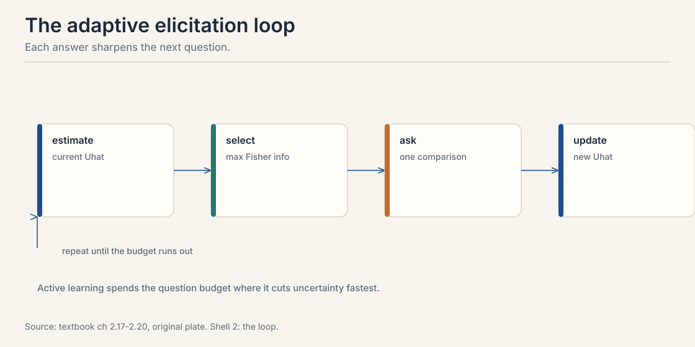
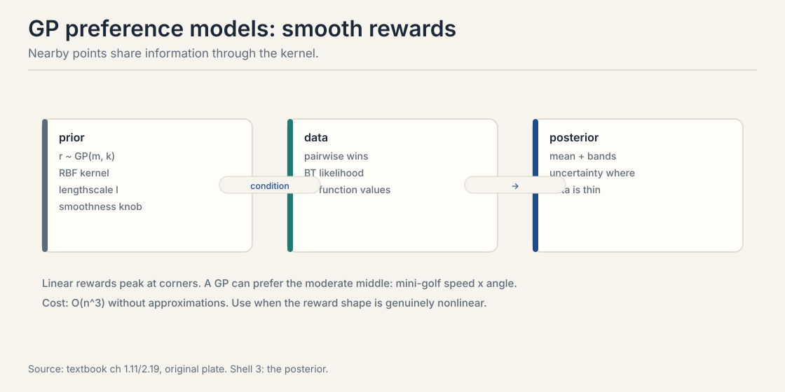

## The problem: questions cost money

Every label in this course costs an annotator's time and
attention. A preference dataset of 100,000 pairs is 100,000 paid
judgments. Lectures 2 through 4 assumed the pairs arrive. This
chapter asks which pairs to buy. Random pairs waste the budget
on questions whose answers you can already predict. The goal:
pick the queries that shrink your uncertainty fastest.

The key tool is **Fisher information**. For a parameter theta, it
measures how much one observation reveals about theta. Higher
information means tighter estimates from fewer questions. The
Cramer-Rao bound makes this precise: no unbiased estimator beats
the inverse information. Information is the currency. Spend it
well.

## First attempt: ask random pairs

The naive pipeline samples pairs uniformly and labels them all.
It works. It is also wasteful in a way you can measure. Suppose
your current model says A beats B with probability 0.95. You pay
for the label. The annotator says A, as expected. What did you
learn? Almost nothing. The answer was predictable. The budget is
gone anyway.

The waste has a number. For a Bernoulli observation with success
probability p, the Fisher information about the underlying
parameter is:

I = p * (1 - p)

Work it at three values.

```ascii
p = 0.90:  I = 0.90 x 0.10 = 0.09
p = 0.50:  I = 0.50 x 0.50 = 0.25
p = 0.10:  I = 0.10 x 0.90 = 0.09
```

The 50/50 question carries 0.25 units of information. The
predictable question carries 0.09. One well-chosen question is
worth nearly three wasted ones. Random sampling spends most of
the budget near 0.09. That is the failure, demonstrated.

## The key question

If information peaks at 50/50, can we choose each question to
sit at the current edge of our knowledge?

## The 50/50 rule, worked

Take the Rasch model from Lecture 1. A candidate item j has
acceptance probability p_j(U) = sigma(U + V_j) for a user of
ability U. The Fisher information about U from one response is
p_j(1 - p_j): the downward parabola from above, maximized at
p = 0.5. The most informative item is the one the user gets right
half the time. Too easy teaches nothing. Too hard teaches
nothing.

 peaks at p = 0.5. Worked: matched item gives I = 0.250, hard gives 0.197, easy gives 0.105. Source: original figure for Stanford Frontier AI.")

Worked example from the textbook. Estimated ability U-hat = 1.0.
Three candidate items: hard (V = -2.0), matched (V = -1.0), easy
(V = 1.0).

```ascii
hard:     p = sigma(1.0 - 2.0) = sigma(-1.0) = 0.269,  I = 0.197
matched:  p = sigma(1.0 - 1.0) = sigma(0.0)  = 0.500,  I = 0.250
easy:     p = sigma(1.0 + 1.0) = sigma(2.0)   = 0.881,  I = 0.105
```

Ask the matched item. Its difficulty, -V_j = 1.0, equals the
ability estimate. This is the principle behind computerized
adaptive testing: the SAT and GRE pick each question to sit at
your estimated level. Every question is a 50/50 bet against your
current belief.

> [!QA]
> Q: Why is a 50/50 question the most informative?
> A: Fisher information for a Bernoulli response is p(1-p), which peaks at p = 0.5 with value 0.25. A question the user always gets right or always wrong has information near zero: the answer was predictable. The 50/50 question splits the posterior most evenly, so the answer moves your estimate the most.
> Follow-up: What goes wrong if your ability estimate is bad?
> A: You ask at the wrong difficulty. Overestimate the user and every question looks hard: answers are near-deterministic failures, information collapses. The fix is the adaptive loop below: re-estimate after each answer so the difficulty tracks the improving estimate. Early questions should hedge across difficulties.

## The adaptive loop

One good question is not enough. Chain them.



1. **Estimate.** Current best guess of the parameter.
2. **Select.** The candidate query with max Fisher information.
3. **Ask.** Get the human's answer.
4. **Update.** Refit the estimate with the new data.

Repeat until the budget runs out. Each answer sharpens the next
question. The loop is greedy: it maximizes immediate information,
not the optimal sequence. Greedy is near-optimal here and far
simpler than planning the whole sequence.

> [!QA]
> Q: Why not plan the whole question sequence up front?
> A: Because answers change the plan. A surprising answer moves the estimate, which changes which question is most informative next. Pre-planned sequences cannot adapt. The greedy loop re-optimizes after each answer, which is why adaptive testing beats fixed forms with the same number of questions.
> Follow-up: When does greedy fail?
> A: When information is complementary: two questions together reveal more than the sum of their separate gains. Greedy picks the best single question and can miss synergistic pairs. In practice the loss is small for smooth parametric models, and the textbook's D-optimal simulations show greedy active selection beating random selection clearly.

## From one parameter to many: D-optimality

So far the parameter was one user's ability. Now learn a shared
weight vector W over item features: V_j = W^T X_j. The pair
probability is sigma(W^T (X_j - X_k)): logistic regression on
feature differences.

The Fisher information becomes a matrix. Each query adds a
rank-one update scaled by p(1-p). The 50/50 rule survives inside
the matrix: uncertain pairs contribute more. The selection
criterion is **D-optimality**: pick the pair maximizing the
log-determinant gain of the precision matrix.

logdet(Lambda + w x_jk x_jk^T) - logdet(Lambda), w = p(1-p)

D-optimality maximizes the information volume: it shrinks the
posterior ellipsoid fastest in all directions at once. The
textbook simulates this: 50 items, 5 features, 100 queries.
Active D-optimal selection beats random pairs on estimating W.
The margin is the payoff of the whole chapter.

### Subchapter: D-optimality, drawn and worked

Picture the posterior over W as an ellipse. Wide in a direction
means uncertain about that direction. Each query adds
information along its feature-difference direction x_jk, scaled
by w = p(1-p). The ellipse shrinks along that direction. The
D-optimal query is the one that shrinks the ellipse's volume
the most: maximize the log-determinant gain.


Work it in 2-D. Posterior precision Lambda = I, the identity:
the ellipse is a circle. Two candidate queries. Query 1 has
direction x = (1, 0) and p = 0.5, so w = 0.25. By the matrix
determinant lemma, the logdet gain is log(1 + w * x^T
Lambda^{-1} x) = log(1 + 0.25 * 1) = log(1.25) = 0.223. Query
2 has direction (0.71, 0.71) and p = 0.9, so w = 0.09: gain =
log(1 + 0.09 * 1) = 0.086. Query 1 wins by a factor of 2.6.
The 50/50 rule survives inside the matrix: the uncertain pair
contributes more, and the direction matters too. A query along
an already-precise direction adds little even at 50/50, because
x^T Lambda^{-1} x is small there.

## Asking well for flexible models

Parametric models have Fisher information. **Gaussian processes**
have posterior variance, which varies across the input space:
high far from data, low near it. The acquisition function for a
candidate query Q = (x_A, x_B) is the expected information gain
about the reward function:

a(Q) = H(y | D, Q) - E_r[H(y | r, Q)]

Two terms. Predictive entropy: how uncertain is the outcome under
the current model? High when p(A beats B) is near 0.5. Expected
conditional entropy: how uncertain would the answer be even
knowing the true reward? Low for clean comparisons, high for
inherently noisy ones.

The rule: ask where the model is uncertain but a human could
answer clearly. Skip queries where the model is certain, waste,
and queries where even the truth is noisy, unanswerable.



The textbook also sketches **active DPO**: DPO trains
billion-parameter policies, so exact Fisher information is
intractable. The ADPO algorithm approximates the policy locally
and selects pairs by approximate information gain. The principle
is unchanged. The computation is approximate.

## Mapping back: what active selection buys

| Random-sampling pain | Active answer | How |
|---|---|---|
| Budget spent on predictable answers | Ask at 50/50 | I = p(1-p) peaks at 0.25. predictable pairs sit near 0.09 |
| Fixed forms cannot react | Adaptive loop | Re-estimate after each answer. difficulty tracks belief |
| Many parameters, one rule | D-optimality | Max logdet gain shrinks the ellipsoid in all directions |
| Flexible models, no Fisher matrix | Information gain | Ask where the model is uncertain but the human is clear |

## The honest price: selection can bias

Active selection is not free. The queries it picks are not a
random sample, so naive estimators on actively collected data
can be biased. Greedy selection can miss complementary question
pairs. And the whole scheme assumes the model is right: if the
BT model is misspecified, the "most informative" query under a
wrong model teaches the wrong thing efficiently. Active learning
amplifies model errors as well as model gains. The textbook's
remedy: keep a stream of random queries as a reality check, and
re-examine the model when the active stream disagrees with it.

> [!QA]
> Q: Walk me through the Fisher information computation on the Rasch toy.
> A: Take the estimated ability U-hat = 1.0 and three candidate items with difficulties -V_j of 2.0 (hard), 1.0 (matched), -1.0 (easy). Step one: compute each acceptance probability. Hard: sigma(1.0 - 2.0) = sigma(-1.0) = 0.269. Matched: sigma(0) = 0.500. Easy: sigma(2.0) = 0.881. Step two: compute I = p(1-p) for each. Hard: 0.269 x 0.731 = 0.197. Matched: 0.25. Easy: 0.881 x 0.119 = 0.105. Step three: pick the max. The matched item wins with 0.250, worth 2.4 times the easy item. The rule in one line: ask the question the user gets right half the time.
> Follow-up: What if two items tie on information?
> A: Break the tie by coverage: pick the item whose feature direction is least explored so far, the D-optimal tiebreak. Or pick randomly between them. Ties are rare with continuous difficulties and harmless either way: both questions are near-optimal.

> [!QA]
> Q: You have a 10,000-label budget to train a reward model for RLHF. Spend it.
> A: Do not spend it all on random pairs. Reserve 2,000 labels as a random stream: the reality check that catches model misspecification. Spend the other 8,000 adaptively. Start with 1,000 random pairs to fit an initial BT reward model. Then loop: score candidate pairs by expected information gain under the current posterior, label the top batch, refit. Weight sampling toward pairs near 50/50 under the current model. Stratify prompts across task types so no category starves. Track held-out pairwise accuracy as the spend progresses. when it plateaus, stop early and bank the remainder. The failure to avoid: spending the whole budget up front on random pairs, which the lesson's arithmetic shows wastes roughly two thirds of the information.
> Follow-up: How do you know the adaptive loop is helping and not just adding bias?
> A: Compare against the random stream. Fit the model on the adaptive labels and on an equal-sized random subset, and evaluate both on a held-out set drawn randomly. If the adaptive fit wins, the selection is buying real information. If the random fit wins, the selection is chasing the model's own errors. Also watch for distribution shift: the adaptive stream oversamples hard pairs, so always evaluate on random pairs, never on the selected ones.

> [!QA]
> Q: What does the Cramer-Rao bound actually say, in plain words?
> A: It says no unbiased estimator can be more precise than the inverse Fisher information allows. If one observation carries I = 0.25 units of information, then n observations give you at most n x 0.25, and your estimator's variance cannot go below 1/(0.25n). It is a speed limit on learning. The practical use: it converts the information numbers into sample sizes. Want the standard error halved? You need four times the information, which means four times the well-chosen questions, or twelve times the wasted ones at I = 0.09.
> Follow-up: Does the bound apply to regularized estimators?
> A: No, only to unbiased ones. Regularized estimators trade bias for variance and can beat the bound on mean squared error. The bound still sets the intuition: information is the currency, and biased estimators spend it differently, not freely.

> [!QA]
> Q: Greedy picks the best single question. When does planning pairs beat it?
> A: When questions are complementary: two questions together reveal more than the sum of their separate gains. Example: two items whose difficulties bracket the ability estimate from above and below. Each alone is mildly informative. Together they pin the estimate from both sides, and the pair beats any two independent greedy picks. In practice the loss from greedy is small for smooth parametric models, and the textbook's simulations show greedy active selection beating random clearly. Plan pairs only when you have a concrete complementarity story. otherwise the greedy loop wins on simplicity.
> Follow-up: Is there a principled way to plan the whole sequence?
> A: Yes: Bayesian optimal experimental design over sequences, maximizing expected terminal information. It is intractable beyond tiny horizons: the decision tree branches on every possible answer. Approximations exist, lookahead with sampling, but the textbook's verdict stands: greedy is near-optimal here and far simpler. Spend the complexity budget on a better model, not a better planner.

> [!QA]
> Q: What is the random stream for, exactly, and how big should it be?
> A: The random stream is the control group of your elicitation experiment. Active selection optimizes under the current model. if the model is wrong, the selection efficiently teaches the wrong thing. Random queries are model-free: they estimate the truth without the selection filter. Size it at 10 to 20 percent of the budget. That is enough to detect a disagreement between the active and random estimates without wasting the budget's main force. If the two streams disagree, trust the random one and fix the model. The stream is insurance, and like all insurance it looks wasteful until the day it pays.
> Follow-up: Can the random stream be replaced by a fixed validation set?
> A: Partly. A fixed validation set checks the final model, but it does not check the selection process while it runs. The stream's value is temporal: it catches the model going wrong mid-budget, when you can still redirect the spend. A post-hoc validation set only tells you after the money is gone.

## Recap: the whole lesson on one screen

The story in eight steps. Each step answers the one before it.

1. **Questions cost.** Each label is an annotator's time.
   Random pairs spend it on predictable answers.
2. **Information is measurable.** I = p(1-p). The 0.9
   question carries 0.09. The 0.5 question carries 0.25.
   Nearly 3x the value.
3. **Ask at 50/50.** Match difficulty to the current
   estimate. The toy: hard 0.197, matched 0.250, easy 0.105.
   The SAT and GRE run this rule.
4. **Loop it.** Estimate, select, ask, update. Greedy is
   near-optimal and far simpler than planning ahead.
5. **Many parameters: D-optimality.** Max the logdet gain.
   Shrink the ellipsoid in all directions. 50 items, 5
   features, 100 queries: active beats random.
6. **GPs use information gain.** Predictive entropy minus
   expected conditional entropy. Uncertain model, clear
   human.
7. **Active DPO approximates.** Billion parameters break
   exact Fisher. Approximate locally, select greedily.
8. **The price is bias.** Selected queries are not random.
   Keep a random stream. A wrong model teaches the wrong
   thing fast.

## Official sources and further reading

**Official:**
- Active Learning and Iterative Improvement (external explainer,
  video id eAtBuZHTl40): the iterative active-learning loop in
  production.
- Course textbook, chapters 5.x: Fisher information, the 50/50
  rule, the adaptive loop, D-optimality, GP acquisition, ADPO. [link](https://mlhp.stanford.edu/Machine-Learning-from-Human-Preferences.pdf)

**Further reading:**
- Chaloner and Verdinelli (1995): the Bayesian experimental
  design reference behind the information-gain rule.

**Caveats from these sources.** The 50-item, 5-feature,
100-query simulation is the textbook's illustration. The
Cramer-Rao bound applies to unbiased estimators. regularized
estimators trade bias for variance. ADPO is sketched in the
textbook, not derived in full.

## Connections to the other courses

- **CS329H L01:** the Rasch model whose p(1-p) starts the
  chapter.
- **CS329H L04:** the posterior variance from Bayes is what
  active selection spends.
- **CS329H L06:** the same information rule picks duels in
  preferential Bayesian optimization.
- **CS329H L07:** active DPO selects pairs for the alignment
  loop.
- **CS329H L09:** annotation budgets are mechanism design.
  elicitation and incentives are one story.
