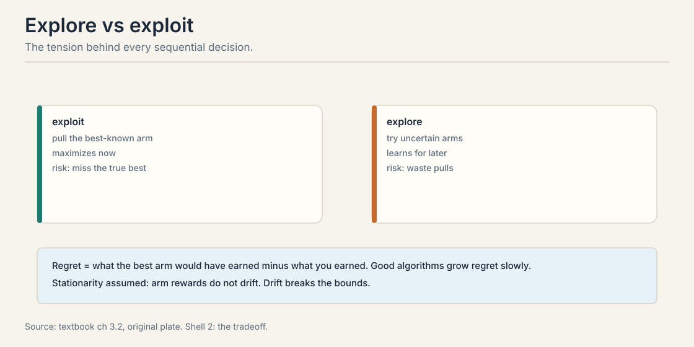
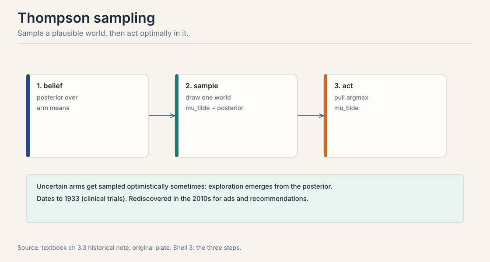
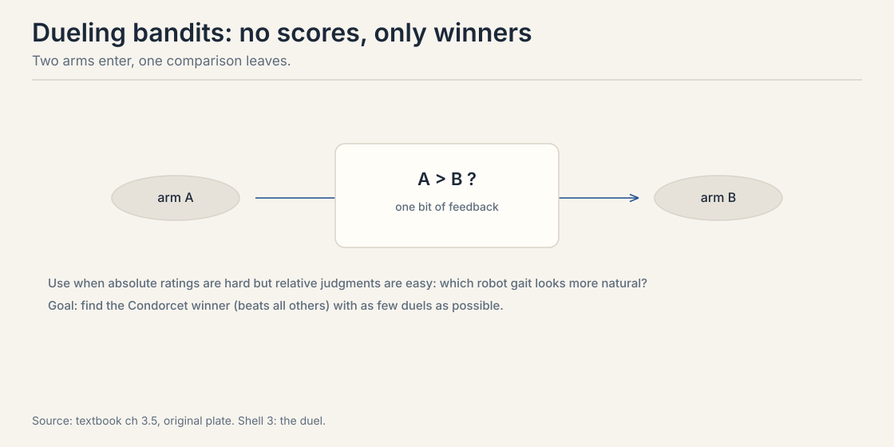
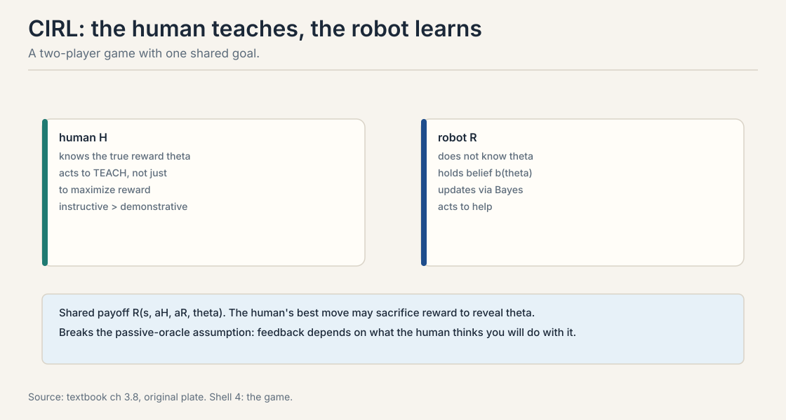

## The problem: choosing is not predicting

Every lesson so far predicted: which item wins, with what
probability. Now act. You run a website with two homepage
layouts. Each visitor sees one layout. A good layout earns a
click with some unknown probability. Your job: maximize total
clicks over the next 10,000 visitors.

Prediction alone does not solve this. Knowing layout A clicks at
0.8 and B at 0.5 is the end of the story only if you already know
the numbers. You do not. You must learn them by trying, and every
try on the worse layout costs clicks. This is the **bandit**
problem: each round you pick an item, an arm, and observe
feedback. Item values are fixed but unknown. The goal is total
reward over rounds, not a good estimate.

## First attempt: always play the current best

The naive policy: try each arm a few times, then play the winner
forever. This is pure exploitation. Watch it fail on a toy.

```ascii
arm A: 8 wins in 10 pulls   (observed rate 0.80)
arm B: 1 win in 2 pulls     (observed rate 0.50)
```

Greedy commits to A. B gets two pulls and is abandoned. But B's
true rate is barely measured. Model B's unknown rate with a
Beta(2, 2) posterior: 1 win and 1 loss plus a uniform prior. The
probability that B's true rate exceeds 0.80:

```ascii
Beta(2,2) density: 6x(1-x)
P(theta > 0.80) = 1 - 6[x^2/2 - x^3/3] from 0 to 0.80
                = 1 - 6(0.32 - 0.1707)
                = 1 - 0.896 = 0.104
```

About 10%. Greedy has a 1-in-10 chance of locking onto the wrong
arm forever, after just 2 pulls of the alternative. The failure
is structural: exploitation maximizes now but may miss the true
best permanently. Pure exploration has the mirror failure: it
keeps pulling known-bad arms and wastes the budget. The tension
is **exploration versus exploitation**, and every algorithm in
this chapter is a way to price it.

**Regret** is the scorecard. It equals what the best arm would
have earned minus what you earned. Good algorithms grow regret
slowly: logarithmically in the number of rounds, not linearly.
One assumption underlies the bounds: **stationarity**. Arm
rewards do not drift. When preferences drift, tastes evolve or
models update, the bounds break and algorithms must discount old
data.



> [!QA]
> Q: What is the exploration-exploitation tradeoff?
> A: Exploitation uses current knowledge to maximize immediate reward. Exploration sacrifices immediate reward to gain information for future rounds. Pure exploitation can lock onto a suboptimal arm forever: the toy shows a 10% chance after 2 pulls. Pure exploration wastes pulls on arms already known to be bad. Bandit algorithms balance the two, and regret quantifies how well: the gap between your total reward and the best arm's.
> Follow-up: Why does stationarity matter?
> A: Every regret bound assumes the best arm stays the best. If rewards drift, past observations mislead and the bounds are void. Real systems handle drift by discounting old data with sliding windows or decaying weights, or by detecting change points. Elo's K-factor does this implicitly: high K forgets fast.

## The key question

Can an algorithm explore exactly as much as its uncertainty
warrants, no more, no less, without a hand-tuned exploration
knob?

## Thompson sampling: sample a world, act in it

The textbook's central algorithm is **Thompson sampling** from
1933, revived in the 2010s for ads and recommendations. Three
steps per round.



1. **Belief.** Hold a posterior over arm means. For the toy:
   A ~ Beta(9, 3), B ~ Beta(2, 2).
2. **Sample.** Draw one plausible world from the posterior. One
   draw might give A = 0.75, B = 0.62. Another might give A =
   0.72, B = 0.85.
3. **Act.** Pull the best arm in the sampled world.

Exploration emerges automatically. B's posterior is wide, so B
samples high about 10% of the time, and B gets pulled about 10%
of the time. Each pull narrows B's posterior. If B is truly
worse, its optimistic draws dry up and the algorithm commits to
A. If B is truly better, the pulls reveal it. No explicit
exploration bonus is needed. No tuning knob sets the rate.

This is **probability matching**: each arm is pulled with the
probability that it is the best. Uncertainty becomes action
probability. The posterior from Lecture 4 is not decoration
here. It is the engine.

> [!QA]
> Q: Why does Thompson sampling explore without an exploration bonus?
> A: The posterior encodes uncertainty as width. Sampling from it turns uncertainty into action probability: wide posteriors produce occasional optimistic draws, which trigger pulls, which narrow the posterior. Exploration is probability matching: each arm is pulled with the probability that it is the best. No bonus term, no tuning.
> Follow-up: When does Thompson sampling fail?
> A: With a bad prior or a misspecified model. If the prior rules out the true best arm with zero mass, no amount of sampling finds it. With non-stationary rewards, the posterior concentrates on stale data. Both failures are prior problems, not algorithm problems: the method is only as good as its beliefs.

### Subchapter: UCB, the bonus method

Thompson sampling explores by sampling. **UCB** (upper confidence
bound) explores by adding a bonus. Each round, pull the arm with
the highest optimistic score:

score = observed mean + sqrt(2 ln t / n)

t is the total pulls so far, n is this arm's pulls. The bonus
shrinks as the arm gets pulled: uncertainty falls with evidence.
Pull an arm either because its mean is high (exploit) or because
its bonus is high (explore). One formula, both motives.


Work it on the toy. Twelve total pulls. A: 8/10, mean 0.80. B:
1/2, mean 0.50. The exploration term: 2 ln 12 = 4.97.

```ascii
A: 0.80 + sqrt(4.97 / 10) = 0.80 + 0.705 = 1.505
B: 0.50 + sqrt(4.97 / 2)  = 0.50 + 1.576 = 2.076
```

B wins and gets pulled. The bonus did its job: B's two pulls
are thin evidence, so the algorithm stays curious. Compare with
Thompson sampling on the same toy: B gets pulled about 10% of
the time, the posterior probability it is best. UCB is
deterministic optimism. Thompson is probabilistic matching. Both
achieve logarithmic regret. UCB needs no prior but needs the
bonus tuned to the reward scale. Thompson needs a prior but no
bonus knob. In practice, Thompson usually wins on real problems
and UCB wins on whiteboards.

### Subchapter: the regret bound, worked

"Logarithmic regret" is a bound with numbers inside. The
standard UCB bound for one suboptimal arm with gap Delta says
the expected number of pulls of that arm is at most
(8 ln n) / Delta^2, plus a constant. Multiply by Delta to get
regret: at most 8 ln n / Delta, plus (1 + pi^2/3) Delta.

Work it. Two arms, true means 0.8 and 0.5, gap Delta = 0.3.

```ascii
n = 100:      regret <= 8 x 4.61 / 0.3 + 1.29  = 124.1
n = 10,000:   regret <= 8 x 9.21 / 0.3 + 1.29  = 246.9
n = 100,000:  regret <= 8 x 11.51 / 0.3 + 1.29 = 308.3
```

Read the column. Multiplying the horizon by 100, from 100 to
10,000 rounds, roughly doubles the bound: 124 to 247. Another
factor of 10 adds only 61. That is what logarithmic means in
practice. The algorithm's total mistakes grow with the log of
time, so the per-round mistake rate falls toward zero.

Two preconditions the bound needs. Rewards are bounded, the
[0, 1] click case qualifies, and the arm means are stationary.
Break stationarity and the bound is void: the proof counts how
often a fixed suboptimal arm gets pulled, and a drifting best
arm is a different problem. The constant 8 comes from the bonus
coefficient sqrt(2 ln t / n): change the bonus, change the
constant. The shape, ln n over the gap, survives.

The interview reading: when someone says "UCB has logarithmic
regret," ask for the gap dependence. Small gaps are expensive:
halve Delta from 0.3 to 0.15 and the bound doubles, because
near-tied arms need many pulls to separate. The bound is
honest about where the difficulty lives.

## Dueling bandits: no scores, only winners

Sometimes absolute rewards are unavailable but pairwise
comparisons are easy. Which robot gait looks more natural? Which
summary reads better? Asking a human to score a gait 7.3 out of
10 is unanchored. Asking which of two gaits looks more natural is
stable. The **dueling bandit** picks two arms per round and
observes only the winner.



The goal is the **Condorcet winner**: the arm that beats every
other arm pairwise. Algorithms duel promising candidates against
each other and eliminate losers. Sample complexity counts duels,
not pulls.

This is the bandit analogue of Lecture 2's pairwise data, and
everything transfers. Bradley-Terry models the duel outcomes.
The posterior over utilities drives selection. The same
heterogeneity warnings from Lecture 3 apply: a mixed population
of judges produces compromise winners.

## Preferential Bayesian optimization

**Bayesian optimization** finds the optimum of an expensive
black-box function with few evaluations. The preferential
version handles the human case: you cannot query the function
value, only pairwise comparisons. Which of these two designs is
better? Which trajectory looks more natural?

A **Gaussian process** models the latent preference function.
Each duel updates the GP posterior through a Bradley-Terry
likelihood. The acquisition function picks the next duel by
expected information gain. This is Lecture 5's rule in new
clothes: ask where the model is uncertain but a human could
answer clearly.

Use preferential BO when comparisons are genuinely easier than
ratings, when rating scales are unanchored across evaluators, or
when the goal is finding the best option rather than estimating
the whole function. When scalar feedback is available and
reliable, standard BO needs fewer queries: one number constrains
the function more than one comparison bit.

> [!QA]
> Q: When is pairwise feedback better than scalar feedback for optimization?
> A: When humans judge differences better than magnitudes. Rating a robot trajectory 7.3 out of 10 is unanchored: one evaluator's 7 is another's 9. Saying trajectory A looks more natural than B is stable across evaluators. Preferential BO wins when the rating scale is the problem. It loses when good scalars exist, because each scalar carries more information than one comparison bit.
> Follow-up: What does the GP buy over a parametric model here?
> A: Flexibility about the reward shape. A linear model peaks at corners of the feasible region. A GP with an RBF kernel can express "the moderate middle is best," which is the common human preference for tuned parameters like speed and angle. The cost is O(n^3) scaling without approximations.

## The strategic human: CIRL (cooperative inverse reinforcement learning)

Every algorithm so far treats the human as a passive oracle: it
answers queries but does not strategize. Real humans do. An
annotator may pick the harder example deliberately to teach the
system. A user may change behavior based on what they think the
system is learning.

**Cooperative inverse reinforcement learning** (CIRL) models this
as a two-player game. The human knows the true reward parameters
theta. The robot does not, but holds a belief and updates it.
Both share the payoff. The human's optimal move is not just to
demonstrate good behavior but to teach: instructive actions that
reveal theta can beat expert demonstrations that merely maximize
immediate reward.



The lesson for preference learning: feedback depends on what the
human believes you will do with it. Elicitation that ignores this
gets gamed. An annotator who suspects the system rewards
verbosity writes verbose answers, and you learn verbosity as
quality. Mechanism design in Lecture 9 is the other half of the
answer.

> [!QA]
> Q: What breaks when you treat the human as a passive oracle?
> A: You misread strategic feedback as sincere. An annotator who suspects the system rewards verbosity writes verbose answers, and you learn verbosity as quality. A user who knows they are being measured changes what they do. CIRL says: model the human as optimizing given their beliefs about you, and design queries that stay informative under that model.
> Follow-up: How does CIRL change practice?
> A: It pushes toward teaching-aware elicitation: queries designed so that even a strategic human reveals the most. It also justifies humility about learned rewards: if feedback was strategic, the reward model captures the strategy, not the preference. The inversion problem of Lecture 10 starts here.

> [!QA]
> Q: Walk me through three rounds of Thompson sampling on the layout toy.
> A: Arms: A with posterior Beta(9,3), B with Beta(2,2). Round 1: sample A = 0.75, B = 0.62. A wins the sample, pull A. Visitor clicks. Posterior becomes Beta(10,3). Round 2: sample A = 0.71, B = 0.85. B wins the sample, pull B. No click. Posterior becomes Beta(2,3). Round 3: sample A = 0.78, B = 0.45. Pull A. Each round, the arm pulled is the best arm in one plausible world. B's wide posterior gave it a 10% chance per round. after the failure its posterior narrowed and its chances fell. No exploration parameter was set anywhere. The posterior's width is the exploration schedule.
> Follow-up: What changes with a stronger prior on B, say Beta(20,20)?
> A: B's posterior concentrates near 0.5 and samples high rarely. Exploration of B nearly stops. If B is truly better, the algorithm may never learn it. The prior is not a formality: it sets the exploration budget. This is why Thompson sampling fails with a bad prior, as the earlier follow-up notes.

> [!QA]
> Q: Design the homepage experiment. Two layouts, 10,000 visitors, minimize lost clicks.
> A: Do not run a fixed 50/50 A/B test: it wastes half the visitors on the worse layout after the winner is clear. Run Thompson sampling. Model each layout's click rate with a Beta posterior, starting Beta(1,1). Each visitor sees the layout sampled as best from the posteriors. Early on, traffic splits near 50/50 while uncertainty is high. As evidence accumulates, traffic shifts toward the winner automatically. Expected regret grows logarithmically, not linearly. Add two guardrails: a minimum 5% traffic to each layout for the first 500 visitors so neither posterior starts from noise, and a stationarity check, because layout performance drifts with time of day and day of week. If drift is detected, discount old observations.
> Follow-up: The product manager wants a p-value at the end. What do you say?
> A: The bandit does not produce one, and that is fine. Report the posterior probability that each layout is best and the expected loss from choosing wrong. If they need a fixed-sample test for a launch decision, run the bandit for learning and a short confirmatory A/B after. Do not contaminate the learning phase with peeking at p-values: the video linked above explains why the peeking problem vanishes under the Bayesian framing.

> [!QA]
> Q: Dueling bandits or standard A/B testing: when does the duel win?
> A: The duel wins when absolute scores are unanchored but pairwise judgments are stable. Which robot gait looks more natural, which summary reads better: ask for a score and you get one evaluator's 7 is another's 9. Ask for a winner and the answers agree. The duel also wins when the goal is finding the best arm rather than estimating all arms: duels eliminate losers directly. A/B testing wins when good scalars exist: revenue per visitor, click-through with calibrated tracking. One number constrains the estimate more than one comparison bit, so scalar feedback needs fewer samples for the same precision.
> Follow-up: What is the sample complexity of finding the Condorcet winner?
> A: It scales with the number of arms and the inverse squared gaps, like standard bandits, but counts duels instead of pulls. The textbook's treatment keeps the comparison structure: Bradley-Terry models the duel outcomes, the posterior over utilities drives selection, and the same heterogeneity warnings from Lecture 3 apply. A mixed judge population produces compromise winners, so check who is judging before trusting the crown.

## RL in one paragraph

Bandits are single-step. Full reinforcement learning adds
states: early actions influence later states. The MDP (Markov
decision process) tuple is states, actions, transitions, rewards, discount, and the initial
distribution. The objective maximizes expected discounted return.
Policy gradients climb it.

This stays brief on purpose. The deep mechanics, PPO, KL
control, advantage estimation, belong to CS336 L15. What CS329H
adds is the preference framing: in RLHF the reward is not given,
it is learned from human comparisons, and every RL step inherits
the choice-theoretic assumptions of Lectures 2 and 3. The
textbook also develops GRPO, group relative policy
optimization, as the modern method connecting policy gradients to
Bradley-Terry: advantages computed within groups of sampled
responses play the role of pairwise comparisons.

## Mapping back: what acting adds to predicting

| Prediction-only pain | Bandit answer | How |
|---|---|---|
| Greedy locks onto the wrong arm | Thompson sampling | Pull each arm with P(it is best). the toy's 10% gets tested, then resolved |
| Scores are unanchored | Dueling bandits | Two arms per round, one bit. BT models the duels |
| Function values unqueryable | Preferential BO | GP prior, BT likelihood on duels, information gain picks the next pair |
| Humans strategize | CIRL | Model the teacher, not just the oracle. design teaching-aware queries |

## The honest price: the world moves

Stationarity underlies every bound here. Tastes evolve, models
update, annotators learn the system. When the best arm changes,
posteriors concentrate on stale data and Thompson sampling
confidently pulls yesterday's winner. The fix is discounting:
sliding windows, decaying weights, change detection. Elo's
K-factor does this implicitly. The second price: regret still
grows. Logarithmic is slow, not zero. Exploration always costs
something, and the bill is denominated in the very reward you
are maximizing.

## Recap: the whole lesson on one screen

The story in eight steps. Each step answers the one before it.

1. **Choosing is not predicting.** Two layouts, unknown click
   rates, 10,000 visitors. Learn by trying. Tries cost clicks.
2. **Greedy can lock in wrong.** A: 8/10. B: 1/2. P(B's true
   rate > 0.8) = 0.104. Greedy abandons B with a 10% chance of
   permanent error.
3. **Regret is the scorecard.** Best arm's earnings minus
   yours. Good algorithms grow it logarithmically. Assume
   stationarity.
4. **Thompson sampling probability-matches.** Sample a world
   from the posterior, act optimally in it. Wide posteriors
   earn pulls. No bonus, no knob.
5. **Duels replace scores.** Two arms per round, one winner.
   Find the Condorcet winner. BT models the outcomes.
6. **PBO compares, not rates.** GP over the latent function,
   BT likelihood on duels, information gain picks the next
   pair. Use when ratings are unanchored.
7. **Humans teach.** CIRL: the human knows theta, the robot
   learns it. Instructive actions beat demonstrations.
   Strategic feedback needs strategic elicitation.
8. **The price is drift.** Stationarity fails in the wild.
   Discount old data. Regret grows slowly but never stops.

## Go deeper

<div style="position:relative;padding-bottom:56.25%;height:0;overflow:hidden;max-width:100%;margin:16px 0;">
<iframe style="position:absolute;top:0;left:0;width:100%;height:100%;" src="https://www.youtube-nocookie.com/embed/dPSEIrlJizc" title="Understanding Bayesian A/B Testing, Practical stats" frameborder="0" allow="accelerometer; autoplay; clipboard-write; encrypted-media; gyroscope; picture-in-picture" allowfullscreen></iframe>
</div>
- Bayesian A/B Testing (Thompson sampling in production): https://www.youtube.com/watch?v=dPSEIrlJizc
- Course textbook (Truong, Haupt, Koyejo): https://mlhp.stanford.edu/Machine-Learning-from-Human-Preferences.pdf
- Thompson (1933): the original sampling paper.
- Hadfield-Menell et al. (2016): cooperative inverse reinforcement learning.

## Official sources and further reading

**Official:**
- Course textbook, chapter 3.x: bandits, Thompson sampling,
  dueling bandits, preferential BO, CIRL, the GRPO connection.

**Further reading:**
- Thompson (1933): the original sampling paper.
- Hadfield-Menell et al. (2016): cooperative inverse
  reinforcement learning.

**Caveats from these sources.** The Beta(2,2) toy is worked here
from the textbook's 8/10 and 1/2 example. the 0.104 figure is
arithmetic, not a textbook quote. The logarithmic regret claim
summarizes standard bandit bounds. constants depend on the
algorithm and the gap. The RL section is intentionally brief.
mechanics live in CS336 L15.

## Connections to the other courses

- **CS329H L04:** the posterior that Thompson sampling samples
  from. Elo as the online idea.
- **CS329H L05:** the information-gain rule reused for duel
  selection in PBO.
- **CS329H L07:** RLHF inherits every assumption here. the
  reward is learned, then optimized.
- **CS329H L09:** strategic humans need mechanism design. CIRL
  is the cooperative half.
- **CS336 L15:** PPO, KL control, and policy gradients in full.
