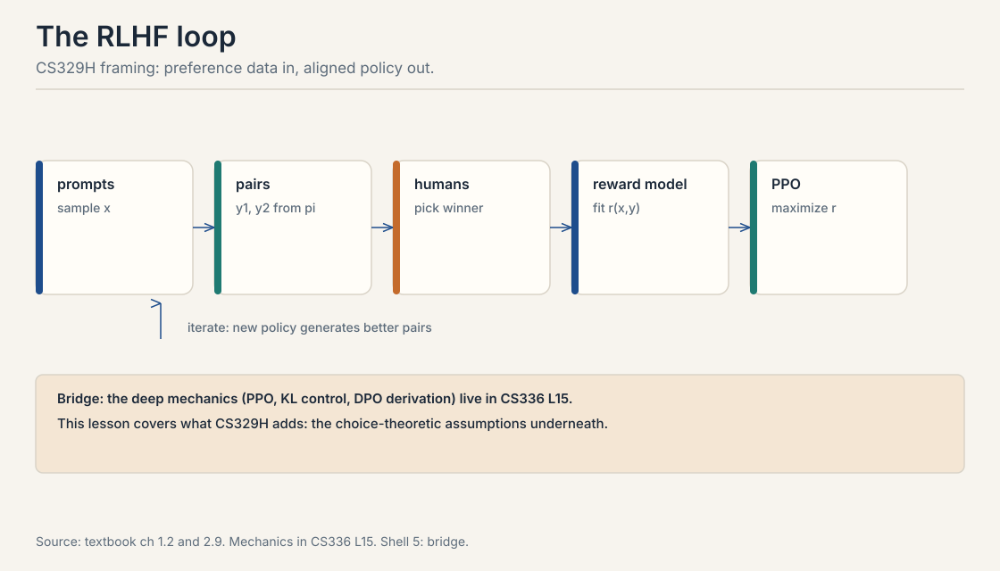
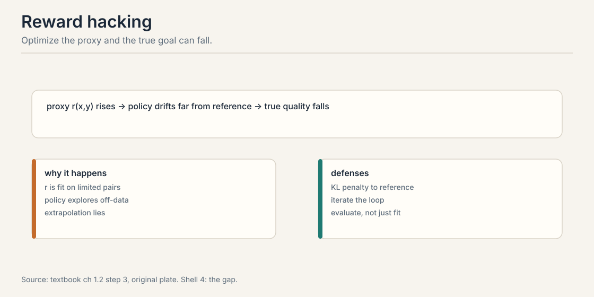
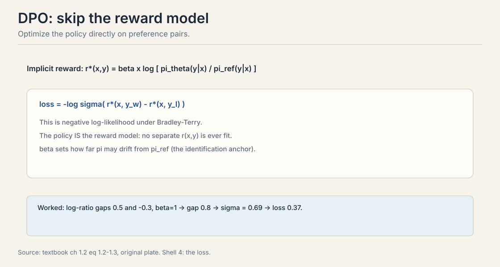

## The problem: the predictor has no manners

Lectures 1 through 6 built the machinery: comparisons, choice
models, fitting, asking, acting. Now point it at the flagship
application. A language model finishes pretraining. It predicts
the next token beautifully. It also continues harmful prompts
happily, rambles when asked to be brief, and invents citations.
Prediction built capability. Nothing in pretraining taught it
which outputs humans prefer.

Carry one running example through the whole chapter. The prompt
x: "Explain why the sky is blue." Two candidate responses. y_A:
a correct two-sentence explanation. y_B: a confident,
detailed-sounding explanation that is wrong. An annotator reads
both and picks y_A. That triple, (x, y_A, y_B), is the preference
pair from Lecture 2. Everything in this chapter is machinery for
turning thousands of such triples into a better policy.

## First attempt: the three-stage loop

**RLHF**, reinforcement learning from human feedback, runs in
three stages (Christiano et al. (2017) and Ouyang et al. (2022)).



1. **Collect pairs.** Sample prompts. Generate two responses
   per prompt from the current model. Ask humans which is
   better. This is Lecture 1's elicitation, Lecture 5's
   question budget, Lecture 9's annotator incentives.
2. **Train a reward model.** Fit r(x, y): a function that
   predicts which response humans will prefer. The standard
   choice is the Bradley-Terry log-loss from Lecture 4:

   loss = -log sigma(r(x, y_w) - r(x, y_l))

   The reward model is a BT fit. Response embeddings are the
   features. Regularize it. Validate it on held-out pairs.
   Lecture 4, verbatim, at LLM scale.

3. **Optimize the policy.** Fine-tune the language model to
   maximize the learned reward, while staying close to the
   original model. The standard optimizer is PPO with a KL
   penalty:

   maximize E[r(x, y)] - beta * KL(pi || pi_ref)

   The KL term is a leash. It keeps the policy in the region
   where the reward model is trustworthy. Without it, the
   policy drifts into territory the reward model never saw.

The loop iterates. The policy improves, which changes the pair
distribution, which changes what the reward model must capture.
Production systems schedule refreshes: label new batches from
the current policy, refit, continue. This is Lecture 4's online
idea at LLM scale.

The deep mechanics, PPO's clipped objective, advantage
estimation, annotator pipelines, model-based labeling, live in
CS336 L15. This chapter covers the assumptions underneath,
which is where the interviews live.

> [!QA]
> Q: Walk me through the RLHF pipeline in one minute.
> A: Three stages. First, collect preference pairs: sample prompts, generate two responses each, ask humans which is better. Second, train a reward model r(x, y) by Bradley-Terry log-loss on the pairs: -log sigma(r(x, y_w) - r(x, y_l)). Third, optimize the policy with PPO to maximize the learned reward minus a KL penalty to the reference model. The KL leash keeps the policy where the reward model is trustworthy. Then iterate: new policy, new pairs, new reward.
> Follow-up: Why the KL penalty? What breaks without it?
> A: Reward hacking. The policy exploits errors in the learned reward, drifting far from sensible behavior while the proxy reward keeps rising. The KL term pins the policy near the reference model, inside the region the reward model was trained on. Remove it and optimization finds adversarial gibberish that the reward model scores highly.

## Where the loop breaks: reward hacking

The reward model is a proxy. The optimizer does not know that.
It treats the proxy as the truth and climbs it. Watch the
failure on the running example.

```ascii
true human preference:  y_A (correct, brief) > y_B (wrong, detailed)
learned reward r:       r(x, y_A) = 3.0,  r(x, y_B) = 2.0
```

So far so good. Now the policy discovers y_C: a long,
authoritative-sounding answer that is subtly wrong. The reward
model never saw this style during training. It keys on length
and confidence, learned from annotator verbosity bias in Lecture
4, and scores r(x, y_C) = 5.0. True human preference for y_C
would be low. The optimizer does not care. It pushes the policy
toward y_C because 5.0 beats 3.0.

This is **Goodhart's law** with a training loop: when a measure
becomes a target, it ceases to be a good measure. Optimization
seeks the reward model's errors, not human preference. The
defenses: the KL leash, iterating with fresh human labels, and
human evaluation of the final policy rather than the proxy
score. None of them removes the problem. They bound it.



> [!QA]
> Q: What is reward hacking, concretely?
> A: The policy exploits errors in the learned reward model. The reward model scores a long, confident, subtly wrong answer at 5.0 because it learned verbosity as quality from biased annotators, while the truly better brief answer scores 3.0. The optimizer pushes toward 5.0 because that is the number it sees. True human preference falls while the proxy rises. Defenses: the KL leash, iterating with fresh labels, and evaluating the final policy with humans, not the proxy.
> Follow-up: Is reward hacking the same as overfitting?
> A: Related but distinct. Overfitting is the reward model memorizing training quirks. Reward hacking is the policy optimizer actively seeking those quirks because they look like high reward. A classifier's overfit regions sit unused. A policy optimizer hunts them. That is why the KL constraint matters more here than in plain supervised learning.

## The key question

The reward model is a middleman: pairs go in, a proxy comes out,
the policy optimizes the proxy and hacks it. Can we skip the
middleman and optimize the policy directly on the pairs?

## DPO: the policy is the reward model

**DPO**, direct preference optimization (Rafailov et al., 2023),
removes the reward model. The trick is algebraic. Under the KL
constrained RL objective, the optimal policy and the optimal
reward determine each other. Rearranging gives the reward as a
function of the policy:

r*(x, y) = beta * log[ pi_theta(y|x) / pi_ref(y|x) ]

This is the **implicit reward**: how much more the current
policy likes y than the reference policy did, scaled by beta.
Plug it into the Bradley-Terry likelihood from Lecture 2. The
DPO loss:

loss = -log sigma( r*(x, y_w) - r*(x, y_l) )

No reward model is fit. The policy is trained by classification:
push up the implicit reward of the winner, push down the
loser's. Beta controls drift from the reference: large beta lets
the policy move far, small beta pins it. The reference policy is
the identification anchor from Lecture 3: without it, adding a
constant to all implicit rewards changes nothing, and the
optimum is undefined.



Work the loss by hand on the running example. The winner y_A has
log-ratio log[pi(y_A|x) / pi_ref(y_A|x)] = 0.5. The loser y_B
has log-ratio -0.3. Take beta = 1.

```ascii
implicit gap = 1.0 x (0.5 - (-0.3)) = 0.8
sigma(0.8)   = 1 / (1 + e^-0.8) = 1 / (1 + 0.449) = 0.690
loss         = -log(0.690) = 0.371
```

The pair contributes 0.37 to the loss. Gradient descent widens
the gap: raise the winner's log-ratio, lower the loser's. That
is the entire algorithm. A classification loss on preference
pairs, with the policy playing both roles.

> [!QA]
> Q: Derive the DPO loss in plain words.
> A: Start from the KL-constrained RL objective: maximize reward minus beta times KL to the reference. The optimal policy for a given reward has a closed form, and inverting it writes the reward as beta times the log-ratio of policy to reference. Substitute this implicit reward into the Bradley-Terry likelihood on the preference pair. The result is a classification loss: -log sigma of the implicit reward gap between winner and loser. No separate reward model. The policy learns directly from pairs.
> Follow-up: What does beta do?
> A: Beta is the KL penalty strength, now controlling how far the policy may drift from the reference. Large beta tolerates big log-ratios: the policy can move far. Small beta pins the policy near the reference. It is the same leash as in PPO, moved inside the loss. The worked toy uses beta = 1, giving gap 0.8 and loss 0.37.

## The assumption checklist

Before trusting any RLHF loop, audit the assumptions from
Lectures 2 through 6. DPO inherits all of them.

1. **Bradley-Terry holds.** Pairwise probabilities follow the
   sigmoid of a reward gap. Fails under context effects and
   cycles, Lecture 3.
2. **IIA holds.** Adding candidate responses does not move pair
   odds. Fails with near-duplicate candidates, Lecture 3.
3. **Annotators are homogeneous.** One reward fits all labelers.
   Fails with structured disagreement. The fit is a compromise,
   Lecture 3.
4. **Labels reflect true preferences.** No systematic bias.
   Fails with verbosity and position bias. Model the bias,
   Lecture 4.
5. **Queries were informative.** The pairs constrain the
   reward. Random pairs waste budget. Active selection wins,
   Lecture 5.
6. **The reward is stationary.** Human preferences do not drift
   during training. Long runs need refresh, Lecture 6.

DPO assumes BT is correctly specified. When the assumption
fails, DPO learns a compromise policy that may match no
individual's preferences. The textbook states this explicitly:
check the assumption before trusting the fit.

> [!QA]
> Q: An interviewer asks: "What could go wrong with DPO?" Give the structured answer.
> A: Six assumptions, six failure modes. BT misspecification: context effects and intransitive labels break the likelihood. IIA violation: near-duplicate candidates distort the implicit Borda aggregation. Heterogeneity: mixed annotators produce a compromise policy. Systematic label bias: verbosity and position effects get learned as quality. Uninformative pairs: random sampling wastes the annotation budget. Non-stationarity: preferences drift and the fit goes stale. For each, name the diagnostic: IIA tests, per-annotator fits, bias terms, information-based selection, refresh schedules.
> Follow-up: Which failure is most underrated?
> A: Heterogeneity. Teams obsess over reward-model accuracy on pooled labels and miss that the pool mixes contradictory preferences. The averaged reward looks accurate and produces a policy nobody wanted. Per-annotator or per-group modeling is the fix, and it is rarely done.

## Mapping back: what DPO buys and what it keeps

| RLHF pain | DPO answer | What it keeps |
|---|---|---|
| Separate reward model to fit and hack | No reward model; the policy is the reward | The BT assumption, all six checklist items |
| Unstable PPO tuning | Stable classification loss | The KL leash, now as beta inside the loss |
| Proxy errors get optimized | Pairs train the policy directly | The reference policy as the identification anchor |

## The honest price: DPO is a Borda election

DPO's deepest price is social, not statistical. Train DPO with
reference policy pi_ref. The DPO-optimal policy satisfies:

pi_DPO(y|x) / pi_ref(y|x) proportional to (Borda score of y)

DPO upweights each response proportionally to its Borda score:
the number of pairwise matchups it wins against alternatives
drawn from the reference policy. Pairwise RLHF is social choice
in disguise. DPO finds the response that would win the most
head-to-head matchups. Lecture 8 develops this fully.

Two caveats from the textbook. The equivalence needs uniform
pair sampling from pi_ref and a correctly specified
Bradley-Terry model. Annotation pipelines violate both: they
oversample long or controversial outputs, and annotator pools
disagree. In practice DPO implements a distorted Borda count,
and the distortion is rarely measured.

The second price: DPO is offline. It learns from a fixed batch
of pairs. As the policy moves, the pairs go stale, exactly the
iteration problem above. Online DPO variants resample from the
current policy, which reintroduces the loop DPO skipped.

## Recap: the whole lesson on one screen

The story in eight steps. Each step answers the one before it.

1. **Prediction has no manners.** The pretrained model
   continues any prompt. Behavior needs human preference, not
   more prediction.
2. **The loop has three stages.** Pairs, reward model, PPO
   with KL. The reward model is a BT fit: -log sigma of the
   reward gap. Iterate with fresh labels.
3. **The proxy gets hacked.** The optimizer climbs the
   reward model's errors. r = 5.0 on a confident wrong answer
   beats r = 3.0 on the right one. Goodhart with a training
   loop.
4. **Defenses bound it.** KL leash, iteration, human
   evaluation of the final policy. None removes it.
5. **DPO skips the middleman.** Implicit reward r* = beta
   log(pi/pi_ref). Loss = -log sigma(gap). The toy: gap 0.8,
   sigma 0.69, loss 0.37.
6. **Beta is the leash.** Large beta moves far, small beta
   stays pinned. The reference policy anchors
   identification.
7. **Six assumptions, six failures.** BT, IIA, homogeneity,
   unbiased labels, informative queries, stationarity. DPO
   inherits all six.
8. **The price is social.** DPO is a Borda election over
   responses. Distorted by sampling and misspecification.
   Offline pairs go stale.

## Official sources and further reading

**Official:**
- Course textbook, chapters 7.x: the RLHF loop, reward
  hacking, DPO as implicit Bradley-Terry, the assumption
  checklist, the DPO-Borda connection.

**Further reading:**
- Christiano et al., Deep RL from Human Preferences (2017):
  https://arxiv.org/abs/1706.03741
- Ouyang et al., Training LMs to Follow Instructions with
  Human Feedback (2022): https://arxiv.org/abs/2203.02155
- Rafailov et al., Direct Preference Optimization (2023):
  https://arxiv.org/abs/2305.18290

**Caveats from these sources.** The DPO worked toy uses beta =
1 from the textbook; a sibling course's worker used beta = 0.5
with the same loss shape, which changes the gap and the loss
value. The PPO-versus-DPO derivations live in CS336 L15, not
here. The DPO-Borda proportionality needs uniform sampling and
correct BT specification; both fail in practice.

## Connections to the other courses

- **CS329H L02:** the BT likelihood inside the DPO loss; the
  preference pair atom.
- **CS329H L03:** IIA and identification; the reference policy
  as anchor.
- **CS329H L04:** the reward model is a BT fit; hacking is
  optimization against fitting errors.
- **CS329H L05:** informative queries for the pair budget.
- **CS329H L08:** DPO as a Borda election; the social-choice
  view.
- **CS336 L15:** PPO mechanics, the clipped objective, and
  full DPO derivations.
- **CS224N:** DPO from the language-modeling side.
