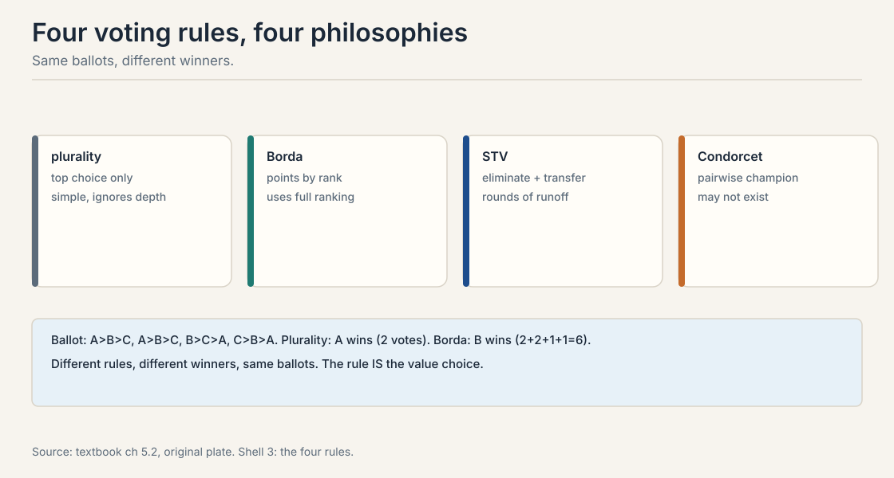
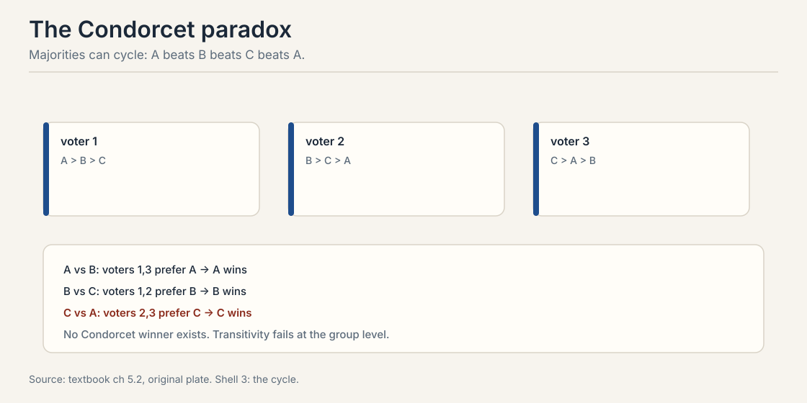
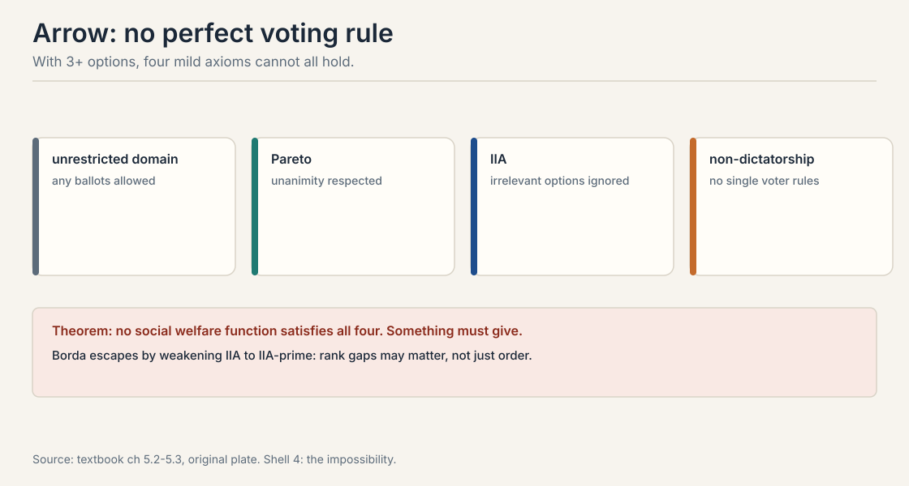
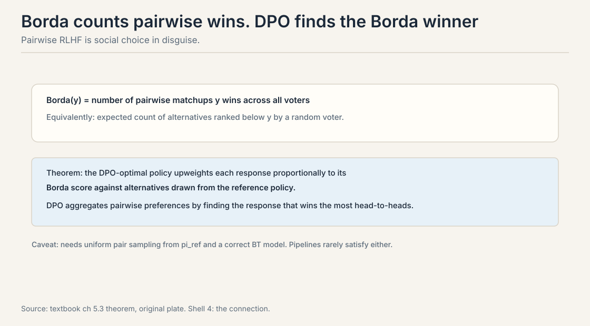
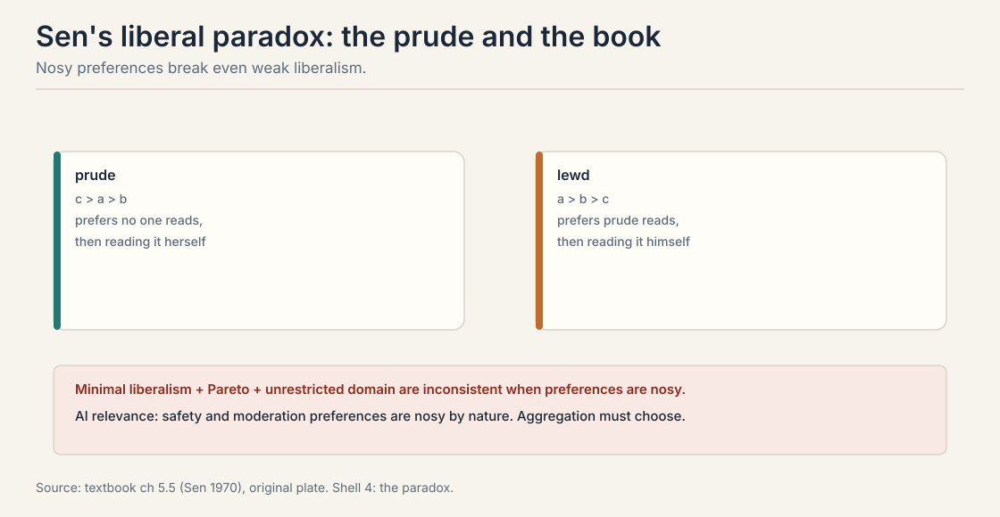

## The problem: whose preferences?

Lectures 1 through 7 modeled one person's preferences. Real
systems serve millions. Ten thousand annotators label pairs.
Their preferences disagree: some want concise answers, others
want thorough ones. One policy must be chosen. The question:
can a group decide coherently? The answer is mostly no, and the
ways it fails shape AI alignment directly.

Carry one ballot box through the chapter. Three candidates: A,
B, C. Four voters. Ballots:

```ascii
voter 1:  A > B > C
voter 2:  A > B > C
voter 3:  B > C > A
voter 4:  C > B > A
```

Four reasonable rules read these ballots. They pick different
winners. That is the whole chapter in miniature.

## First attempt: count the top choices

**Plurality** is the obvious rule. Each voter names a top
choice. Most votes wins. On the toy: A gets 2 first-place
votes, B gets 1, C gets 1. A wins.

Plurality ignores everything below first place. Voters 3 and 4
both rank B second, but plurality never looks there. The rule is
simple and lossy. Three more rules read the same ballots
differently.

**Borda count.** Voters rank all alternatives. Top gets m-1
points, second m-2, down to 0. Highest total wins. On the toy
with m = 3:

```ascii
A: 2 + 2 + 0 + 0 = 4
B: 1 + 1 + 2 + 2 = 6
C: 0 + 0 + 1 + 1 = 2
```

B wins with 6. Same ballots, different winner. Borda sees what
plurality missed: B is everyone's first or second choice.

**Single transferable vote (STV).** Ranked ballots, counted in
rounds. Each round eliminates the weakest and transfers its
votes to next choices, until someone has a majority.

**Condorcet methods.** Find the candidate who beats every other
candidate in pairwise majority contests. If one exists, they
win.



The rule is the value choice. Plurality rewards passionate
minorities. Borda rewards broad acceptability. There is no
neutral way to read the ballots. Choosing the rule chooses
which slice of the voters' will counts.

> [!QA]
> Q: Why do different voting rules pick different winners from the same ballots?
> A: Each rule reads the ballots differently. Plurality sees only top choices: A wins 2-1-1. Borda weighs every rank position: B scores 6, A scores 4, C scores 2, so B wins. STV simulates sequential runoffs. Condorcet checks pairwise majorities. The ballot profile contains all of this information at once, and each rule extracts a different slice. There is no neutral extraction: choosing the rule chooses which slice counts.
> Follow-up: Which rule is "best"?
> A: No rule dominates. That is Arrow's point, covered below. Plurality is simple but ignores depth. Borda uses depth but violates IIA. Condorcet is principled but the winner may not exist. Pick by which failure you can tolerate, and say so explicitly.

## Where aggregation breaks: the cycle

Majority preferences can cycle. Three voters, three candidates:

```ascii
voter 1:  A > B > C
voter 2:  B > C > A
voter 3:  C > A > B
```

Count the pairwise majorities by hand.

```ascii
A vs B:  voters 1 and 3 prefer A.  A wins 2-1.
B vs C:  voters 1 and 2 prefer B.  B wins 2-1.
C vs A:  voters 2 and 3 prefer C.  C wins 2-1.
```

The group prefers A to B to C to A: a rock-paper-scissors cycle.
No **Condorcet winner** exists, no candidate that beats every
other head-to-head. Transitivity holds for each individual and
fails for the group. Every individual is rational. The group is
not.



Any aggregation method must break the cycle somehow, and every
way of breaking it violates some fairness axiom. This is not a
paradox with a clever resolution. It is a fact about majority
rule.

## The key question

If every rule breaks some axiom, is there at least one rule that
breaks none of the reasonable ones?

## Arrow: no perfect rule exists

With 3 or more alternatives, no social welfare function, a rule
mapping ballot profiles to a group ranking, satisfies four mild
axioms at once.



**Unrestricted domain.** Any ballot profile is allowed, including
the cycle above.

**Pareto efficiency.** If everyone prefers x to y, the group
ranks x above y.

**IIA.** The group ranking of x versus y depends only on
individual rankings of x versus y. This is Lecture 3's IIA,
now applied to the aggregation rule.

**Non-dictatorship.** No single voter always decides the group
ranking.

Theorem: no rule satisfies all four. Something must give. Drop
unrestricted domain and cycles vanish on single-peaked
preferences. Drop Pareto and the rule can ignore unanimity.
Drop IIA and Borda works. Drop non-dictatorship and one voter
decides. This is not a puzzle with a clever answer. It is a
proof that the answer does not exist.

For AI the implication is direct. Any method that aggregates
human preferences into one model behavior is a social welfare
function. RLHF from many annotators is one. It cannot be fully
fair, fully responsive, and fully principled at once. The design
question is which axiom to relax, not whether to relax one.

> [!QA]
> Q: State Arrow's theorem and say why it matters for AI.
> A: With three or more alternatives, no voting rule satisfies unrestricted domain, Pareto, IIA, and non-dictatorship simultaneously. For AI: any method that aggregates human preferences into one model behavior violates at least one of these. RLHF from many annotators is a social welfare function. It cannot be fully fair, fully responsive, and fully principled at once. The design question is which axiom to relax, not whether to relax one.
> Follow-up: How do real systems escape Arrow?
> A: By weakening an axiom. Borda weakens IIA to IIA-prime: rank gaps may matter, not just order. Restricted domains like single-peaked preferences dodge the paradox. Randomization, random dictator, satisfies the axioms ex ante but not ex post. Each escape names its price.

## Borda escapes by weakening IIA

The **Borda score** of y is the number of pairwise matchups y
wins across all voters. Equivalently: the expected count of
alternatives ranked below y by a random voter. Borda violates
IIA but satisfies a weaker **IIA-prime**: if two profiles agree
on everyone's y-versus-y' order and on how many alternatives sit
between them, the outcome cannot flip. By relaxing IIA, Borda
escapes Arrow.



Now the remarkable connection to Lecture 7. Train DPO with
reference policy pi_ref. The DPO-optimal policy satisfies:

pi_DPO(y|x) / pi_ref(y|x) proportional to (Borda score of y)

DPO upweights each response proportionally to its Borda score
against alternatives drawn from the reference policy. Pairwise
RLHF is social choice in disguise: DPO finds the response that
would win the most head-to-head matchups. The voters are sampled
response pairs. The election is Borda.

Two caveats from the textbook. The equivalence needs uniform
pair sampling from pi_ref and a correctly specified
Bradley-Terry model. Annotation pipelines violate both: they
oversample long or controversial outputs, and annotator pools
disagree. In practice DPO implements a distorted Borda count,
and the distortion is rarely measured.

> [!QA]
> Q: What is the DPO-Borda connection?
> A: The DPO-optimal policy upweights responses proportionally to their Borda score: the number of pairwise matchups each response wins against alternatives from the reference policy. So DPO is not just fitting preferences. It is running a Borda election where the voters are sampled response pairs. This gives DPO a social-choice interpretation: it aggregates pairwise preferences by head-to-head wins.
> Follow-up: Why does the connection matter if the assumptions fail?
> A: Because it tells you what DPO is approximating and how the approximation distorts. Non-uniform pair sampling changes the implicit electorate: oversampled response types get extra votes. BT misspecification changes what a "win" means. If you know DPO is a Borda count, you can audit the election: check the sampling, check the model, and interpret the winner accordingly.

## Nosy preferences: Sen's liberal paradox

Classical social choice assumes private preferences: you care
about your own outcomes. AI alignment runs on **nosy**
preferences: you care about what others receive. Safety,
moderation, fairness, and paternalism are all nosy.

Sen (1970): minimal liberalism, Pareto efficiency, and
unrestricted domain are inconsistent when preferences are nosy.
The textbook's example: the prude and the book. The prude
prefers that no one reads it, but failing that, prefers to read
it herself rather than let the lewd one read it. The lewd one
prefers to read it. Each claims a personal sphere: who reads
what. Pareto pushes one way, liberalism the other. No
resolution exists.



For alignment this is concrete. Content moderation is a nosy
preference: you want others not to see certain content. Any
system that aggregates nosy preferences inherits Sen's
inconsistency. Someone's personal sphere must give.

## Multi-issue voting

Real AI decisions span multiple issues: helpfulness,
harmlessness, honesty. Can the group vote issue by issue? Only
if preferences are **separable**: whether you want to add x to
the bundle does not depend on what is already in it, only on
whether x is intrinsically good.

The textbook's characterization: a voting scheme satisfies
surjectivity, strategy-proofness, and separability if and only
if it is voting by committees, each issue decided by its own
winning coalitions. The price: committee voting generally
violates other desiderata, and separability itself is strong.
Helpfulness and harmlessness interact: a helpful answer to a
harmful question is not separable.

## Mapping back: what each escape buys

| Aggregation pain | Escape | Price |
|---|---|---|
| Cycles: no Condorcet winner | Restrict the domain | Single-peaked preferences rarely hold for open-ended text |
| Arrow: no perfect rule | Borda weakens IIA to IIA-prime | Clones and irrelevant alternatives move the outcome |
| One dictator decides | Random dictator | Fair ex ante, arbitrary ex post |
| Issues interact | Committee voting per issue | Separability fails: helpfulness and harmlessness interact |

## The honest price: every aggregation is a value choice

There is no neutral way to turn many preferences into one
policy. Plurality, Borda, Condorcet, and DPO-as-Borda each read
the same ballots and crown different winners. Arrow proves the
neutral rule does not exist. Sen proves nosy preferences break
liberal aggregation. The honest practice: name the rule, name
the axiom you relaxed, and audit the distortion. "The data
decided" is never true. A rule decided, and someone chose the
rule.

## Recap: the whole lesson on one screen

The story in eight steps. Each step answers the one before it.

1. **Whose preferences?** One policy, ten thousand
   annotators, real disagreement. Aggregation is unavoidable.
2. **Four rules, four winners.** The toy ballots: plurality
   crowns A 2-1-1. Borda crowns B 6-4-2. The rule is the value
   choice.
3. **Majorities cycle.** A beats B, B beats C, C beats A,
   each 2-1. No Condorcet winner. Group rationality fails
   where individual rationality holds.
4. **Arrow: pick at most three.** Unrestricted domain,
   Pareto, IIA, non-dictatorship. No rule satisfies all four
   with 3+ alternatives.
5. **Borda escapes by weakening IIA.** Counts pairwise wins.
   IIA-prime replaces IIA. The price: irrelevant alternatives
   move outcomes.
6. **DPO is a Borda election.** pi_DPO/pi_ref proportional to
   the Borda score. Pairwise RLHF is social choice in
   disguise, distorted by sampling and misspecification.
7. **Nosy preferences break liberalism.** Sen's paradox: the
   prude and the book. Moderation is nosy. Someone's sphere
   gives.
8. **Name the rule.** No neutral aggregation exists. State
   the relaxed axiom. Audit the distortion.

## Official sources and further reading

**Official:**
- Course textbook, chapters 8.x: voting rules, Condorcet,
  Arrow, Borda, the DPO-Borda connection, Sen, multi-issue
  voting.

**Further reading:**
- Arrow (1951), Social Choice and Individual Values: the
  impossibility theorem.
- Sen (1970): the liberal paradox.

**Caveats from these sources.** The DPO-Borda proportionality
needs uniform sampling and correct BT specification; the
textbook flags both as violated in practice. The ballot toys
are worked here from the textbook's examples. Sen's example is
the textbook's telling.

## Connections to the other courses

- **CS329H L02:** the preference pair and BT; the matchup
  unit Borda counts.
- **CS329H L03:** IIA as a choice axiom, now as an
  aggregation axiom; heterogeneity as the source of
  disagreement.
- **CS329H L07:** DPO as a Borda election; the assumption
  checklist's homogeneity item.
- **CS329H L09:** voting rules are manipulable mechanisms;
  Gibbard-Satterthwaite.
- **CS329H L10:** bridging versus majority in deployed
  systems; whose preferences count.
