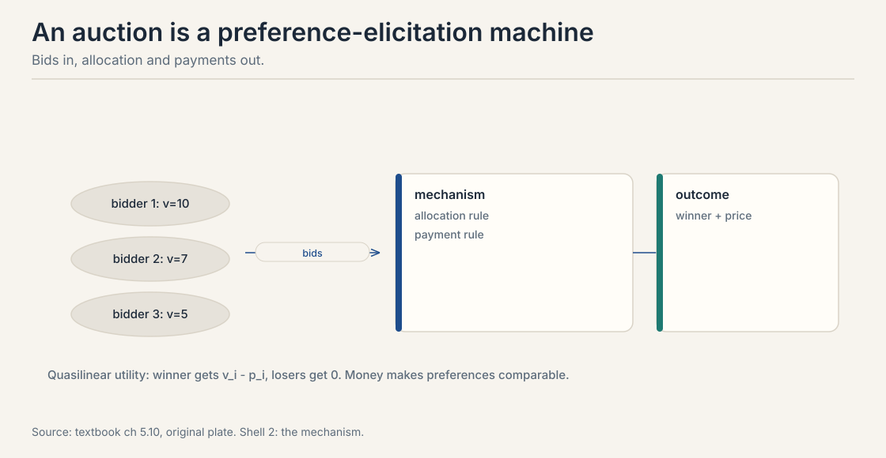
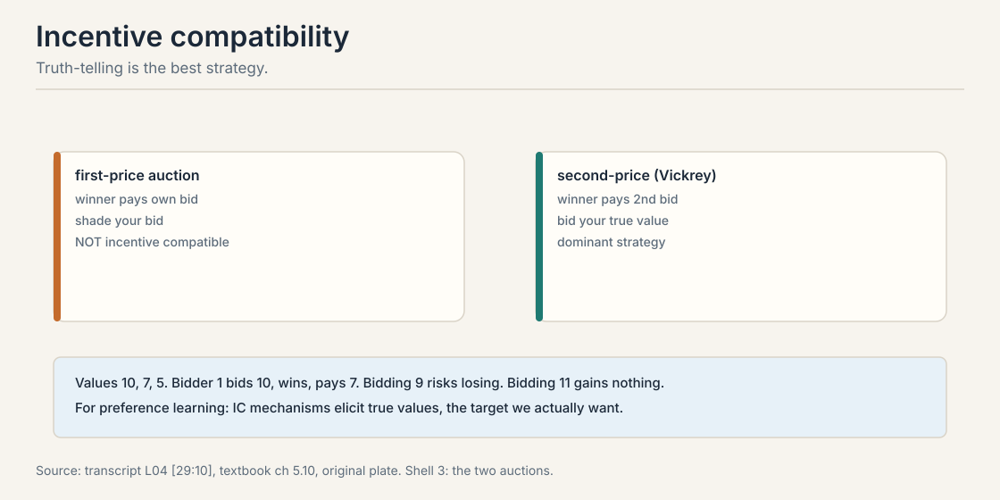
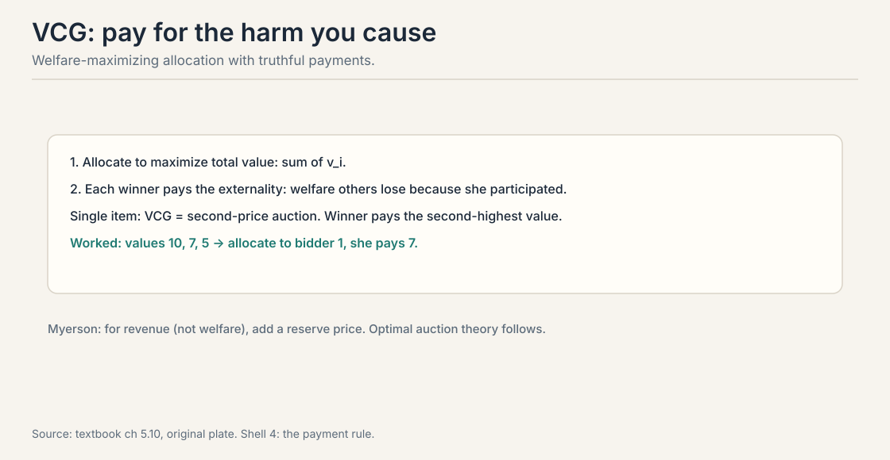
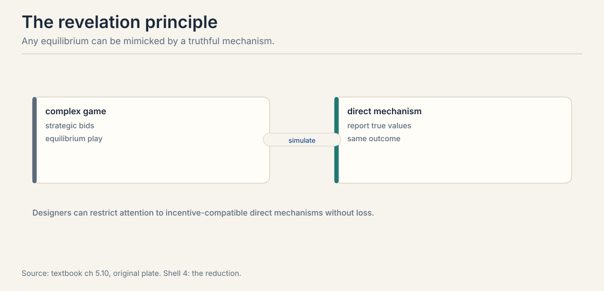

## The problem: people strategize

Every lesson so far assumed honest reports. Annotators answer
sincerely. Voters mark true preferences. Bidders bid their
values. Real agents do none of these reliably. An annotator paid
per label rushes. A bidder shades. A voter misreports to game
the rule. Drop the honesty assumption and the data changes
shape: you no longer observe preferences. You observe strategy.

Carry one running example. A single item is for sale. Three
bidders value it privately: bidder 1 at 10, bidder 2 at 7,
bidder 3 at 5. Money makes preferences comparable, which is why
auctions are the cleanest laboratory. The lessons transfer to
annotation pipelines, where the currency is effort and the
bidders are labelers.

A **mechanism** is a game designed by us. Agents have private
values. They send messages: bids, reports, clicks. The mechanism
maps messages to an outcome: who gets what, who pays what.
**Mechanism design** asks: which rules make self-interested play
produce a good outcome? The designer wants welfare, give the
item to the highest valuer, or revenue, maximize the seller's
take.



Why this matters for preference learning: every annotation
pipeline is a mechanism. Annotators choose how much effort to
spend, which biases to indulge, whether to satisfice. The rules
of the pipeline, pay per label, quality checks, interface
design, shape the data as surely as auction rules shape bids.

> [!QA]
> Q: What is mechanism design?
> A: The engineering of games. Given agents with private preferences who act in their own interest, design the rules, what messages are allowed, how messages map to outcomes and payments, so that equilibrium play produces the outcome you want: welfare, revenue, or truthful information. It is preference elicitation under strategy.
> Follow-up: How is this different from social choice?
> A: Social choice aggregates reported preferences. It assumes the reports are honest. Mechanism design assumes they are not: agents misreport when it pays. Voting rules are mechanisms too, and most are manipulable. The Gibbard-Satterthwaite theorem says every non-dictatorial voting rule with 3+ outcomes is manipulable. Design for strategy, not sincerity.

## First attempt: first-price auction

The obvious rule: highest bid wins, winner pays their bid. Work
it on the toy. Values 10, 7, 5. Bidder 1 knows bidder 2 will bid
around 6. Bidder 1 bids 6.5, wins, pays 6.5, keeps 3.5 of value.

Bidding your true value is stupid here. Bid 10, win, pay 10,
gain nothing. Everyone **shades**: bids below value, by an
amount that depends on beliefs about others. The observed bids
confound values with beliefs. Bidder 1's 6.5 tells you about
bidder 1's value and bidder 1's guess about bidder 2. To recover
the value you must invert the strategy, which needs the beliefs,
which you do not observe.

First-price is not **incentive compatible**. Truth-telling is not
the best strategy. The mechanism elicits a strategic distortion
of the target, not the target.

### Subchapter: the equilibrium shade, computed

How much should a bidder shade? In the symmetric benchmark,
values are uniform on [0, 10] and all three bidders use the same
strategy. The equilibrium bid is:

b(v) = (n - 1) / n * v

With n = 3: shade one third, bid two thirds of value. The
lesson toy's bidder 1 bids 6.5 on value 10. Equilibrium says
6.67. The toy's bidder is shading almost exactly right.


Why two thirds? Bid b with value v. You win when both rivals
bid less, which under a common increasing strategy means both
rival values sit below yours. Expected payoff: (v - b) times
the win probability. Bid higher and you win more often but keep
less. The first-order condition balances the two, and the
solution is b = (n-1)/n * v. More bidders, less shade: with
n = 10, bid 90% of value. Competition does the disciplining.

Now the revenue comparison. Second-price on the toy: winner
pays 7, the second value. First-price equilibrium: winner pays
6.67. But that is one draw. Take expectations over the uniform
distribution. Expected second-highest of 3 uniform values is
10 x 2/4 = 5.0. Expected first-price payment is (2/3) times the
expected highest value, (2/3) x 7.5 = 5.0. Equal. This is
**revenue equivalence**: in the symmetric setting, the
expected seller revenue does not depend on the auction format.
What changes is not the average price but who bears the
strategic burden: bidders strategize in first-price, the
mechanism computes in second-price.

## The key question

Can the rules be designed so that honesty is each agent's best
strategy, regardless of what others do?

## Incentive compatibility and the second-price auction

A mechanism is **incentive compatible** (IC) when each agent's
best strategy is to report truthfully. No shading, no gaming, no
strategizing about others. The lecture's framing: think of the
true value as the elicitation target, stated at [29:10](ts:29:10).
IC mechanisms elicit the thing you actually want to learn.
Non-IC mechanisms elicit a strategic distortion, and you must
invert the strategy to recover the truth.

The **second-price** (Vickrey) auction: highest bid wins, winner
pays the second-highest bid. Work it on the toy. Values 10, 7,
5. Everyone bids truthfully. Bidder 1 bids 10, wins, pays 7.
Bidder 1 keeps 3.



Why is truth-telling dominant? Your bid only decides whether
you win, never what you pay. You pay the second-highest bid.
Take value 10.

```ascii
bid 10 (truth):  win exactly when the top rival bid is below 10.
                 pay that rival bid. Every win is profitable.
bid 9 (shade):   if the top rival bid is 9.5, you lose a win
                 worth 10 - 9.5 = 0.5 profit. Shading only
                 loses profitable wins.
bid 11 (over):   if the top rival bid is 10.5, you win and pay
                 10.5 > 10, losing 0.5. Overbidding only buys
                 unprofitable wins.
```

Bidding exactly your value wins exactly the profitable auctions.
No belief about others is needed. Truth dominates, as a
**dominant strategy**: best regardless of what anyone else does.

> [!QA]
> Q: Why is truth-telling dominant in a second-price auction?
> A: Your bid only decides whether you win, never what you pay: you pay the second-highest bid. Consider value 10. Bidding below 10 only loses auctions where the second bid sits between your bid and 10: profitable wins you threw away. Bidding above 10 only wins auctions where the second bid exceeds 10: you pay more than the item is worth. Bidding exactly 10 wins exactly the profitable auctions. No belief about others needed.
> Follow-up: Why do not all auctions use second-price?
> A: Revenue and robustness. With few bidders or collusion, second-price leaves money on the table and is vulnerable to shill bidding. First-price with a reserve can raise more revenue, Myerson's result. In practice, ad auctions moved from second-price to first-price partly because the strategic complexity was deemed manageable and revenue higher. IC is not the only objective.

## VCG: pay for the harm you cause

The **Vickrey-Clarke-Groves** mechanism generalizes second-price
beyond single items. Two rules.



1. **Allocate** to maximize total welfare: the sum of reported
   values.
2. **Charge** each winner their **externality**: the welfare
   others lose because she participated.

Single item: the welfare maximizer is the highest valuer, and
her externality is the second-highest value. Without bidder 1,
bidder 2 would have enjoyed 7. So bidder 1 pays 7. VCG reduces
to second-price. Worked on the toy: values 10, 7, 5. Bidder 1
wins, pays 7: without her, bidder 2 would have enjoyed 7.

VCG is incentive compatible and welfare-optimal. Its costs: it
can raise little revenue, it is vulnerable to collusion and
false-name bidding, and computing the optimal allocation is hard
in combinatorial settings. Theory's gold standard, practice's
cautionary tale.

## The revelation principle

Any equilibrium of any mechanism can be mimicked by a truthful
direct mechanism with the same outcome.



The construction: take the complex game and its equilibrium
strategies. Build a direct mechanism that asks for true types,
then simulates what the agents would have done with those
reports. Truth-telling is an equilibrium of the simulation,
with the same outcome as the original.

The payoff for designers: restrict attention to
incentive-compatible direct mechanisms without loss of
generality. You never need exotic message spaces or complex
strategy profiles to achieve an outcome. If it is achievable at
all, it is achievable truthfully.

The limit: the principle preserves the outcome, not the
simplicity. The direct mechanism may be computationally
monstrous. And it assumes equilibrium play in the original game,
which is itself a strong assumption about agent rationality.

## Revenue: Myerson and the reserve

Welfare is not the only objective. Sellers maximize revenue.
**Myerson's** optimal auction: with independent private values,
the revenue-optimal mechanism allocates to the bidder with the
highest virtual value above a reserve, where virtual value
discounts for information rent.

In the simple case this means: run a second-price auction with
a reserve price. The reserve excludes low-value bidders and
forces higher payments. The lecture's pricing discussion
connects here: pricing is mechanism design with posted
take-it-or-leave-it offers, the simplest truthful mechanism of
all.

The preference-learning parallel: annotation budgets are
revenue problems. You have limited money for labels. Which
queries buy the most information per dollar? That is Lecture 5's
active learning meets mechanism design's budget constraints.
The two lectures are one story: ask the best questions, and
make the answers honest.

> [!QA]
> Q: Connect mechanism design back to the preference learning pipeline.
> A: Three links. First, annotation is elicitation: IC-style thinking asks whether labelers are rewarded for honesty or for speed, and designs the pipeline accordingly. Second, active learning in Lecture 5 assumes honest answers. Mechanisms supply the honesty. Third, aggregation in Lecture 8 assumes sincere ballots. Voting mechanisms are manipulable, so preference aggregation over strategic labelers needs IC aggregation rules. The pipeline's data quality is a mechanism design problem wearing a data collection costume.
> Follow-up: What is the single most practical takeaway?
> A: Pay for the thing you want to measure, not a proxy. Piece rates per label reward speed and satisfice quality. Bonuses tied to agreement with gold labels or to downstream model performance reward care. The payment rule is the mechanism, and it selects the data distribution you will train on.

> [!QA]
> Q: Walk me through VCG on a two-item example, by hand.
> A: Two items, X and Y. Bidder 1 values the bundle {X, Y} at 10, each alone at 0: she wants both or nothing. Bidder 2 values X alone at 6. Bidder 3 values Y alone at 6. Step one, allocate for welfare: giving both to bidder 1 yields 10. Splitting gives 6 + 6 = 12. Split wins: bidder 2 gets X, bidder 3 gets Y. Step two, charge externalities. Without bidder 2, the best allocation gives both items to bidder 1 for welfare 10, and the others get 0. With bidder 2, the others get: bidder 1 gets 0, bidder 3 gets 6. Bidder 2's externality is 10 - 6 = 4. She pays 4 for an item she values at 6. Symmetrically bidder 3 pays 4. Total revenue 8, below the 10 bidder 1 would have paid for the bundle: VCG maximizes welfare, not revenue. Truth-telling was dominant throughout because each bidder's payment never depends on their own bid.
> Follow-up: Why did bidder 2 pay 4 and not 6?
> A: Because the payment is the harm to others, not the winner's value. Without bidder 2, others enjoy 10 (bidder 1's bundle). With her, others enjoy 6 (bidder 3's Y). The difference is 4. Her own value of 6 never enters the payment. That separation, allocation from reported values, payment from others' losses, is what makes truth-telling dominant.

> [!QA]
> Q: Design the payment scheme for an annotation pipeline. 1,000 labelers, pairwise preference labels, quality matters more than speed.
> A: Piece rates are out: paying per label buys speed and satisficing. Use a two-part scheme. Base pay per hour, not per label, removes the rush incentive. Bonus tied to agreement with gold labels: randomly inject prompts with known-good answers, and pay a bonus proportional to the match rate. This is peer prediction's honest core: agreement with ground truth is rewarded, and the gold labels are the mechanism's audit. Add a third component for the active-learning loop: bonus weight on labels for high-information pairs, so labelers do not cherry-pick easy ones. Publish the scheme. Secret payment rules get gamed. Published ones get understood. The revelation principle applies: design the direct mechanism, pay for honesty, and do not make labelers strategize about the pay formula.
> Follow-up: What breaks if labelers collude on the gold labels?
> A: The bonus becomes a coordination game instead of a truth-telling game. Defense: keep gold labels secret and rotate them, so collusion has no fixed target. Also cross-check with inter-annotator agreement on non-gold items: a labeler who matches gold but disagrees with every peer is suspicious. No payment rule survives determined collusion. The goal is to make honesty the cheapest strategy, not the only one.

> [!QA]
> Q: Walk me through the revelation principle construction. Why does it let designers restrict to truthful mechanisms?
> A: Start with any mechanism and one of its equilibria: complex bids, clever strategies, some outcome. Build a new direct mechanism: each agent reports their true type, and the mechanism simulates what that agent would have done in the old equilibrium given that report, then implements the old outcome. Truth-telling is an equilibrium of the simulation: if everyone else reports truthfully, the simulation reproduces the old equilibrium play, and deviating in the report is exactly as profitable as deviating in the old game, which was unprofitable by the equilibrium assumption. So any equilibrium outcome of any mechanism is also a truthful equilibrium outcome of a direct mechanism. Designers lose nothing by restricting to direct IC mechanisms.
> Follow-up: What is the catch?
> A: Two. The direct mechanism simulates the equilibrium strategies, which may be computationally monstrous: the revelation principle preserves the outcome, not the simplicity. And it assumes the agents actually play an equilibrium of the original game, which demands more rationality than real annotators or bidders possess. It is a design principle, not a deployment recipe: search among truthful mechanisms, but check the computation and the rationality assumptions before shipping.

> [!QA]
> Q: Work the Myerson reserve on the toy. Values 10, 7, 5, one item.
> A: Plain second-price: bidder 1 bids 10, pays 7, seller gets 7. Add a reserve of 8. Bidders below 8 cannot win. Bids: 10 wins, pays max(7, 8) = 8. Seller gets 8, up from 7. The reserve excludes the weak and forces the strong to pay more. Now the risk: if all values come in below 8, the item goes unsold and the seller gets 0. The optimal reserve balances the two: set it where the virtual value crosses zero. For values uniform on [0, 10], the virtual value is 2v - 10, zero at v = 5: optimal reserve 5. Below 5 the bidder's information rent exceeds their contribution. The preference-learning parallel: an annotation budget is a reserve problem. You have limited money for labels. The reserve is the quality bar: do not buy labels below it, because their information rent, noise and bias, exceeds their value.
> Follow-up: Why do real ad auctions use first-price with reserves instead of second-price?
> A: Revenue and robustness at scale. With many bidders the formats converge by revenue equivalence, and first-price avoids second-price's vulnerability to shill bidding and last-look advantages. The industry decided the strategic complexity was manageable and the revenue higher. IC is one objective among several: revenue, simplicity, and robustness trade against it.

## Mapping back: what IC buys

| Strategic pain | Mechanism answer | How |
|---|---|---|
| Bidders shade. bids confound value and belief | Second-price | Bid your value. the bid decides winning, never the price |
| Multi-item allocation under strategy | VCG | Maximize welfare, charge each winner their externality |
| Complex games with clever equilibria | Revelation principle | Any outcome is achievable truthfully. design direct and IC |
| Seller wants revenue, not welfare | Myerson reserve | Second-price with a reserve. virtual values discount information rent |

## The honest price: truth is fragile

Incentive compatibility is a property of the rules, not of the
people. It breaks under collusion: two bidders coordinate and the
second price collapses. It breaks under false identities: shill
bidders manufacture competition. It assumes rationality sharp
enough to find the dominant strategy, which real annotators may
not. And IC is not the only objective: revenue, simplicity, and
robustness trade against it. Ad auctions abandoned second-price
for first-price with good reason. Design the game for the agents
you have, not the agents the theorem assumes.

## Recap: the whole lesson on one screen

The story in eight steps. Each step answers the one before it.

1. **People strategize.** The auction toy: values 10, 7, 5.
   Honest reports are the exception, not the rule.
2. **A mechanism is a designed game.** Private values in,
   messages, allocation and payments out. Design for welfare,
   revenue, or truth.
3. **First-price elicits shading.** Bid 6.5 on value 10.
   Bids confound values with beliefs. Not IC.
4. **IC means truth is best.** Second-price: bid your value.
   The bid decides winning, never the price. Dominant
   strategy, worked: 9 loses profitable wins, 11 buys losses.
5. **VCG prices the externality.** Maximize welfare, charge
   the harm you cause others. Single item: pay 7, the
   second value. IC and efficient, fragile in practice.
6. **Revelation: design direct.** Any equilibrium outcome is
   achievable truthfully. The direct mechanism may be
   monstrous to compute.
7. **Revenue wants reserves.** Myerson: second-price with a
   reserve. Virtual values discount information rent.
8. **Annotation is a mechanism.** Pay for the thing you
   measure. The payment rule selects your data distribution.

## Official sources and further reading

**Official:**
- CS329H Autumn 2024: Mechanism Design (video id zkHTbb-0Gns):
  auctions as preference elicitation, incentive compatibility.
- Course textbook, chapters 9.x: auctions, IC, VCG, the
  revelation principle, Myerson. [link](https://mlhp.stanford.edu/Machine-Learning-from-Human-Preferences.pdf)

**Further reading:**
- Vickrey (1961): the second-price auction.
- Myerson (1981): optimal auction design.

**Caveats from these sources.** The Gibbard-Satterthwaite
theorem is the textbook's bridge from voting to mechanisms.
its proof is not reproduced here. The ad-auction history,
second-price to first-price, is the lecture's telling. The
10/7/5 toy is worked here from the textbook's example values.

## Connections to the other courses

- **CS329H L05:** annotation budgets are revenue problems.
  active learning meets mechanism design.
- **CS329H L06:** CIRL's strategic human is the cooperative
  half. mechanisms are the adversarial half.
- **CS329H L08:** voting rules are manipulable mechanisms.
  Arrow meets Gibbard-Satterthwaite.
- **CS329H L10:** the inversion problem: strategic behavior
  breaks the behavior-to-preference map.
