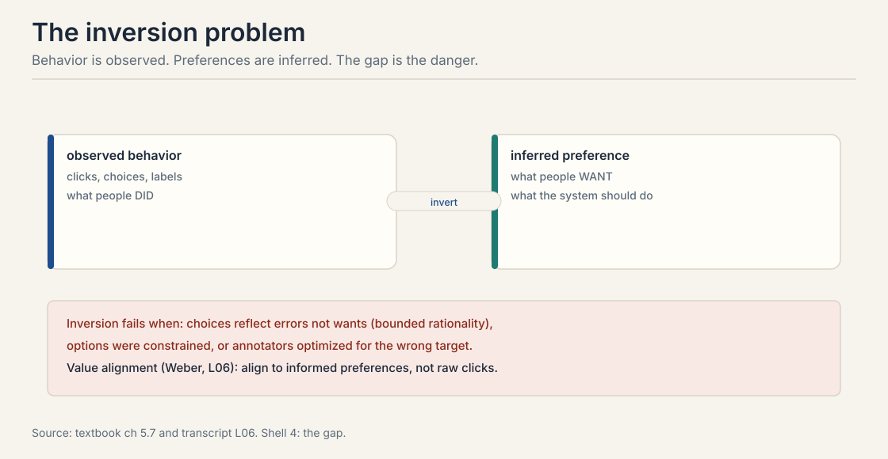
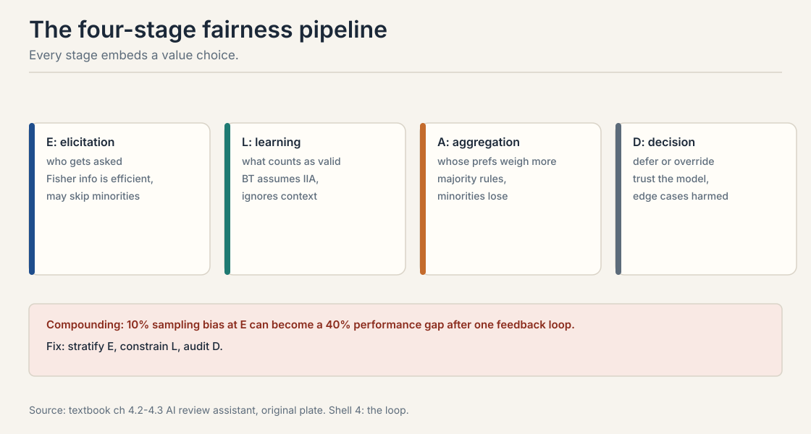
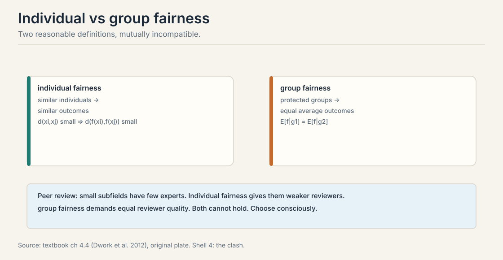
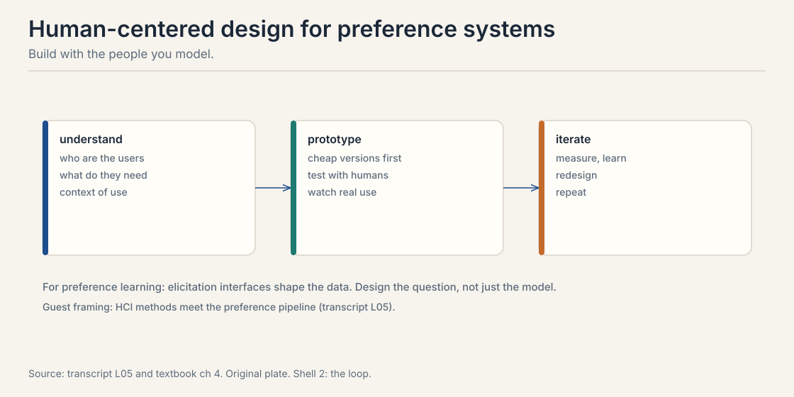

## The problem: the lab meets the world

Lectures 1 through 9 built the machinery: comparisons, choice
models, fitting, asking, acting, aggregating, incentives. This
chapter asks what the machinery is for and where it breaks
outside the lab. Whose preferences count? How does fairness fail?
How do deployed systems aggregate millions of voices? The
answers are less mathematical and more load-bearing than
everything before.

Carry one running example. A team builds an AI assistant for
peer review. It reads papers, suggests scores, drafts reviews.
Whose judgment does it encode? The senior faculty who labeled
the most data? The junior researchers who will live with its
decisions? The machinery from earlier lectures gives no answer.
It only executes the values smuggled into each stage.

## First attempt: invert behavior into preference

Every lesson so far observed behavior: clicks, choices, labels.
The goal was never behavior. The goal is preferences: what
people want, so the system can serve it. The gap between
observed behavior and true preference is the **inversion
problem**.

Inversion fails three ways. **Errors:** bounded rationality
means choices reflect mistakes, not wants. **Constraints:**
people choose from what is available, not what they want.
**Strategy:** annotators and users respond to the system
measuring them, Lecture 6's CIRL and Lecture 9's mechanisms.

The concrete failure: click data in recommenders. Clicks
reflect position bias, curiosity gaps, and outrage as much as
satisfaction. A model trained to maximize predicted clicks
learns clickbait, not quality. The inversion assumed clicks
reveal preference. They reveal engagement, which is a different
thing. Fixing it means modeling the bias in Lecture 4 or
changing the feedback in Lecture 5.

> [!QA]
> Q: What is the inversion problem?
> A: Observed choices do not equal underlying preferences. People err, face constrained options, and strategize against measurement. Inverting behavior to preferences requires assumptions about all three, and the assumptions are value choices. A system that optimizes learned "preferences" without auditing the inversion optimizes a distorted image of what people want.
> Follow-up: Give a concrete inversion failure.
> A: Click data in recommenders. Clicks reflect position bias, curiosity gaps, and outrage as much as satisfaction. A model trained to maximize predicted clicks learns clickbait, not quality. The inversion assumed clicks reveal preference. They reveal engagement, which is a different thing. Fixing it means modeling the bias or changing the feedback.

## The key question

If every technical choice smuggles in an answer to "whose
preferences matter," can we at least make the smuggling
explicit, stage by stage?

## The four-stage pipeline

The textbook's pipeline makes the values explicit. Trace the
peer-review assistant through four stages.

1. **Elicitation.** Who gets asked? Querying the most
   "productive" reviewers, or the highest Fisher information
   from Lecture 5, oversamples senior faculty in mainstream
   areas. Efficiency has a demographic.
2. **Learning.** What counts as valid? Fitting Bradley-Terry
   assumes context-free preferences and discards the
   context-dependence of overburdened reviewers as noise. The
   model decides which variation is signal.
3. **Aggregation.** Whose preferences weigh more? Simple
   majority across annotators weights the overrepresented
   group equally per person, which is unequal per
   perspective. Lecture 8's impossibility lives here.
4. **Decision.** Defer or override? When the model is
   uncertain, does the system defer to a human or decide
   anyway? When is paternalism legitimate?

The compounding is the point. A 10% sampling bias at
elicitation can become a 40% performance gap after one
feedback loop: the model serves seniors well, seniors use it
more, their data dominates further. Each stage's small choice
multiplies. Interventions: stratified sampling at elicitation,
fairness-constrained learning, regular auditing at decision.

## Two fairnesses that cannot both hold

**Individual fairness** (Dwork et al., 2012): similar
individuals get similar outcomes. Formally, close features imply
close decisions. **Group fairness**: protected groups get equal
average outcomes. Formally, expected decisions match across
groups.

The textbook proves by example they conflict. Peer review:
papers in small subfields have few available experts.
Individual fairness gives them less-expert reviewers: similar
papers get similar reviewers, and the similar reviewers are
scarce. Group fairness demands equally expert reviewers on
average across subfields. Both cannot hold. Satisfying group
fairness means giving small-subfield papers reviewers that
individual fairness would assign elsewhere.

The lesson generalizes: state which fairness you target, measure
it, and name what you sacrificed. "Fair" without a definition is
a slogan.

> [!QA]
> Q: Why can't individual and group fairness both hold?
> A: They demand different things when feature distributions differ across groups. Individual fairness is local: treat similar cases similarly. Group fairness is aggregate: equalize group averages. When one group's cases systematically differ, small subfields with few experts, local similarity and aggregate equality pull in opposite directions. Dwork et al. proved the incompatibility formally. The peer review example shows it concretely.
> Follow-up: Which should a preference learning system target?
> A: It depends on the harm model. If the harm is disparate service quality across user groups, target group fairness on the outcome that matters: satisfaction, accuracy per group. If the harm is arbitrary treatment of individuals, target individual fairness with a defensible similarity metric. Most deployed systems need both partially: constrain one, optimize the other, and audit the tradeoff.

## Revealed versus informed preferences

Dan Weber, postdoc at Stanford HAI and the Center for Ethics in
Society, PhD in philosophy, gave the value alignment guest
lecture. His framing: alignment is about which preferences
count, not just how to learn them.

The key distinction is revealed versus informed preferences.
**Revealed preferences** are what behavior shows, discussed at
minute 20:18 of the Weber guest lecture (video id _kdR_7dCcyI;
timestamps in this chapter link to the Polis lecture video in
the frontmatter). **Informed preferences** are
what someone would want knowing the relevant facts, with time
to reflect. Alignment to raw revealed preferences bakes in
mistakes, ignorance, and manipulation. Alignment to informed
preferences requires extrapolation: from the cases you observed
to the cases the person never considered.

Weber also introduced the ESR statements, ethical and societal
reflection, required for the course's final projects: every
project must state its value assumptions explicitly. The habit
transfers. Any preference learning system should ship with its
inversion assumptions written down.

> [!QA]
> Q: What is the difference between revealed and informed preferences?
> A: Revealed preferences are what choices show. Informed preferences are what someone would want with full information and reflection time. They differ whenever people err, lack facts, or face manipulation. Aligning to revealed preferences reproduces the errors. Aligning to informed preferences requires extrapolating beyond the data, which is itself a value-laden choice about how far to extrapolate and in which direction.
> Follow-up: Isn't "informed preference" just the designer's preference in disguise?
> A: That is the central risk. Extrapolation needs a model of what the person would endorse, and the designer supplies it. The defense is transparency: state the extrapolation rule, make it contestable, and prefer the weakest extrapolation that resolves the clear errors. Weber's ESR requirement is the institutional version: write the assumption down so it can be argued with.

## Polis: bridging, not majority

Colin Megill, founder of Polis, gave the applied guest lecture.
Polis is an open-source platform for large-scale deliberation.
Its most famous descendant is Community Notes on X.

The problem with majority voting on notes: the largest
ideological group decides what is "helpful." The Polis answer is
**bridging**: find notes rated positively by people who disagree
with each other. Disagreement is the instrument, not the
obstacle, stated at [08:50](ts:08:50) in the lecture.

The model is a factor model:

u = mu + alpha_j + beta_j + p^T q_j + noise

alpha is rater bias: some raters are generous. p^T q captures
ideological agreement between rater and note. beta_j is note
quality after ideology is removed. A note is selected when
beta_j clears a threshold: it must appeal across the divide,
not just within one camp.

Two details from the lecture. First, the goal is recovering
consensus signal from diversity of opinion. Second, the
factorization runs in continuous space, deliberately not
clustering raters into liberal/conservative buckets, to avoid
reifying the divisions it measures, stated at [46:38](ts:46:38).

This is Lecture 1's factor model deployed at scale, and Lecture
8's social choice with a concrete rule: bridging beats majority
when the population is polarized.

## Human-centered design: the interface is the model

The human-centered design lecture, built on tutorials from the
HCI community, argues the elicitation interface is part of the
model. Understand users, prototype cheaply, test with humans,
iterate. For preference learning specifically: the question
format shapes the data. Pairwise versus ranked, forced choice
versus skip allowed, context shown versus hidden. Each choice
selects a different preference distribution.

The connection to the pipeline: HCD operates at the elicitation
stage, where the fairness pipeline says values enter first.
Designing the question is designing the data. A "which is
better" button and a five-star widget do not measure the same
preference.

## Running experiments on humans

The final lecture covers running preference experiments with
humans: the applied setting where theory meets logistics. Its
distinctive content is Thompson sampling for experiments. When
comparing two treatments, which prompt elicits better
responses, allocate subjects adaptively. Early results suggest A
beats B 70/30. Thompson sampling assigns the next subject to A
with probability 0.7. Exploration and exploitation over human
subjects, minimizing regret while learning. Lecture 6's
algorithm, Lecture 10's stakes.

The ethics need stating. Adaptive allocation treats humans as
bandit arms. Subjects in the worse arm get worse treatment by
design. Human experiments need the statistical care of Lecture 6
plus the ethical care of Weber's lecture: consent, debriefing,
and a harm model for the exploration itself.

## Closing topics: paternalism, privacy, peer prediction

**Paternalism.** When should the system override stated
preferences? The review-assistant example: help the harsh
reviewer be harsh, liberal assistance, or nudge toward
constructive feedback, illiberal assistance? Paternalism is the
decision stage of the pipeline. The textbook's stance: name the
override rule and its justification. Hidden paternalism is
manipulation.

**Privacy and personalization.** Personalization needs user
models. User models need data. The tension is fundamental: the
factor models of Lecture 1 identify individuals to serve them.
Aggregation and anonymization protect privacy at the cost of
personalization quality.

**Mutual information paradigm.** For peer prediction, eliciting
honest reports without ground truth, reward agents by the mutual
information between their report and others' reports.
Truth-telling maximizes shared information under the paradigm's
conditions. It is mechanism design from Lecture 9 for the
no-ground-truth case: pay for agreement that could only come
from shared signal.

## Mapping back: the course in one pipeline

| Stage | Machinery | Value choice smuggled in |
|---|---|---|
| Elicitation | Lectures 1, 5, 9; HCD | Who gets asked; what the interface measures |
| Learning | Lectures 2, 3, 4 | Which variation counts as signal; which model structure |
| Aggregation | Lecture 8; Polis bridging | Whose preferences weigh more; which axiom is relaxed |
| Decision | Lectures 6, 10 | Defer or override; the paternalism rule |

## The honest price: values all the way down

There is no value-free preference learning. The inversion
assumes behavior reveals preference. The model assumes IIA and
homogeneity. The aggregation relaxes some axiom. The decision
rule overrides or defers. Each step is defensible. None is
neutral. The honest practice is Weber's: write the assumptions
down, make them contestable, and prefer the weakest
extrapolation that resolves the clear errors. The machinery of
Lectures 1 through 9 is powerful exactly because it is
explicit. This chapter asks that the values be equally
explicit.

## Recap: the whole lesson on one screen

The story in eight steps. Each step answers the one before it.

1. **The lab meets the world.** A peer-review assistant.
   Whose judgment does it encode? The machinery gives no
   answer.
2. **Inversion: behavior is not preference.** Errors,
   constraints, strategy. Clicks reveal engagement, not
   satisfaction. Clickbait is the invoice.
3. **Four stages, four value choices.** Elicitation,
   learning, aggregation, decision. 10% sampling skew becomes
   a 40% gap. Bias compounds.
4. **Two fairnesses conflict.** Individual: similar cases,
   similar outcomes. Group: equal averages. Small subfields
   prove both cannot hold.
5. **Revealed versus informed.** Behavior shows revealed
   preferences. Informed preferences need extrapolation.
   State the rule. Make it contestable.
6. **Bridge, do not majoritize.** Polis: u = mu + alpha +
   beta + p^T q + noise. Select on beta after factoring out
   ideology. Disagreement is the instrument.
7. **The interface is the model.** Question format selects
   the preference distribution. Design elicitation with the
   users.
8. **Values all the way down.** No neutral pipeline exists.
   Write the assumptions down. Weakest extrapolation that
   fixes the clear errors.

## Official sources and further reading

**Official:**
- Guest lecture: Dan Weber on value alignment (video id
  _kdR_7dCcyI): revealed versus informed preferences at minute
  20:18 of his lecture, ESR statements. Plain-text minute mark:
  the ts: links in this chapter point at the Polis video above.
- Guest lecture: Colin Megill on Polis (video id 1QpNZXL35NM):
  bridging at [08:50](ts:08:50), continuous factorization at
  [46:38](ts:46:38).
- Lecture on human-centered design (video id VffFArrRSBE).
- Lecture on running human experiments (video id HFrCySzH9QI).
- Course textbook, chapters 10.x: the inversion problem, the
  four-stage pipeline, fairness, paternalism, privacy, the
  mutual information paradigm.

**Further reading:**
- Dwork et al. (2012): individual fairness.
- Megill / Polis: https://pol.is — the open-source platform.

**Caveats from these sources.** The 10%-to-40% compounding
figure is the textbook's illustration of feedback loops, not a
measured rate. The Polis factor model is stated as in the
lecture; estimation details are the platform's. The HCD
lecture is built on HCI community tutorials, per the lecturer.
Timestamps link to the guest lecture videos named above.

## Connections to the other courses

- **CS329H L01:** the factor model Polis deploys at scale.
- **CS329H L04:** systematic bias as the inversion problem in
  miniature.
- **CS329H L06:** Thompson sampling for human experiments;
  CIRL's strategic human.
- **CS329H L08:** aggregation impossibility; bridging as a
  concrete escape.
- **CS329H L09:** peer prediction as mechanism design without
  ground truth.
- **CS336:** the deployed systems these choices govern.
